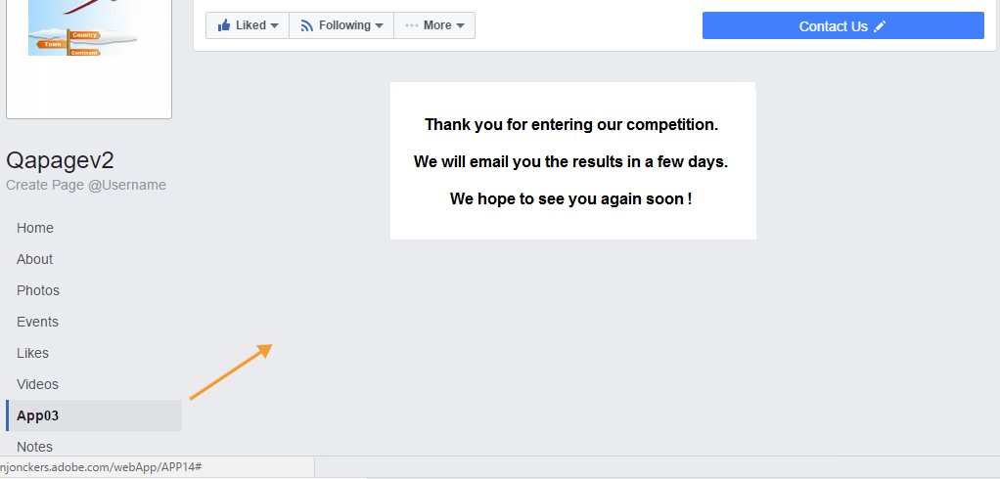
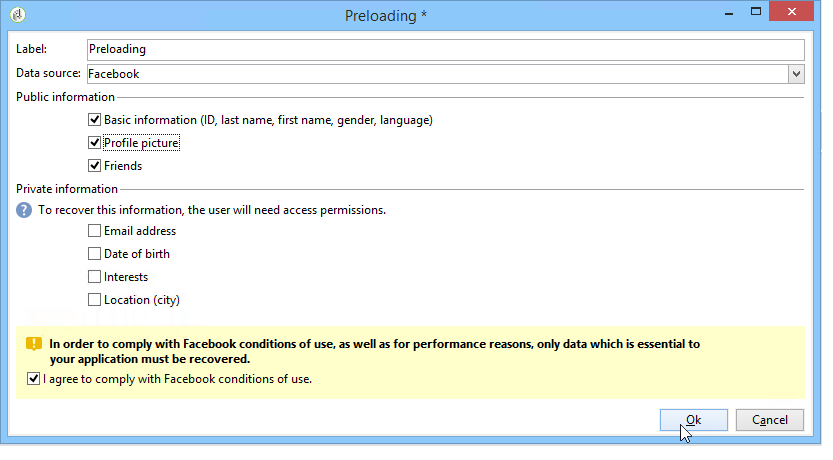
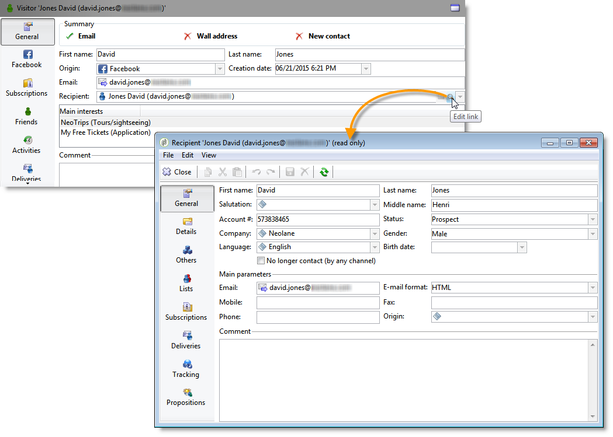
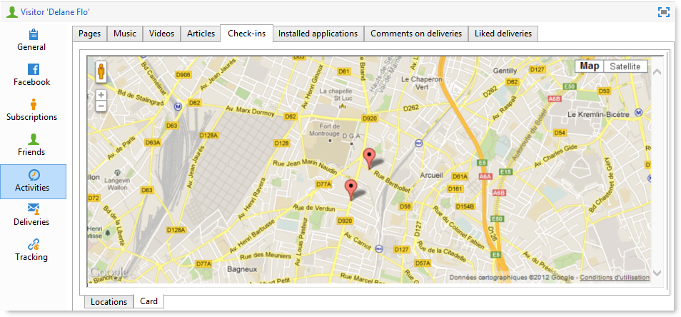

# Voorbeelden van Facebook-apps{#examples-of-facebook-apps}

Wanneer een gebruiker op de tab van een Facebook-toepassing klikt, wordt deze weergegeven in een ruimte van 810 pixels breed. Adobe Campaign gebruikt een webtoepassing van het type Facebook waarmee u de inhoud die in de Facebook-toepassing wordt weergegeven, kunt definiëren en aanpassen, zodat u gemakkelijker profielen kunt aanschaffen.

>[!NOTE]
>
>Het is ook mogelijk Adobe Campaign te integreren met een Facebook-toepassing die door een partner is ontwikkeld. In dit geval hoeft u de webtoepassing Adobe Campagne niet te gebruiken om Facebook-profielen aan te schaffen. Voor meer op dit, verwijs naar het [Vormen van externe rekeningen](../../social/using/creating-a-facebook-application.md#configuring-external-accounts).

>[!CAUTION]
>
>Volg de configuratiestappen die worden beschreven in [Een Facebook-toepassing](../../social/using/creating-a-facebook-application.md)maken.

>[!NOTE]
>
>In deze sectie worden de elementen beschreven die zijn gekoppeld aan webtoepassingen van het type Facebook. Alle elementen die worden gedeeld met standaardwebtoepassingen, worden in [deze sectie](../../web/using/about-web-applications.md)beschreven.

Hier worden de volgende voorbeelden gegeven van webtoepassingen van het type Facebook:

* Hoe maakt u in 7 stappen een Facebook-toepassing. Raadpleeg [Snel starten: het maken van een Facebook-toepassing in 7 stappen](#quick-start--creating-a-facebook-application-in-7-steps).
* Instellingen doorsturen naar een Facebook-toepassing. Zie [Hoe kan ik instellingen doorsturen naar een Facebook-toepassing?](#how-to-forward-settings-to-a-facebook-application-).
* Hoe verkrijgt u ventilatorgegevens. Zie [Hoe te om ventilatorgegevens te verwerven?](#how-to-acquire-fan-data-).

>[!CAUTION]
>
>Deze eenvoudige gebruiksgevallen worden gegeven als voorbeelden om de functionaliteit van Facebook-webtoepassingen te illustreren.

## Aanbevelingen {#recommendations}

De volgende beperkingen zijn rechtstreeks gekoppeld aan Facebook:

* U moet al uw webtoepassingen maken in HTTPS.
* Een Facebook-toepassing die via een tabblad wordt weergegeven, heeft een breedte van 810 pixels.

## Snel starten: maken van een Facebook-toepassing in 7 stappen {#quick-start--creating-a-facebook-application-in-7-steps}

In dit voorbeeld wordt stapsgewijs uitgelegd hoe u een Adobe Campagne-toepassing die is gemaakt op Facebook kunt weergeven. In dit geval, willen wij een toepassing tot stand brengen die u het **Welkome** bericht laat tonen wanneer de gebruiker het toepassingslusje (**App01**) klikt.

Voer de volgende stappen uit om deze toepassing te maken:

1. Maak een toepassing op Facebook ( [https://developers.facebook.com/apps](https://developers.facebook.com/apps)). Raadpleeg voor meer informatie: Een Facebook-toepassing [maken](../../social/using/publishing-on-facebook-walls.md#creating-a-facebook-application).

   

1. Maak een extern **[!UICONTROL Facebook Connect]** type account en voer de parameters van de Facebook-toepassing in. Raadpleeg voor meer informatie: Externe accounts [configureren](../../social/using/creating-a-facebook-application.md#configuring-external-accounts).

   

1. Voer de **[!UICONTROL Terms of service]** en de **[!UICONTROL Privacy policy]** koppelingen in die moeten worden weergegeven op het scherm voor het aanvragen van bevoegdheden op Facebook. Raadpleeg voor meer informatie: Het [ingaan van de Termijnen van de Dienst en de beleidsverbindingen](../../social/using/creating-a-facebook-application.md#entering-the-terms-of-service-and-privacy-policy-links)van de Privacy.

   

1. Maak een Facebook-webtoepassing in Adobe Campaign. Raadpleeg voor meer informatie: Een webtoepassing [van het type Facebook](../../social/using/creating-a-facebook-application.md#creating-a-facebook-type-web-application)maken.

   

1. Bewerk uw webtoepassing. In dit voorbeeld hebben we een **[!UICONTROL Page]** activiteit toegevoegd en een titel gedefinieerd.

   

1. Implementeer uw toepassing.

   

1. Configureer uw Facebook-toepassing zodat deze als een tabblad op uw Facebook-pagina wordt weergegeven. Raadpleeg voor meer informatie: Facebook-tabs [configureren](../../social/using/creating-a-facebook-application.md#configuring-facebook-tabs).

   

Controleer of het tabblad van de toepassing **App01** wordt weergegeven op uw Facebook-pagina. Als u erop klikt, wordt een **welkomstbericht** weergegeven.

## Hoe kan ik instellingen doorsturen naar een Facebook-toepassing? {#how-to-forward-settings-to-a-facebook-application-}

>[!CAUTION]
>
>Volg de configuratiestappen die zijn beschreven in [Een Facebook-toepassing](../../social/using/creating-a-facebook-application.md)maken.

In voorbeeld 1 personaliseerde we de weergave van de Facebook-pagina op basis van de waarde in het **[!UICONTROL Fan of the page]** veld. Het is ook mogelijk het **[!UICONTROL Application settings]** veld te verwerken. Met dit veld kunt u gegevens herstellen die zijn opgeslagen in een koppeling die is gegenereerd door Adobe Campaign, via Facebook.

Laten we het voorbeeld nemen van een bedrijf dat besluit een e-mailcampagne te verzenden. Tijdens de levering wijst een koppeling naar de Facebook-toepassing. Deze koppeling is gepersonaliseerd dankzij de **[!UICONTROL app_data]** parameter die aan het einde van de URL is toegevoegd. De waarde van deze parameter zou een indicator kunnen zijn die op klantenbelangrijkheid wijst. In ons voorbeeld, zijn de waarden van de **[!UICONTROL app_data]** parameter **[!UICONTROL big]** (significante klant) en **[!UICONTROL small]** (minder significante klant).

Zodra het wordt gepersonaliseerd, kijkt URL als dit:

* `http://<path of the Facebook application>&app_data=big` (voor een belangrijke klant)
* `http://<path of the Facebook application>&app_data=small` (voor een minder belangrijke klant)

Onder de anonieme gegevens die door Facebook naar Adobe Campaign zijn doorgestuurd, wordt de waarde van het **[!UICONTROL Application parameters]** veld verzameld, zodat Adobe Campaign de weergave van de toepassing op basis van deze parameter kan aanpassen.

Als de gebruiker een significante klant is (de waarde van de **[!UICONTROL app_data]** parameter is **[!UICONTROL big]**), wordt het volgende beeld getoond:

Als de gebruiker een minder significante klant is (de waarde van de **[!UICONTROL app_data]** parameter is **[!UICONTROL small]**), wordt het volgende beeld getoond:

Voor het opnieuw maken van dit gebruiksgeval hebben we een webtoepassing gemaakt die bestaat uit de volgende elementen:

* Een **[!UICONTROL Test]** activiteit die op het **[!UICONTROL Application parameter]** gebied wordt gebaseerd.
* twee pagina&#39;s die de afbeeldingen bevatten die volgens de waarde van het **[!UICONTROL Application parameter]** veld moeten worden weergegeven.

## Hoe verkrijgt u ventilatorgegevens? {#how-to-acquire-fan-data-}

>[!CAUTION]
>
>Volg de configuratiestappen die zijn beschreven in [Een Facebook-toepassing](../../social/using/creating-a-facebook-application.md)maken.

In dit voorbeeld ziet u hoe u contact opneemt met Facebook-gebruikers en hen aanbiedt hun profielgegevens te delen. Laten we het voorbeeld nemen van een bedrijf dat vooruitzichten wil verwerven en een wedstrijd organiseert op zijn Facebook-pagina om ze aan te trekken.

Wanneer een gebruiker op het **[!UICONTROL App03]** tabblad klikt, vragen we hem of hij of zij aan de wedstrijd wil deelnemen.

Als zij besluiten aan de wedstrijd deel te nemen, bieden wij hun aan hun profielinformatie te delen.

Als ze hun gegevens willen delen, wordt het volgende scherm weergegeven.

Voor het samenstellen van dit gebruiksgeval hebben we een webtoepassing gemaakt die de volgende elementen bevat:

* een **[!UICONTROL Test]** activiteit
* drie pagina&#39;s
* een **[!UICONTROL Access control]** activiteit
* een **[!UICONTROL Pre-loading]** activiteit
* een **[!UICONTROL Save]** activiteit
* een **[!UICONTROL End]** activiteit

### Testactiviteit {#test-activity}

De **[!UICONTROL Test]** activiteit is gebaseerd op het **[!UICONTROL ID]** en het **[!UICONTROL Application parameters]** gebied.

Het bestaat uit drie bijkantoren:

* **[!UICONTROL identifier (UID) is empty]** : De identificatiecode wordt alleen door Facebook doorgestuurd als de gebruiker al heeft ingestemd met het delen van zijn gegevens. Met de eerste tak van de **[!UICONTROL Test]** activiteit kunt u de wedstrijd alleen beschikbaar maken voor gebruikers die nog nooit zijn ingegaan, dat wil zeggen gebruikers met een lege id.
* **[!UICONTROL application parameter equals 'thanks']** : Als u een weergavefout wilt toevoegen die is gekoppeld aan Facebook, wijst de eindpagina van de webtoepassing naar de URL van de Facebook-toepassing die met de **[!UICONTROL app_data]** parameter wordt toegevoegd aan het gebruik van de **[!UICONTROL thanks]** waarde (zie voor meer informatie: [Eindactiviteit](#end-activity)). De tweede tak laat u weten of de gebruiker uit de **[!UICONTROL End]** activiteit van de eerste tak (en is enkel ingegaan op de concurrentie) komt om een dank te tonen u bericht. Raadpleeg voor meer informatie over het gebruik van aanvullende URL-parameters: [Hoe kan ik instellingen doorsturen naar een Facebook-toepassing?](#how-to-forward-settings-to-a-facebook-application-).
* **[!UICONTROL Default branch]** : als de gebruiker reeds op een vorige datum (toepassingsparameter verschillend van) de concurrentie (reeds ingegaan identiteitskaart) is ingegaan, zullen wij een pagina tonen die zegt dat zij reeds zijn ingegaan. **[!UICONTROL thanks]**

### Mededingingspagina {#competition-page}

Als u de weergavefout wilt negeren die aan Facebook is gekoppeld, moet u ook de pagina voor concurrentie selecteren **[!UICONTROL Parent window]** of **[!UICONTROL In the top window]** in het **[!UICONTROL Window]** veld.

### Toegangscontroleactiviteit {#access-control-activity}

Met de **[!UICONTROL Access control]** activiteit kunt u de pagina met Facebook-machtigingsaanvragen weergeven wanneer de gebruiker aan de wedstrijd deelneemt. Als zij ermee instemmen hun informatie te delen, wordt deze tijdens het vooraf laden teruggewonnen. Raadpleeg voor meer informatie: [Voorladen](#pre-loading-activity).

Als u eerder het externe account hebt ingevoerd bij het maken van de webtoepassing (zie [Een webtoepassing](../../social/using/creating-a-facebook-application.md#creating-a-facebook-type-web-application)van het type Facebook maken), hoeft u de activiteit niet te bewerken. Als dat niet het geval is, gaat u naar het **[!UICONTROL Application]** veld en selecteert u het externe account dat is gekoppeld aan de Facebook-toepassing.

### Voorladen {#pre-loading-activity}

Selecteer de gegevensbron die moet worden gebruikt voor het vooraf laden:

* **[!UICONTROL Marketing database]** : Met deze optie kunt u gegevens vooraf laden via de Adobe Campaign-database.
* **[!UICONTROL Facebook]** : Met deze optie kunt u gegevens vooraf laden via Facebook.

**Marketing Database**

Met deze optie kunt u de gegevens herstellen van een profiel dat bestaat in de tabel met bezoekers. De verificatie wordt uitgevoerd op basis van de externe Facebook-id die wordt hersteld wanneer de gebruiker op het tabblad Facebook-toepassing klikt. Als u een formulier toevoegt na de **[!UICONTROL Pre-loading]** activiteit, worden de velden met informatie in de database vooraf geladen.

>[!NOTE]
>
>Zie [deze sectie](../../web/using/publishing-a-web-form.md#pre-loading-the-form-data)voor meer informatie over het vooraf laden van gegevens via de Adobe Campagne-database.

**Facebook**

Met deze optie kunt u de Facebook-profielgegevens definiëren die u wilt verzamelen, onder de informatie die de gebruiker heeft willen delen, om deze op te slaan.

Met de **[!UICONTROL Database information]** optie kunt u de volgende gegevens verzamelen:

* **[!UICONTROL External ID]**: gebruikersnaam
* **[!UICONTROL Gender]**: geslacht van de gebruiker
* **[!UICONTROL Verified]** : in dit veld wordt aangegeven of de gebruiker een geverifieerd Facebook-account heeft.
* **[!UICONTROL Full name]**: volledige naam van gebruiker
* **[!UICONTROL First name]**: voornaam van gebruiker
* **[!UICONTROL Last name]**: achternaam van gebruiker
* **[!UICONTROL Language]**: taal van de gebruiker

U kunt ook besluiten om de profielfoto, de lijst met vrienden, e-mailadres, geboortedatum, interesses en locatie te verzamelen door de juiste vakjes in te schakelen.

Schakel het **[!UICONTROL Ok]** selectievakje in voordat u klikt **[!UICONTROL I agree to comply with Facebook conditions of use]** .

>[!NOTE]
>
>Als u een of meer vakken in de **[!UICONTROL Private information]** sectie inschakelt, wordt de toegangsaanvraag voor deze gegevens automatisch weergegeven op het scherm met de Facebook-machtiging.
>
>Als u de geselecteerde gegevens wilt verzamelen, moet de gebruiker ermee instemmen deze te delen.
>
>Als u beide typen voorladen wilt gebruiken (via Adobe Campagne en via Facebook), voegt u twee vooraf geladen vakken achter elkaar toe.

### Activiteit opslaan {#save-activity}

Met de **[!UICONTROL Save]** activiteit kunt u de informatie opslaan die tijdens de vorige fasen is verzameld in de tabel met bezoekers.

Als het profiel al in de bezoekerslijst bestaat, worden hun gegevens bijgewerkt met de nieuwe verzamelde gegevens.

Als het profiel niet bestaat in de database en het e-mailadres van de Facebook-gebruiker is verzameld, wordt een bezoeker gemaakt in de tabel met bezoekers.

1. Selecteer in het **[!UICONTROL Visitor creation folder]** veld de map waarin het profiel wordt gemaakt. In het geval van een webtoepassing van het type Facebook is de standaardmap voor het maken van bestanden **[!UICONTROL Visitors]**.
1. Selecteer in het **[!UICONTROL Reconciliation mode]** veld de afstemmingsmodus die u wilt gebruiken:

   * **[!UICONTROL Automatic]** : De afstemming vindt plaats op basis van e-mail, achternaam, voornaam en geboortedatum.
   * **[!UICONTROL Manual]** : Selecteer een of meer afstemmingssleutels.
   * **[!UICONTROL None]** : Er vindt geen verzoening plaats.

1. Selecteer in het **[!UICONTROL Mapping]** veld het schema waarop u de afstemming wilt uitvoeren.

   >[!CAUTION]
   >
   >Controleer of de velden van het **[!UICONTROL Social networks]** tabblad correct zijn ingevoerd in de leveringstoewijzing. Leveringstoewijzingen zijn toegankelijk via het **[!UICONTROL Administration > Campaign management > Target mappings]** knooppunt.

1. U kunt een zoekmap selecteren voor afstemming en een map maken voor nieuwe profielen. Als de velden leeg zijn, worden profielen gezocht naar en gemaakt in de standaardmap van het toewijzingsschema.

### Eindactiviteit {#end-activity}

Als u de weergavefout wilt negeren die aan Facebook is gekoppeld, moet u het **[!UICONTROL Use an external URL]** selectievakje inschakelen en de URL van de Facebook-toepassing invoeren, gevolgd door de **[!UICONTROL app_data]** parameter en een waarde. Deze waarde wordt gebruikt in de **[!UICONTROL Test]** activiteit om te bepalen of de gebruiker net de concurrentie is ingegaan, en om een dank u bericht te tonen indien van toepassing. Raadpleeg voor meer informatie: [Testactiviteit](#test-activity).

In ons voorbeeld is **dank** de gebruikte waarde.

### Scherm Details van een bezoeker {#details-screen-of-a-visitor}

Net als voor Twitter-volgers (zie: ( [Operationeel principe](../../social/using/publishing-on-twitter.md#operating-principle)), herstelde Facebook-profielen worden opgeslagen in de bezoekerslijst. Ga naar het **[!UICONTROL Profiles and Targets > Visitors]** knooppunt om de lijst met bezoekers weer te geven.

Elk Facebook-perspectief dat ermee instemt hun profielgegevens te delen, wordt toegevoegd aan de lijst met bezoekers. Als het **[!UICONTROL Friends]** vakje in de **[!UICONTROL Pre-load]** activiteit wordt gecontroleerd (verwijs naar: [Vooraf geladen activiteit](#pre-loading-activity)), worden ook vrienden toegevoegd.

In het **[!UICONTROL Summary]** gedeelte van het detailvenster van de bezoeker zijn er twee mogelijke statussen voor de **[!UICONTROL New Contact]** indicator:

Als een groen vinkje wordt weergegeven, betekent dit dat de bezoeker zich niet heeft aangesloten bij ontvangers. In dit geval wordt een nieuw profiel gemaakt in de lijst met ontvangers.

Een rood kruis betekent dat de bezoeker in overeenstemming is gebracht met een ontvanger. U kunt op de vergroting rechts van het **[!UICONTROL Recipient]** veld klikken om de overeenkomende ontvanger weer te geven.

Ga naar het detailvenster van een ontvanger om de overeenkomende bezoeker, indien van toepassing, weer te geven. Selecteer het **[!UICONTROL Others]** tabblad en dubbelklik vervolgens op de naam van de bezoeker in de **[!UICONTROL Web identities]** sectie.

Het **[!UICONTROL Activities]** scherm van de detailpagina van een bezoeker bevat de volgende informatie:

* Ventilatoractiviteiten van het type &quot;Open Graph&quot;: muziek, video&#39;s die worden afgespeeld, artikelen die worden gelezen en gelezen en waarop de geïnstalleerde toepassingen zijn gebaseerd (Deezer, Spotify, Dailymotion, Yahoo News, enz.)

   

* &quot;Likes&quot; en opmerkingen die door de ventilator zijn toegevoegd na leveringen die door Adobe Campaign zijn verzonden
* pagina&#39;s die door de ventilator worden gevonden
* inchecken door de ventilator

   

   >[!NOTE]
   >
   >Als u Adobe Campaign wilt gebruiken om inchecken van een ventilator te verzamelen, moet u op de **[!UICONTROL Subscribe]** knop op het serviceconfiguratiescherm klikken. Voor meer op dit, verwijs naar het [Vormen van externe rekeningen](../../social/using/creating-a-facebook-application.md#configuring-external-accounts).

## De velden van een formulier vooraf laden met Facebook-profielgegevens {#how-to-pre-load-the-fields-of-a-form-using-facebook-profile-data}

Met de **[!UICONTROL Social Marketing]** toepassing kunt u ook een knop aan een formulier toevoegen om velden vooraf te laden met Facebook-profielgegevens. Deze optie, die beschikbaar is in alle sjablonen van de webtoepassing (**[!UICONTROL Page]** typeactiviteiten), wordt in [deze sectie](../../web/using/static-elements-in-a-web-form.md#inserting-html-content)beschreven.

>[!NOTE]
>
>Voordat u deze functie gaat gebruiken, moet u eerst een Facebook-toepassing en een externe **[!UICONTROL Facebook Connect]** account maken. Voor meer op dit, verwijs naar het [Vormen van externe rekeningen](../../social/using/creating-a-facebook-application.md#configuring-external-accounts).

