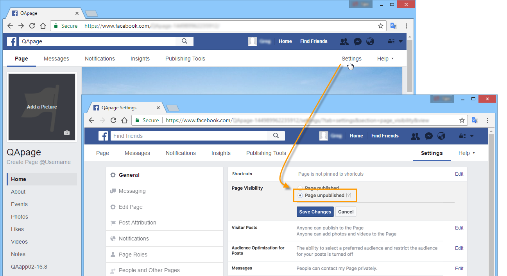
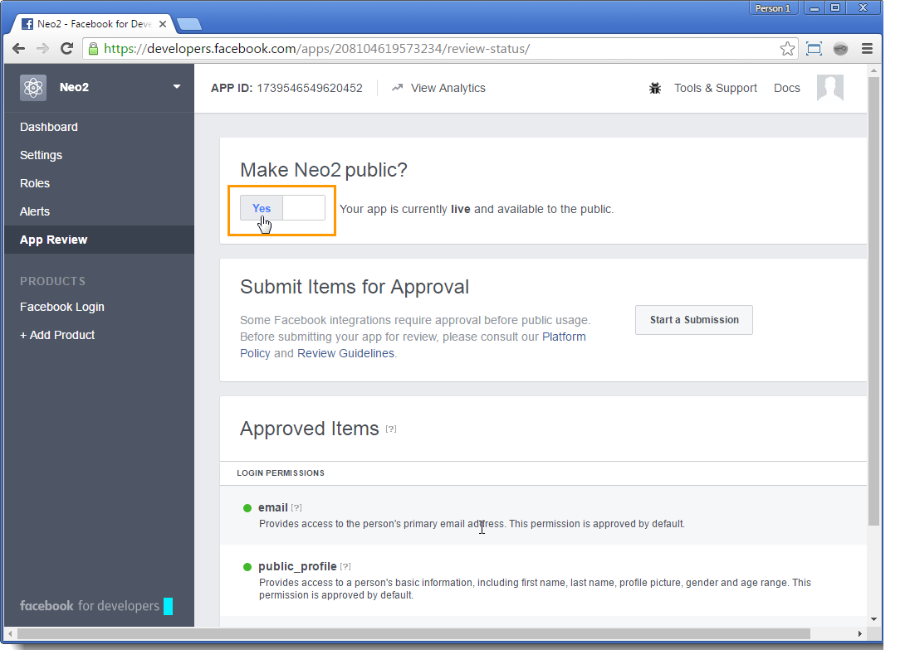

# Publiceren op Facebook-walls{#publishing-on-facebook-walls}

Als u wilt dat Adobe Campaign publicaties naar Facebook-muren kan verzenden, moet u de schrijftoegang voor deze pagina&#39;s delegeren aan Adobe Campaign. Dit omvat de volgende configuratiestappen:

1. Maak een Facebook-account met een of meer pagina&#39;s.
1. Maak een test-Facebook-pagina voor het verzenden van proefdrukken.
1. Maak een Facebook-toepassing.
1. Voer de instellingen van de Facebook-toepassing in Adobe Campaign in de **[!UICONTROL Facebook routing]** externe account.

## Vereisten {#prerequisites}

Begin door een Facebook-account en meerdere pagina&#39;s te maken: deze zullen worden gebruikt voor de verzending van publicaties .

* Gebruik de koppeling [https://www.facebook.com](https://www.facebook.com) om een Facebook-account te maken.
* Als u een Facebook-pagina wilt maken, gebruikt u de koppeling [https://www.facebook.com/pages/create](https://www.facebook.com/pages/create) .

   We raden u aan hetzelfde Facebook-account te gebruiken om al uw pagina&#39;s te beheren. Op deze manier hebt u slechts één Facebook-toepassing en één externe account nodig om op alle pagina&#39;s van de account te schrijven.

   

## Een testpagina voor Facebook maken {#creating-a-test-facebook-page}

We raden u aan een persoonlijke Facebook-pagina te maken voor het afleveren van proefdrukken (raadpleeg voor meer informatie de [proefdruk](../../social/using/publishing-on-facebook.md#sending-the-proof)verzenden).

1. Meld u aan bij het Facebook-account waarmee u uw pagina&#39;s beheert.
1. Maak een nieuwe Facebook-pagina.
1. Klik op de **[!UICONTROL Settings]** knop in de rechterbovenhoek.
1. Wijzig op het **[!UICONTROL General]** tabblad de zichtbaarheidsparameters van de pagina: Schakel het **[!UICONTROL Page unpublished]** selectievakje in.
1. Klik op de knop **[!UICONTROL Save Changes]**.

## Een Facebook-applicatie maken {#creating-a-facebook-application}

Adobe Campaign kan alleen op de muren van uw pagina&#39;s publiceren als u een Facebook-toepassing maakt. Hiervoor voert u de volgende stappen uit:

1. Meld u aan bij het Facebook-account waarmee u pagina&#39;s beheert.
1. Voer het volgende adres in uw browser in: [https://developers.facebook.com/apps](https://developers.facebook.com/apps).

   >[!IMPORTANT]
   >
   >Afhankelijk van het type account dat u hebt, kunnen een of meer machtigingen nodig zijn.
   >
   >Als u een Facebook-toepassing wilt maken, hebt u een **geverifieerd** Facebook-account nodig.

1. Klik op de **[!UICONTROL Add a New App]** knop in de rechterbovenhoek van de pagina. Voer een toepassingsnaam en een e-mailbericht met contactgegevens in en geef vervolgens de beveiligingscontrole door.

   

1. Klik onder **[!UICONTROL Settings > Basic]** op **[!UICONTROL Add a platform]** en selecteer het **[!UICONTROL Facebook Web Games]** type.

   

1. Controleer in het **[!UICONTROL Products]** gedeelte aan de linkerkant of u het **[!UICONTROL Facebook Login]** product ziet. Als dat niet het geval is, voegt u een nieuw product toe en selecteert u **[!UICONTROL Facebook Login]**.

   

1. Nadat de toepassing is gemaakt, selecteert u het **[!UICONTROL App Review]** tabblad en publiceert u de toepassing.

   

## Schrijftoegang delegeren aan Adobe Campaign {#delegating-write-access-to-adobe-campaign}

Als u schrijftoegang wilt delegeren aan Adobe Campaign voor het plaatsen op de wanden van uw pagina&#39;s, moet u de parameters van de eerder gemaakte Facebook-toepassing invoeren.

Voor deze stap hebt u toegang tot zowel uw Adobe Campaign-console als een internetbrowser die u hebt aangemeld bij de Facebook-account die u gebruikt voor paginabeheer:

>[!IMPORTANT]
>
>De Adobe Campaign-exploitant moet beheerrechten hebben om deze configuratie uit te voeren.

* **Facebook**: Selecteer de eerder gemaakte toepassing ( [https://developers.facebook.com/apps](https://developers.facebook.com/apps)) en selecteer het **[!UICONTROL Settings > Basic]** tabblad.

   

   >[!NOTE]
   >
   >Als de **[!UICONTROL Facebook Web Games]** sectie niet verschijnt, klik de **[!UICONTROL Add Platform]** knoop, bij de bodem van de pagina, en selecteer **[!UICONTROL Facebook Web Games]**.

* **Adobe Campaign**: Ga naar het **[!UICONTROL Administration > Platform > External Accounts]** knooppunt van de structuur, selecteer de **[!UICONTROL Facebook routing]** externe account en klik op het **[!UICONTROL Connector]** tabblad.

   

1. Kopieer in de Adobe Campaign-console het adres in het **[!UICONTROL Secure Canvas URL]** veld en plak het in het **[!UICONTROL Secure Web Games URL (https)]** veld op Facebook (in de **[!UICONTROL Facebook Web Games]** sectie).

   

   >[!IMPORTANT]
   >
   >U mag in geen geval de onveilige URL gebruiken.

   Kopieer en plak deze URL ook onder **[!UICONTROL Products]** > **[!UICONTROL Facebook Login]** > **[!UICONTROL Settings]** > **[!UICONTROL Valid OAuth Redirect URIs]**. Als u de geldigheid van de URL wilt controleren, slaat u de toepassing op, kopieert en plakt u de URL in het **[!UICONTROL Redirect URI to Check]** veld en klikt u op **[!UICONTROL Check URI]**.

   

1. Kopieer op Facebook de inhoud van de velden **[!UICONTROL App ID]** en **[!UICONTROL App Secret]** velden en plak deze in de overeenkomende velden van de console.

   

1. Klik op Facebook op de **[!UICONTROL Save Changes]** knop onder aan de pagina.
1. Ga naar de Adobe Campaign-console, sla de externe account op.

   >[!NOTE]
   >
   >The **[!UICONTROL Marketing URL]** field is optional.

1. Klik in de Adobe Campaign-console op de **[!UICONTROL Request the authorization from the application]** koppeling onder aan het **[!UICONTROL Connector]** tabblad. De **[!UICONTROL Synchronize Facebook pages]** workflow wordt automatisch geactiveerd en verzamelt alle Facebook-pagina&#39;s die door de beheerder worden beheerd. Raadpleeg [Facebook-pagina&#39;s](#synchronizing-facebook-pages)synchroniseren voor meer informatie.

   

   >[!NOTE]
   >
   >Standaard worden de pagina&#39;s toegevoegd aan de **[!UICONTROL Facebook]** servicemap die beschikbaar is via het **[!UICONTROL Profiles and Targets > Services and Subscriptions]** knooppunt. In het **[!UICONTROL Folder]** veld op het **[!UICONTROL Connector]** tabblad kunt u de servicemap wijzigen waarin de Facebook-pagina&#39;s na synchronisatie worden gemaakt. U kunt ook de Facebook-pagina&#39;s selecteren die u in Adobe Campaign wilt synchroniseren, afhankelijk van het **[!UICONTROL Filter]** veld. Als u dit veld leeg laat, worden alle Facebook-pagina&#39;s die door de beheerder worden beheerd, gesynchroniseerd.

1. Er wordt een dialoogvenster weergegeven met de verschillende Facebook-machtigingsinstellingen. Hiermee kan Adobe Campaign publicaties naar de Facebook-pagina&#39;s sturen.

   Accepteer de verschillende machtigingsaanvragen.

   

1. Adobe Campaign heeft het recht om op de muren van de pagina&#39;s van het Facebook-account te publiceren.

   

>[!NOTE]
>
>Als het Facebook-account meerdere pagina&#39;s beheert, configureert u gewoon één externe account om op elke pagina van het Facebook-account te schrijven. Voor elk nieuw Facebook-account moet u een nieuw **[!UICONTROL Routing]** type extern account maken.

De **[!UICONTROL Synchronization of Facebook pages]** workflow synchroniseert alle pagina&#39;s die door het Facebook-account worden beheerd, zodat u rechtstreeks via Adobe Campaign op de muur kunt plaatsen. Raadpleeg [Facebook-pagina&#39;s](#synchronizing-facebook-pages)synchroniseren voor meer informatie.

## Facebook-pagina&#39;s synchroniseren {#synchronizing-facebook-pages}

Met de **[!UICONTROL Synchronization of Facebook pages]** workflow, die toegankelijk is via het **[!UICONTROL Administration > Production > Technical workflows > Managing social networks]** knooppunt, kunt u (in Adobe Campaign) de pagina&#39;s synchroniseren van de Facebook-account die eerder is geconfigureerd. Door gebrek, wordt dit werkschema gevormd om één keer per dag te lopen of wanneer een beheerder de **[!UICONTROL Request an authorization from the application]** verbinding in het scherm van de de dienstconfiguratie klikt (verwijs naar het [Delegeren schrijf toegang aan Adobe Campaign](#delegating-write-access-to-adobe-campaign)).

Zodra de synchronisatie is voltooid, verschijnen de verzamelde pagina&#39;s in de de dienstomslag ingegaan in de externe rekening (verwijs naar het [Delegeren van schrijf toegang tot Adobe Campaign](#delegating-write-access-to-adobe-campaign)). Pagina&#39;s worden standaard toegevoegd aan de hoofdmap van de **[!UICONTROL Facebook]** servicemap die beschikbaar is via het **[!UICONTROL Profiles and Targets > Services and subscriptions]** menu.

U kunt nu rechtstreeks via Adobe Campaign op de wanden van uw Facebook-pagina&#39;s publiceren. Raadpleeg [Publiceren op Facebook](#publishing-on-facebook-walls)voor meer informatie hierover.
