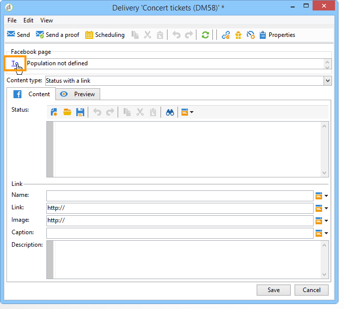
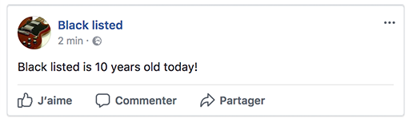
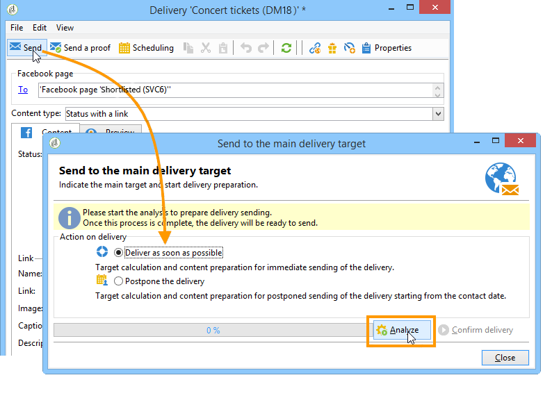

# Publiceren op Facebook{#publishing-on-facebook}

Als de configuratie is voltooid, kunt u via Social Marketing publicaties op de muren van uw Facebook-pagina&#39;s plaatsen.

## Beperkingen {#limitations}

De volgende beperkingen zijn inherent aan Facebook.

* Berichten mogen niet langer zijn dan 1.000 tekens.
* HTML wordt niet ondersteund.

## De levering maken {#creating-the-delivery}

Creeer een nieuwe levering gebruikend het **[!UICONTROL Publish to a brand page]** leveringsmalplaatje.

## Het hoofddoel selecteren {#selecting-the-main-target}

U moet de pagina(&#39;s) selecteren waarop u uw publicatie wilt plaatsen.

1. Klik op de **[!UICONTROL To]** koppeling.

   

1. Klik op de **[!UICONTROL Add]** knop.

   

1. Selecteer **[!UICONTROL A Facebook page]**.

   

1. Selecteer in het **[!UICONTROL Folder]** veld de servicemap die de Facebook-pagina bevat. Pagina&#39;s worden standaard in de hoofdmap van de **[!UICONTROL Facebook]** servicemap opgeslagen. Selecteer vervolgens de Facebook-pagina waarop u wilt plaatsen.

   

## Het proefdrukdoel selecteren {#selecting-the-proof-target}

Op het **[!UICONTROL Target of the proofs]** tabblad kunt u de Facebook-pagina definiëren die u wilt gebruiken voor het testen van leveringen voordat u deze verzendt. We raden u aan hiervoor een speciale persoonlijke Facebook-pagina te maken. Raadpleeg [Een testpagina voor Facebook maken voor meer informatie over het maken van een persoonlijke Facebook-pagina](../../social/using/publishing-on-facebook-walls.md#creating-a-test-facebook-page). Als u het proefdrukdoel wilt selecteren, voert u dezelfde stappen uit als voor het hoofddoel: Het hoofddoel selecteren.

>[!NOTE]
>
>Als u dezelfde Facebook-testpagina gebruikt voor alle leveringen, kunt u het proefdrukdoel opslaan in de **[!UICONTROL Publish to a brand page]** leveringssjabloon, die toegankelijk is via het **[!UICONTROL Resources > Templates > Delivery templates]** knooppunt. Het proefdrukdoel wordt standaard ingevoerd voor elke nieuwe levering.

## Het publiek definiëren {#defining-the-audience}

Als u lokale segmenten wilt gebruiken om het type openbaar te verfijnen dat is geautoriseerd om de publicatie weer te geven, raden we u aan één Facebook-pagina per segment te maken (bijvoorbeeld: Adobe Campaign Paris, Adobe Campaign London, enz.).

Het is echter ook mogelijk om de publieksfilters te gebruiken die door Facebook worden gebruikt. Het **[!UICONTROL Audience]** tabblad van de **[!UICONTROL Select target window]** code bevat vier filters:

* **[!UICONTROL Country]**
* **[!UICONTROL Regions]**
* **[!UICONTROL Cities]**
* **[!UICONTROL Languages]**

>[!CAUTION]
>
>Wees voorzichtig met deze functie. In leveringsrapporten zal de **[!UICONTROL Number of fans]** indicator geen rekening houden met deze filters van Facebook.
>
>Facebook kan de lijst met publieksfilters en hun waarden wijzigen.

## Berichtinhoud definiëren {#defining-message-content}

Selecteer het type publicatie in het **[!UICONTROL Content type]** keuzemenu.

De volgende typen leveringen zijn beschikbaar:

* a **[!UICONTROL Status]**
* a **[!UICONTROL Status with a link]**
* a **[!UICONTROL Status with a YouTube link]**
* a **[!UICONTROL Photo album]**

### Een status publiceren {#publishing-a-status}

Een levering van een statustype kan alleen tekst bevatten, zoals in het onderstaande voorbeeld:

Voer de publicatiestatus in de invoerzone in.

### Een status met een koppeling publiceren {#publishing-a-status-with-a-link}

Een levering van het statustype met een koppeling kan tekst, afbeeldingen en een koppeling bevatten. In de volgende sectie wordt de symmetrie beschreven tussen de velden van het bewerkingsscherm en de laatste publicatie op Facebook:

Voer de verschillende velden in:

>[!CAUTION]
>
>Alle URL&#39;s moeten beginnen met **&quot;http://&quot;** of **&quot;https://&quot;**.

1. Voer in het **[!UICONTROL Status]** veld de tekst in die onder de naam van de pagina wordt weergegeven.
1. Voer in het **[!UICONTROL Name]** veld de titel van de publicatie in.
1. Voer in het **[!UICONTROL Link]** veld de URL in waarnaar de publicatie verwijst.

   >[!NOTE]
   >
   >Als u het **[!UICONTROL Link]** veld wilt toevoegen aan de URL van een Facebook-toepassing om de toepassing te promoten, raden we u aan deze aan te passen aan de weergavecriteria voor smartphones:
   >
   >1. Selecteer de Facebook-toepassing [https://developers.facebook.com/apps](https://developers.facebook.com/apps)en selecteer het **[!UICONTROL Settings > Basic]** tabblad.
   >1. Voer het **[!UICONTROL Namespace]** veld in.
   >1. Voer het **[!UICONTROL Mobile Site URL]** veld in: wanneer een gebruiker op de publicatiekoppeling op zijn smartphone klikt, wordt deze automatisch door Facebook omgeleid naar de URL die in dit veld is gedefinieerd.
   >1. Maak uw webtoepassing zodat het Facebook-scherm wordt gepersonaliseerd als een functie van het gebruikte apparaat (smartphone of pc).
   >1. Ga naar het **[!UICONTROL Link]** gebied van de publicatie via de console van de Campagne van Adobe, ga URL van het **[!UICONTROL Canvas page]** gebied in.

1. Voer in het **[!UICONTROL Image]** veld de URL in van de afbeelding die links van de publicatie wordt weergegeven.

   >[!CAUTION]
   >
   >Facebook kan de afbeelding alleen uploaden als deze op een openbare website wordt gehost.

1. Voer in het **[!UICONTROL Caption]** veld de tekst in die aan het einde van de publicatie wordt weergegeven.
1. Ga naar het **[!UICONTROL Description]** gebied en ga de tekst in die onder de titel moet worden getoond.

### Een status publiceren met een YouTube-koppeling {#publishing-a-status-with-a-youtube-link}

Met dit type inhoud kunt u een koppeling naar een YouTube-video publiceren. Net als bij een status met een gewone koppeling kunt u een status, naam, bijschrift, beschrijving en aanvullende koppeling definiëren. De afbeelding wordt automatisch door Facebook toegevoegd. De symmetrieën tussen de velden van het bewerkingsscherm van de levering en de definitieve publicatie op Facebook zijn hieronder beschreven:

Voer de verschillende velden in:

>[!CAUTION]
>
>Alle URL&#39;s moeten beginnen met **&quot;http://&quot;** of **&quot;https://&quot;**.

1. Voer in het **[!UICONTROL Status]** veld de tekst in die onder de naam van de pagina wordt weergegeven.
1. Voer in het **[!UICONTROL Name]** veld de titel van de publicatie in.
1. Voer in het **[!UICONTROL Video code]** veld de code in van de YouTube-video. Voor de koppeling &#39;http://www.youtube.com/watch?v=abc123456&#39;&#39; is de videocode &#39;abc123456&#39;.
1. Voer in het **[!UICONTROL Caption]** veld de tekst in die aan het einde van de publicatie wordt weergegeven.
1. Ga naar het **[!UICONTROL Description]** gebied en ga de tekst in die onder de titel moet worden getoond.

### Een fotoalbum publiceren {#publishing-a-photo-album}

Met dit type inhoud kunt u een fotoalbum publiceren. U kunt voor elke foto een naam en een beschrijving voor het album en een bijschrift toevoegen. De symmetrieën tussen de velden van het bewerkingsscherm van de levering en de definitieve publicatie op Facebook zijn hieronder beschreven:

Voer de verschillende velden in:

1. Begin door het **[!UICONTROL Album name]** in te voeren.
1. Voer vervolgens de foto in die boven de foto&#39;s **[!UICONTROL Description]** moet worden weergegeven.
1. Als u een foto wilt toevoegen, klikt u op de **[!UICONTROL Add]** knop, selecteert u de foto en klikt u **[!UICONTROL Open]**.
1. Aan elke foto kan een bijschrift worden toegevoegd.

## Voorvertoning {#previewing}

Op het **[!UICONTROL Preview]** tabblad kunt u de rendering van de publicatie weergeven.

1. Klik op het **[!UICONTROL Preview]** tabblad.
1. Klik op het **[!UICONTROL Test personalization]** vervolgkeuzemenu en selecteer **[!UICONTROL Service]**.
1. Selecteer in het **[!UICONTROL Folder]** veld de servicemap die uw Facebook-pagina&#39;s bevat. Pagina&#39;s worden standaard in de hoofdmap van de **[!UICONTROL Facebook]** servicemap opgeslagen.
1. Selecteer de Facebook-pagina waarop u de voorvertoning wilt testen.

>[!NOTE]
>
>De voorvertoning kan enigszins afwijken van de uiteindelijke Facebook-publicatie. We raden u aan vóór de definitieve levering een bewijs te verzenden voor een exacte weergave van de publicatie. Zie De proefdruk [verzenden](#sending-the-proof).

## Tekstspatiëring configureren {#configuring-tracking}

Het volgen kan in de leveringsrapporten en in het **[!UICONTROL Edit > Tracking]** lusje van de levering en de dienst worden bekeken.

De klikken op URL in de levering worden gemeten door de Campagne van Adobe. Het aantal klikken op de **[!UICONTROL Like]** knop, het aantal opmerkingen en het aantal ventilatoren worden door Facebook gemeten.

De volgende configuratie is het zelfde als voor een e-maillevering. Zie [deze sectie](../../delivery/using/monitoring-a-delivery.md)voor meer informatie.

>[!NOTE]
>
>In het **[!UICONTROL Publish to a brand page]** leveringsmalplaatje, wordt het volgen toegelaten door gebrek.

## De proefdruk verzenden {#sending-the-proof}

We raden u ten zeerste aan een proefdruk van uw publicatie vóór de definitieve levering te verzenden om de exacte weergave van de publicatie op een persoonlijke Facebook-testpagina te bekijken. Raadpleeg [Een testpagina voor Facebook maken voor meer informatie over het maken van een persoonlijke Facebook-testpagina](../../social/using/publishing-on-facebook-walls.md#creating-a-test-facebook-page). De stappen voor het selecteren van de doelproefdruk worden in detail beschreven in het [selecteren van het proefdrukdoel](#selecting-the-proof-target).

Bewijs van levering is identiek aan e-mailleveringen. Zie [deze sectie](../../delivery/using/steps-validating-the-delivery.md#sending-a-proof).

## Het bericht verzenden {#sending-the-message}

1. Als de inhoud is goedgekeurd, klikt u op de **[!UICONTROL Send]** knop.
1. Selecteer **[!UICONTROL Deliver as soon as possible]** en klik op de **[!UICONTROL Analyze]** knop.

   >[!NOTE]
   >
   >Met de **[!UICONTROL Postpone the delivery]** optie kunt u de levering uitstellen tot een latere datum.

   

1. Controleer het resultaat wanneer de analyse is voltooid.
1. Klik **[!UICONTROL Confirm delivery]** en klik vervolgens op **[!UICONTROL Yes]**.

   

