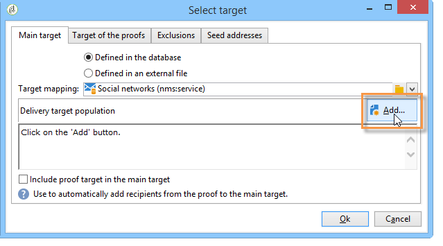
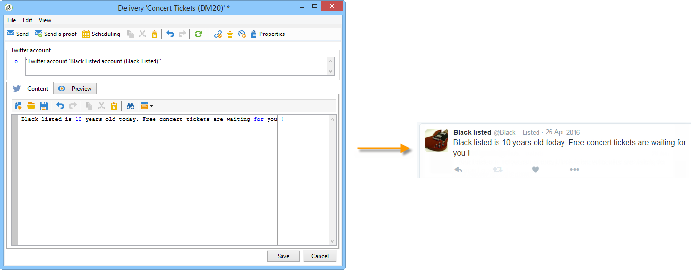
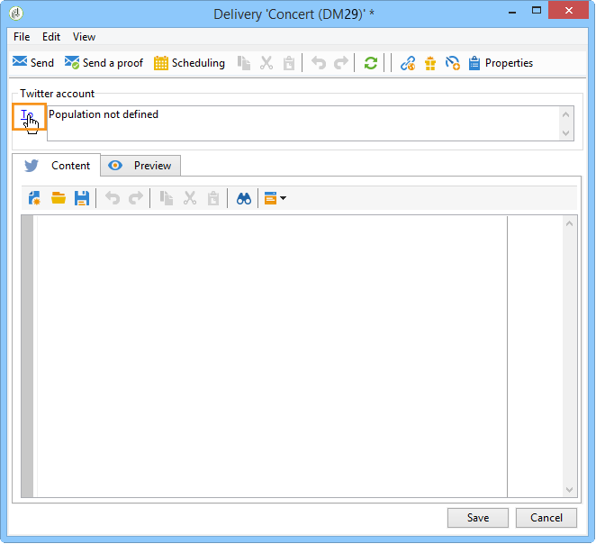
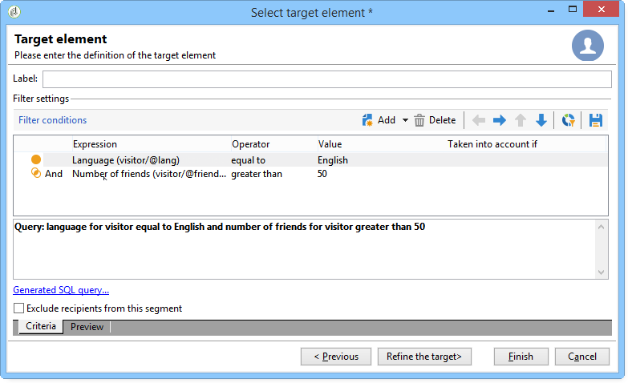

# Publiceren op Twitter{#publishing-on-twitter}

## Publiceren op uw Twitter-accounts {#publishing-on-your-twitter-accounts}

Zodra de configuratie is voltooid, kunt u met Social Marketing tweets verzenden naar uw Twitter-accounts.

### Beperkingen {#limitations}

De volgende beperkingen zijn inherent aan Twitter.

* Het bericht mag niet langer zijn dan 140 tekens.
* HTML-indeling wordt niet ondersteund.

### De levering maken {#creating-the-delivery}

Maak een nieuwe levering op basis van de **[!UICONTROL Tweet (twitter)]** leveringssjabloon.

### Het hoofddoel selecteren {#selecting-the-main-target}

Selecteer de account(s) waarnaar u tweets wilt verzenden.

1. Klik op de **[!UICONTROL To]** koppeling.

   

1. Klik op de **[!UICONTROL Add]** knop.

   

1. Selecteer **[!UICONTROL A Twitter account]**.

   

1. Selecteer in het **[!UICONTROL Folder]** veld de servicemap die de Twitter-account bevat. Selecteer vervolgens het Twitter-account waarnaar u uw tweet wilt verzenden.

   

### Het doel van de proefdruk selecteren {#selecting-the-target-of-the-proof}

Op het **[!UICONTROL Target of the proofs]** tabblad kunt u de Twitter-account definiëren die u wilt gebruiken voor testleveringen voordat de uiteindelijke levering plaatsvindt. Daarom raden we u aan een persoonlijke Twitter-account te maken voor het verzenden van proefdrukken. Zie Een testaccount [maken op Twitter voor meer informatie over het maken van een persoonlijke Twitter-account](../../social/using/configuring-publishing-on-twitter.md#creating-a-test-account-on-twitter). De stappen voor het selecteren van het proefdrukdoel zijn hetzelfde als voor het selecteren van het hoofddoel. Zie Een testaccount [maken op Twitter](../../social/using/configuring-publishing-on-twitter.md#creating-a-test-account-on-twitter).

>[!NOTE]
>
>Als u voor al uw leveringen dezelfde Twitter-testaccount gebruikt, kunt u het proefdrukdoel opslaan in de **[!UICONTROL Tweet]** leveringssjabloon, geopend via het **[!UICONTROL Resources > Templates > Delivery templates]** knooppunt. Het proefdrukdoel wordt dan standaard ingevoerd voor elke nieuwe levering.

### De inhoud van het bericht definiëren {#defining-the-message-content}

Typ de inhoud van uw tweet op het **[!UICONTROL Content]** tabblad.

### De voorvertoning weergeven {#viewing-the-preview}

Op het **[!UICONTROL Preview]** tabblad kunt u een rendering van de tweet weergeven.

1. Klik op het **[!UICONTROL Preview]** tabblad.
1. Klik op het **[!UICONTROL Test personalization]** vervolgkeuzemenu en selecteer **[!UICONTROL Service]**.
1. Selecteer in het **[!UICONTROL Folder]** veld de servicemap die uw Twitter-account bevat.
1. Kies de Twitter-account waarmee u de voorvertoning wilt testen.

>[!NOTE]
>
>De voorvertoning kan iets afwijken van de uiteindelijke tweet. We raden u aan een proefdruk vóór de uiteindelijke aflevering te verzenden om een exacte weergave van de tweet te bekijken. Zie De proefdruk [verzenden](#sending-the-proof).

### Tekstspatiëring configureren {#configuring-tracking}

Het volgen kan in de leveringsrapporten en in het **[!UICONTROL Edit > Tracking]** lusje van de levering en de dienst worden bekeken.

De volgende configuratie is het zelfde als voor een e-maillevering. Zie [deze sectie](../../delivery/using/monitoring-a-delivery.md)voor meer informatie.

>[!NOTE]
>
>In het **[!UICONTROL Tweet]** leveringsmalplaatje, wordt het volgen toegelaten door gebrek.

>[!CAUTION]
>
>We kunnen het verschil niet zien tussen robots die tweets analyseren en gebruikers die klikken.

### De proefdruk verzenden {#sending-the-proof}

We raden u ten zeerste aan een bewijs van uw publicatie vóór de uiteindelijke levering te verzenden om een exacte weergave van de publicatie op een persoonlijke Twitter-testpagina te krijgen. Raadpleeg [Een testaccount maken op Twitter voor meer informatie over het maken van een persoonlijke Twitter-account](../../social/using/configuring-publishing-on-twitter.md#creating-a-test-account-on-twitter). De stappen voor het selecteren van het proefdrukdoel worden gedetailleerd beschreven in het [selecteren van het doel van de proefdruk](#selecting-the-target-of-the-proof).

Bewijs van levering is identiek aan e-mailleveringen. Zie [deze sectie](../../delivery/using/steps-validating-the-delivery.md#sending-a-proof).

### Het bericht verzenden {#sending-the-message}

1. Als de inhoud is goedgekeurd, klikt u op de **[!UICONTROL Send]** knop.
1. Selecteer **[!UICONTROL Deliver as soon as possible]** en klik op de **[!UICONTROL Analyze]** knop.

   >[!NOTE]
   >
   >Met de **[!UICONTROL Postpone the delivery]** optie kunt u de levering uitstellen tot een latere datum.

   

1. Controleer het resultaat als de analyse is voltooid.
1. Klik **[!UICONTROL Confirm delivery]** en klik vervolgens op **[!UICONTROL Yes]**.

## Directe berichten verzenden aan abonnees {#sending-direct-messages-to-subscribers}

### Exploitatiebeginsel {#operating-principle}

Met de **[!UICONTROL Synchronize Twitter accounts]** workflow (zie [Synchronizing Twitter accounts](../../social/using/configuring-publishing-on-twitter.md#synchronizing-twitter-accounts)) wordt de lijst met Twitter-abonnees hersteld, zodat u hen directe berichten kunt sturen. De herstelde volgers worden opgeslagen in een specifieke tabel: de bezoekerslijst. Ga naar het **[!UICONTROL Profiles and Targets > Visitors]** knooppunt om de lijst met Twitter-volgers weer te geven.

>[!CAUTION]
>
>De workflow kan alleen de lijst met Twitter-volgers herstellen als het **[!UICONTROL Synchronize Twitter accounts]** selectievakje is ingeschakeld in het scherm Bewerken van de service die aan de account is gekoppeld. Raadpleeg voor meer informatie: Schrijftoegang [delegeren naar Adobe-campagne](../../social/using/configuring-publishing-on-twitter.md#delegating-write-access-to-adobe-campaign).

Voor elk van de volgende programma&#39;s wordt de volgende informatie hersteld:

* **[!UICONTROL Origin]**: naam van het sociale netwerk (in dit geval **Twitter** )
* **[!UICONTROL External ID]**: gebruikersnaam
* **[!UICONTROL User name]**: accountnaam van de gebruiker
* **[!UICONTROL Full name]**: naam van de gebruiker
* **[!UICONTROL Language]**: gebruikerstaal
* **[!UICONTROL Number of friends]**: aantal volgers
* **[!UICONTROL Time zone]**: tijdzone van gebruiker
* **[!UICONTROL Verified]**: in dit veld wordt aangegeven of de gebruiker een geverifieerde Twitter-account heeft

### Beperkingen {#limitations-1}

De volgende beperkingen zijn inherent aan Twitter.

* Het bericht mag niet langer zijn dan 140 tekens.
* HTML wordt niet ondersteund.
* U kunt niet meer dan 250 directe berichten per dag verzenden. Als u wilt voorkomen dat deze drempelwaarde wordt overschreden, kunt u in verschillende golven leveren. Leveringen in golven worden geconfigureerd als e-mailleveringen. Zie [deze sectie](../../delivery/using/steps-sending-the-delivery.md#sending-using-multiple-waves)voor meer informatie.

### De levering maken {#creating-the-delivery-}

Maak een nieuwe levering op basis van de **[!UICONTROL Tweet (Direct Message)]** leveringssjabloon.

### Het hoofddoel selecteren {#selecting-the-main-target-1}

Selecteer de volgers aan wie u uw directe bericht wilt verzenden.

1. Klik op de **[!UICONTROL To]** koppeling.

   

1. Klik op de **[!UICONTROL Add]** knop.

   

1. Selecteer een type doelverwijzing.

   

   * Selecteer deze optie **[!UICONTROL Twitter subscribers]** om een rechtstreeks bericht naar alle accountwolders te verzenden.

      >[!CAUTION]
      >
      >U kunt niet meer dan 250 berichten per dag verzenden. Als uw Twitter-account meer dan 250 volgers heeft, raden we u ten zeerste aan om uw account in golven te leveren. Dit omvat hetzelfde proces als e-mailleveringen. Zie [deze sectie](../../delivery/using/steps-sending-the-delivery.md#sending-using-multiple-waves).

   * Selecteer **[!UICONTROL Filter conditions]** om een vraag te bepalen en zijn resultaat te bekijken. Deze optie is hetzelfde als voor e-mailleveringen. Zie [deze sectie](../../platform/using/defining-filter-conditions.md) voor meer informatie.

      

### Het doel van de proefdruk selecteren {#selecting-the-target-of-the-proof-1}

Op het **[!UICONTROL Target of the proofs]** tabblad kunt u de volgende persoon selecteren die de proefdruk van uw directe bericht ontvangt. Het selectieproces is hetzelfde als voor het hoofddoel. Zie [Het hoofddoel](#selecting-the-main-target)selecteren.

>[!NOTE]
>
>Als u al uw directe berichtproefdrukken naar de zelfde volger van Twitter wilt verzenden, kunt u het proefdrukdoel in het **[!UICONTROL Tweet (Direct Message)]** leveringsmalplaatje opslaan, dat via de **[!UICONTROL Resources > Templates > Delivery templates]** knoop wordt betreden. Het proefdrukdoel wordt dan standaard ingevoerd voor elke nieuwe levering.

### Berichtinhoud definiëren {#defining-message-content-}

Typ de inhoud van de tweet op het **[!UICONTROL Content]** tabblad.

Velden voor persoonlijke voorkeur kunnen op dezelfde manier worden gebruikt als voor e-mailleveringen, bijvoorbeeld om de naam van de volgende persoon toe te voegen aan de hoofdtekst van het bericht. De personalisatie van de inhoud wordt gedetailleerd in [deze sectie](../../delivery/using/about-personalization.md).

De volgende stappen zijn hetzelfde als het verzenden van een tweet naar een Twitter-account. Raadpleeg [Publiceren op uw Twitter-accounts](#publishing-on-your-twitter-accounts).
