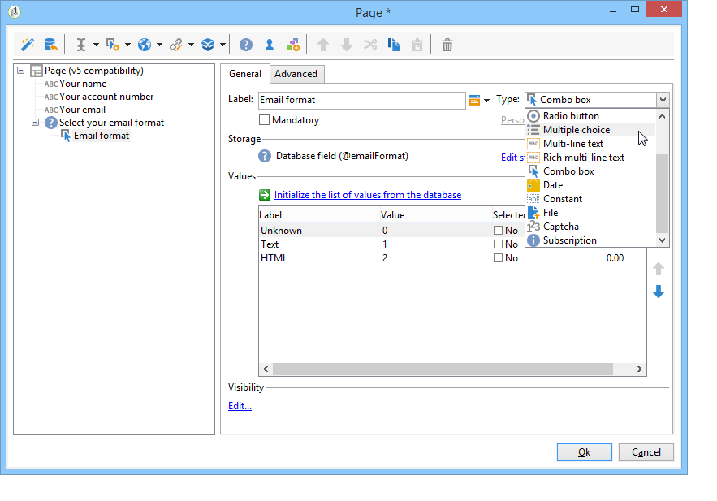
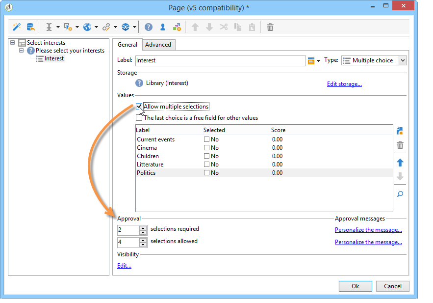
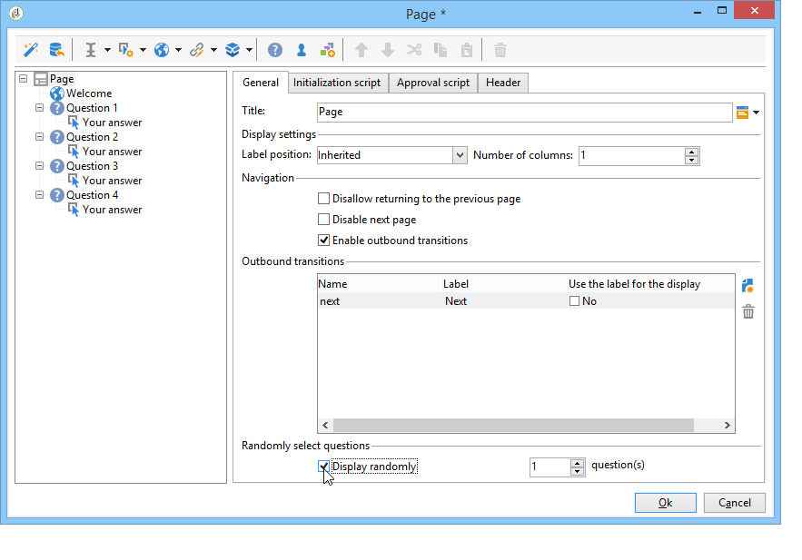

# Een enquête ontwerpen{#building-a-survey}

## Nieuwe enquête maken {#creating-a-new-survey}

In dit hoofdstuk wordt het ontwerpen van een **Enquête** typt u het formulier met Adobe Campaign en met de beschikbare opties en configuraties. Met Adobe Campaign kunt u deze enquête beschikbaar maken voor gebruikers en antwoorden in de database verzamelen en archiveren.

Webformulieren zijn toegankelijk via de **[!UICONTROL Resources > Online > Web applications]** knooppunt van de structuur. Als u een enquête wilt maken, klikt u op de knop **[!UICONTROL New]** boven de lijst met toepassingen of klik met de rechtermuisknop op de lijst en kies **[!UICONTROL New]**.

Selecteer het enquêtemalplaatje (**[!UICONTROL newSurvey]** standaard).

De pagina&#39;s van het formulier worden gemaakt met een speciale editor waarmee u invoervelden (tekst), selectievelden (lijsten, selectievakjes, enz.) kunt definiëren en configureren. en statische elementen (afbeeldingen, HTML-inhoud, enz.). Zij kunnen worden verzameld in &quot;containers&quot; en worden ingedeeld volgens de vereisten. [Meer informatie](#adding-questions)).

>[!NOTE]
>
>Raadpleeg voor meer informatie over het definiëren van inhoud en het maken van schermlay-outs voor een webformulier [dit document](../../web/using/about-web-forms.md).

## Velden toevoegen {#adding-fields}

Met de velden in een formulier kunnen gebruikers gegevens invoeren en opties selecteren. Voor elke pagina in het formulier worden ze gemaakt met de eerste knop op de werkbalk. **[!UICONTROL Add using the wizard]** -menu.

>[!NOTE]
>
>U kunt ook met de rechtermuisknop klikken en een invoerzone invoegen. Standaard wordt de zone ingevoegd aan het einde van de geselecteerde boomstructuur. Gebruik de pijlen in de werkbalk om deze te verplaatsen.

### Typen velden {#types-of-fields}

Wanneer u een veld aan een enquête toevoegt, moet u het type van het veld selecteren. De volgende opties zijn beschikbaar:

1. **[!UICONTROL Answer a question]**: Met deze optie kunt u een nieuw veld (gearchiveerd veld) declareren waarin antwoorden kunnen worden opgeslagen. In dit geval worden alle verzamelde waarden opgeslagen, zelfs wanneer een deelnemer het formulier meerdere keren invult. Deze opslagmodus is alleen beschikbaar in **Enquêtes**. [Meer informatie](../../surveys/using/managing-answers.md#storing-collected-answers).
1. **[!UICONTROL Edit a recipient]**: met deze optie kunt u een veld in de database selecteren. In dit geval worden de gebruikersantwoorden in dit veld opgeslagen. Voor elke deelnemer wordt alleen de laatste opgeslagen waarde behouden en toegevoegd aan de profielgegevens.
1. **[!UICONTROL Add a variable]**: Met deze optie kunt u een instelling maken die ervoor zorgt dat informatie niet in de database wordt opgeslagen. Lokale variabelen kunnen upstream worden gedeclareerd. U kunt de knoppen ook rechtstreeks toevoegen wanneer u het veld maakt.
1. **[!UICONTROL Import an existing question]**: met deze optie kunt u bestaande vragen importeren die in andere enquêtes zijn gemaakt.

   >[!NOTE]
   >
   >Opslagmodi en invoer in het veld worden nader beschreven in [deze sectie](../../surveys/using/managing-answers.md#storing-collected-answers).

De aard van het veld dat moet worden toegevoegd (vervolgkeuzelijst, tekstveld, selectievakjes, enz.) wordt aangepast aan de geselecteerde opslagmodus. U kunt dit wijzigen met de opdracht **[!UICONTROL Type]** van het **[!UICONTROL General]** , maar zorg ervoor dat u consistent blijft met het gegevenstype.

De verschillende typen beschikbare velden worden beschreven in [deze sectie](../../web/using/about-web-forms.md).

## Specifieke elementen {#survey-specific-elements}

De online onderzoeken zijn gebaseerd op de toepassingsmogelijkheden van het Web. De specifieke mogelijkheden voor enquêtes worden hieronder beschreven.

### Meerdere keuzen {#multiple-choice}

Voor **[!UICONTROL Multiple choice]** typecontroles, kunt u een minimum en maximumaantal selecties bepalen. Met deze optie kunt u bijvoorbeeld de selectie op zijn minst op **2** waarden en ten hoogste **4** waarden uit de beschikbare opties:

Als het aantal selecties te groot of te klein is, wordt het juiste bericht weergegeven.

>[!NOTE]
>
>In dit geval worden de opties geselecteerd met behulp van selectievakjes. Wanneer slechts één optie mogelijk is, worden de radioknopen gebruikt.

De bijbehorende configuratie is als volgt:

Daarnaast moet de opslaglocatie voor dit invoerveld een **[!UICONTROL Multiple values]** type **gearchiveerd veld**:

>[!CAUTION]
>
>* Deze functionaliteit is alleen beschikbaar voor **Enquête** typt u formulieren.
>* Deze optie is niet compatibel met willekeurige vraagweergave. [Meer informatie](#adding-questions).

### Vragen toevoegen {#adding-questions}

Er zijn twee typen containers: standaard en vraag. De standaardcontainers worden gebruikt om paginalay-out en voorwaardelijke vertoning in een pagina te vormen. [Meer informatie](../../web/using/about-web-forms.md).

Een **Vraag** container om een vraag aan de pagina toe te voegen en de mogelijke antwoorden hieronder in de hiërarchie op te nemen. Antwoorden van gebruikers op vragen in dit type container kunnen worden geanalyseerd in rapporten.

>[!CAUTION]
>
>Nooit een **Vraag** container onder een andere **Vraag** in de hiërarchie.

Het label van de vraag wordt ingevoerd in het labelveld. In dit geval wordt de stijl uit het stijlblad van het formulier toegepast. Selecteer **[!UICONTROL Enter the title in HTML format]** aanpassen. Hierdoor hebt u toegang tot de HTML-editor.

>[!NOTE]
>
>Zie [dit document](../../web/using/about-web-forms.md) voor meer informatie over het gebruik van de HTML editor.

Bijvoorbeeld:

In het bovenstaande voorbeeld ziet de rendering er als volgt uit:

>[!NOTE]
>
>Elke vraag heeft een **Vraag** tekstcontainer.

U kunt het willekeurig tekenen van vragen door Adobe Campaign inschakelen. Het is dan mogelijk om het aantal vragen te specificeren dat in de pagina, op het gebied wordt getoond dat bij de bodem van het configuratievenster wordt gevestigd.

De rendering ziet er als volgt uit:

Wanneer de pagina wordt vernieuwd, zijn de weergegeven vragen anders.

>[!CAUTION]
>
>Wanneer u een vraag willekeurig weergeeft (**[!UICONTROL Display randomly]** (weergegeven op de pagina), moet u ervoor zorgen dat u geen meerkeuzevragen gebruikt waarvoor een of meer selecties verplicht zijn.
