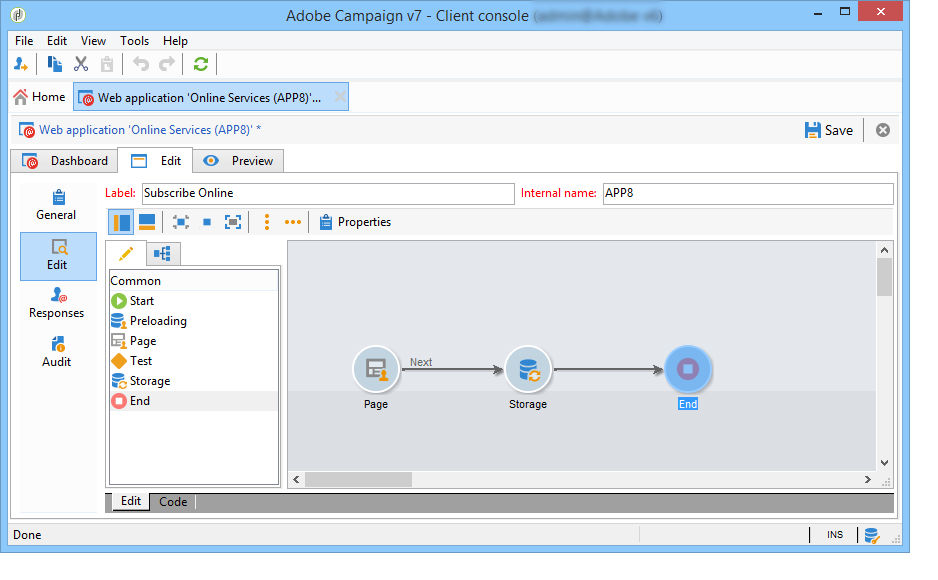
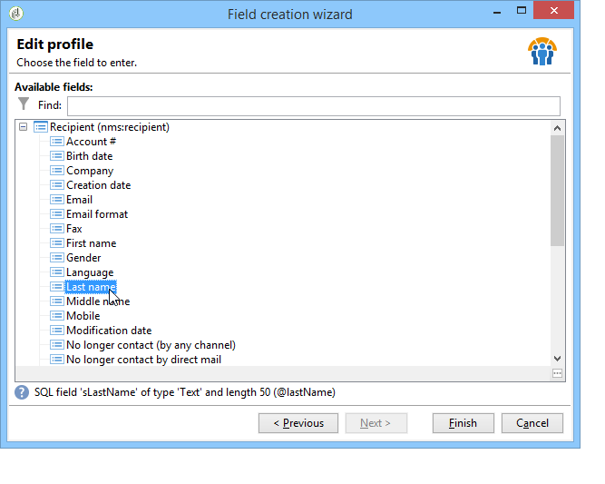
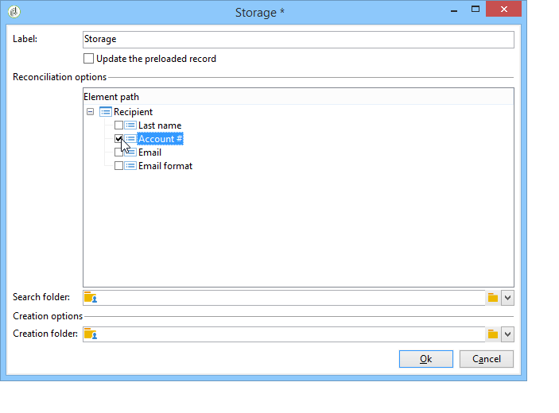

# Belangrijke stappen bij het maken van een enquête{#getting-started-with-surveys}

Hier volgt een snel overzicht van de belangrijkste stappen om een eenvoudig onderzoek tot stand te brengen, gebruikend het volgende ingebouwde malplaatje:

Deze stappen zijn:

1. [Stap 1 - Een enquête maken](#step-1---creating-a-survey),
1. [Stap 2 - Selecteer de sjabloon](#step-2---selecting-the-template),
1. [Stap 3 - Bouw het onderzoek](#step-3---building-the-survey),
1. [Stap 4 - De pagina-inhoud maken](#step-4---creating-the-page-content),
1. [Stap 5 - sla de enquêtegegevens op](#step-5---storing-the-survey-data-),
1. [Stap 6 - De pagina&#39;s publiceren](#step-6---publishing-the-pages),
1. [Stap 7 - Deel uw online enquête](#step-7---sharing-your-online-survey).

## Stap 1 - Een enquête maken {#step-1---creating-a-survey}

Als u een nieuwe enquête wilt maken, gaat u naar de **[!UICONTROL Campaigns]** of **[!UICONTROL Profiles and targets]** en klik op de knop **[!UICONTROL Web Applications]** -menu. Klik op de knop **[!UICONTROL Create]** boven de lijst met formulieren.

## Stap 2 - Selecteer de sjabloon {#step-2---selecting-the-template}

Selecteer een enquêtemalplaatje, dan geef het onderzoek een naam. Deze naam is niet zichtbaar voor de eindgebruikers, maar maakt het mogelijk de enquête te identificeren binnen Adobe Campaign. Klikken **[!UICONTROL Save]** om het onderzoek aan de lijst van de toepassingen van het Web toe te voegen.

## Stap 3 - Bouw het onderzoek {#step-3---building-the-survey}

Enquêtes zijn ingebouwd in een diagram met de volgende elementen: de pagina(&#39;s) waar de inhoud wordt gemaakt, de stappen voor het vooraf laden en opslaan van gegevens en de testfasen. Scripts en query&#39;s kunnen ook worden ingevoegd.

Als u het diagram wilt maken, klikt u op de knop **[!UICONTROL Edit]** vorm van de enquête.

Een onderzoek moet **ten minste** de volgende drie onderdelen: een pagina, een opslagvak en een eindpagina.

* Als u een pagina wilt maken, selecteert u de **[!UICONTROL Page]** object in het linkergedeelte van de editor en neer in het middelste gedeelte, zoals hieronder wordt getoond:

  

* Selecteer vervolgens de **[!UICONTROL Storage]** -object en deze op de uitvoerovergang van de pagina plaatsen.
* Tot slot selecteert u **[!UICONTROL End]** het voorwerp en plaatst het op het eind van de outputovergang van de opslagdoos om het volgende diagram te verkrijgen:

  

## Stap 4 - De pagina-inhoud maken {#step-4---creating-the-page-content}

In het volgende voorbeeld gebruiken we een **[!UICONTROL Page (v5 compatibility)]** tekstpagina. Dit type pagina is toegankelijk via het geavanceerde menu van het dialoogvenster **[!UICONTROL Edit]** tab.

* **Invoervelden toevoegen**

  Als u de inhoud van de pagina wilt maken, moet u deze bewerken. Hiervoor dubbelklikt u op de knop **[!UICONTROL Page]** object. Klik op het eerste pictogram op de werkbalk om de wizard voor het maken van velden te openen. Als u een invoerveld wilt maken waarin de gebruikersnaam wordt opgeslagen in het overeenkomende veld van het profiel van de ontvanger, selecteert u **[!UICONTROL Edit a recipient]**.

  

  Klik op de knop **[!UICONTROL Next]** om het veld voor gegevensopslag in de database te selecteren. In dit geval het veld Achternaam.

  

  Klikken **[!UICONTROL Finish]** om het maken van velden te bevestigen.

  Wanneer de informatie wordt opgeslagen in een veld dat al in de database bestaat, neemt het veld standaard de naam van het geselecteerde veld over, in dit voorbeeld &#39;Achternaam&#39;. U kunt dit label wijzigen zoals hieronder wordt getoond:

  

  Maak nu een invoerveld voor het gebruikersaccountnummer. Herhaal de bewerking en selecteer Account No. veld.

  Pas dezelfde procedure toe om een veld toe te voegen waarin de gebruiker een e-mailadres kan invoeren.

* **Een vraag maken**

  Als u een vraag wilt maken, klikt u met de rechtermuisknop op het laatste element in de structuur en selecteert u **[!UICONTROL Containers > Question]** of klik op de knop **[!UICONTROL Containers]** pictogram en selecteer **[!UICONTROL Question]**.

  

  Voer het label van de vraag in en voeg het (de) antwoordveld(en) in als een subvertakking van de vraag. Hiervoor moet het knooppunt dat aan de vraag is gekoppeld, worden geselecteerd wanneer u het antwoordveld maakt. Voeg een **[!UICONTROL drop-down listx]** met de **[!UICONTROL Selection controls]** of door met de rechtermuisknop te klikken, zoals hieronder wordt getoond:

  

  Selecteer een opslagruimte: selecteer een opsomveld om de waarden automatisch op te halen (in dit geval de e-mailindeling).

  

  In de **[!UICONTROL General]** klikt u op de knop **[!UICONTROL Initialize the list of values from the database]** koppeling: de waardetabel wordt automatisch ingevoerd.

  

  Klikken **[!UICONTROL OK]** de redacteur te sluiten, en **[!UICONTROL Save]** om de wijzigingen op te slaan.

  >[!NOTE]
  >
  >Voor elk veld of elke vraag kunt u de paginalay-out aan uw behoeften aanpassen, dankzij de opties in het dialoogvenster **[!UICONTROL Advanced]** tab. De indeling van de enquêteschermen wordt in het gedeelte [deze sectie](../../web/using/about-web-forms.md).

  Klik in het detailscherm op de knop **[!UICONTROL Preview]** om de weergave weer te geven van de enquête die u zojuist hebt gemaakt.

  

## Stap 5 - sla de enquêtegegevens op {#step-5---storing-the-survey-data-}

In het opslagvak kunt u de gebruikersreacties opslaan in de database. U moet een afstemmingssleutel selecteren om de profielen te identificeren die reeds in het gegevensbestand zijn.

Hiervoor bewerkt u het vak en selecteert u het veld dat wordt gebruikt als afstemmingssleutel wanneer de gegevens worden opgeslagen.

In het onderstaande voorbeeld wordt het profiel bijgewerkt wanneer het opslaan (bevestiging) plaatsvindt en een profiel wordt opgeslagen in de database met hetzelfde accountnummer als de ingevoerde gegevens in het formulier. Als het profiel niet bestaat, wordt het gemaakt.

Klikken **[!UICONTROL OK]** om te bevestigen, dan klik **[!UICONTROL Save]** de enquête opslaan

## Stap 6 - De pagina&#39;s publiceren {#step-6---publishing-the-pages}

Gebruikers kunnen pas toegang krijgen tot de HTML-pagina&#39;s als de toepassing beschikbaar is. Het moet zich niet meer in de bewerkingsfase bevinden, maar in productie. Als u een enquête in productie wilt plaatsen, moet u deze publiceren. Dit doet u als volgt:

* Klik op de knop **[!UICONTROL Publish]** boven het enquêtedashboard.
* Klikken **[!UICONTROL Start]** om de publicatie te starten en de wizard te sluiten.

  

  De status van de enquête verandert in: **Online**.

  

## Stap 7 - Deel uw online enquête {#step-7---sharing-your-online-survey}

Zodra het in productie is, is het onderzoek toegankelijk op de server en u kunt het leveren. De URL voor toegang tot de enquête wordt weergegeven op het dashboard.

Als u de enquête wilt afleveren, kunt u een bericht met een toegangskoppeling naar de doelpopulatie verzenden of de URL voor de toegang tot de enquête bijvoorbeeld op een webpagina plaatsen.

Vervolgens kunt u de antwoorden van gebruikers controleren via rapporten en logboeken. Zie [Respons bijhouden](../../surveys/using/publish-track-and-use-collected-data.md#response-tracking).

>[!CAUTION]
>
>De openbare URL bevat de interne naam van de enquête. Wanneer de interne naam wordt gewijzigd, wordt de URL automatisch bijgewerkt: alle koppelingen naar de enquête moeten ook worden bijgewerkt.
>
>Als er al leveringen met de koppeling naar het formulier zijn verzonden, werkt deze koppeling niet meer.
