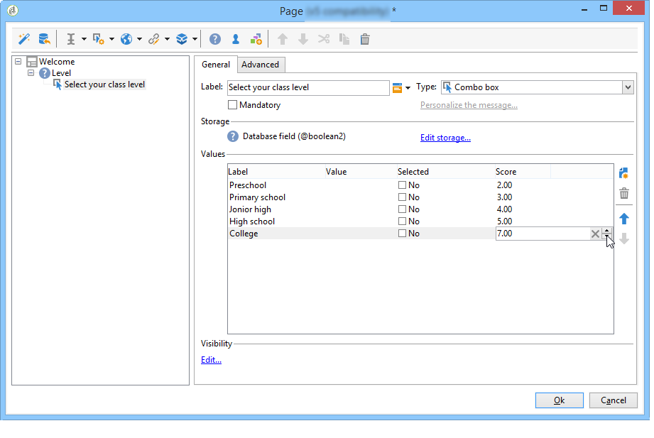

# Antwoorden beheren{#managing-answers}


## Opgeslagen antwoorden opslaan {#storing-collected-answers}

Naast de standaard opslagwijzen die voor alle vormen van het Web in Adobe Campaign (gegevensbestandgebied en lokale variabele) gemeenschappelijk zijn, laten de onderzoeken de dynamische uitbreiding van het gegevensmodel toe gebruikend gearchiveerde gebieden.

>[!CAUTION]
>
>Deze optie is beschikbaar voor **Enquête** Typ alleen webtoepassingen. Het wordt niet aangeboden voor andere soorten de vormen van het Web.

### Opslaan in een gearchiveerd veld {#storing-in-an-archived-field}

Het is gemakkelijk om het gegevensmalplaatje uit te breiden door nieuwe opslagruimten toe te voegen om de reacties te bewaren die in onderzoeken worden verstrekt. Selecteer hiervoor de optie **[!UICONTROL Store answers to a question]** als u het invoerveld maakt. Klik op de knop **[!UICONTROL New field...]** koppelen en eigenschappen geven:


Voer het label en de naam van het veld in en selecteer het veldtype: Tekst, Boolean, Geheel getal of decimaal getal, Datum, enzovoort.

Het geselecteerde veldtype bevat een besturingselement voor de gegevens wanneer de gebruikers de reacties invoeren. Voor **text** in velden kunt u een beperking (hoofdletters/kleine letters, opmaak) of een koppeling naar een bestaande opsomming toevoegen om selectie te forceren.

Als u een restrictie wilt toevoegen, selecteert u deze in de vervolgkeuzelijst. Er zijn twee soorten beperkingen:

1. Teken

   De ingevoerde informatie kan in de volgende notaties in het veld worden opgeslagen: in hoofdletters, in kleine letters of in hoofdletters. Deze beperking vereist niet dat de gebruiker de gegevens in de geselecteerde indeling invoert, maar de inhoud die in het veld wordt ingevoerd, wordt geconverteerd wanneer deze wordt opgeslagen.

1. Gegevensindeling

Als dit veld in een lijst wordt gebruikt, kunnen de waarden van de opsomming automatisch in de waardetabel worden opgehaald met de opdracht **[!UICONTROL Initialize the list of values from the database]** koppeling boven de lijst met waarden.

U kunt bijvoorbeeld een vervolgkeuzelijst maken waarin de gebruiker zijn of haar eigen taal kan selecteren. Het corresponderende gearchiveerde veld kan worden gekoppeld aan het **taal** opsomming die een lijst van talen bevat:


De **[!UICONTROL Edit link]** Met het pictogram rechts van het veld kunt u de inhoud van deze opsomming bewerken:


In de **[!UICONTROL General]** tabblad van het veld, **[!UICONTROL Initialize the list of values from the database]** Met deze koppeling kunt u automatisch de lijst met aangeboden labels invoeren.


**Voorbeeld**: de contracten van een ontvanger in één veld opslaan

Als u verschillende typen contracten in één veld wilt opslaan, maakt u een **[!UICONTROL Text]** invoerveld en selecteer de **[!UICONTROL Store answers to a question]** optie.

Klik op de knop **[!UICONTROL New field...]** koppelen en de veldeigenschappen invoeren. Selecteer **[!UICONTROL Multiple values]** om meerdere waarden op te slaan.


Maak invoervelden voor de andere contracten en sla de gegevens op in hetzelfde gearchiveerde veld.


Wanneer gebruikers de enquête goedkeuren, worden hun antwoorden opgeslagen in de **[!UICONTROL Contracts]** veld.

In ons voorbeeld, voor de volgende antwoorden:


Het profiel van de respondent bevat de vier contracten die zijn aangegaan.

U kunt ze bekijken in het dialoogvenster **[!UICONTROL Answers]** tabblad van de enquête door de desbetreffende kolommen weer te geven.


U kunt ontvangers ook filteren op basis van antwoorden om alleen de gebruikers weer te geven die u interesseren. Hiertoe maakt u een doelworkflow en gebruikt u de opdracht **[!UICONTROL Survey responses]** doos.


Maak uw query op basis van de profielen die u wilt herstellen. In het volgende voorbeeld kunt u met de query profielen selecteren met ten minste twee contracten, inclusief een A-typecontract.


Voor elk formulier kunnen de antwoorden worden gebruikt in velden of labels. Gebruik de volgende syntaxis voor inhoud die is opgeslagen in een gearchiveerd veld:

```
<%= ctx.webAppLogRcpData.name of the archived field %
```

>[!NOTE]
>
>Voor andere typen velden wordt de syntaxis beschreven in [deze sectie](../../platform/using/about-queries-in-campaign.md).

### Opslaginstellingen {#storage-settings}

U kunt antwoorden op enquêtes archiveren in XML-indeling. Hiermee kunt u een onbewerkte kopie van de verzamelde antwoorden opslaan. Dit kan handig zijn als de gegevens in een gespecificeerde lijst te veel gestandaardiseerd zijn. [Meer informatie](../../surveys/using/publish--track-and-use-collected-data.md#standardizing-data)

>[!CAUTION]
>
>De archivering van onbewerkte reacties is van invloed op de vereiste opslagruimte. Wees voorzichtig met deze optie.

Dit doet u als volgt:

* De enquêteeigenschappen bewerken via het dialoogvenster **[!UICONTROL Properties]** van de **[!UICONTROL Edit]** tab.
* Klik op de knop **[!UICONTROL Advanced parameters]** en controleer de **[!UICONTROL Save a copy of raw answers]** optie.


U kunt deze optie standaard inschakelen voor alle enquêtes (deze optie wordt toegepast wanneer de enquête wordt gepubliceerd). Om dit te doen, creeer **[!UICONTROL NmsWebApp_XmlBackup]** optie en waarde toewijzen **[!UICONTROL 1]** op de lijst, zoals hieronder weergegeven:


## Score-beheer {#score-management}

U kunt een score toewijzen aan de opties op de pagina&#39;s van het formulier. Scores kunnen alleen worden gekoppeld aan gesloten vragen: selectievakje, waarde uit een vervolgkeuzelijst, abonnement, enz.


De scores worden verzameld en op de server opgeslagen wanneer de pagina wordt bevestigd, dat wil zeggen wanneer de gebruiker op de knop **[!UICONTROL Next]** of **[!UICONTROL Finish]** knop.

>[!NOTE]
>
>U kunt positieve of negatieve waarden, gehele getallen of niet-gehele getallen gebruiken.

Scores kunnen worden gebruikt in tests of scripts.

>[!CAUTION]
>
>Scores kunnen niet worden gebruikt in de zichtbaarheidsvoorwaarden voor velden die zich op dezelfde pagina bevinden. Ze kunnen echter wel op volgende pagina&#39;s worden gebruikt.

* Als u scores wilt gebruiken in tests, gebruikt u de opdracht **[!UICONTROL Score]** veld in de formule voor de berekening van de test, zoals hieronder aangegeven:

   

* U kunt de score in een script gebruiken.

**Voorbeeld**: Bereken een score en gebruik deze als voorwaarde voor de weergave van de volgende pagina:

* In een enquête kunt u op de volgende pagina verschillende scores toewijzen aan gebruikers, afhankelijk van de waarde die is geselecteerd in de vervolgkeuzelijst:

   

* U kunt deze score combineren met een tweede waarde, afhankelijk van de geselecteerde optie:

   

* Wanneer de gebruiker op de knop **[!UICONTROL Next]** worden de twee waarden opgeteld.

   

* De voorwaarden kunnen worden toegepast voor de pagina die volgens de score moet worden getoond. Dit is als volgt geconfigureerd:

   

   
