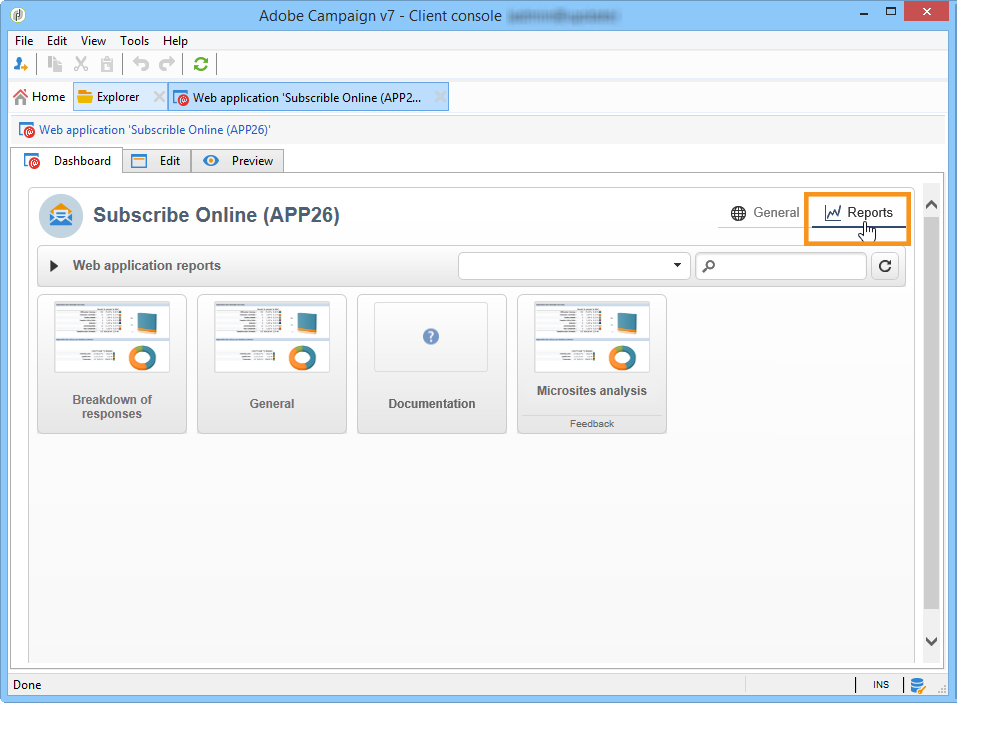

# Verzamelde data gegevens publiceren, bijhouden en gebruiken{#publish-track-and-use-collected-data}


Nadat het formulier is gemaakt, geconfigureerd en gepubliceerd, kunt u de koppeling delen met uw publiek en de reacties volgen.

>[!NOTE]
>
>De levenscyclus van een onderzoek in Adobe Campaign evenals zijn het publiceren en leveringswijzen zijn gelijkaardig aan die van de vormen van het Web: deze zijn gedetailleerd in [ deze sectie ](../../web/using/about-web-forms.md).

## Beoordelingsdashboard {#survey-dashboard}

Elk onderzoek heeft zijn eigen dashboard dat u zijn status, beschrijving, openbare URL en beschikbaarheidsprogramma laat bekijken. U kunt ook de beschikbare rapporten weergeven. [Meer informatie](#reports-on-surveys).

De openbare URL van de enquête wordt weergegeven op het dashboard:


## Respons bijhouden {#response-tracking}

U kunt de antwoorden op de enquête bijhouden in logboeken en rapporten.

### Beoordelingslogboeken {#survey-logs}

Voor elke geleverde enquête kunt u de antwoorden bijhouden op het tabblad **[!UICONTROL Logs]** . Op dit tabblad ziet u de lijst met gebruikers die de enquête hebben voltooid en de oorsprong van de enquête:


Dubbelklik op een regel om het enquêteformulier weer te geven zoals het door de geënquêteerde is ingevuld. U kunt de enquête volledig doorbladeren en de antwoorden volledig openen. Deze bestanden kunnen in een extern bestand worden geëxporteerd. Voor meer op dit, verwijs naar [ het Uitvoeren antwoorden ](#exporting-answers).

De oorsprong wordt aangegeven in de URL van de enquête door de volgende tekens toe te voegen:

```
?origin=xxx
```

terwijl de enquête wordt bewerkt, bevat de URL de parameter **[!UICONTROL __uuid]** , die aangeeft dat de enquête zich in een testfase bevindt en nog niet online is. Wanneer u de enquête opent via deze URL, wordt er geen rekening gehouden met de gemaakte records in de tracering (rapporten). De oorsprong wordt geforceerd naar de waarde **[!UICONTROL Adobe Campaign]** .

Voor meer op parameters URL, verwijs naar [ deze pagina ](../../web/using/defining-web-forms-properties.md#form-url-parameters).

### Verslagen over enquêtes {#reports-on-surveys}

Op het tabblad dashboard hebt u toegang tot enquêterapporten. Klik op een rapportnaam om deze weer te geven.



De structuur van de enquête wordt weergegeven in het **[!UICONTROL Documentation]** -rapport.

Er zijn nog twee andere rapporten over webenquêtes beschikbaar op het tabblad **[!UICONTROL Reports]** van de enquêtes: **[!UICONTROL General]** en **[!UICONTROL Breakdown of responses]** .

* Algemeen

  Dit verslag bevat algemene informatie over de enquête: hoe het aantal reacties in de loop der tijd verandert en hoe de verspreiding naar oorsprong en taal verloopt.

  Voorbeeld van een algemeen rapport:

  

* Uitsplitsing van reacties

  In dit verslag worden de antwoorden voor elke vraag uitgesplitst. Deze indeling is alleen beschikbaar voor antwoorden op velden die zijn opgeslagen in **[!UICONTROL Question]** -tekstcontainers. Deze is alleen geldig voor selectiecontroles (bijvoorbeeld geen uitsplitsing op tekstvelden).

  

## Antwoorden exporteren {#exporting-answers}

Antwoorden op een enquête kunnen worden geëxporteerd in een extern bestand dat later wordt verwerkt. Er zijn twee manieren om dit te doen:

1. Rapportgegevens exporteren

   Als u rapportgegevens wilt exporteren, klikt u op de knop **[!UICONTROL Export]** en kiest u de exportindeling.

   Voor meer bij het uitvoeren van rapportgegevens, verwijs naar [ deze sectie ](../../reporting/using/about-reports-creation-in-campaign.md).

1. Antwoorden exporteren

   Als u antwoorden wilt exporteren, klikt u op het tabblad **[!UICONTROL Responses]** van de enquête en klikt u met de rechtermuisknop. Selecteer **[!UICONTROL Export...]**.

   

   Voer vervolgens de gegevens in die u wilt exporteren en het opslagbestand.

   U kunt de inhoud en de indeling van het uitvoerbestand configureren in de exportassistent.

   Hiermee kunt u:

   * kolommen toevoegen aan het uitvoerbestand en de informatie over de ontvanger (die in de database is opgeslagen) herstellen;
   * de indeling van de geëxporteerde gegevens;
   * Selecteer de coderingsindeling voor de gegevens in het bestand.

   Als de enquête die u wilt exporteren meerdere **[!UICONTROL Multi-line text]** - of **[!UICONTROL HTML text]** -velden bevat, moet deze worden geëxporteerd in de **[!UICONTROL XML]** -indeling. U doet dit door deze indeling te selecteren in de vervolgkeuzelijst van het veld **[!UICONTROL Output format]** , zoals hieronder wordt weergegeven:

   

   Klik op **[!UICONTROL Start]** om het exporteren uit te voeren.

   >[!NOTE]
   >
   >De uitvoer van gegevens en de stadia van hun configuratie zijn gedetailleerd in [ deze sectie ](../../platform/using/about-generic-imports-exports.md).

## De verzamelde gegevens gebruiken {#using-the-collected-data}

De informatie die via online enquêtes wordt verzameld, kan worden teruggevonden in het kader van een doelgerichte werkstroom. Gebruik hiervoor het vak **[!UICONTROL Survey responses]** .

In het volgende voorbeeld, willen wij een aanbieding van het Web speciaal voor de vijf ontvangers met minstens twee kinderen en met de hoogste scores bij een online onderzoek maken. De antwoorden op deze enquête zijn:


In de doelworkflow wordt **[!UICONTROL Survey responses]** als volgt geconfigureerd:


Selecteer eerst de desbetreffende enquête en vervolgens de gegevens die u wilt extraheren in het centrale gedeelte van het venster. In dit geval moeten we ten minste de kolom met de score extraheren, aangezien deze in het gesplitste vak wordt gebruikt om de vijf hoogste scores te herstellen.

Geef de filtervoorwaarden voor antwoorden aan door op de koppeling **[!UICONTROL Edit query...]** te klikken.


Start de doelworkflow. De query herstelt 8 ontvangers.


Klik met de rechtermuisknop op de uitvoerovergang van het verzamelingsvak om deze te bekijken.


Plaats vervolgens een gesplitst vak in de workflow om de 5 ontvangers met de hoogste score te herstellen.

Bewerk het gesplitste vak om het te configureren:

* Selecteer eerst het juiste schema op het tabblad **[!UICONTROL General]** en configureer vervolgens de subset:

  

* Ga naar de tab **[!UICONTROL Sub-sets]** en selecteer de optie **[!UICONTROL Limit the selected records]** en klik vervolgens op de koppeling **[!UICONTROL Edit...]** .

  

* Selecteer de optie **[!UICONTROL Keep only the first records after sorting]** en selecteer de sorteerkolom. Schakel de optie **[!UICONTROL Descending sort]** in.

  

* Klik op de knop **[!UICONTROL Next]** en beperkt het aantal records tot 5.

  

* Klik op **[!UICONTROL Finish]** en start de workflow opnieuw om het kiezen van doelen goed te keuren.

## Gegevens standaardiseren {#standardizing-data}

Het is mogelijk om normalisatieprocessen in Adobe Campaign op te zetten voor gegevens die met aliassen worden verzameld. Hiermee kunt u de gegevens die in de database zijn opgeslagen, standaardiseren: hiervoor definieert u aliassen in de gespecificeerde lijsten die de relevante informatie bevatten. [Meer informatie](../../platform/using/managing-enumerations.md#about-enumerations)
