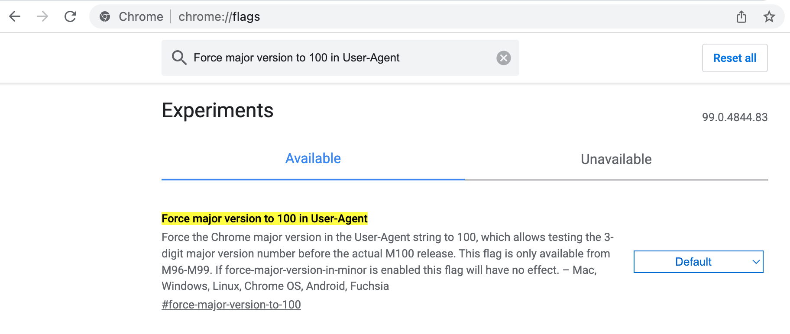

# Chrome en Firefox v100 zijn van invloed op webcomponenten voor campagnes {#version-100}

Google en Mozilla waarschuwen dat Chrome en Firefox sommige websites kunnen verbreken vanwege de aanstaande versies van 3 cijfers.

De wijziging in het versienummer van 2 naar 3 cijfers kan problemen veroorzaken bij het bezoeken van websites die niet zijn voorbereid voor deze wijziging. Sommige webpagina&#39;s worden mogelijk niet meer correct weergegeven in deze nieuwe browserversies.

Chrome v100 is ingesteld voor release op **29 maart 2022** en Firefox v100 op **3 mei 2022**.

Mozilla en Google testen de compatibiliteit van belangrijke websites op voorhand. Als er problemen zijn met sites die ze niet kunnen oplossen voordat deze versies worden uitgebracht, hebben beide back-upplannen klaar om ervoor te zorgen dat de sites niet worden beïnvloed.

Mogelijke problemen of verlies van functionaliteit op de website komen voort uit de userAgent-tekenreeks die browsers verzenden naar websites die u bezoekt: de gebruikersagent is een tekenreeks die door de browser naar de website wordt verzonden om de site te laten weten welke browser en versie u gebruikt en welke technologie u gebruikt. Wanneer uw browser een verzoek naar een website verzendt, identificeert het zich met het koord van de gebruikersagent alvorens het de gevraagde inhoud terugwint. De gegevens in de tekenreeks van de gebruikersagent helpen de website de inhoud te leveren in een indeling die geschikt is voor uw browser. De versie van de gebruikersagent wordt verhoogd zodat deze overeenkomt met het versienummer van de browser. Het verplaatsen van 2 naar 3 cijfers kan problemen veroorzaken.

## Heeft dit gevolgen voor u?{#version-100-impact}

Adobe raadt u aan uw Campagne-webtoepassingen, waaronder webformulieren en enquêtes, en e-mailspiegel-pagina&#39;s te testen om ervoor te zorgen dat deze nog steeds goed werken met deze nieuwe browserversies.

Deze aanbeveling is van toepassing op alle webtoepassingen, en vooral als u JavaScript-code hebt opgenomen.

U moet beide controleren met Firefox en Chrome, mobiel en bureaublad.

## Hoe kan ik testen?{#version-100-test}

In Chrome en Firefox, kunt u browser vormen om de versie nu als 100 te melden, dan om het even welke kwesties te melden en te verbeteren u tegenkomt.

### Testen met Firefox 100{#test-firefox-100}

Als u uw webpagina&#39;s wilt testen met Mozilla Firefox 100, kunt u de volgende wijziging van de gebruikersagent in uw webapps simuleren door de tekenreeks van de gebruikersagent handmatig te wijzigen.

1. Firefox openen, voer `about:config` in de adresbar, en druk binnengaan.
1. Zoeken naar `general.useragent.override`.
1. Selecteer &#39;String&#39; en klik op het plusteken (+).

   

1. Voer de volgende tekst in het veld in:

   ```
   Mozilla/5.0 (Windows NT 10.0; rv:100.0) Gecko/20100101 Firefox/100.0
   ```

1. Klik op het blauwe vinkje om de instelling op te slaan.
1. Sluit de browser en start deze opnieuw.

Met deze instellingen stuurt de browser de tekenreeks van de nieuwe gebruikersagent naar websites om aan te geven dat de browser Firefox 100 is. Als u problemen ondervindt met uw webformulieren, moet u een nieuw foutrapport voor Mozilla maken. Overweeg deze webformulieren opnieuw samen te stellen voordat deze wijziging algemeen beschikbaar is.

Om uw gebruikersagent terug naar zijn gebrek te veranderen, ga eenvoudig terug in `about:config` en zoek naar `general.useragent.override` opnieuw instellen.  Klik in dat geval op het prullenbakpictogram om de instelling te verwijderen en de browser opnieuw te starten.

### Testen met Chrome 100{#test-chrome-100}

Als u de Google Chrome 100-gebruikersagent wilt testen op uw eigen webapps, kunt u deze test inschakelen door de volgende stappen uit te voeren:

1. Chroom openen, Enter `chrome://flags` in de adresbar, en druk binnengaan.
1. Zoeken `Force major version to 100 in User-Agent` in het zoekveld en inschakelen zoals hieronder wordt weergegeven.

   

1. Sluit de browser en start deze opnieuw.
1. Sluit de `chrome://flags` scherm.

Met deze instellingen stuurt de browser de tekenreeks van de nieuwe gebruikersagent naar websites om aan te geven dat de browser Chrome 100 is. Als u problemen ondervindt met de websites die u bezoekt, moet u een nieuw foutrapport voor Google maken. Overweeg deze webformulieren opnieuw samen te stellen voordat deze wijziging algemeen beschikbaar is.

Om gebruikersagent terug naar zijn gebrek te veranderen, volg eenvoudig dit proces en verander het plaatsen van de vlag aan `Default` en start de browser opnieuw.
