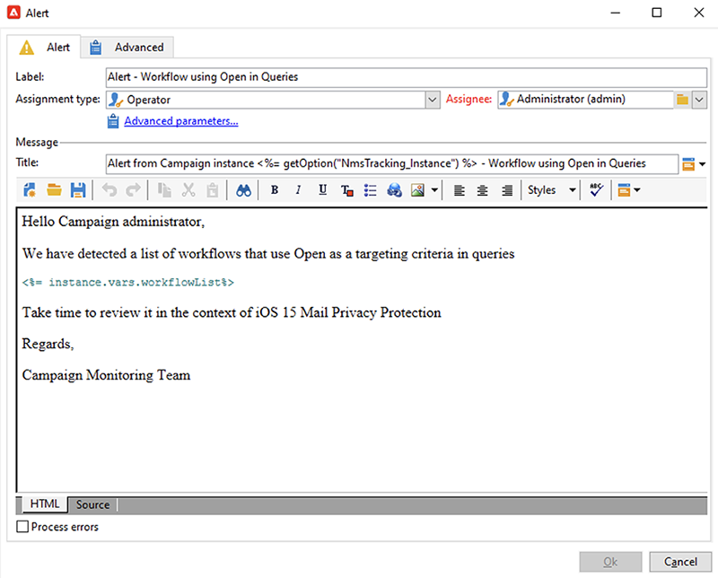

# Privacy-beveiliging per post in de e-mailtoepassing van Apple


## Wat is er veranderd?

In 2021 introduceerde Apple nieuwe mogelijkheden voor privacybescherming voor hun native Mail-app. Deze app bevat nu de functie om privacybescherming voor e-mail van Apple. Afzenders kunnen de &#39;tracking&#39;-pixels niet meer gebruiken om informatie te verzamelen over ontvangers die ervoor hebben gekozen om de functie van Apple Mail Privacy Protection in te schakelen. [Lees meer](https://experienceleague.adobe.com/docs/deliverability-learn/deliverability-best-practice-guide/additional-resources/technotes/apple-mail-privacy-faq.html){target=&quot;_blank&quot;}.

## Hoe worden mijn campagnes beïnvloed?

Adobe Campaign biedt mogelijkheden om trackingpixels te gebruiken om het openen van e-mail te volgen. U kunt deze mogelijkheid niet alleen gebruiken voor doelframes en campagnes, maar ook voor meetgegevens. U kunt bijvoorbeeld de e-mailsnelheid gebruiken om de doeltreffendheid van de campagne en de betrokkenheid van de gebruiker te meten. Kortom, segmentatie, het richten, en metriek zouden in uw campagnes kunnen worden beïnvloed. [Lees meer](https://experienceleague.adobe.com/docs/deliverability-learn/deliverability-best-practice-guide/additional-resources/technotes/apple-mail-privacy-faq.html#in-addition-to-measuring-opens%2C-what-else-is-impacted%3F){target=&quot;_blank&quot;}.

## Welke maatregelen moet ik nemen?

De nieuwe functie van Apple is de vorm van zaken die in de branche komen op het gebied van bescherming van de privacy van e-mail. We raden u ten zeerste aan de aanbevelingen van de Adobe te volgen.

### De invloed op uw campagnetriggers beoordelen

Evalueer hoe deze wijzigingen van invloed zijn op uw huidige campagnetriggers. Identificeer de werkschema&#39;s waarin e-mail opent als criterium voor segmentatie, het richten, of het herrichten worden gebruikt. Lees de [tips en trucs](#find-email-open-tracking).

### Uw gegevens behouden

Behoud uw gegevens en consolideer uw huidige kennis op apparaten. U kunt zeer belangrijke prestatiesindicatoren (KPIs) op de gebruikersagent baseren. U kunt bijvoorbeeld KPI&#39;s maken rond profielen van personen die iOS en de e-mailtoepassing van Apple gebruiken. Lees de [tips en trucs](#preserve-tracking-data).

### Uw trackinglogboeken archiveren na de bewaarperiode

Archiveer uw trackinglogboeken na de bewaarperiode van Adobe Campaign:

1. Controleer de duur van de retentieperiode in uw campagneexemplaar.
1. Controleer de actieve doeltoewijzingen tweemaal. Bepaal of u tabellen met aangepaste profielen gebruikt naast de tabel met out-of-the-box profielen (`nmsRecipient`).
1. Exporteer uw trackinglogboeken vanuit Adobe Campaign. Neem de logboeken op die gegevens bevatten over de gebruikersagent en het besturingssysteem.

### De huidige trend in de open rentetarieven beoordelen

Bepaal welk deel van uw publiek de app Mail van Apple op een iOS-apparaat gebruikt.
Op basis van deze beoordeling kunt u mogelijke afwijkende leemten en de oorzaak ervan vaststellen. U kunt bepalen of een gat te wijten is aan problemen met de campagneprestaties of aan de privacybeschermingsfunctie van Apple. Lees de [tips en trucs](#measure-ios-footprint).

### Herzie uw campagnestrategie en prestatiesmetriek

We raden u met name aan uw campagnestrategie en maatstaven voor de prestaties van uw campagne proactief opnieuw te beoordelen. U kunt zich op betrouwbaardere metriek, bijvoorbeeld, klik-door, productmeningen, en aankopen concentreren.

Wij adviseren dat u momenteel beschikbare gegevens onderzoekt en de correlatie tussen open tarieven en andere metriek beoordeelt. Als deze metriek constant gecorreleerd zijn, kunt u uw trekkers met een goed niveau van vertrouwen verbeteren.

## Tips en trucs

### De totale iOS-voetafdruk meten {#measure-ios-footprint}

Om inzichten van de gegevens van Adobe Campaign te verzamelen, kunt u out-of-the-box rapporten gebruiken:

* **[!UICONTROL Operating Systems]** verslag

   Gebruik dit rapport om het aantal bezoekers per besturingssysteem en per versie te bepalen. [Meer informatie](../../reporting/using/global-reports.md#operating-systems).

   U kunt de uitsplitsing van bezoekers per besturingssysteem bekijken in verhouding tot het totale aantal bezoekers.

   

   Voor elk besturingssysteem kunt u de uitsplitsing van bezoekers per versie van het besturingssysteem weergeven.

   

* **[!UICONTROL Breakdown of opens]** verslag

   Gebruik dit rapport om te bepalen hoeveel e-mailberichten per besturingssysteem worden geopend. [Meer informatie](../../reporting/using/global-reports.md#breakdown-of-opens).

   

### Bepalen hoe e-mail open tracking wordt gebruikt {#find-email-open-tracking}

U kunt de werkschema&#39;s identificeren waarin e-mail opent als criterium voor segmentatie, het richten, en het opnieuw richten worden gebruikt.

Om dit te doen, kunt u het **[!UICONTROL type]** attribuut van de gevolgde verbinding URL (**[!UICONTROL url/@type]**) gebruiken. Voor e-mail opent, wordt dit attribuut geplaatst aan **[!UICONTROL Open]**. Dit attribuut is beschikbaar bij de vraagredacteur, de **[!UICONTROL Query]** activiteit in een werkschema, en vooraf bepaalde filters. U kunt dit kenmerk gebruiken als een doelcriterium voor marketingcampagnes.


In dit voorbeeld wil een marketeer een beloningsaanbod sturen naar de ontvangers die de laatste zeven dagen een specifieke e-mail voor levering hebben geopend en in de afgelopen maand een aankoop hebben gedaan. Bij workflowquery&#39;s kunt u e-mailberichten op verschillende manieren gebruiken:

* U kunt e-mail gebruiken opent als doelcriterium in een vraag.

   U kunt, als het filtreren voorwaarde, specificeren dat het type URL van het volgen logboeken van een specifieke levering aan **[!UICONTROL Open]** moet worden geplaatst.

   

* U kunt een vooraf gedefinieerd filter gebruiken. [Meer info](../../workflow/using/creating-a-filter.md).

   

   U kunt dit vooraf gedefinieerde filter in vraagactiviteiten in werkschema&#39;s gebruiken.

   

   >[!NOTE]
   >
   >Vanuit een workflow kunt u de doelcriteria van een vooraf gedefinieerd filter niet bekijken.

Om de lijst van werkschema&#39;s terug te winnen waarin e-mail opent als het richten criterium wordt gebruikt, moet u het `xtk:workflow` schema vragen. De inhoud van de workflow wordt in XML-indeling in het veld **[!UICONTROL XML memo (data)]** opgeslagen.


U kunt opgeven dat de workflows deze inhoud moeten bevatten:

`expr="[url/@type] = 2"`

Dit het richten criterium betekent dat het type van bijgehouden URL aan **[!UICONTROL Open]** moet worden geplaatst.


#### Voorbeeld van implementatie en voorbeeldpakket

U kunt dit voorbeeld van implementatie gebruiken om de werkstromen te identificeren waarin e-mail opent als het richten criterium worden gebruikt en een bericht naar de campagneexploitant van uw keus te verzenden. U kunt deze implementatie voor de volgende doeleinden gebruiken:

* U kunt het potentiële effect meten van het schakelen van e-mail opent naar een andere KPI in uw het richten werkschema. Als u e-mail niet gebruikt wordt geopend, is geen verdere actie vereist.
* Wanneer u uw implementatie opnieuw evalueert, kunt u dit voorbeeld gebruiken om werkschema&#39;s niet over te slaan.

In dit voorbeeld wordt een aangepaste implementatie in één technische workflow getoond.


>[!IMPORTANT]
>
>Het pakket wordt alleen als voorbeeld gegeven en wordt niet ondersteund door Adobe als productfunctie.
>
>Mogelijk moet u de voorbeeldcode aanpassen aan uw campagne-implementatie.
>
>De eindgebruiker is de enige die verantwoordelijk is voor de installatie en het gebruik van dit voorbeeldpakket.
>
>We raden u ten zeerste aan dit pakket te testen en te valideren in een niet-productieomgeving.

Download het [voorbeeldpakket](assets/PKG_Search_workflows_using_Opens_in_queries_V1.xml) en installeer het. [Meer info](../../platform/using/working-with-data-packages.md#importing-packages).

Nadat u het pakket hebt geïnstalleerd, kunt u tot het werkschema van de omslag toegang hebben die de uit-van-de-doos technische werkschema&#39;s in uw geval bevat:

`/Administration/Production/Technical workflows/nmsTechnicalWorkflow`

Kies **[!UICONTROL Administration]** > **[!UICONTROL Production]** > **[!UICONTROL Technical workflows]** in de gebruikersinterface.


De workflow bestaat uit de volgende hoofdstappen:

1. Geef een lijst weer van de workflows waarin e-mail wordt geopend en die als een doelcriterium worden gebruikt.
1. Geef een lijst weer van de vooraf gedefinieerde filters waarin e-mail wordt geopend en die als doelcriterium worden gebruikt.
1. Geef een overzicht van de workflows waarin deze vooraf gedefinieerde filters worden gebruikt.
1. Voeg de twee lijsten met workflows samen tot één lijst.
1. Verzend een e-mailmelding naar de opgegeven operator.

De workflow bestaat uit de volgende gedetailleerde stappen:

1. De aanvankelijke activiteit is een vraagactiviteit in het `xtk:workflow` schema. Deze activiteit wordt gebruikt om, in de aangewezen instantie, de expliciete werkschemaquery&#39;s te vinden die e-mail omvatten opent als het richten criterium.

   

   

   

   Er wordt dan een lijst met workflows geretourneerd.

   

   Omdat deze informatie opnieuw wordt gebruikt, wordt de naam van de het werk lijst opgeslagen in een globale veranderlijke werkschemainstantie.

   

1. Een tweede query wordt gebruikt om te zoeken naar de vooraf gedefinieerde filters die e-mail bevatten die worden geopend.

   

   

   

   Er wordt dan een lijst met vooraf gedefinieerde filters geretourneerd.

   

1. Deze lijst van vooraf bepaalde filters wordt gebruikt om de werkschema&#39;s te vinden waarin deze filters worden gebruikt.
1. Beide lijsten met workflows worden samengevoegd in één lijst.

   Hiervoor wordt JavaScript-code gebruikt.

   

   ```javascript
   const queryPredFilter = xtk.queryDef.create(
     <queryDef schema={vars.targetSchema} operation="select">
        <select>
          <node alias="@id" expr="@id" />
          <node alias="@name" expr="@name"  />
        </select>
        <where/>
     </queryDef>
       ).ExecuteQuery()
   
   var qDef =
     <queryDef schema="xtk:workflow" operation="select">
       <select>
         <node expr="@id"/>
         <node expr="@internalName"/>
         <node expr="@label"/>
       </select>
       <where>
         <condition boolOperator="OR" expr={"data like '%expr=[url/@type] = 2%'" }/>
       </where>
     </queryDef>
   
   for each (var filter in queryPredFilter) {       
   
      //logInfo (filter.@name);
      var condition;
      condition =<condition boolOperator="OR" expr={"data like '%" + filter.@name + "%'" }/>
      qDef.where.appendChild(condition);   
   
   }
   
   var queryWorkflowList = xtk.queryDef.create(qDef);
   var workflowList = queryWorkflowList.ExecuteQuery();
   
   var sWorkflowList = "";
   var iCount = 0
   for each (var workflow in workflowList) {       
   
      //logInfo ("Workflow ID: " + workflow.@id + " in " + instance.vars.mainTargetSchema);
   
      iWorkflowId = workflow.@id;
      iWorkflowName = workflow.@internaName;
      iWorkflowLabel = workflow.@label;
   
       xtk.session.Write(
             <{instance.vars.mainTargetSchema.split(':')[1]}
               _operation="insertOrUpdate"       
               _key="@id"
               xtkschema={instance.vars.mainTargetSchema}
               id={iWorkflowId}
               internaName={iWorkflowName}
               label={iWorkflowLabel}
             />
       )
   }
   ```

1. Dubbele workflows worden verwijderd uit de samengevoegde lijst.

   

1. Er wordt een test uitgevoerd om te controleren of de lijst niet leeg is.

   

   Als de lijst niet leeg is, wordt deze ingevoegd in een HTML-tabel voor e-mailmeldingen.

   

   ```js
   const queryWorkflow = xtk.queryDef.create(
       <queryDef schema={vars.targetSchema} operation="select">
           <select>
               <node alias="@id" expr="@id" />
               <node alias="@internalName" expr="@internalName"  />
               <node alias="@label" expr="@label"  />
           </select>
           <where/>
       </queryDef>
   ).ExecuteQuery()
   
   var sWorkflowList = '<table border="0" >';
   
   sWorkflowList = sWorkflowList + "<tr><th>Worklow Id</th><th>Name</th><th>Label</th></tr>";
   
   for each (var workflow in queryWorkflow) {       
   
      sWorkflowList = sWorkflowList + "<tr>" +
                       "<td>" + workflow.@id + "</td>" +
                       "<td>" + workflow.@internalName + "</td>" +
                       "<td>" + workflow.@label + "</td>" +
                       "</tr>";
   
   }
   
   sWorkflowList = sWorkflowList + "</table>";
   
   instance.vars.workflowList = sWorkflowList;
   ```

1. De HTML-tabel wordt toegevoegd aan de meldingssjabloon.

   ```js
   <%= instance.vars.workflowLIst%>
   ```

   

   De e-mailberichten bevatten een lijst met workflows met e-mail die als een doelcriterium worden geopend in query&#39;s.

   

### De huidige volggegevens behouden {#preserve-tracking-data}

#### Welke gegevens worden beïnvloed?

Profielgegevens worden verrijkt met trackinggegevens uit handelingen zoals het openen van e-mail en het doorklikken. Het volgen verstrekt, door de gebruikersagent wanneer deze informatie beschikbaar is, zeer belangrijke informatie over de apparaten van de gebruiker.

In een notendop, verstrekt het volgen van Adobe Campaign gegevens deze informatie:

* Het profiel dat is gekoppeld aan de persoon die een specifiek e-mailbericht heeft geopend of erop heeft geklikt
* De openingsdatum
* Het apparaat dat is gebruikt, bijvoorbeeld iPhone of Mac
* Het besturingssysteem en de versie, bijvoorbeeld iOS 15, macOS 12 of Windows 10
* De toepassing, zoals een e-mailtoepassing of een webbrowser, en de versie, bijvoorbeeld Outlook 2019

#### Waarom moet ik gegevens bijhouden behouden?

We raden u ten zeerste aan deze gegevens te bewaren, en wel om meerdere redenen:

* Deze gegevens worden door Adobe Campaign gedurende een beperkte periode bewaard. De bewaarperiode varieert, afhankelijk van de configuratie van uw instantie.

   Controleer de instellingen van uw exemplaar. [Meer informatie](../../platform/using/privacy-management.md#data-retention).

* Naast de recente wijzigingen van Apple kunt u volggegevens gebruiken om een enorme waarde toe te voegen aan de betrokkenheid van uw publiek.
* Apple brengt mogelijk verdere wijzigingen aan in de native e-mailtoepassing en de functie om e-mailprivacy te beschermen.

Om al deze redenen raden we u ten zeerste aan deze gegevens zo snel mogelijk te exporteren. Anders, zouden uw het volgen gegevens voor een deel van uw publiek negatief kunnen worden beïnvloed.

#### Hoe kan ik het bijhouden van gegevens behouden?

Als u de trackinggegevens wilt behouden, moet u deze vanuit Adobe Campaign exporteren naar uw informatiesysteem. [Meer informatie](../../platform/using/get-started-data-import-export.md).

>[!IMPORTANT]
>
>Het volgende voorbeeld concentreert zich op uit-van-de-doos `nms:Recipient` schema, dat het standaardprofielschema is. Als u extra toewijzingen van het douanedoel gebruikt die aan douaneprofielen in bijlage zijn, adviseren wij dat u deze de uitvoerstrategie tot alle lijsten van douanelogboeken uitbreidt. [Meer informatie](../../configuration/using/target-mapping.md).

##### Beginsel

Standaard is het schema `nms:Recipient` gekoppeld aan drie schema&#39;s die u moet exporteren:

| Schema | Inhoud |
| --- | --- |
| nms:trackingLogRcp | Gegevens bijhouden, waarmee de gebruiker, de tijd en het betreffende bericht wordt getraceerd |
| nms:trackingUrl | Details over de koppeling, inclusief de aard, bijvoorbeeld een geopende e-mail of een doorklikken |
| nms:userAgent | Informatie over het apparaat |

De tabellen zijn gekoppeld in het gegevensmodel.


Gebruik deze relaties om één exportquery te maken.


U kunt deze gegevens verrijken met nuttige informatie uit gekoppelde schema&#39;s:

| Schema | Inhoud |
| --- | --- |
| nms:Ontvanger | Details die betrekking hebben op profielen |
| nms:levering | Informatie over het bericht waarop de gebruiker heeft gereageerd |

U kunt het resultaat exporteren naar een externe opslagoplossing die door Adobe Campaign wordt ondersteund:

* SFTP
* S3
* Azure Blob

##### Implementatie

In dit voorbeeld wordt getoond hoe u volggegevens uit Adobe Campaign kunt exporteren.

1. Maak een workflow die begint met een query.

   De aanvankelijke vraag wordt gebruikt om de volgende logboeken voor de laatste drie maanden terug te winnen.
Met een incrementele query kunt u alleen de records extraheren die u nog niet hebt geëxporteerd.

   Voeg alle vereiste informatie van de **[!UICONTROL Additional data]** knoop toe.

   

1. Voeg een **[!UICONTROL Data extraction (file)]** activiteit toe. Wijs alle gegevens van de vraag aan een formaat van het extractiedossier toe.

   

   Kies de bestandsindeling, bijvoorbeeld TXT of CSV.

   

1. Voeg de derde en laatste activiteit voor het uploaden van het dossier aan een gesteunde opslagoplossing toe.


##### Geavanceerde implementatie: storing per iOS-apparaat

U kunt workflows gebruiken om te bepalen of een ontvanger de app Mail van Apple gebruikt. U kunt trackinglogboeken splitsen op apparaat. U kunt bijvoorbeeld queryfilters gebruiken om records op iOS-apparaat in te delen:

| Toepassing | Besturingssysteem of apparaat  | Query-filter |
| --- | --- | --- |
| Apple Mail | iOS 15 | `operating System (Browser) contains 'iOS 15' and browser (Browser) contains 'ApplewebKit'` |
| Apple Mail | iOS 14 of iOS 13 | `browser contains 'AppleWebKit' and operating System of browser contains 'iOS 14' or operating System of browser contains 'iOS 13'` |
| Apple Mail | Mobiele iOS-apparaten: iPad, iPod en iPhone | `device (Browser) contains iPhone or device (Browser) equal to iPod or device (Browser) equal to iPad and browser (Browser) equal to 'AppleWebKit'` |
| Apple Mail | iPhone, iPad of iPod | `browser (Browser) equal to 'AppleWebKit' and device (Browser) equal to iPhone or device (Browser) equal to iPod or device (Browser) equal to iPad` |
| Apple Mail | Mac | `browser (Browser) equal to 'AppleWebKit' and operating System (Browser) contains 'Mac'` |
| Safari | macOS | `browser (Browser) equal to 'Safari' and device (Browser) equal to PC and operating System (Browser) contains 'Mac'` |
| Safari | Mobiele apparaten | `browser (Browser) equal to 'Safari' and device (Browser) equal to iPad or device (Browser) equal to iPod or device (Browser) equal to iPhone` |


U kunt deze regels voor verschillende doeleinden gebruiken:

* Gegevens exporteren en archiveren naar een externe opslagoplossing
* De KPI&#39;s berekenen die aan profielen moeten worden gekoppeld
* Onderdrukkingslijsten maken
* Rapportage

In deze voorbeelden ziet u hoe u workflows kunt gebruiken om records op een iOS-apparaat in te delen:

* Het eerste voorbeeldwerkschema omvat deze activiteiten:

   1. De eerste **[!UICONTROL Query]** activiteit wordt gebruikt om alle e-mail te selecteren opent voor de laatste drie maanden.
   1. Een **[!UICONTROL Split]** activiteit wordt gebruikt om de selectie door e-mailtoepassing, browser, werkend systeem, en apparaat te verdelen.

   1. Een **[!UICONTROL Deduplication]** activiteit volgt elke **[!UICONTROL Split]** activiteit. De activiteit **[!UICONTROL Deduplication]** wordt gebruikt om dubbele e-mailadressen te verwijderen.

      De **[!UICONTROL Deduplication]** activiteit wordt geplaatst na **[!UICONTROL Split]** activiteit om het verliezen van informatie over ontvangers te vermijden die diverse apparaten gebruiken.

   1. Een **[!UICONTROL End]** activiteit volgt elke **[!UICONTROL Deduplication]** activiteit.

   Dit type van werkschema is nuttig als u ontvangers slechts in de uit-van-de-doos lijst van ontvangers voor het richten opslaat.

   

* Het tweede voorbeeldwerkschema omvat deze activiteiten:

   1. De eerste **[!UICONTROL Query]** activiteit wordt gebruikt om alle e-mail te selecteren opent voor de laatste drie maanden.
   1. Een **[!UICONTROL Deduplication]** activiteit wordt gebruikt om dubbele e-mailadressen te verwijderen.
   1. Er wordt een **[!UICONTROL Fork]**-activiteit gebruikt:

      * In één overgang, wordt de **[!UICONTROL Change dimension]** activiteit gebruikt om de ontvangers te vinden waarnaar het volgende logboek verwijst.
      * In de andere overgang wordt de activiteit **[!UICONTROL Split]** gebruikt om de selectie te splitsen via e-mailtoepassing, browser, besturingssysteem en apparaat.
   1. Een **[!UICONTROL End]** activiteit volgt elke overgang na de **[!UICONTROL Split]** activiteit.

   Dit type workflow is handig als u ontvangers opslaat in een andere tabel dan de tabel met out-of-the-box ontvangers.

   

## Nuttige koppelingen

[Veelgestelde vragen](https://experienceleague.adobe.com/docs/deliverability-learn/deliverability-best-practice-guide/additional-resources/technotes/apple-mail-privacy-faq.html) over de privacybescherming van Apple Mail {target=&quot;_blank&quot;}
