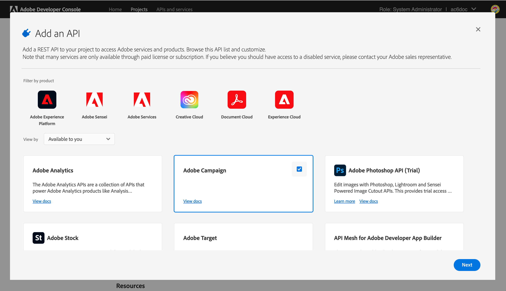

# Bijwerken naar de nieuwe releaseserver {#acc-deliverability}

Starten [release v7.2.2](../../rn/using/latest-release.md#release-7-2-2)Adobe Campaign is afhankelijk van een nieuwe, te leveren server die hoge beschikbaarheid biedt en problemen met de naleving van de beveiligingsvereisten verhelpt. Campaign Classic synchroniseert nu de regels, de uitzending en het suppressieadres van en naar de nieuwe aanwijsbaarheidsserver. De oude leverbaarheidsserver wordt op 31 augustus 2022 gedecomisseerd.

Als klant van het Campaign Classic, moet u de nieuwe leverbaarheidsserver uitvoeren **vóór 31 augustus 2022**.

>[!NOTE]
>
>Voor meer vragen over deze wijzigingen raadpleegt u de [Veelgestelde vragen](#faq)of contact op [Klantenservice Adoben](https://helpx.adobe.com/nl/enterprise/admin-guide.html/enterprise/using/support-for-experience-cloud.ug.html){_blank}.
>

## Wat is er veranderd?{#acc-deliverability-changes}

Adobe ontmantelt oudere gegevenscentra wegens veiligheidsnalevingsredenen. Adobe Campaign Classic-clients moeten migreren naar de nieuwe, op de Amazon Web Service (AWS) gehoste service.

Deze nieuwe server garandeert een hoge beschikbaarheid (99.9) &#x200B; en biedt veilige en geverifieerde eindpunten om campagnemeservers in staat te stellen de vereiste gegevens op te halen: in plaats van verbinding te maken met de database voor elk verzoek, slaat de nieuwe leverbaarbaarheidsserver de gegevens in cache om de aanvragen waar mogelijk te bedienen. Dit mechanisme verbetert de responstijd. &#x200B;

## Heb je invloed op?{#acc-deliverability-impacts}

Alle klanten worden beïnvloed en moeten bevorderen aan [Campagne v7.2.2](../../rn/using/latest-release.md#release-7-2-2) (of meer) en implementeer hun omgeving om te profiteren van de nieuwe leverbaarbaarheidsserver.

## Hoe kan ik bijwerken?{#acc-deliverability-update}

Als **gehoste klant**, werkt de Adobe samen met u om uw exemplaar(s) te upgraden naar de nieuwere versie en het project te maken in Adobe Developer Console.

Als **on-premise/hybride klant**, moet u upgraden naar [Campagne v7.2.2](../../rn/using/latest-release.md#release-7-2-2) (of meer) om te profiteren van de nieuwe, te leveren server. Zodra alle instanties worden bevorderd, moet u [de nieuwe integratie uitvoeren](#implementation-steps) naar de Adobe van de leverbaarbaarheidsserver en zorg voor een naadloze overgang.

## Implementatiestappen {#implementation-steps}

>[!WARNING]
>
>Deze stappen dienen alleen te worden uitgevoerd voor Hybride en On-premise implementaties.

Als onderdeel van de nieuwe integratie van de leverbaarheidsserver, moet de Campagne met de Adobe Gedeelde Diensten via een op de Dienst van Identity Management (IMS) gebaseerde authentificatie communiceren. De aangewezen manier is de op Adobe Developer gebaseerde Token van de Gateway te gebruiken (ook genoemd Token van de Technische Rekening of Adobe IO JWT).

>[!AVAILABILITY]
>
> JWT (JSON Web Tokens) wordt momenteel uitgefaseerd en wordt vervangen door OAuth. De overgang wordt geleidelijk uitgevoerd binnen komende releases van Campaign en de documentatie zal worden aangepast voor deze updates.

### Vereisten{#prerequisites}

Controleer uw instantieconfiguratie voordat u de implementatie start.

1. Open de clientconsole van Campagne en meld u als beheerder aan bij Adobe Campaign.
1. Bladeren naar **Beheer > Platform > Opties**.
1. Controleer of de `DmRendering_cuid` option value is fill.

   * Als de optie is gevuld, kunt u de implementatie starten.
   * Als geen waarde wordt gevuld, contacteer [Klantenservice Adoben](https://helpx.adobe.com/nl/enterprise/admin-guide.html/enterprise/using/support-for-experience-cloud.ug.html){_blank} om uw CUID op te halen.

   Deze optie moet op al uw instanties van de Campagne (MKT, MID, RT, EXEC) met de correcte waarde worden ingevuld. Als hybride klant, bereik uit aan Adobe om de optie te hebben die op uw instanties MID, RT en EXEC wordt geplaatst.

Als klant op locatie moet u ook controleren of een campagne **[!UICONTROL Product profile]** is beschikbaar voor uw organisatie. Volg onderstaande stappen om dit te doen:

1. Als beheerder maakt u verbinding met [Adobe Admin Console](https://adminconsole.adobe.com/){_blank}.
1. Toegang krijgen tot de **Product en services** sectie en controle **Adobe Campaign** is vermeld.
Als u niet ziet **Adobe Campaign** contact [Klantenservice Adoben](https://helpx.adobe.com/nl/enterprise/admin-guide.html/enterprise/using/support-for-experience-cloud.ug.html){_blank} om het toe te voegen.
1. Klikken **Adobe Campaign** en selecteer uw organisatie.
   **Waarschuwing**: Als u meerdere organisaties hebt, moet u de juiste selecteren. Meer informatie over organisaties [op deze pagina](https://experienceleague.adobe.com/docs/control-panel/using/faq.html#ims-org-id){_blank}.

1. Controleer of een **[!UICONTROL Product profile]** bestaat. Als dat niet het geval is, maakt u het. Hiervoor is geen toestemming vereist **[!UICONTROL Product profile]**.


>[!CAUTION]
>
>Als klant op locatie, als een firewall aan uw zijde is geïmplementeerd, moet u deze URL toevoegen `https://deliverability-service.adobe.io` op uw lijst van gewenste personen. [Meer informatie](../../installation/using/url-permissions.md).


### Stap 1: uw Adobe Developer-project maken/bijwerken {#adobe-io-project}

1. Toegang [Adobe Developer Console](https://developer.adobe.com/console/home) en meld u aan bij de toegang tot ontwikkelaars van uw organisatie. Zorg ervoor u in het correcte portaal van de Organisatie wordt geregistreerd.
   **Waarschuwing**: Als u meerdere organisaties hebt, moet u de juiste selecteren. Meer informatie over organisaties [op deze pagina](https://experienceleague.adobe.com/docs/control-panel/using/faq.html#ims-org-id){_blank}.
1. Selecteer **[!UICONTROL Create new project]**.
   

   >[!CAUTION]
   >
   >Als u reeds Adobe IO JWT authentificatiefunctionaliteit voor een andere integratie, zoals de schakelaar van de Analyse, of de Trekkers van de Adobe gebruikt, dan moet u uw project bijwerken door toe te voegen **Campagne-API** voor dat project.

1. Kies **[!UICONTROL Add API]**.
   
1. In de **[!UICONTROL Add an API]** venster, selecteert u **[!UICONTROL Adobe Campaign]**.
   
1. Als uw client-id leeg was, selecteert u **[!UICONTROL Generate a key pair]** om een openbare en privé zeer belangrijke paar tot stand te brengen.
   

   De sleutels zullen dan automatisch met een standaardvervaldatum van 365 dagen worden gedownload. Zodra verlopen, zult u een nieuw zeer belangrijk paar moeten creëren en de integratie in het configuratiedossier bijwerken. Met de optie 2 kunt u handmatig uw **[!UICONTROL Public key]** met een langere vervaldatum.
   

   >[!CAUTION]
   >
   >U moet de `config.zip` bestand wanneer de downloadprompt verschijnt omdat u deze niet opnieuw kunt downloaden.

1. Klik op **[!UICONTROL Next]**.
1. Bestaande kiezen **[!UICONTROL Product profile]** of maak indien nodig een nieuwe versie. Hiervoor is geen toestemming vereist **[!UICONTROL Product profile]**. Voor meer informatie over **[!UICONTROL Product Profiles]**, zie [deze pagina](https://helpx.adobe.com/enterprise/using/manage-developers.html){_blank}.
   

   Klik vervolgens op **[!UICONTROL Save configured API]**.

1. Van uw project, selecteer **[!UICONTROL Adobe Campaign]** en kopieert u de volgende informatie onder **[!UICONTROL Service Account (JWT)]**

   

   * **[!UICONTROL Client ID]**
   * **[!UICONTROL Client Secret]**
   * **[!UICONTROL Technical account ID]**
   * **[!UICONTROL Organization ID]**

>[!CAUTION]
>
>Adobe Developer-certificaat verloopt na twaalf maanden. Je moet elk jaar een nieuw sleutelpaar genereren.

### Stap 2: Voeg de projectgeloofsbrieven in Adobe Campaign toe {#add-credentials-campaign}

De persoonlijke sleutel moet in base64 UTF-8-indeling worden gecodeerd.

Dit doet u als volgt:

1. Gebruik de persoonlijke sleutel die in de bovenstaande stappen is gegenereerd.
1. Codeer de persoonlijke sleutel met behulp van de volgende opdracht: `base64 ./private.key > private.key.base64`. Hierdoor wordt de base64-inhoud opgeslagen in een nieuw bestand `private.key.base64`.

   >[!NOTE]
   >
   >Soms kunnen extra regels automatisch worden toegevoegd wanneer u de persoonlijke sleutel kopieert/plakt. Vergeet niet deze te verwijderen voordat u uw persoonlijke sleutel gaat coderen.

1. De inhoud van het bestand kopiëren `private.key.base64`.
1. Meld u via SSH aan bij elke container waarin de Adobe Campaign-instantie is geïnstalleerd en voeg de projectgegevens toe in Adobe Campaign door de volgende opdracht uit te voeren als `neolane` gebruiker. Hiermee voegt u de **[!UICONTROL Technical Account]** referenties in het configuratiebestand van de instantie.

   ```sql
   nlserver config -instance:<instance name> -setimsjwtauth:Organization_Id/Client_Id/Technical_Account_ID/<Client_Secret>/<Base64_encoded_Private_Key>
   ```

1. U moet de server stoppen en dan opnieuw beginnen om met de wijziging rekening te houden. U kunt ook een `config -reload` gebruiken.

### Stap 3: Valideer uw configuratie

Volg onderstaande stappen om te controleren of de integratie is gelukt:

1. Open de clientconsole en meld u aan bij Adobe Campaign.
1. Bladeren naar **Beheer > Productie > Technische workflows**.
1. De opdracht opnieuw starten **Vernieuwen voor leverbaarheid** (leverabilityUpdate) workflow. Dit moet worden uitgevoerd op al uw campagneinstanties (MKT, MID, RT, EXEC). Als hybride klant, bereik uit aan Adobe om het werkschema op uw MID, RT en EXEC instanties opnieuw te hebben begonnen.
1. Logbestanden controleren: de workflow moet zonder fouten worden uitgevoerd.

>[!CAUTION]
>
>Na de update worden de **Zaadnetwerk bijwerken voor Inbox Rendering (updateRenderingSeeds)** de workflow moet worden stopgezet omdat deze niet langer van toepassing is en mislukt.

## Veelgestelde vragen {#faq}

### Wat is de tijdlijn voor de update?

De overgang naar de nieuwe leverbaarbaarheidsserver, die de toevoeging van deze verbeterde mogelijkheden en de versterking van de beveiliging mogelijk maakt, begint op 22 juli voor gehoste klanten (Campagne Managed Services). Alle gehoste klanten worden eind augustus bijgewerkt.

Op locatie en hybride klanten moeten binnen hetzelfde tijdsbestek overstappen.

### Wat gebeurt er als ik mijn omgeving niet opwaardeer?

Om het even welke instantie van de Campagne die niet tegen 31 Augustus wordt bevorderd zal niet meer met de server van de Leverbaarheid van de Campagne kunnen verbinden. Als gevolg daarvan **Vernieuwen voor leverbaarheid** De workflow (DeliabilityUpdate) zal mislukken en dit is van invloed op de te leveren items.

Als u uw milieu niet bevordert, zullen de e-mailmontages ophouden gesynchroniseerd (MX de regels van het Beheer, Binnenkomende E-mailregels, de regels van het Beheer van het Domein, en stuiterende kwalificatieregels). Dit kan in de loop der tijd invloed hebben op uw leverbaarheid. Als deze regels ingrijpend worden gewijzigd, moeten ze vanaf dit punt handmatig worden toegepast.

Alleen voor MKT-instanties [Algemene lijst voor onderdrukking](../../campaign-opt/using/filtering-rules.md#default-deliverability-exclusion-rules) is aangetast.
