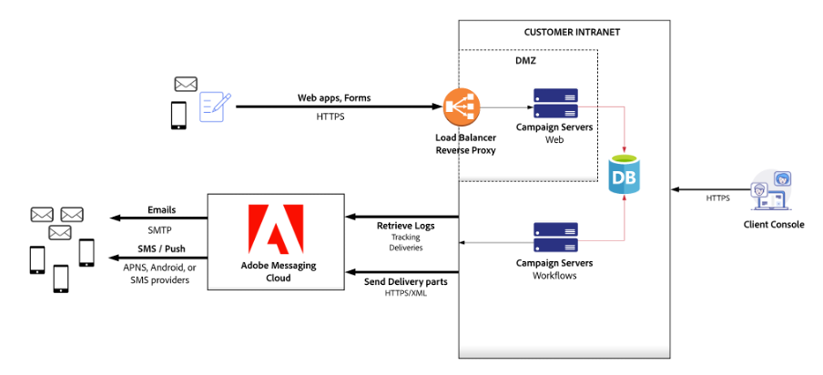
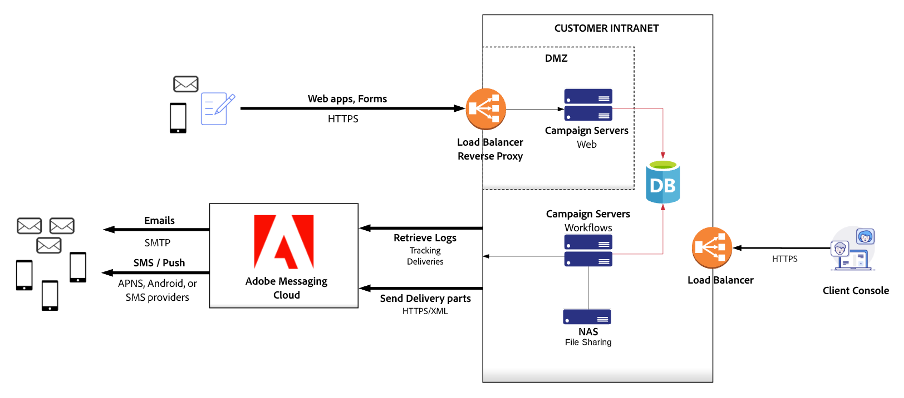

# Aanbevelingen voor hardwareaanpassing{#hardware-sizing-reco}

## Overzicht

>[!CAUTION]
>
>Dit artikel is alleen beschikbaar als algemene voorbeeldgids. U moet contact opnemen met uw Adobe Campaign Customer Success Manager om de exacte grootte van uw implementatie te meten voordat u uw Campagne-project start. **verkrijgt of stelt geen infrastructuur of hardware op** tot dit wordt gedaan.

Dit document bevat algemene aanbevelingen voor Adobe Campaign Classic v7-implementatie in uw on-premise datacenter of gevirtualiseerde cloud-omgeving. Dit type van plaatsing, die als **wordt bedoeld hybride** of **midsourcing**, plaatst de het in de handel brengen van de Campagne instantie en marketing gegevensbestand onder uw operationele controle, terwijl het gebruiken van de Diensten van het Overseinen van de Wolk van de Adobe om e-mail, SMS of SMPP- berichten te verzenden, en e-mail open te verzamelen, stuitend, en het volgen gegevens te klikken.

De marketinginstantie is het deel van de Adobe Campaign-architectuur dat alle marketingactiviteiten stuurt en alle gegevens van de ontvanger en de analytische gegevens opslaat die door campagnes worden geretourneerd. De marketinginstantie is een set on-premise servers waarop Adobe Campaign-services worden uitgevoerd, en een relationele database.

>[!CAUTION]
>
>De informatie in dit document is niet van toepassing als u een volledig gehoste Adobe Campaign-instantie gebruikt (geïmplementeerd in Adobe Cloud Servicen).

De verenigbaarheid van de software is gedetailleerd in de [ Matrijs van de Verenigbaarheid ](../../rn/using/compatibility-matrix.md).

### Scenarios

De diagrammen van de plaatsing en de aanbevelingen van de hardwarerangschikking worden verstrekt voor drie representatieve scenario&#39;s:

1. [ Matig-Grootte ](#scenario-1) - 5 miljoenen actieve ontvangers in het systeem
1. [ groot-Grootte ](#scenario-2) - 20 miljoen actieve ontvangers in het systeem
1. [ Onderneming ](#scenario-3) - 50 miljoen actieve ontvangers, met transactioneel overseinen

### Veronderstellingen

Dit document veronderstelt ook de volgende types van gebruik voor alle drie scenario&#39;s:

* Twee keer per week worden grote e-mailcampagnes verzonden naar ongeveer 50% van de actieve ontvangers
* Directe post wordt geproduceerd eens per maand voor elke ontvanger in het systeem
* SMS-berichten worden elke maand naar ongeveer 10% van de actieve ontvangers verzonden
* Het databaseschema dat elke ontvanger definieert, is uitgebreid met één extra tabel, die ongeveer 200 bytes aan gegevens voor elke ontvanger bevat
* De Adobe Campaign-interactiemodule wordt gebruikt om aanbiedingen toe te voegen aan uitgaande e-mail
* Gegevens voor e-mailtracking worden 90 dagen bewaard in het campagnesysteem

## Algemene richtsnoeren

Campagne is een database-centric toepassing, en de prestaties van de gegevensbestandserver zijn kritiek. De lopende werkschema&#39;s, segmentatie, het volgen van gegevens uploadt, binnenkomende Interacties, analyses en andere activiteiten allen produceren gegevensbestandactiviteit. Over het algemeen bepalen de grootte en frequentie van deze bewerkingen de grootte van uw databaseservers.

De toepassingsservers in uw marketinginstantie vereisen voldoende CPU en geheugen om workflows uit te voeren en te reageren op SOAP API-aanroepen, waaronder aanvragen van Campagnegebruikers. CPU-vereisten kunnen van belang zijn voor workflows die uitgaande interacties gebruiken met complexe aanbiedingsregels, workflows die aangepaste JavaScript uitvoeren en webtoepassingen met hoge verkeersniveaus.

Campagne-webtoepassingen kunnen ook worden geïmplementeerd op de App-servers voor marketinginstanties of op afzonderlijke webserversystemen. Omdat werklasten van webtoepassingen conflicteren met kritieke workflows en Campagnegebruikers, kunnen webtoepassingen en binnenkomende interacties worden geïmplementeerd op afzonderlijke servers om ervoor te zorgen dat de functionaliteit van de kerncampagne betrouwbaar werkt met goede prestaties.

Voor veiligheid en beschikbaarheid, adviseert de Adobe scheidend het verkeer van Internet van het verkeer dat door de bedrijfsgebruikers wordt geproduceerd. Om die reden, bevatten de diagrammen twee groepen servers: de server van het Web (Internet die Web1 en Web2 onder ogen ziet), en de servers van de App (bedrijfsprocessen App1 en App2).

Het is een wettelijke vereiste voor commerciële e-mailzenders om een functionele opt-out-webpagina te hebben. De Adobe adviseert hebbend overtollige machine in elke groepsserver voor failover scenario&#39;s. Dit geldt vooral als Adobe Campaign de pagina&#39;s voor niet-deelname host.

### Proxy&#39;s omkeren

De architectuur van de Campagne dwingt hoge veiligheid af door SSL over HTTP (HTTPS) te gebruiken om tussen uw marketing instantie en het Overseinen van de Wolk van de Adobe te communiceren. De veiligheid, de betrouwbaarheid, en de beschikbaarheid worden afgedwongen door omgekeerde volmachten in &quot;gedemilitariseerde streek&quot;(DMZ) subnet te gebruiken om de marketing instantieservers en het gegevensbestand te isoleren en te beveiligen.

### Load balancer

Het taakverdelingsmechanisme voor de servers App wordt opstelling in een actieve/passieve configuratie, met HTTPS geëindigd bij de volmacht. Het taakverdelingsmechanisme voor de servers van het Web wordt opstelling in een actieve/actieve configuratie, met HTTPS geëindigd bij de volmacht.

De Adobe voorziet u van de exclusieve lijst van wegen URL die aan de server van Adobe Campaign in uw plaatsingsmilieu kunnen worden afgelost.

### Architectuur

De algemene architectuur is vrijwel identiek, ongeacht de volumes. De veiligheids en hoge beschikbaarheidsvereisten bepalen een minimum van vier servers; twee servers als geen WebApps wordt gebruikt. Het verschil in configuratie varieert hoofdzakelijk in de hardwareconfiguratie zoals de kern en het geheugen van CPU.

## Scenario 1: Moderne Plaatsing{#scenario-1}

Geraamd volume:

| Kanaal | Volume |
| ----------------------- | ----------------- |
| Actieve ontvangers | 5 miljoen |
| Email | 4,2 miljoen/maand |
| Direct mail | 1 miljoen/maand |
| Mobiele SMS | 100.000/maand |
| Maximale dagelijkse e-mailvolume | 500 |

Voor deze volumes biedt een paar Adobe Campaign-toepassingsserversystemen alle functionaliteit voor Adobe Campaign Client-gebruikers en workflowuitvoering. Voor 5 miljoen actieve ontvangers en dit e-mailvolume zijn de werklasten van de toepassingsserver niet CPU- of I/O-intensief. Het grootste deel van de belasting ligt in de database.

De servers van het Web van Adobe Campaign worden getoond in de veilige streek.

### Web- en toepassingsservers

In dit scenario wordt aangeraden Adobe Campaign op vier computers te installeren, met de volgende specificatie:

**3Ghz+ quad-core CPU, 8-GB RAM, INVAL 1 of 10, 2 x 80-GB SSD**

Deze systemen creëren de Server van de toepassing van de marketinginstantie, die direct uw gebruikers van de Console van de Campagne steunt en de campagnewerkschema&#39;s uitvoert.

Reverse volmachten in een DMZ verkeer van de ladingsbalans aan de servers van het Web van Adobe Campaign. De Adobe Campaign-softwarestack hoeft niet te worden geïnstalleerd op proxycomputers. Eventuele reverse-proxysoftware of netwerkapparatuur kan worden gebruikt.

De functies voor het kiezen voor een abonnement of het weigeren en het instellen van een voorkeurscentrum kunnen via de campagne of via uw eigen website worden aangeboden. Als u ervoor kiest om deze functionaliteit op uw website te implementeren, moet u ervoor zorgen dat voorkeur- en abonnementsgegevens worden doorgegeven aan de marketingdatabase voor campagnes. Dit gebeurt gewoonlijk door extractiebestanden te maken die automatisch worden geüpload door campagneworkflows.

Het verbruik van schijfruimte op toepassingsservers is afhankelijk van de bewaarperiode van bestanden die worden uitgewisseld met externe servicebureaus (bijvoorbeeld leveranciers van gedrukte publicaties voor Direct Mail) en van de grootte en het behoud van geïmporteerde platte bestanden, zoals abonnements- of voorkeursupdates van uw website, of van extracten van uw eigen CRM- of marketingsystemen.

### Database

De aanbevelingen van de hardware voor de gegevensbestandserver zijn als volgt:

**3Ghz+ 4-core CPU, 16-GB RAM, INVAL 1 of 10, minimaal 128GB SSD**

De geheugenschatting gaat uit van volledige caching van ongeveer 500.000 ontvangers voor een grote campagnelancering, plus RDBMS bufferruimte voor het uitvoeren van werkschema&#39;s, het invoeren van volggegevens, en andere gezamenlijke activiteiten.

Er wordt geschat dat de schijfruimte die nodig is voor de database voor het opslaan van alle technische gegevens van Adobe Campaign (campagnes, bijhouden, werktabellen enzovoort), ongeveer 35 GB is op basis van een bewaarperiode van drie maanden. Als u ervoor kiest om de volgende gegevens gedurende 6 maanden te behouden, neemt de databasegrootte toe tot ongeveer 40 GB en bij een bewaarperiode van 12 maanden neemt de databasegrootte toe tot ongeveer 45 GB. De ontvangende gegevens verbruiken ongeveer 5 GB voor deze omgeving.

>[!CAUTION]
>
>In deze schatting zijn geen aanvullende klantgegevens opgenomen. Als u van plan bent om extra kolommen of lijsten van klantengegevens in het gegevensbestand van Adobe Campaign te herhalen, dan moet u de extra behoefte van de schijfruimte voor het schatten. Geüploade segmenten/lijsten vereisen ook meer opslag, afhankelijk van hun grootte, frequentie en retentieperiode.

Houd er ook rekening mee dat vanwege het dagelijks verwerkte gegevensvolume de IOPS van de databaseserver van essentieel belang is. Bijvoorbeeld, op een piekdag, kunt u campagnes opstellen die in totaal 500.000 ontvangers richten. Om elke campagne uit te voeren, neemt Adobe Campaign 500.000 verslagen in een lijst op die ruwweg 12 miljoen verslagen (de lijst van het leveringslogboek) bevatten. Om acceptabele prestaties tijdens de campagnemplementatie te bieden, adviseert de Adobe minimaal 60.000 4-KB Willekeurige lees-schrijfIOPS voor dit scenario.

## Scenario 2: grootschalige implementatie{#scenario-2}

Geraamd volume:

| Kanaal | Volume |
| ----------------------- | ----------------- |
| Actieve ontvangers | 20 miljoen |
| Email | 42 miljoen per maand |
| Direct mail | 10 miljoen/maand |
| Mobiele SMS | 1.000.000/maand |
| Maximale dagelijkse e-mailvolume | 5.000.000 |

### Web- en toepassingsservers

In dit scenario raadt Adobe aan Adobe Campaign te installeren op vier computers, twee toepassingsservers en twee webservers, met de volgende specificatie:

**3Ghz+ quad-core CPU, 8-GB RAM, INVAL 1 of 10, 80-GB SSD**

De toepassingsservers ondersteunen rechtstreeks de gebruikers van de Campagne Console en de uitvoering van campagneworkflows. Deze functionaliteit wordt opgesteld op twee identieke servers voor hoge beschikbaarheid, delend een netwerk-Attached Storage (NAS) dossiersysteem om failover toe te laten.

De servers van het Web ontvangen het Webtoepassingen van de Campagne die de 10 miljoen actieve ontvangers in het systeem steunen.

Verwijs naar [ Scenario 1: Matige-Grootte Plaatsing ](#scenario-1) voor meer commentaren op volmachten, voorkeurscentra/abonnement behandeling, en schijfruimtegebruik.

### Database

De aanbevelingen van de hardware voor de gegevensbestandserver zijn als volgt:

**3Ghz+ 8-core CPU, 64-GB RAM, INVAL 1 of 10, 2 x 320-GB SSD of INVAL 10, 640 GB SSD minimum**

De geheugenschatting gaat uit van volledige caching van ongeveer 5.000.000 ontvangers voor een grote lancering van de campagne, plus RDBMS bufferruimte voor het uitvoeren van werkschema&#39;s, het invoeren van volggegevens, en andere gezamenlijke activiteiten.

Er wordt geschat dat de schijfruimte die nodig is voor de database voor het opslaan van alle technische gegevens van Adobe Campaign (campagnes, bijhouden, werktabellen enzovoort), ongeveer 280 GB is op basis van een bewaarperiode van 3 maanden. Als u ervoor kiest om de volgende gegevens gedurende 6 maanden te behouden, neemt de databasegrootte toe tot ongeveer 450 GB en bij een bewaarperiode van 12 maanden neemt de databasegrootte toe tot ongeveer 900 GB. De ontvangende gegevens verbruiken ongeveer 15 GB voor deze omgeving.

## Scenario 3: De Plaatsing van de onderneming met het Centrum van het Bericht{#scenario-3}

Geraamd volume:

| Kanaal | Volume |
| ----------------------- | ----------------- |
| Actieve ontvangers | 50 miljoen |
| Email | 108 miljoen per maand |
| Direct mail | 25 miljoen per maand |
| Mobiele SMS | 2,5 miljoen/maand |
| Transactionele berichten | 2,5 miljoen/maand |
| Maximale dagelijkse e-mailvolume | 2,5 miljoen |

De plaatsing die 50 miljoen ontvangers steunt is hoofdzakelijk het zelfde zoals aangetoond in [ Scenario 2 ](#scenario-2): Het verkeer van de het Webtoepassing van de campagne wordt verpletterd aan het Webservers van de Campagne, zodat de uitbarstingen van Webverkeer na grote campagnelanceringen niet de werkschema&#39;s van de Campagne en de gebruikers van de Console van de Cliënt beïnvloeden.

Deze plaatsing omvat ook de vraag van het Centrum van het Bericht, die van uw eigen websites en toepassingen wordt gedreven.

### Web- en toepassingsservers

In dit scenario raadt Adobe aan Adobe Campaign op vier computers te installeren, zoals hieronder wordt beschreven:

* Toepassingsservers
  **Twee systemen, 3Ghz+ quad-core CPU, 8-GB RAM, INVAL 1 of 10, 80-GB SSD**

* Webservers
  **Twee systemen, 3Ghz+ quad-core CPU, 16-GB RAM, INVAL 1 of 10, 80-GB SSD**

De toepassingsservers ondersteunen rechtstreeks de gebruikers van de Campagne Console en de uitvoering van campagneworkflows. Deze functionaliteit wordt opgesteld op twee identieke servers voor hoge beschikbaarheid, delend een netwerk-Attached Storage (NAS) dossiersysteem om failover toe te laten.

De servers van het Web ontvangen het Webtoepassingen van de Campagne die de 10 miljoen actieve ontvangers in het systeem steunen.

Verwijs naar [ Scenario 1: Matige-Grootte Plaatsing ](#scenario-1) voor meer commentaren op volmachten, voorkeurscentra/abonnement behandeling, en schijfruimtegebruik.

### Database

De aanbevelingen van de hardware voor de gegevensbestandserver zijn als volgt:

**3Ghz+ 8-core CPU, 96-GB RAM, INVAL 1 of 10, minimaal 1.5TB SSD**

De geheugenschatting gaat uit van volledige caching van ongeveer 12.500.000 ontvangers voor een grote lancering van de campagne, plus RDBMS bufferruimte voor het uitvoeren van werkschema&#39;s, het invoeren van volggegevens, en andere gezamenlijke activiteiten.

Er wordt geschat dat de schijfruimte die nodig is voor de database voor het opslaan van alle technische gegevens van Adobe Campaign (campagnes, bijhouden, werktabellen enzovoort), ongeveer 700 GB is op basis van een bewaarperiode van 3 maanden. Als u ervoor kiest om het volgen gegevens voor 6 maanden te behouden, neemt de gegevensbestandgrootte tot ongeveer 1.2TB toe, en 12 maandenbehoud verhoogt gegevensbestandgrootte tot ongeveer 2TB. De ontvangende gegevens verbruiken ongeveer 50 GB voor deze omgeving.

## Richtlijnen voor het wijzigen van veronderstellingen

De aannames die voor deze scenario&#39;s zijn gemaakt, hebben allemaal een aanzienlijke invloed op de hardwareaanbevelingen en de implementatiearchitectuur. In deze sectie worden de richtlijnen rond verschillende veronderstellingen besproken. Neem contact op met het Adobe Campaign Consulting-team voor specifieke aanbevelingen om aan uw vereisten te voldoen.

* **Aantal Ontvangers**
Actieve ontvangers hebben zowel opslagruimte als databasebufferruimte nodig, zodat meer ontvangers over het algemeen meer geheugen en CPU-capaciteit op de databaseserver nodig hebben. Opslagverhogingen zijn relatief klein voor de ontvangers zelf, maar kunnen van belang zijn voor de gegevens voor het bijhouden van gebeurtenissen die worden bijgehouden voor e-mailcampagnes.

* **Grootte van de Campagne E-mail**
De frequentie van het lanceren van de campagne heeft een effect op de vereisten van CPU van de gegevensbestandserver. Gecombineerd met directe post, binnenkomende Interacties, en andere werkschema&#39;s, plaatsen de segmenteringsverrichtingen voor e-mailcampagnes een significante lading op de gegevensbestandserver.

* **Directe Frequentie van de Post**
De frequentie van directe mailings kan de vereisten van CPU van de gegevensbestandserver beïnvloeden. Gecombineerd met campagnelanceringen en andere werkschema&#39;s, zetten de segmenteringsverrichtingen voor directe post een significante lading op de gegevensbestandserver.

* **Volume van het Bericht van SMS**
Net als de grootte van de e-mailcampagne worden met SMS-berichten geen grote hoeveelheden geladen op Campagneservers die zich op locatie bevinden. De bestanden worden vooral geladen op Adobe Cloud Messaging-servers in de cloud. Segmentering voor SMS-campagnes, zoals e-mail en direct mail, kan een aanzienlijke belasting voor de marketingdatabase betekenen. Daarom zijn de frequentie van de lanceringen van de campagne van SMS en de ingewikkeldheid van segmentatie relevanter dan het volume van SMS berichten.

* **Complexiteit van het Schema van het Gegevensbestand**
De hoeveelheid gegevens voor elke actieve ontvanger vereist zowel opslagruimte als databasebufferruimte, zodat meer ontvangers over het algemeen meer geheugen en CPU op de databaseserver nodig hebben. De complexe schema&#39;s vereisen ook meer bij te voegen lijsten voor segmentatie, zodat kunnen de segmentatieverrichtingen veel langzamer lopen, en vereisen meer gegevensbestand CPU en geheugen wanneer het gegeven over veelvoudige lijsten wordt verspreid.

  Het geheugen van de de serverserver van het gegevensbestand wordt geschat door ervoor te zorgen dat de pool van de gegevensbestandbuffer groot genoeg kan zijn om alle ontvankelijke gegevens, plus tijdelijke lijsten voor het runnen van werkschema&#39;s, plus een marge voor andere gegevensbestandverrichtingen te bevatten.

* **Uitgaand Gebruik van de Interactie**
De regels voor Interactie op partijwijze worden geëvalueerd in werkschema&#39;s die alle berekeningsingewikkeldheid aan het gegevensbestand overdragen. De belangrijkste factor van inspanning voor de database is het totale aantal in aanmerking komende aanbiedingen dat tijdens één motoroproep is berekend (doelgrootte X gemiddeld aantal aanbiedingen per ontvanger voordat de beste N-aanbiedingen worden gehouden). De CPU-snelheid van de databaseserver is de eerste prestatiefactor.

* **Binnenkomende Interacties of SOAP API Gebruik**
De binnenkomende regels en aanbiedingen van de Interactie worden geëvalueerd in het marketing gegevensbestand, die significante middelen van de gegevensbestandserver, vooral CPU vereisen. Bij intensief gebruik van binnenkomende interacties of SOAP API&#39;s zijn aparte webservers nodig om de werkbelasting te scheiden van de actieve workflows voor campagnes.

* **het Volgen Periode van het Behouden van Gegevens**
Het verhogen van het behoud van het volgen van gegevens na 90 dagen vereist meer gegevensbestandopslag, en kan het systeem vertragen omdat het opnemen van nieuwe het volgen gegevens in grote lijsten gaat. Het bijhouden van gegevens is niet nuttig voor campagnesegmentatie na 90 dagen, dus de kortere retentieperiode wordt aanbevolen.

  Trackinggegevens moeten worden overgebracht naar Adobe Analytics of een ander analysesysteem als u een langetermijnanalyse van de marketingervaring van de geadresseerde nodig hebt.

## Virtualisatie

Alle campagnemeservers zijn goede kandidaten voor virtualisatie. Er moeten verschillende problemen worden opgelost om een passende beschikbaarheid en prestaties te garanderen.

* **Fail-over Configuratie**
Gegroepeerde servers, bijvoorbeeld, overtollige toepassingsservers onder een lading-in evenwicht gebrachte volmacht, moeten op afzonderlijke hardware worden opgesteld om ervoor te zorgen dat beide VMs niet daalt als er hardwaremislukking is.

* **I/O Configuratie**
Elke aanbevolen RAID-configuratie moet worden onderhouden voor databasebeveiliging, om te voorkomen dat gegevensverlies optreedt bij een opslagapparaat.

* **I/O Prestaties**
De aanbevolen IOPS-classificatie voor databaseopslag moet in acht worden genomen. Cloudservices zoals Amazon EC2 leveren mogelijk niet de vereiste prestaties en moeten zorgvuldig worden geëvalueerd. De Amazon EC2-volumes voor SSD-voorzieningen worden momenteel bijvoorbeeld op elk 20.000 IOPS beoordeeld. Leer meer in [ documentatie van Amazon ](https://docs.aws.amazon.com/AWSEC2/latest/UserGuide/ebs-volume-types.html)), zodat zou een 4 volumeConfiguratie van de INVAL bij 80.000 IOPS worden geschat, die niet voldoende kan zijn.

Adobe raadt aan om voor elke gevirtualiseerde implementatie van Adobe Campaign prestatietests uit te voeren voordat het systeem in productie wordt genomen.

## Verwante onderwerpen

* [Campagne-bewakingsprocessen](../../production/using/monitoring-processes.md)
* [Algemene architectuur van campagne](../../installation/using/general-architecture.md)
* [Prestaties en productieproblemen](../../production/using/performance-and-throughput-issues.md)
* [Controlelijst voor beveiliging en privacy](../../installation/using/get-started-security-privacy.md)
