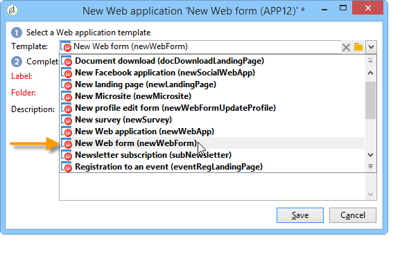

# Webformulieren{#about-web-forms}

Adobe Campaign integreert een grafische module voor het definiëren en publiceren van webformulieren om pagina&#39;s te maken die invoer- en selectievelden bevatten en die mogelijk gegevens in de database bevatten. Zo kunt u webpagina&#39;s ontwerpen en plaatsen die gebruikers kunnen openen om informatie weer te geven of in te voeren.

In dit hoofdstuk worden de creatie en het beheer van webformulieren beschreven, hoe u velden en pagina&#39;s beheert en hoe u de opslagmodi opslaat.

>[!CAUTION]
>
>Om privacyredenen raden we aan HTTPS te gebruiken voor alle externe bronnen.

## Stappen voor het maken van een webformulier {#steps-for-creating-a-web-form}

In dit hoofdstuk worden de stappen beschreven die nodig zijn voor het ontwerpen van een formulier van het type **webForm** in Adobe Campaign, plus de beschikbare opties en configuraties. Met Adobe Campaign kunt u dit webformulier beschikbaar maken voor gebruikers en antwoorden in de database verzamelen en archiveren.

>[!CAUTION]
>
>Wanneer u webtoepassingen en webformulieren configureert, hebt u een minimale verticale resolutie van 900 pixels nodig (bijv. 1600x900).

Webformulieren zijn toegankelijk via het menu Webtoepassingen op het tabblad **Campagnes** . In de Adobe Campaign-structuur worden ze gegroepeerd onder het **[!UICONTROL Resources > Online > Web Applications]** knooppunt.

Als u een webformulier wilt maken, klikt u op de **[!UICONTROL Create]** knop boven de lijst met webtoepassingen.

Selecteer de webformuliersjabloon ( **[!UICONTROL newWebForm]** standaard).

Hiermee gaat u naar het dashboard van het formulier.

Op het **[!UICONTROL Edit]** tabblad kunt u uw inhoud maken.

Om de configuratie en de inhoud van de vorm van het Web te bepalen, pas de volgende stappen toe:

* Begin door de vereiste pagina&#39;s en controles te maken: invoervelden, vervolgkeuzelijsten, HTML-inhoud, enz.

   Deze stap wordt hieronder beschreven.

* Hiermee definieert u de volgorde van pagina&#39;s en bepaalt u de weergave.

   Deze stap wordt gedetailleerd beschreven in [Webformulieren in volgorde](../../web/using/defining-web-forms-page-sequencing.md)definiëren.

* Vertaal indien nodig de inhoud.

   Deze stap wordt gedetailleerd beschreven in [Een webformulier](../../web/using/translating-a-web-form.md)vertalen.

## Webformulieren ontwerpen {#about-web-forms-designing}

De pagina&#39;s van het formulier worden gemaakt met een specifieke editor waarmee u invoerzones (tekst), selectievelden (lijsten, selectievakjes, enz.) kunt definiëren en configureren. en statische elementen (afbeeldingen, HTML-inhoud, enz.). U kunt ze groeperen in containers en de lay-out ervan wordt aangepast aan uw behoeften (voor meer informatie gaat u naar [Containers](../../web/using/defining-web-forms-layout.md#creating-containers)maken).

In de volgende secties wordt beschreven hoe u inhoud en indeling voor formulierschermen definieert:

* [Velden toevoegen aan een webformulier](../../web/using/adding-fields-to-a-web-form.md),
* [HTML-inhoud](../../web/using/static-elements-in-a-web-form.md#inserting-html-content)invoegen,
* [Statische elementen in een webformulier](../../web/using/static-elements-in-a-web-form.md),
* [Opmaak](../../web/using/defining-web-forms-layout.md)van webformulieren definiëren.

>[!NOTE]
>
>* Tijdens het ontwerpen van een pagina kunt u de uiteindelijke rendering weergeven op het **[!UICONTROL Preview]** tabblad. Sla het formulier eerst op om de wijzigingen weer te geven. Eventuele fouten worden weergegeven op het **[!UICONTROL Log]** tabblad.
>* Om ervoor te zorgen dat de paginavertoning en de informatieopslag in de aangewezen opeenvolging voorkomen, laat zuiveringswijze in de vorm van het Web toe. Ga hiertoe naar het **[!UICONTROL Preview]** subtabblad en schakel het **[!UICONTROL Enable debug mode]** selectievakje in: alle verzamelde informatie en mogelijke uitvoeringsfouten worden onder aan elke pagina weergegeven .
>

### De pictogrammen in de werkbalk gebruiken {#using-the-icons-in-the-toolbar}

U kunt ook de pictogrammen in de werkbalk gebruiken of met de rechtermuisknop klikken om een invoerzone in te voegen.

In dit geval selecteert u eerst het type veld dat u wilt toevoegen en de opslagmodus voor antwoorden.

Klik **[!UICONTROL Ok]** om de selectie goed te keuren.

