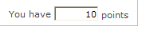

# Velden toevoegen aan een webformulier{#adding-fields-to-a-web-form}

In een webformulier kunnen gebruikers in velden informatie invoeren en opties selecteren. Webformulieren kunnen invoervelden, selectievelden, statische en geavanceerde inhoud (bijschriften, abonnementen, enz.) bieden.

Wanneer u velden toevoegt met de wizard, wordt het veldtype automatisch gedetecteerd op basis van het geselecteerde veld of de opslagvariabele. U kunt het uitgeven gebruikend de **[!UICONTROL Type]** drop-down doos op het **[!UICONTROL General]** lusje.

Selecteer het type veld dat u wilt toevoegen wanneer u de knoppen op de werkbalk gebruikt.

De volgende veldtypen zijn beschikbaar:

* Tekst/nummerinvoer. Zie [Invoervelden](#adding-input-fields)toevoegen.
* Selectie vervolgkeuzelijst. Zie [Vervolgkeuzelijsten](#adding-drop-down-lists)toevoegen.
* Meerdere keuzen via selectievakjes. Zie [Selectievakjes](#adding-checkboxes)toevoegen.
* Exclusieve selectie via keuzerondjes. Zie [Keuzerondjes](#adding-radio-buttons)toevoegen.
* Stem in een optieraster. Zie Rasters [toevoegen](#adding-grids).
* Getallen en datums. Zie [Datums en getallen](#adding-dates-and-numbers)toevoegen.
* Abonnement/abonnement op een informatieservice. Zie [Selectievakjes](#subscription-checkboxes)voor abonnementen.
* Captcha-validatie. Zie [Een captcha](#inserting-a-captcha)invoegen.
* Knop Downloaden. [Een bestand](#uploading-a-file)uploaden.
* De constante Verborgen. Zie Een verborgen constante invoegen.

Geef de opslagmodus voor reacties op: een veld in de database bijwerken (alleen de laatst opgeslagen waarde wordt opgeslagen) of in een variabele opslaan (het antwoord wordt niet opgeslagen). Raadpleeg de opslagvelden Reactie voor meer informatie hierover.

>[!NOTE]
>
>Standaard wordt het veld onder aan de huidige structuur ingevoegd. Gebruik de pijlen in de werkbalk om deze omhoog of omlaag te verplaatsen.

## Wizard Veld maken {#field-creation-wizard}

Voor elke pagina van het formulier kunt u een veld toevoegen met de eerste knop op de werkbalk. Ga hiertoe naar het **[!UICONTROL Add using the wizard]** menu.

Selecteer het type veld dat u wilt maken: U kunt een veld toevoegen aan de database of een variabele of een groep velden importeren die in een ander formulier zijn gemaakt en in een container zijn verzameld.

Klik op **[!UICONTROL Next]** en selecteer het opslagveld of de variabele of de container die u wilt importeren.

Klik **[!UICONTROL Finish]** om het geselecteerde veld op de pagina in te voegen.

## Invoervelden toevoegen {#adding-input-fields}

Als u een invoerveld wilt toevoegen, klikt u op de **[!UICONTROL Input control]** knop en kiest u het type veld dat u wilt toevoegen.

### Typen invoervelden {#types-of-input-fields}

U kunt vijf verschillende typen tekstvelden invoegen in een formulierpagina:

* **Tekst**: Hiermee kan de gebruiker een tekst op één regel invoeren.

   

* **Getal**: Hiermee kan de gebruiker een getal op één regel invoeren. Zie [Getallen](#adding-numbers)toevoegen voor meer informatie hierover.

   Nadat de pagina is goedgekeurd, wordt de inhoud van het veld gecontroleerd om te controleren of de ingevoerde waarde compatibel is met het veld. Raadpleeg [Besturingsinstellingen](../../web/using/form-rendering.md#defining-control-settings)definiëren voor meer informatie hierover.

* **Wachtwoord**: Hiermee kan de gebruiker tekst op één regel invoeren. Tijdens tekstinvoer worden de tekens vervangen door punten:

   

   >[!CAUTION]
   >
   >Wachtwoorden worden niet-gecodeerd opgeslagen in de database.

* **Tekst** met meerdere regels: Hiermee kan de gebruiker tekst op meerdere regels invoeren.

   

   >[!CAUTION]
   >
   >Tekstvelden met meerdere regels zijn specifieke velden die regeleinden kunnen bevatten. Hun opslagruimte moet worden gekoppeld aan een veld dat is toegewezen aan een XML-element, niet aan een XML-kenmerk. Voor meer over de types van gegevens in schema&#39;s, verwijs naar het &quot;de verwijzings&quot;hoofdstuk van het Schema in [deze sectie](../../configuration/using/about-schema-reference.md).
   >   
   >Als u de module **Beoordeling** gebruikt, kunt u dit type veld opslaan in een gearchiveerd veld dat automatisch wordt aangepast aan de indeling. Zie [deze sectie](../../web/using/about-surveys.md)voor meer informatie.

* **Verrijkte tekst** met meerdere regels: Hiermee kan de gebruiker tekst invoeren met een lay-out die wordt opgeslagen in HTML-indeling.

   

   U kunt het type editor selecteren dat gebruikers wordt aangeboden. Hiervoor gebruikt u de vervolgkeuzelijst van het **[!UICONTROL HTML editor]** veld op het **[!UICONTROL Advanced]** tabblad.

   

   Het aantal weergegeven pictogrammen is afhankelijk van het type editor. Voor een **[!UICONTROL Advanced]** editor is de rendering als volgt:

   

### Invoervelden configureren {#configure-input-fields}

Invoervelden worden allemaal geconfigureerd op basis van dezelfde modus, waarbij de volgende opties worden gebruikt:

Op het **[!UICONTROL General]** tabblad kunt u de naam van het veld invoeren en er indien nodig een standaardwaarde aan toewijzen.

De antwoordopslagmodus kan worden gewijzigd via de **[!UICONTROL Edit storage...]** koppeling. Waarden kunnen worden opgeslagen in een bestaand veld van de database; of u kunt ervoor kiezen geen informatie in de database op te slaan (gebruik een lokale variabele).

>[!NOTE]
>
>Opslagmodi worden gedetailleerd weergegeven in [responsopslagvelden](../../web/using/web-forms-answers.md#response-storage-fields)

Op het **[!UICONTROL Advanced]** tabblad kunt u weergaveparameters voor het veld definiëren (positie van labels, uitlijning, enz.). Zie De indeling van [webformulieren definiëren](../../web/using/defining-web-forms-layout.md).

## Vervolgkeuzelijsten toevoegen {#adding-drop-down-lists}

U kunt een vervolgkeuzelijst invoegen in een enquêtepagina. Hiermee kan de gebruiker een waarde selecteren uit de beschikbare waarden in een vervolgkeuzemenu.

Als u een vervolgkeuzelijst aan een formulierpagina wilt toevoegen, klikt u op de **[!UICONTROL Selection controls > Drop-down list]** knop op de werkbalk van de pagina-editor.

Selecteer de antwoordopslagmodus en bevestig uw keuze.

Definieer de labels en waarden van de lijst in de onderste sectie van het **[!UICONTROL General]** tabblad. Als de informatie in een bestaand gebied van het gegevensbestand wordt opgeslagen en het een opsommingsgebied is, kunt u de waarden automatisch invullen door te klikken **[!UICONTROL Initialize the list of values from the database]** , zoals hieronder getoond:

>[!NOTE]
>
>Gebruik de pijlen rechts van de lijst met waarden om de volgorde te wijzigen.

Als de gegevens worden opgeslagen in een gekoppelde tabel, kunt u het veld selecteren waarin de waarden worden opgeslagen die in de lijst moeten worden voorgesteld. Als u bijvoorbeeld de lijst met landen selecteert, klikt u op het gewenste veld **[!UICONTROL Initialize the list of values from the database...]** en selecteert u dit.

Klik vervolgens op de **[!UICONTROL Load]** koppeling om de waarden op te halen:

>[!CAUTION]
>
>Herhaal deze bewerking telkens wanneer de lijst wordt bijgewerkt om de aangeboden waarden te vernieuwen.

## Selectievakjes toevoegen {#adding-checkboxes}

Als de gebruiker een optie kan selecteren, moet u een selectievakje gebruiken.

Als u een selectievakje aan een formulier wilt toevoegen, klikt u op het **[!UICONTROL Selection controls > Checkbox...]** pictogram op de werkbalk van de pagina-editor.

Selecteer de antwoordopslagmodus en bevestig uw keuze.

Typ het label van het vak in het **[!UICONTROL Label]** veld op het **[!UICONTROL General]** tabblad.

Met een selectievakje kunt u een waarde aan het opslagveld (of de waarde) toewijzen, afhankelijk van het feit of het vak is ingeschakeld. In het **[!UICONTROL Values]** gedeelte kunt u de waarde invoeren die moet worden toegewezen als het vak is ingeschakeld (in het **[!UICONTROL Value]** veld) en de waarde die moet worden toegewezen als dit niet is ingeschakeld (in het **[!UICONTROL Empty value]** veld). Deze waarden zijn afhankelijk van de indeling voor gegevensopslag.

Als het opslagveld (of de variabele) Booleaans is, wordt de waarde die moet worden toegewezen als het vak niet is ingeschakeld, automatisch afgetrokken. In dit geval wordt alleen het **[!UICONTROL Value if checked]** veld aangeboden, zoals hieronder wordt getoond:

## Voorbeeld: Een waarde toewijzen aan een veld als een vak is ingeschakeld {#example--assign-a-value-to-a-field-if-a-box-is-checked}

We willen een selectievakje in een formulier invoegen om een onderhoudsaanvraag te verzenden, zoals hieronder wordt weergegeven:

De informatie wordt geüpload naar de database en naar een bestaand veld (in dit geval het **[!UICONTROL Comment]** veld):

Als het selectievakje &quot;Onderhoud vereist&quot; is ingeschakeld, bevat de **[!UICONTROL Comment]** kolom &quot;Onderhoud vereist&quot;. Als de doos niet wordt gecontroleerd, zal de kolom &quot;Onderhoud niet vereist&quot;tonen. U bereikt dit resultaat door de volgende configuratie toe te passen op het selectievakje op de formulierpagina:

## Keuzerondjes toevoegen {#adding-radio-buttons}

Met keuzerondjes kunt u de gebruiker een aantal exclusieve opties bieden waaruit u kunt kiezen. Dit zijn verschillende waarden voor hetzelfde veld.

U kunt keuzerondjes afzonderlijk maken (eenheidsknoppen) of via een meerkeuzevelijst, maar aangezien het doel van de keuzerondjes is een van de opties te selecteren, maken we altijd minstens één keuzerondje, nooit slechts één keuzerondje.

>[!CAUTION]
>
>Als u selectie verplicht wilt maken, moet u een keuzelijst met meerdere keuzes maken.

### Enkele knoppen toevoegen {#add-single-buttons}

Als u een keuzerondje aan een formulierpagina wilt toevoegen, gaat u naar het **[!UICONTROL Selection controls > Radio button]** menu op de werkbalk van de pagina-editor en kiest u een opslagmodus.

Keuzerondjes worden op dezelfde manier geconfigureerd als selectievakjes (zie Selectievakjes [toevoegen](#adding-checkboxes)). Er wordt echter geen waarde toegewezen als de optie niet is geselecteerd. Als u wilt dat verschillende knoppen onderling afhankelijk zijn, de andere automatisch deselecteert, moeten ze in hetzelfde veld worden opgeslagen. Als zij niet in het gegevensbestand worden opgeslagen, moet de zelfde lokale variabele voor tijdelijke opslag worden gebruikt. Zie [Opslagvelden](../../web/using/web-forms-answers.md#response-storage-fields)Reactie.

### Een lijst met knoppen toevoegen {#add-a-list-of-buttons}

Als u keuzerondjes wilt toevoegen via een lijst, gaat u naar het **[!UICONTROL Selection controls>Multiple choice]** menu in de werkbalk van de pagina-editor.

Voeg zoveel keuzerondjes toe als er labels zijn. Het voordeel van deze functie is dat u waarden uit een bestaand veld kunt importeren (in het geval van een gespecificeerd veld) en dat de gebruiker één optie kan kiezen. De lay-out van knoppen is echter minder flexibel.

>[!NOTE]
>
>Webformulieren staan de selectie van verschillende waarden niet toe. Meerdere selecties mogen alleen worden geactiveerd voor formulieren van het type **enquête** . Zie [deze sectie](../../web/using/about-surveys.md)voor meer informatie.\
>Het is echter mogelijk om een **[!UICONTROL Multiple choice]** typegebied in een toepassing van het Web op te nemen; maar zonder toestemming voor de keuze van verschillende waarden: u kunt de aangeboden opties selecteren met behulp van keuzerondjes.

## Rasters toevoegen {#adding-grids}

Rasters worden gebruikt om stempagina&#39;s te ontwerpen in de toepassingen van het Web. Hier kunt u lijsten met keuzerondjes aanbieden voor het beantwoorden van enquêtes of het beoordelingstype Webformulieren, zoals hieronder wordt getoond:

Als u dit type element in een formulier wilt gebruiken, maakt u een eenvoudig raster en voegt u een lijn toe voor elk element dat u wilt beoordelen.

Het aantal keuzerondjes in elke regel van het raster komt overeen met het aantal waarden dat in het eenvoudige raster is gedefinieerd.

Per rasterlijn kan slechts één optie worden geselecteerd.

>[!NOTE]
>
>In ons voorbeeld is het label van het raster verborgen. Hiervoor gaat u naar het **[!UICONTROL Advanced]** tabblad. De **[!UICONTROL Label position]** weergave wordt gedefinieerd als **[!UICONTROL Hidden]** . Zie De positie van labels [definiëren](../../web/using/defining-web-forms-layout.md#defining-the-position-of-labels).

## Datums en nummers toevoegen {#adding-dates-and-numbers}

De inhoud van de formuliervelden kan worden opgemaakt op basis van de gegevens die in de database zijn opgeslagen of om aan een bepaalde eis te voldoen. U kunt geschikte velden maken voor het invoeren van getallen en datums.

### Datums worden toegevoegd {#adding-dates}

Als u wilt dat de gebruiker een datum op een formulierpagina kan invoeren, selecteert u deze **[!UICONTROL Add input field > Date...]** op de werkbalk of in de paginaeditor.

Voer een label in voor het veld en configureer de gegevensopslagmodus.

In de onderste sectie van het venster kunt u de datum- en tijdnotaties selecteren voor de waarden die in dit veld zijn opgeslagen.

U kunt er ook voor kiezen om de datum (of tijd) niet weer te geven.

Datums kunnen worden geselecteerd via een kalender of een vervolgkeuzelijst. U kunt ze ook rechtstreeks in het veld invoeren, maar ze moeten overeenkomen met de indeling die in het bovenstaande scherm is opgegeven.

>[!NOTE]
>
>De datums die in formulieren worden gebruikt, worden standaard ingevoerd via een kalender. Controleer voor meertalige formulieren of de kalenders beschikbaar zijn in alle gebruikte talen. Zie [Een webformulier](../../web/using/translating-a-web-form.md)vertalen.

In sommige gevallen (bijvoorbeeld bij het invoeren van geboortedata) kan het echter gemakkelijker zijn om vervolgkeuzelijsten te gebruiken.

Klik hiertoe op het **[!UICONTROL Advanced]** tabblad en kies de invoermodus met **[!UICONTROL Drop-down lists]**.

Vervolgens kunt u limieten instellen voor de waarden die worden aangeboden in de lijst.

### Getallen toevoegen {#adding-numbers}

U kunt geschikte velden maken voor het invoeren van getallen.

In een numeriek veld kan de gebruiker alleen getallen invoeren. De controle van de ingang wordt automatisch toegepast wanneer de pagina wordt goedgekeurd.

Afhankelijk van het veld waarin gegevens in de database worden opgeslagen, kunnen speciale opmaak of bepaalde beperkingen worden toegepast. U kunt ook maximum- en minimumwaarden opgeven. Dit type veld is als volgt geconfigureerd:

De standaardwaarde is de waarde die in het veld wordt weergegeven wanneer het formulier wordt gepubliceerd. Deze kan door de gebruiker worden gecorrigeerd.

U kunt een voor- en/of achtervoegsel toevoegen aan het numerieke veld via het **[!UICONTROL Advanced]** tabblad, zoals hieronder wordt weergegeven:

In de vorm zal de rendering als volgt zijn:

## Selectievakjes voor abonnement {#subscription-checkboxes}

U kunt besturingselementen toevoegen waarmee gebruikers zich kunnen abonneren op of zich kunnen afmelden bij een of meer informatiediensten (nieuwsbrieven, waarschuwingen, realtime meldingen, enz.). Om zich in te schrijven, controleert de gebruiker de overeenkomstige dienst.

Klik op **[!UICONTROL Advanced controls>Subscription]** het selectievakje Abonnement maken.

Geef het label voor het selectievakje op en selecteer de desbetreffende informatiedienst in het **[!UICONTROL Service]** keuzemenu.

>[!NOTE]
>
>De informatiediensten zijn gedetailleerd in [deze pagina](../../delivery/using/managing-subscriptions.md).

De gebruiker abonneert zich op de service door de relevante optie te controleren.

>[!CAUTION]
>
>Als de gebruiker al is geabonneerd op een informatieservice en het vak dat aan deze service is gekoppeld, niet is ingeschakeld wanneer hij of zij het formulier goedkeurt, wordt het abonnement opgezegd.

Voorbeelden van abonnementen en verwijzingen zijn beschikbaar in [deze sectie](../../web/using/about-surveys.md).

## Een captcha invoegen {#inserting-a-captcha}

Het doel van **Captcha** -tests is om frauduleus gebruik van uw webformulieren te voorkomen.

>[!CAUTION]
>
>Als uw formulier meerdere pagina&#39;s bevat, moet Captcha altijd op de laatste pagina worden geplaatst, vlak voor het opslagvak, om te voorkomen dat de beveiligingsmaatregelen worden omzeild.

Als u een Captcha in een formulier wilt invoegen, klikt u op de eerste knop op de werkbalk en selecteert u **[!UICONTROL Advanced controls>Captcha]**.

Voer het label van het veld in. Dit label wordt vóór het weergavegebied van Captcha weergegeven. U kunt de positie van dit label op het **[!UICONTROL Advanced]** tabblad wijzigen.

>[!NOTE]
>
>Voor **[!UICONTROL captcha]** typecontroles, is er geen behoefte om op een opslaggebied of een variabele te wijzen.

Captcha wordt opgenomen in de pagina met een inputgebied dat onder visueel wordt geplaatst. Deze twee elementen zijn onscheidbaar en worden voor de paginalay-out als één item beschouwd (ze nemen één cel in beslag).

Wanneer de pagina wordt bevestigd, wordt het invoerveld rood weergegeven als de inhoud van Captcha niet correct is ingevoerd.

U kunt een foutbericht maken om weer te geven. Hiervoor gebruikt u de **[!UICONTROL Personalize the message]** koppeling op het **[!UICONTROL General]** tabblad.

>[!NOTE]
>
>Hoofdletters zijn altijd 8 tekens lang. U kunt deze waarde niet wijzigen.

## Een bestand uploaden {#uploading-a-file}

U kunt een uploadveld toevoegen aan een pagina. Deze functionaliteit kan bijvoorbeeld nuttig zijn voor het delen van intranetbestanden.

Als u een uploadveld wilt invoegen in een formulierpagina, selecteert u het **[!UICONTROL Advanced controls > File...]** menu op de werkbalk van de pagina-editor.

De geüploade bestanden worden standaard opgeslagen in bronbestanden die via het **[!UICONTROL Resources > Online > Public resources]** menu toegankelijk zijn. U kunt een script gebruiken om dit gedrag te wijzigen. Dit script kan de functies gebruiken die zijn gedefinieerd in de JSAPI-documentatie [van](https://docs.adobe.com/content/help/en/campaign-classic/technicalresources/api/index.html)Campagne, inclusief de functies die betrekking hebben op het manipuleren van bestanden.

U kunt de koppeling naar deze bestanden opslaan in een lokale variabele of in een databaseveld. U kunt bijvoorbeeld het ontvangende schema uitbreiden om een koppeling naar op een bestand gebaseerde bronnen toe te voegen.

>[!CAUTION]
>
>* Dit type bestand moet worden gereserveerd voor formulieren met beveiligde toegang (met referenties).
>* Adobe Campaign heeft geen invloed op de grootte of het type van de geüploade bron: daarom adviseren wij hoogst gebruikend upload gebieden voor veilige de plaatsen van het typeIntranet slechts.
>* Als verscheidene servers met de instantie (lading het in evenwicht brengen architectuur) worden verbonden, moet u ervoor zorgen vraag aan de vorm van het Web op de zelfde server aankomt.
>* Voor deze implementaties is de hulp van het Adobe Campagne Consulting-team vereist.
>

## Een verborgen constante invoegen {#inserting-a-hidden-constant}

U kunt een veld markeren wanneer de gebruiker een van de pagina&#39;s van het formulier doorgeeft. Hiervoor plaatst u een constante op de pagina en geeft u de waarde en de opslaglocatie op.

Dit veld is niet zichtbaar voor de gebruiker, maar kan worden gebruikt om de gegevens in het gebruikersprofiel te verrijken.

In het volgende voorbeeld wordt het **oorspronkelijke** bestand van het ontvangende profiel automatisch ingevuld wanneer een gebruiker deze pagina goedkeurt. De constante wordt niet weergegeven op de pagina.

