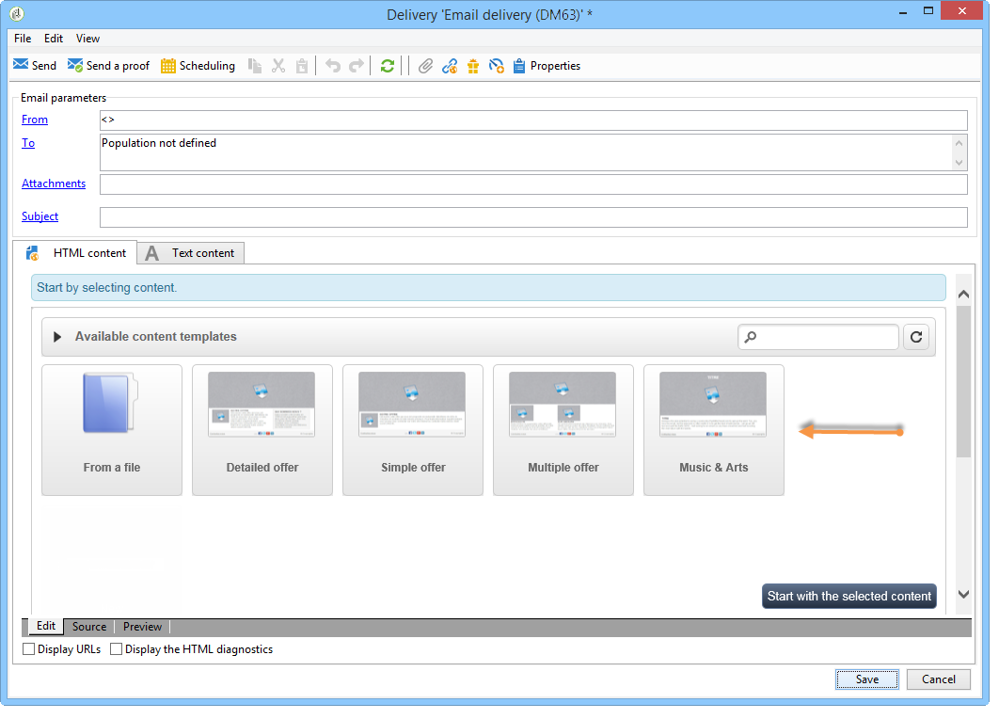

# Interface van de content-editor{#content-editor-interface}

## Venster {#editing-window} bewerken

Het DCE-bewerkingsvenster is onderverdeeld in drie verschillende secties. Hiermee kunt u de status van de inhoud weergeven, wijzigen en controleren.

1. De **top** sectie is een vertoningsgebied voor berichten aan de gebruiker. Deze berichten wijzen op het statuut van de de toepassingsstatus van het Web of de levering die evenals waarschuwingen en foutenmeldingen met betrekking tot de inhoud wordt gecreeerd. Raadpleeg [HTML-inhoudsstatussen](../../web/using/content-editing-best-practices.md#html-content-statuses) voor meer informatie.
1. De sectie aan **left** van het venster is het gebied voor het uitgeven van inhoud. Vanuit dit gebied kan de gebruiker rechtstreeks met de inhoud communiceren via de pop-upwerkbalk: voegt een koppeling in een afbeelding in, wijzigt het lettertype, verwijdert een veld, enzovoort. Zie [Formulieren bewerken](../../web/using/editing-content.md#editing-forms) voor meer informatie.
1. De sectie aan **right** van het venster is het gebied van het controlepaneel. In dit gebied worden de verschillende opties voor de editor gegroepeerd, met name de opties voor het configureren van de paginakop en de algemene opties voor een blok: Voeg een rand toe, verbind een gegevensbestandgebied met een inputstreek, toegang Web-pagina eigenschappen, enz. Raadpleeg voor meer informatie de secties [Algemene opties](#global-options) en [Inhoud bewerken](../../web/using/editing-content.md).

## Algemene opties {#global-options}

In de rechterbovensectie van de editor hebt u toegang tot globale opties waarmee u de inhoud kunt beheren die momenteel wordt gemaakt.

Het heeft vier pictogrammen:

* Met het pictogram **Blokken weergeven/verbergen** kunt u blauwe kaders rond de inhoudsblokken weergeven (overeenkomend met de HTML-tag `
`).

* Met het pictogram **Een andere inhoud kiezen** kan de gebruiker nieuwe inhoud laden vanuit een sjabloon (bestaande sjabloon of een sjabloon buiten het vak).

   

   >[!CAUTION]
   >
   >De geselecteerde inhoud vervangt de huidige inhoud.

* Met het pictogram **Opslaan als sjabloon** kunt u de huidige inhoud opslaan als een sjabloon. U moet het label en de interne naam voor de sjabloon invoeren. Sjablonen worden opgeslagen in het knooppunt **[!UICONTROL Resources > Templates > Content templates]**.

   

   Nadat de sjabloon is opgeslagen, is deze beschikbaar en kan deze worden geselecteerd bij het maken van nieuwe inhoud.

   

* Met het pictogram **Pagina-eigenschappen** kunt u inhoudsgegevens boven aan de HTML-pagina selecteren.

   

   >[!NOTE]
   >
   >Deze informatie komt overeen met de HTML-tags **`<title>`** en **`<meta>`** op de pagina.
   >
   >De sleutelwoorden moeten door komma&#39;s worden gescheiden.

## Blokopties {#block-options}

In de sectie rechts van de editor worden de belangrijkste opties gegroepeerd waarmee u op de inhoud kunt reageren. Als u deze opties wilt weergeven, moet u een blok selecteren: de aard van deze opties is afhankelijk van het geselecteerde blok.

U kunt:

* Bepaal de weergave voor een of meerdere blokken. Raadpleeg [Een zichtbaarheidsvoorwaarde definiëren](../../web/using/editing-content.md#defining-a-visibility-condition).
* Definieer de randen en frames. Raadpleeg [Een rand en achtergrond toevoegen](../../web/using/editing-content.md#adding-a-border-and-background).
* Afbeeldingskenmerken definiëren (grootte, bijschrift). Zie [Afbeeldingseigenschappen bewerken](../../web/using/editing-content.md#editing-image-properties).
* Koppel de database aan een formulierelement (invoerzone, selectievakje). Raadpleeg [De gegevenseigenschappen voor een formulier wijzigen](../../web/using/editing-content.md#changing-the-data-properties-for-a-form).
* Als u een deel van een formulier verplicht wilt maken, raadpleegt u [De gegevenseigenschappen wijzigen voor een formulier](../../web/using/editing-content.md#changing-the-data-properties-for-a-form).
* Definieer een handeling voor een knop. Raadpleeg [Een handeling aan een knop toevoegen](../../web/using/editing-content.md#adding-an-action-to-a-button).

## Inhoudwerkbalk {#content-toolbar}

De toolbar is een **pop-up element** van de interface DCE die verschillende functies volgens het geselecteerde blok voorstelt.

>[!CAUTION]
>
>Met bepaalde werkbalkfuncties kunt u de HTML-content opmaken. Als de pagina echter een CSS-stijlpagina bevat, kunnen de **instructies** uit de stijlpagina **priority** overnemen op de instructies die met de werkbalk zijn opgegeven.

