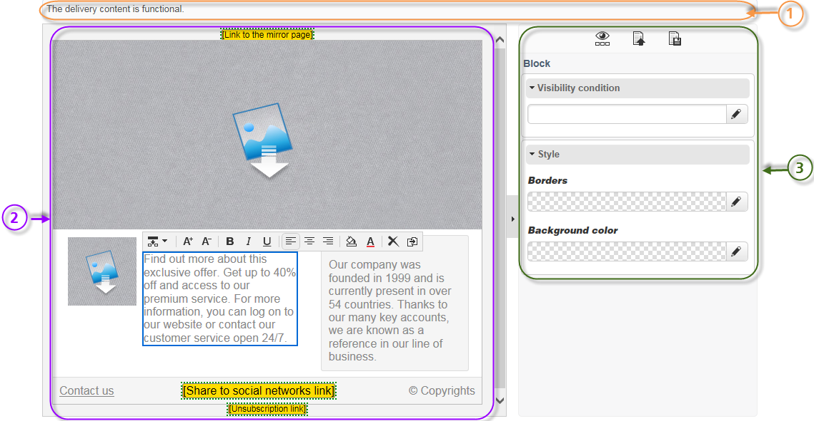
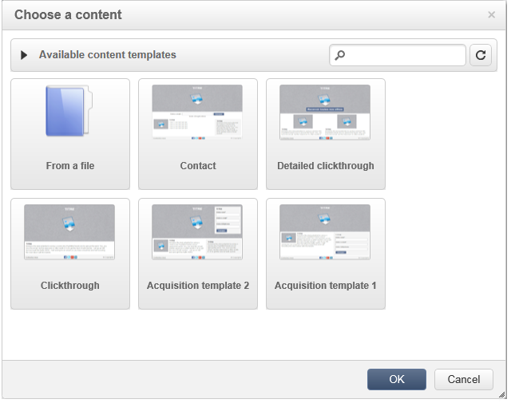
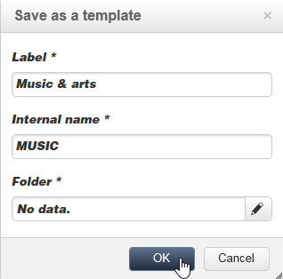

# Interface van de contenteditor{#content-editor-interface}

## Venster bewerken {#editing-window}

Het DCE-bewerkingsvenster is onderverdeeld in drie verschillende secties. Hiermee kunt u de status van de inhoud weergeven, wijzigen en controleren.

1. De **top** is een weergavegebied voor berichten aan de gebruiker. Deze berichten wijzen op het statuut van de de toepassingsstatus van het Web of de levering die evenals waarschuwingen en foutenmeldingen met betrekking tot de inhoud wordt gecreeerd. Raadpleeg voor meer informatie hierover [HTML-inhoudsstatus](content-editing-best-practices.md#html-content-statuses).
1. De sectie naar de **left** van het venster is het gebied voor het bewerken van inhoud. Vanuit dit gebied kan de gebruiker rechtstreeks met de inhoud communiceren via de pop-upwerkbalk: voegt een koppeling in een afbeelding in, wijzigt het lettertype, verwijdert een veld, enzovoort. Zie voor meer informatie [Formulieren bewerken](editing-content.md#editing-forms).
1. De sectie naar de **right** van het venster is het regelpaneel. In dit gebied worden de verschillende opties voor de editor gegroepeerd, met name de opties voor het configureren van de paginakop en de algemene opties voor een blok: Voeg een rand toe, verbind een gegevensbestandgebied met een inputstreek, toegang Web-pagina eigenschappen, enz. Raadpleeg voor meer informatie de [Algemene opties](#global-options) en [Inhoud bewerken](editing-content.md) secties.

## Algemene opties {#global-options}

In de rechterbovensectie van de editor hebt u toegang tot globale opties waarmee u de inhoud kunt beheren die momenteel wordt gemaakt.

Het heeft vier pictogrammen:

* De **Blokken weergeven/verbergen** met dit pictogram kunt u blauwe frames weergeven rondom de inhoudsblokken (die overeenkomen met de `
` HTML (tag).

* De **Een andere inhoud kiezen** kan de gebruiker nieuwe inhoud uit een sjabloon laden (bestaande sjabloon of een sjabloon die buiten het vak valt).

   

   >[!CAUTION]
   >
   >De geselecteerde inhoud vervangt de huidige inhoud.

* De **Opslaan als sjabloon** kunt u de huidige inhoud opslaan als een sjabloon. U moet het label en de interne naam voor de sjabloon invoeren. Sjablonen worden opgeslagen in de **[!UICONTROL Resources > Templates > Content templates]** knooppunt.

   

   Nadat de sjabloon is opgeslagen, is deze beschikbaar en kan deze worden geselecteerd bij het maken van nieuwe inhoud.

   

* De **Pagina-eigenschappen** kunt u inhoudsgegevens boven aan de pagina HTML selecteren.

   

   >[!NOTE]
   >
   >Deze informatie komt overeen met de **`<title>`** en **`<meta>`** HTML-tags op de pagina.
   >
   >De sleutelwoorden moeten door komma&#39;s worden gescheiden.

## Blokopties {#block-options}

In de sectie rechts van de editor worden de belangrijkste opties gegroepeerd waarmee u op de inhoud kunt reageren. Als u deze opties wilt weergeven, moet u een blok selecteren: de aard van deze opties is afhankelijk van het geselecteerde blok.

U kunt:

* Bepaal de weergave voor een of meerdere blokken, verwijs naar [Een zichtbaarheidsvoorwaarde definiëren](editing-content.md#defining-a-visibility-condition),
* Definieer de randen en frames. Raadpleeg [Rand en achtergrond toevoegen](editing-content.md#adding-a-border-and-background),
* Afbeeldingskenmerken definiëren (grootte, bijschrift). Zie [Afbeeldingseigenschappen bewerken](editing-content.md#editing-image-properties),
* Koppel de database aan een formulierelement (invoerzone, selectievakje), verwijs naar [De gegevenseigenschappen van een formulier wijzigen](editing-content.md#changing-the-data-properties-for-a-form),
* Een deel van een formulier verplicht maken. Raadpleeg voor meer informatie [De gegevenseigenschappen van een formulier wijzigen](editing-content.md#changing-the-data-properties-for-a-form),
* Definieer een handeling voor een knop. Zie [Een handeling aan een knop toevoegen](editing-content.md#adding-an-action-to-a-button).

## Inhoud, werkbalk {#content-toolbar}

De werkbalk is een **pop-upelement** van de interface DCE die verschillende functies volgens het geselecteerde blok voorstelt.

>[!CAUTION]
>
>Met bepaalde werkbalkfuncties kunt u de HTML-content opmaken. Als de pagina echter een CSS-stijlpagina bevat, **instructies** van het stijlblad **prioriteit** over de instructies die met de werkbalk zijn opgegeven.
