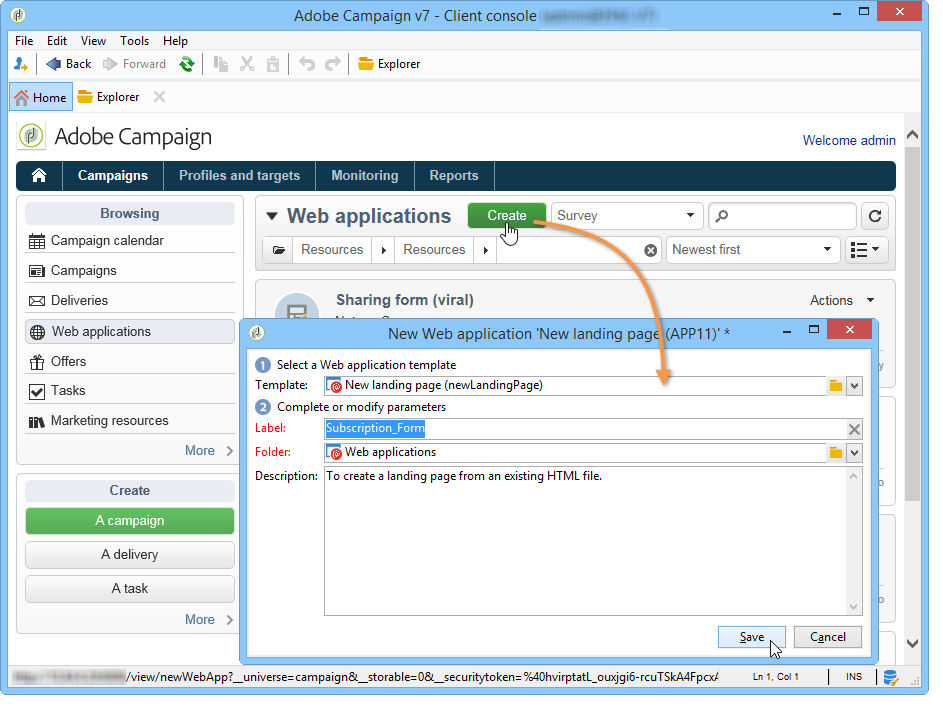
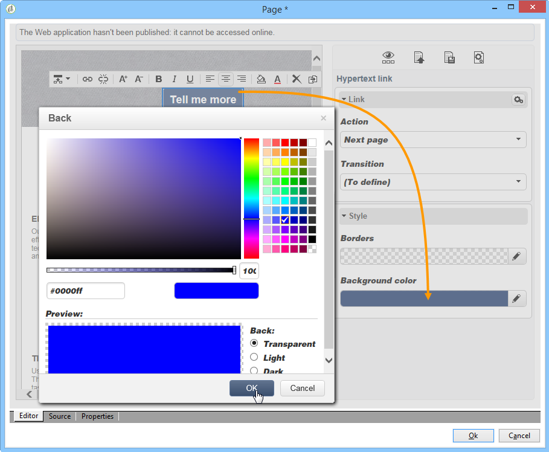
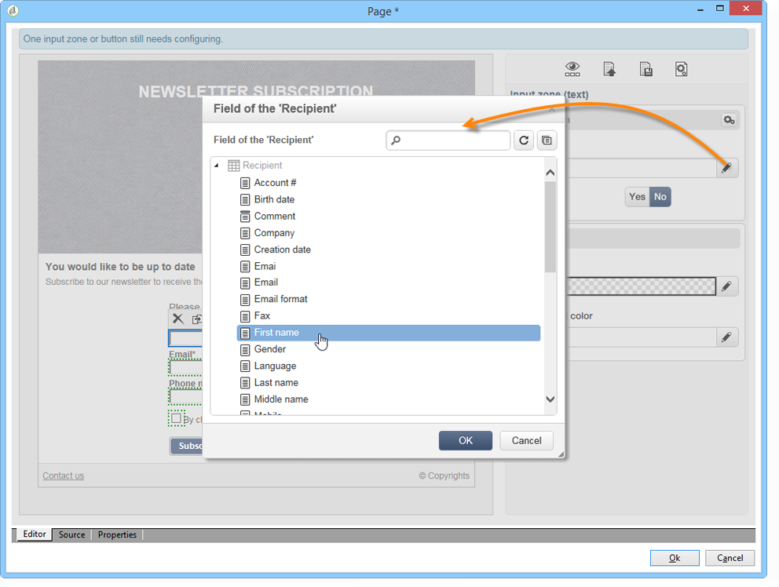
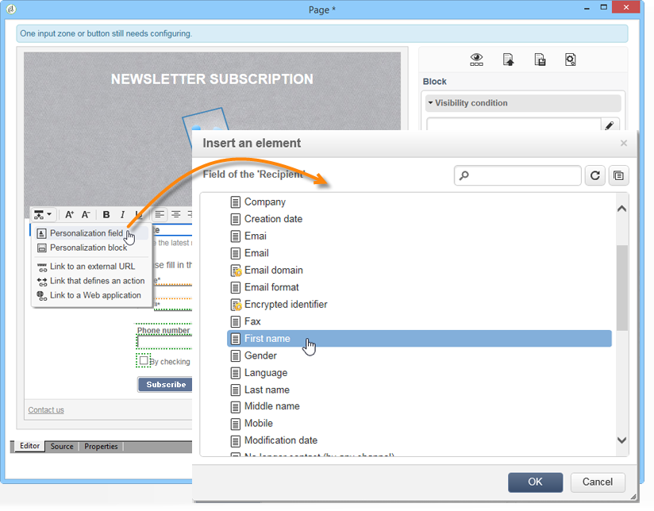

# Een openingspagina maken{#creating-a-landing-page}

## Over het maken van bestemmingspagina&#39;s {#about-landing-pages-creation}

In dit geval kunt u zien hoe u de Digital Editor gebruikt om een bestemmingspagina te maken vanuit de Adobe Campagne-console.

Voordat u de bestemmingspagina gaat configureren in Adobe Campaign, moet u **een of meer sjablonen** gebruiken die de HTML-pagina(&#39;s) vertegenwoordigen.

Het hoofddoel van dit gebruiksgeval is om ervoor te zorgen dat de formuliervelden van de landingspagina overeenkomen met de interne velden in Adobe Campaign met behulp van de functies in de DCE.

## De openingspagina maken {#creating-the-landing-page}

Als u een nieuwe webtoepassing van het type Landing Page wilt maken, gaat u als volgt te werk:

1. Ga naar het **[!UICONTROL Campaigns]** tabblad en klik op de **[!UICONTROL Web application]** koppeling en klik vervolgens op de **[!UICONTROL Create]** knop.
1. Selecteer de **[!UICONTROL New landing page]** sjabloon en voer een label in. Klik vervolgens op **[!UICONTROL Save]**.

   

1. Klik op het **[!UICONTROL Edit]** tabblad.
1. Verwijder de activiteit **Einde** .
1. Voeg een **[!UICONTROL Page]** activiteit na de **[!UICONTROL Storage]** activiteit toe.
1. Bewerk de activiteit **Pagina 2** en schakel de **[!UICONTROL Activate outbound transitions]** optie op het **[!UICONTROL Properties]** tabblad uit.

   

1. Wijzigingen opslaan.

U krijgt dan de volgende opeenvolging:

>[!NOTE]
>
>Raadpleeg [deze sectie](../../web/using/creating-a-new-web-application.md)voor meer informatie over het maken van een webtoepassing.

## Stap 1 - Sjablonen selecteren en laden {#step-1---selecting-and-loading-templates}

In deze sectie gaan we bekijken hoe we HTML-inhoud **voor elke pagina van de webtoepassing** importeren.

Een sjabloon moet bevatten:

* een **HTML** -bestand (verplicht)
* een of meer **CSS** -bestanden (optioneel)
* een of meer **afbeeldingen** (optioneel)

Voer de volgende stappen uit om de sjabloon op de eerste pagina te laden:

1. Open de eerste **[!UICONTROL Page]** activiteit van de toepassing van het Web.
1. Selecteer deze optie **[!UICONTROL From a file]** om de inhoudssjabloon op te halen.

   

1. Selecteer het HTML-bestand dat u wilt gebruiken.
1. Klik op **Openen** om het importeren te starten.

   Tijdens het laden wordt de lijst met gedeelde bestanden weergegeven. Het importsysteem controleert of alle bestanden die zijn gekoppeld aan de geselecteerde HTML aanwezig zijn (CSS, afbeeldingen, enz.).

   Klik op de **[!UICONTROL Close]** knop nadat het importeren is voltooid.

   

   >[!CAUTION]
   >
   >U moet wachten tot u het volgende bericht krijgt alvorens te sluiten: **[!UICONTROL The external resources have been successfully published]** .

1. Klik op het **[!UICONTROL Properties]** tabblad.
1. Voer een **label** voor elke pagina in (bijvoorbeeld: Pagina 1= Verzamelen, pagina 2=Bedankt).

   

Pas deze stappen voor elke pagina toe die in de toepassing van het Web wordt opgenomen.

>[!CAUTION]
>
>**De DCE voert de JavaScript-code voor de geladen HTML-pagina uit.** JavaScript-fouten in de HTML-sjabloon die kunnen worden weergegeven in de Adobe Campagne-interface. Deze fouten hebben geen betrekking op de editor. Als u wilt controleren of de geïmporteerde bestanden geen fouten bevatten, raden we u aan deze bestanden in een browser (Internet Explorer/Firefox/Chrome) te testen voordat u de bestanden in de DCE importeert.

## Stap 2 - De inhoud configureren {#step-2---configuring-the-content}

In deze sectie gaan we geïmporteerde inhoud aanpassen en de velden van de database koppelen aan de vorm van de webpagina. De eerder gemaakte webtoepassing is:

### Inhoud wijzigen {#modifying-content}

Laten we beginnen met het wijzigen van de kleuren van de pagina. Dit doet u als volgt:

1. Open de **[!UICONTROL Collection]** pagina.
1. Klik op de achtergrond.
1. Klik op **Achtergrondkleur** aan de rechterkant.
1. Selecteer een nieuwe achtergrondkleur.
1. Klik op **OK** om de wijziging te bevestigen.

   

1. Dezelfde processen toepassen om de kleur van de knop te wijzigen

   

### Formuliervelden koppelen {#linking-form-fields}

We gaan de velden op de pagina koppelen aan de velden in de database om de verstrekte informatie op te slaan.

1. Selecteer een formulierveld.
1. Bewerk de **[!UICONTROL Field]** sectie aan de rechterkant van de editor.
1. Selecteer het databaseveld dat u wilt koppelen aan het geselecteerde veld.

   

1. Herhaal dit proces voor elk veld op de pagina.

U kunt een veld verplicht maken: Klik bijvoorbeeld op het **[!UICONTROL Email]** veld en schakel vervolgens de optie **Verplicht** in.

### Koppelingen naar de volgende pagina maken {#creating-a-link-to-the-next-page}

Deze stap is verplicht omdat het de toepassing van het Web zal toestaan om de opeenvolging van de volgende stappen te bepalen: De verzamelde gegevens worden opgeslagen in de database en vervolgens wordt de volgende pagina weergegeven (pagina **Bedankt** ).

1. Selecteer de **[!UICONTROL Send it!]** knop van de **[!UICONTROL Collection]** pagina.
1. Klik op het **[!UICONTROL Action]** vervolgkeuzemenu.
1. Selecteer de **[!UICONTROL Next page]** handeling.

   

### Een aanpassingsveld invoegen {#inserting-a-personalization-field}

Met deze stap kunt u de pagina Bedankt personaliseren. Dit doet u als volgt:

1. Open de **[!UICONTROL Thank you]** pagina.
1. Plaats de cursor in een tekstgebied waar u de voornaam van de ontvanger wilt invoegen.
1. Selecteer **[!UICONTROL Personalization field]** in het **[!UICONTROL Insert]** menu van de toolbar.
1. Selecteer de voornaam.

   

Het verpersoonlijkingsgebied heeft een gele achtergrond in de redacteur.

## Stap 3 - Inhoud publiceren {#step-3---publishing-content}

De inhoud wordt gepubliceerd van het de toepassingsdashboard van het Web. Klik op de **[!UICONTROL Publish]** knop om deze uit te voeren.

Tijdens publicatie wordt een logboek weergegeven. Het publicatiesysteem analyseert alle inhoud die in de toepassing Web wordt gevonden

>[!NOTE]
>
>In het publicatielogboek worden waarschuwingen en fouten gesorteerd op activiteit.

Het formulier is nu beschikbaar: de URL ervan is toegankelijk in het toepassingsdashboard en kan naar ontvangers worden verzonden.
