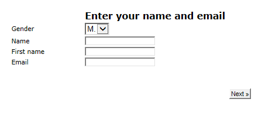

# Opmaak van webformulieren definiëren{#defining-web-forms-layout}

## Containers maken {#creating-containers}

Met containers kunt u de velden van een pagina combineren en de lay-out ervan configureren. om de elementen op de pagina in te delen.

Voor elke pagina van het formulier worden containers gemaakt met de **[!UICONTROL Containers]** knop op de werkbalk.

Gebruik een container om elementen van de pagina te groeperen zonder een label toe te voegen aan de definitieve rendering. Elementen worden gegroepeerd in de containersubstructuur. Met standaardcontainers kunt u de lay-out beheren.

Bijvoorbeeld:

De positie van labels wordt toegepast op elementen die onder de container in de hiërarchie worden geplaatst. Het kan voor elk element indien nodig worden overbelast. Voeg kolommen toe of verwijder kolommen om de lay-out te veranderen. Zie De velden [op de pagina](#positioning-the-fields-on-the-page)positioneren.

In het bovenstaande voorbeeld ziet de rendering er als volgt uit:

## De velden op de pagina plaatsen {#positioning-the-fields-on-the-page}

De indeling van het webformulier wordt per pagina gedefinieerd in elke container en kan voor elke controle worden overgeladen.

Pagina&#39;s worden opgesplitst in kolommen: elke pagina bevat een bepaald aantal kolommen . Elk veld van de pagina neemt **in cellen** in beslag. Containers nemen ook een bepaald aantal kolommen in en de velden die ze bevatten bezetten een bepaald aantal cellen

Pagina&#39;s worden standaard op één kolom gebouwd en elk element neemt één cel in beslag. Dit betekent dat velden onder elkaar worden weergegeven, waarbij elke regel een hele regel beslaat, zoals hieronder wordt getoond:

In het volgende voorbeeld, is de standaardconfiguratie gehouden. De pagina neemt één kolom in, die vier containers bevat.

Elke container neemt één kolom in beslag en elk element neemt één cel in beslag:

De rendering ziet er als volgt uit:

U kunt de weergaveparameters aanpassen om de volgende rendering te verkrijgen:

In het bovenstaande voorbeeld neemt elk invoerveld, elke titel en elke afbeelding één cel in de kolommen van de containers in.

U kunt de opmaak in elke container wijzigen. In ons voorbeeld kunt u de inhoud van container 4 over twee kolommen verspreiden en de elementen verdelen.

De titel en de lijst beslaan elk één cel (en dus een hele regel van de container) en het selectievakje is over twee cellen verdeeld. Het aantal cellen dat aan het invoerveld wordt toegewezen, wordt op het **[!UICONTROL General]** tabblad of op het **[!UICONTROL Advanced]** tabblad gedefinieerd, afhankelijk van het veldtype:

## De positie van labels definiëren {#defining-the-position-of-labels}

U kunt de uitlijning van velden en labels in het formulier definiëren.

Standaard worden de weergaveparameters voor velden en andere inhoud van de pagina overgenomen van de algemene configuratie van het formulier, de configuratie van de pagina of de configuratie van de bovenliggende container, als deze bestaat.

De algemene weergaveparameters voor het gehele formulier worden opgegeven in het vak met formuliereigenschappen. Op het **[!UICONTROL Rendering]** tabblad kunt u de positie van labels selecteren.

Deze positie kan voor elke pagina, elke container, en elk gebied, via het **[!UICONTROL Advanced]** lusje worden overbelast.

De volgende uitlijningen worden ondersteund:

* Overgenomen: de uitlijning wordt overgeërfd van het bovenliggende element (standaardwaarde), d.w.z. de bovenliggende container indien aanwezig, of anders de pagina.
* Links/rechts: het label rechts of links van het veld wordt geplaatst;
* Boven/onder: het etiket boven of onder het veld wordt geplaatst;
* Verborgen: wordt het label niet weergegeven.

