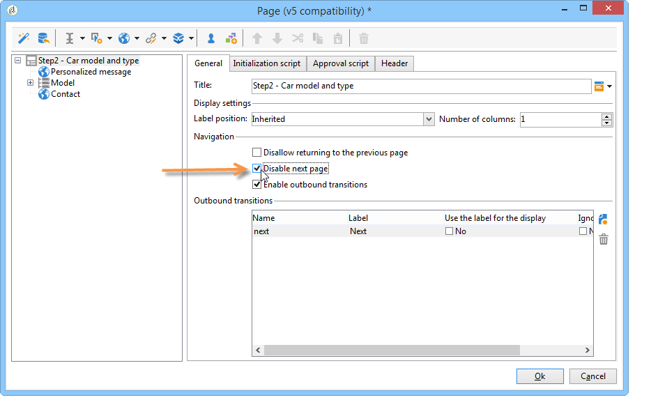
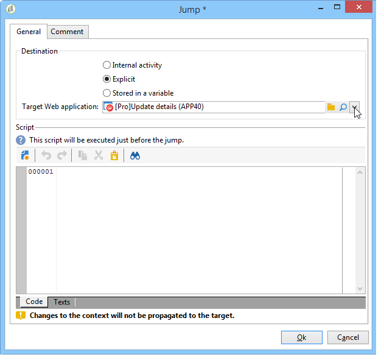

# Opeenvolging van webformulierpagina&#39;s definiëren{#defining-web-forms-page-sequencing}

Het formulier kan een of meer pagina&#39;s bevatten. Het wordt gebouwd door een diagram dat u opeenvolgende pagina&#39;s en het testen, manuscriptuitvoering en de stadia van de paginakijlopname laat. De wijze van de diagramconstructie is het zelfde als voor een werkschema.

## Vorige pagina en volgende pagina {#about-previous-page-and-next-page}

Voor elke pagina kunt u de **[!UICONTROL Next]** of **[!UICONTROL Previous]** knoppen verwijderen. Selecteer hiertoe de betrokken pagina en selecteer de optie **[!UICONTROL Disable next page]** of **[!UICONTROL Disallow returning to the previous page]** .



U kunt deze knoppen vervangen door koppelingen. Zie HTML-inhoud [invoegen](../../web/using/static-elements-in-a-web-form.md#inserting-html-content).

## Een sprong invoegen {#inserting-a-jump}

Het **[!UICONTROL Jump]** object geeft toegang tot een andere pagina of een ander formulier wanneer de gebruiker klikt **[!UICONTROL Next]**.

De bestemming kan zijn:

* Een andere pagina van het formulier. Hiervoor selecteert u de gewenste pagina **[!UICONTROL Internal activity]** en geeft u hieronder de gewenste pagina op:

   

* Een ander formulier. Selecteer hiertoe de **[!UICONTROL Explicit]** optie en geef het doelformulier op.

   

* De bestemming kan in een variabele worden opgeslagen. Selecteer deze optie in dit geval in de vervolgkeuzelijst, zoals hieronder wordt weergegeven:

   

* Op het **[!UICONTROL Comment]** tabblad kunt u informatie invoeren die zichtbaar is voor de operator wanneer deze op het object in het diagram klikt.

   

## Voorbeeld: toegang krijgen tot een ander formulier volgens een parameter van de URL {#example--accessing-another-form-according-to-a-parameter-of-the-url}

In het volgende voorbeeld, willen wij een vorm van het Web vormen die, wanneer goedgekeurd, een andere vorm zal tonen die door een parameter van URL wordt aangewezen. Hiervoor voert u de volgende stappen uit:

1. Een sprong invoegen aan het einde van een formulier: dit vervangt het **[!UICONTROL End]** vak .

   

1. Voeg in de formuliereigenschappen een parameter (**volgende**) toe die is opgeslagen in een lokale variabele (**volgende**). Lokale variabelen worden beschreven in Gegevens [opslaan in een lokale variabele](../../web/using/web-forms-answers.md#storing-data-in-a-local-variable).

   

1. Bewerk het **[!UICONTROL Jump]** object, selecteer de **[!UICONTROL Stored in a variable]** optie en selecteer de **volgende** variabele in het keuzemenu.

   

1. De leverings-URL moet de interne naam van het doelformulier bevatten, bijvoorbeeld:

   ```
   https://[myserver]/webForm/APP62?&next=APP22
   ```

   Wanneer de gebruiker op de **[!UICONTROL Approve]** knop klikt, wordt het formulier **APP22** weergegeven.

## Een koppeling naar een andere pagina van het formulier invoegen {#inserting-a-link-to-another-page-of-the-form}

U kunt koppelingen naar andere pagina&#39;s van het formulier invoegen. Hiervoor voegt u een statisch **[!UICONTROL Link]** type-element toe aan de pagina. Zie Een koppeling [invoegen voor meer informatie](../../web/using/static-elements-in-a-web-form.md#inserting-a-link).

## Voorwaardelijke paginaweergave {#conditional-page-display}

### Weergeven op basis van antwoorden {#display-based-on-responses}

In het **[!UICONTROL Test]** vak kunt u de volgorde van pagina&#39;s in een formulier bepalen. Hiermee kunt u verschillende vertakkingslijnen definiëren, afhankelijk van de testresultaten. Hierdoor kunt u verschillende pagina&#39;s weergeven, afhankelijk van de antwoorden van gebruikers.

U kunt bijvoorbeeld een andere pagina weergeven voor klanten die al online bestellingen hebben geplaatst, en een andere pagina voor klanten die meer dan tien bestellingen hebben geplaatst. Hiervoor voegt u op de eerste pagina van het formulier een invoerveld van het type in waarmee de gebruiker kan aangeven hoeveel bestellingen hij of zij heeft geplaatst. **[!UICONTROL Number]**


U kunt deze informatie opslaan in een veld van de database of een lokale variabele gebruiken.

>[!NOTE]
>
>De opslagmodi worden gedetailleerd weergegeven in de opslagvelden [](../../web/using/web-forms-answers.md#response-storage-fields)Reactie.

In ons voorbeeld, willen wij een variabele gebruiken:


Voeg in het diagram van het formulier een testvak in om de voorwaarden te definiëren. Voor elke voorwaarde, zal een nieuwe tak bij de output van de testdoos worden toegevoegd.


Selecteer de **[!UICONTROL Activate the default branching]** optie om een overgang toe te voegen voor gevallen waarin geen van de voorwaarden waar is. Deze optie is niet nodig als elk mogelijk geval onder de vastgestelde voorwaarden valt.

Definieer vervolgens de volgorde van de pagina wanneer een van de voorwaarden waar is, bijvoorbeeld:


### Weergeven op basis van parameters {#display-based-on-parameters}

U kunt de pagina ook personaliseren die volgens de initialisatieparameters van de vorm van het Web of volgens de waarden in het gegevensbestand wordt opgeslagen. Zie [URL-parameters](../../web/using/defining-web-forms-properties.md#form-url-parameters)van formulier.

## Scripts toevoegen {#adding-scripts}

Met het **[!UICONTROL Script]** object kunt u rechtstreeks een JavaScript-script invoeren, bijvoorbeeld om de waarde van een veld te wijzigen, gegevens op te halen uit de database of een Adobe Campagne-API aan te roepen.

## De eindpagina aanpassen {#personalizing-the-end-page}

U moet een eindpagina aan het eind van het diagram plaatsen. De eindpagina wordt weergegeven wanneer de gebruiker op de **[!UICONTROL Approve]** knop klikt in het webformulier.

Als u deze pagina wilt aanpassen, dubbelklikt u **[!UICONTROL End]** en voert u de inhoud van de pagina in de centrale editor in.


* U kunt bestaande HTML-inhoud kopiëren en plakken. Klik hiertoe op de HTML-code **[!UICONTROL Display source code]** en voeg deze in.
* U kunt een externe URL gebruiken; Hiervoor selecteert u de desbetreffende optie en voert u de URL in van de pagina die u wilt weergeven.

