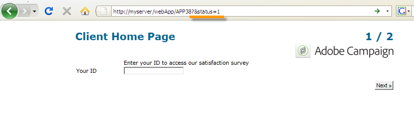

# Eigenschappen voor webformulieren definiëren{#defining-web-forms-properties}

Webformulieren zijn volledig configureerbaar en aanpasbaar om aan uw vereisten te voldoen. De parameters moeten in het eigenschappenvenster worden ingevoerd.

Het eigenschappenvenster is toegankelijk via de **[!UICONTROL Properties]** knop op de werkbalk van het webformulier. In dit venster hebt u toegang tot een reeks instellingen die specifiek zijn voor het webformulier. Sommige instellingen zijn mogelijk afkomstig uit de sjabloonconfiguratie.

## Algemene formuliereigenschappen {#overall-form-properties}

Op het **[!UICONTROL General]** tabblad van het venster Eigenschappen kunt u het **label** van het formulier wijzigen. Het wordt ten zeerste aanbevolen de **interne naam** niet te wijzigen.

De formuliersjabloon wordt gekozen tijdens het maken van het formulier. Deze kan later niet worden gewijzigd. Zie Een webformuliersjabloon gebruiken voor meer informatie over het maken en beheren van formuliersjablonen.

## Opslag van formuliergegevens {#form-data-storage}

De gebieden van de vormen van het Web worden opgeslagen in de ontvangenlijst door gebrek. U kunt de tabel wijzigen door een nieuwe tabel in het **[!UICONTROL Document type]** veld te selecteren. Met het **[!UICONTROL Zoom]** pictogram kunt u de inhoud van de geselecteerde tabel weergeven.

Standaard worden antwoorden opgeslagen in de **[!UICONTROL Answer to a recipient form]** tabel.

## Een foutpagina instellen {#setting-up-an-error-page}

U kunt een foutpagina configureren: deze pagina wordt weergegeven in het geval van fouten tijdens de uitvoering van het formulier.

De foutpagina wordt gedefinieerd op het bijbehorende tabblad van het venster met formuliereigenschappen.

Standaard wordt de volgende informatie weergegeven:

De inhoud van de weergegeven tekenreeksen wordt gedefinieerd op het **[!UICONTROL Error page]** tabblad van het eigenschappenvenster. Op het **[!UICONTROL HTML]** **[!UICONTROL Texts]** tabblad wordt de rendering weergegeven en kunt u de tekstreeksen wijzigen en zo nodig tekst toevoegen:

## Formulierlokalisatie {#form-localization}

Op het **[!UICONTROL Localization]** tabblad kunt u de ontwerp- en weergavetalen voor het webformulier selecteren.

Zie [Een webformulier](../../web/using/translating-a-web-form.md)vertalen.

## Bladeren en weergeven van formulieren {#form-browsing-and-rendering}

Op het **[!UICONTROL Rendering]** tabblad kunt u het type bladeren tussen pagina&#39;s van het webformulier en de gebruikte renderingsjabloon definiëren.

U kunt navigeren via koppelingen of knoppen.

Knoppen zijn standaard de navigatie-elementen. Hiermee kunt u de volgende handelingen uitvoeren:

* Goedkeuren van de huidige pagina en de volgende pagina weergeven door op **[!UICONTROL Next]** te klikken. Deze knop wordt op alle pagina&#39;s weergegeven, behalve op de laatste.
* Geef de vorige pagina weer door op **[!UICONTROL Previous]** te klikken. Deze knop wordt op alle pagina&#39;s weergegeven, behalve op de eerste.
* Sla de formulierreacties op door op de **[!UICONTROL Approve]** knop te klikken. Deze knop wordt alleen op de laatste pagina weergegeven.

Deze elementen worden onder aan elke pagina weergegeven. Hun standpunten kunnen worden gewijzigd. Hiervoor moet u het stijlblad wijzigen.

>[!NOTE]
>
>Het is mogelijk om de **[!UICONTROL Previous]** knop op sommige pagina&#39;s te verbergen. Ga hiertoe naar de desbetreffende pagina en controleer de **[!UICONTROL Disallow returning to the previous page]** optie. Deze optie is toegankelijk wanneer de hoofdmap van de paginastructuur is geselecteerd.

In het **[!UICONTROL Template]** veld op het **[!UICONTROL Rendering]** tabblad kunt u een thema kiezen uit de beschikbare thema&#39;s.

Thema&#39;s worden opgeslagen in het **[!UICONTROL Administration>Configuration>Form rendering]** knooppunt van de structuur. Zie Het renderingsjabloon van het formulier [selecteren](../../web/using/form-rendering.md#selecting-the-form-rendering-template)

In het onderste gedeelte van het eigenschappenvenster wordt een voorbeeld van rendering weergegeven. Met het **[!UICONTROL Edit link]** pictogram kunt u de configuratie voor het geselecteerde thema weergeven.

## Teksten in de vorm {#texts-in-the-form}

Op het **[!UICONTROL Page]** tabblad kunt u de inhoud van de kop- en voettekst van het formulier definiëren. Zie Kop- en [voetteksten](../../web/using/form-rendering.md#defining-headers-and-footers)definiëren.

U kunt hiermee ook vertalingen beheren. Zie [Een webformulier](../../web/using/translating-a-web-form.md)vertalen.

## Toegankelijkheid van het formulier {#accessibility-of-the-form}

Een webformulier is toegankelijk voor gebruikers als dit zo is **[!UICONTROL Online]** en als de huidige datum binnen de geldigheidsperiode valt. De status van het formulier wordt gewijzigd tijdens de publicatiefase (zie [Een formulier](../../web/using/publishing-a-web-form.md#publishing-a-form)publiceren). De status wordt weergegeven in de sectie **Project** van het **[!UICONTROL General]** tabblad Eigenschappen van het venster Eigenschappen.

De geldigheidsperiode loopt van de **[!UICONTROL Start]** datum tot en met de **[!UICONTROL End date]**. Als er in deze velden geen datums zijn opgegeven, is het formulier blijvend geldig.

>[!NOTE]
>
>Als het formulier wordt gesloten en de geldigheidsperiode ervan niet is bereikt of verlopen, of als het formulier is gesloten door de Adobe Campagneoperator, wordt een bericht weergegeven wanneer de gebruiker toegang probeert te krijgen tot het formulier. U kunt dit bericht personaliseren door te klikken **[!UICONTROL Personalize the message displayed if the form is closed...]**.

## Toegangsbeheer voor formulieren {#form-access-control}

Standaard wordt toegang tot webformulieren uitgevoerd in anonieme modus: aan alle operatoren die toegang krijgen tot het formulier, worden de rechten van de WebApp-operator toegewezen.

U kunt toegangsbeheer inschakelen voor de weergave van het formulier, bijvoorbeeld wanneer u een formulier op een intranetsite levert, om gebruikers te verifiëren. U doet dit door het **[!UICONTROL Properties]** venster van het desbetreffende formulier weer te geven en op de **[!UICONTROL Enable access control]** optie te klikken, zoals hieronder wordt weergegeven:

Als de pagina wordt geopend, wordt het volgende verificatieformulier weergegeven:

Aanmelding en wachtwoord zijn die welke worden gebruikt door Adobe Campagnebeheerders. Zie [deze sectie](../../platform/using/access-management.md)voor meer informatie.

Met de **[!UICONTROL Use a specific account]** optie kunt u de lees- of schrijfmachtigingen beperken van de operator die het formulier benadert. Gebruik de vervolgkeuzelijst om een operator of groep operatoren te selecteren die verantwoordelijk zijn voor het verlenen van deze machtigingen.

## URL-parameters van formulier {#form-url-parameters}

U kunt extra parameters in URL van een vorm toevoegen om zijn inhoud te personaliseren en een context (taal, gecodeerde ontvankelijke identiteitskaart, bedrijf, berekende formule te initialiseren die in een variabele wordt opgeslagen, etc.). Hiermee kunt u toegang geven tot één formulier via verschillende URL&#39;s en de pagina-inhoud aanpassen op basis van de waarde van de parameter(s) die in de URL is aangegeven.

Standaard bevat Adobe Campagne parameters voor het weergeven van een voorbeeld van het formulier en het controleren van fouten. U kunt nieuwe instellingen maken die zijn gekoppeld aan het formulier. Hierbij worden mogelijk de waarden van een veld in de database of van een lokale variabele gebruikt.

## Standaardparameters {#standard-parameters}

De volgende parameters zijn standaard beschikbaar:

* **id** om de gecodeerde id aan te geven.
* **lang** om de weergavetaal te wijzigen.
* **oorsprong** om de oorsprong van de geënquêteerde aan te geven.
* **Met _uuid** kunt u formulieren vóór publicatie weergeven en fouten bijhouden. Deze parameter is bestemd voor intern gebruik (maken en fouten opsporen): wanneer u tot het formulier van het Web via dit URL toegang hebt, worden de gecreeerde verslagen niet in het volgen (rapporten) in aanmerking genomen. De oorsprong wordt gedwongen tot de **[!UICONTROL Adobe Campaign]** waarde.

   Wordt gebruikt met de parameters **_preview** en/of **_debug**:

   **_preview** om de laatst opgeslagen versie weer te geven. Deze parameter mag alleen in de testfase worden gebruikt.

   **_debug** om het spoor van de gegevensinvoer of berekend in de pagina&#39;s van de vorm te tonen. Hiermee wordt meer informatie over fouten opgehaald, ook als het formulier eenmaal is gepubliceerd.

   >[!CAUTION]
   >
   >Wanneer het formulier via een URL met de parameter **_uuid** wordt weergegeven, wordt de waarde van de **[!UICONTROL origin]** parameter naar **Adobe Campagne** gedwongen.

## Parameters toevoegen {#adding-parameters}

Parameters kunnen worden toegevoegd via het **[!UICONTROL Parameters...]** tabblad in het venster Eigenschappen van het formulier. Zij kunnen verplicht worden gesteld, zoals hieronder wordt getoond:

U moet een opslagplaats specificeren waarvan de waarde van de parameter zal worden teruggewonnen. U doet dit door een van de opslagopties te selecteren en vervolgens op het **[!UICONTROL Storage]** tabblad te klikken om het desbetreffende veld of de variabele te selecteren. De opslagopties worden gedetailleerd beschreven in de opslagvelden Reactie.

De status van de geënquêteerde (0, 1 of een andere waarde) kan vervolgens aan de URL worden toegevoegd om het formulier te openen. Deze informatie kan opnieuw worden gebruikt op de pagina&#39;s van het formulier of in een testvak. De weergegeven pagina&#39;s kunnen worden geconditioneerd op basis van de waarde van de context, zoals hieronder wordt weergegeven:

1. Homepage voor klanten (**status=1**):

   

1. Startpagina voor vooruitzichten (**status=0**):

   

1. Startpagina voor andere profielen (bijvoorbeeld **status=12**):

   

Om deze vorm te vormen, creeer een testdoos en plaats het bij het begin van het diagram, zoals hieronder getoond:

Met het testvak kunt u de voorwaarden voor de volgorde van pagina&#39;s configureren:

