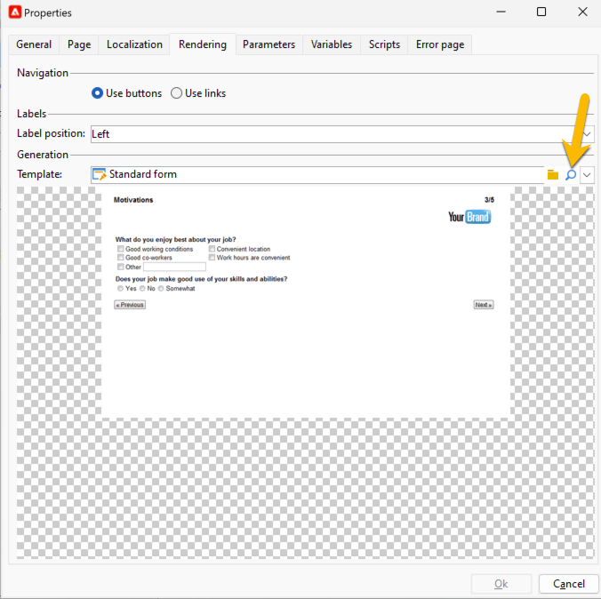
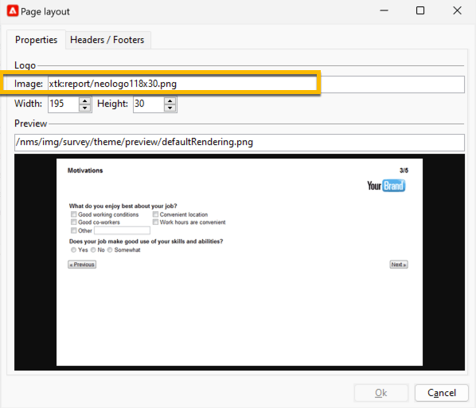

# Eigenschappen voor webformulieren definiëren{#defining-web-forms-properties}

U kunt webformulieren volledig configureren en aanpassen aan uw wensen. De parameters moeten in het eigenschappenvenster worden ingevoerd.

Het eigenschappenvenster is toegankelijk via het dialoogvenster **[!UICONTROL Properties]** in de werkbalk van het webformulier. In dit venster hebt u toegang tot een reeks instellingen die specifiek zijn voor het webformulier. Sommige instellingen zijn mogelijk afkomstig uit de sjabloonconfiguratie.

## Algemene formuliereigenschappen {#overall-form-properties}

In de **[!UICONTROL General]** tabblad van het eigenschappenvenster kunt u de **Label** van het formulier. Het wordt ten zeerste aanbevolen de **Interne naam**.

De formuliersjabloon wordt gekozen tijdens het maken van het formulier. Deze kan later niet worden gewijzigd. Voor meer informatie over het maken en beheren van formuliersjablonen raadpleegt u [Een webformuliersjabloon gebruiken](using-a-web-form-template.md).

## Opslag van formuliergegevens {#form-data-storage}

De gebieden van de vormen van het Web worden opgeslagen in de ontvangenlijst door gebrek. U kunt de tabel wijzigen door een nieuwe tabel te selecteren in het menu **[!UICONTROL Document type]** veld. De **[!UICONTROL Zoom]** kunt u de inhoud van de geselecteerde tabel weergeven.

Standaard worden antwoorden opgeslagen in de **Antwoord op een formulier voor ontvangers** tabel.

## Een foutpagina instellen {#setting-up-an-error-page}

U kunt een foutpagina configureren: deze pagina wordt weergegeven in het geval van fouten tijdens de uitvoering van het formulier.

De foutpagina wordt gedefinieerd op het bijbehorende tabblad van het venster met formuliereigenschappen.

Standaard wordt de volgende informatie weergegeven:

De inhoud van de weergegeven tekenreeksen wordt gedefinieerd in het dialoogvenster **[!UICONTROL Error page]** van het eigenschappenvenster. De **[!UICONTROL HTML]** wordt de rendering en de **[!UICONTROL Texts]** kunt u de tekstreeksen wijzigen en zo nodig tekst toevoegen:

## Formulierlokalisatie {#form-localization}

De **[!UICONTROL Localization]** kunt u de ontwerp- en weergavetalen voor het webformulier selecteren.

Zie [Een webformulier vertalen](translating-a-web-form.md).

## Bladeren en weergeven van formulieren {#form-browsing-and-rendering}

De **[!UICONTROL Rendering]** kunt u het type definiëren waarin wordt gebladerd tussen pagina&#39;s van het webformulier en de gebruikte renderingsjabloon.

U kunt navigeren via koppelingen of knoppen.

Knoppen zijn standaard de navigatie-elementen. Hiermee kunt u de volgende handelingen uitvoeren:

* De huidige pagina goedkeuren en de volgende pagina weergeven door op **[!UICONTROL Next]**. Deze knop wordt op alle pagina&#39;s weergegeven, behalve op de laatste.
* De vorige pagina weergeven door op **[!UICONTROL Previous]**. Deze knop wordt op alle pagina&#39;s weergegeven, behalve op de eerste.
* Sla de formulierreacties op door op de knop **[!UICONTROL Approve]** knop. Deze knop wordt alleen op de laatste pagina weergegeven.

Deze elementen worden onder aan elke pagina weergegeven. Hun standpunten kunnen worden gewijzigd. Hiervoor moet u het stijlblad wijzigen.

>[!NOTE]
>
>Het is mogelijk om de **[!UICONTROL Previous]** op sommige pagina&#39;s. Ga hiertoe naar de desbetreffende pagina en controleer de **[!UICONTROL Disallow returning to the previous page]** -optie. Deze optie is toegankelijk wanneer de hoofdmap van de paginastructuur is geselecteerd.

De **[!UICONTROL Template]** van het **[!UICONTROL Rendering]** kunt u een thema selecteren uit de beschikbare thema&#39;s.

Thema&#39;s worden opgeslagen in de **[!UICONTROL Administration>Configuration>Form rendering]** knooppunt van de structuur. Zie [De renderingsjabloon van het formulier selecteren](form-rendering.md#selecting-the-form-rendering-template)

In het onderste gedeelte van het eigenschappenvenster wordt een voorbeeld van rendering weergegeven. De **[!UICONTROL Edit link]** kunt u de configuratie voor het geselecteerde thema weergeven.

## Logo in het formulier {#logo-in-the-form}

U kunt het logo dat in het formulier wordt gebruikt, wijzigen met uw eigen logo.

In de **[!UICONTROL Rendering]** in de **[!UICONTROL Properties]** Klik op het glaspictogram van uw sjabloon in uw webapp:

Klik in het nieuwe venster op de knop **[!UICONTROL Page layout]** link :

U kunt het pad van de logoafbeelding hier wijzigen:

De beschikbare afbeeldingen zijn lager dan **[!UICONTROL Administration]** > **[!UICONTROL Configuration]** > **[!UICONTROL Images]**. U kunt hier uw logo toevoegen.

Deze afbeeldingen worden in de achterste map van de instantie geplaatst *datakit\nms\fra\img\activities* of *datakit\nms\eng\img\activities* (eng of fra, afhankelijk van de taal van de instantie).

Als er een nieuwe afbeelding beschikbaar is in deze map (en in Afbeeldingen), neemt u contact op met de ondersteuning van de Adobe om wijzigingen aan te brengen in de achterste mappen.

Voor instanties op locatie kunt u zelf afbeeldingen aan de database toevoegen.

De geüploade afbeelding hoeft niet zichtbaar te zijn vanuit de Campagneclient. Het juiste pad is voldoende om te gebruiken als een nieuw logo.

## Teksten in de vorm {#texts-in-the-form}

De **[!UICONTROL Page]** kunt u de inhoud van de kop- en voettekst van het formulier definiëren. Zie [Kop- en voetteksten definiëren](form-rendering.md#defining-headers-and-footers).

U kunt hiermee ook vertalingen beheren. Zie [Een webformulier vertalen](translating-a-web-form.md).

## Toegankelijkheid van het formulier {#accessibility-of-the-form}

Een webformulier is toegankelijk voor gebruikers als het **[!UICONTROL Online]** en indien de huidige datum binnen de geldigheidsperiode valt. De status van het formulier wordt tijdens de publicatiefase gewijzigd (zie [Een formulier publiceren](publishing-a-web-form.md#publishing-a-form)). De status wordt weergegeven in het dialoogvenster **Project** van de **[!UICONTROL General]** van het eigenschappenvenster.

De geldigheidsperiode loopt vanaf **[!UICONTROL Start]** aan de **[!UICONTROL End date]**. Als er in deze velden geen datums zijn opgegeven, is het formulier blijvend geldig.

>[!NOTE]
>
>Als het formulier wordt gesloten en de geldigheidsperiode ervan niet is bereikt of verlopen, of als het formulier is gesloten door de Adobe Campaign-operator, wordt een bericht weergegeven wanneer de gebruiker toegang probeert te krijgen tot het formulier. U kunt dit bericht aanpassen door op **[!UICONTROL Personalize the message displayed if the form is closed...]**.

## Toegangsbeheer voor formulieren {#form-access-control}

Standaard wordt toegang tot de webformulieren uitgevoerd in anonieme modus: aan alle operatoren die toegang krijgen tot het formulier, worden de rechten van de WebApp-operator toegewezen.

U kunt toegangsbeheer inschakelen voor de weergave van het formulier, bijvoorbeeld wanneer u een formulier op een intranetsite levert, om gebruikers te verifiëren. Om dit te doen, toon **[!UICONTROL Properties]** en klikt u op het **[!UICONTROL Enable access control]** zoals hieronder weergegeven:

Als de pagina wordt geopend, wordt het volgende verificatieformulier weergegeven:

Aanmelding en wachtwoord zijn die welke door Adobe Campaign-operatoren worden gebruikt. Raadpleeg [deze sectie](../../platform/using/access-management.md) voor meer informatie.

De **[!UICONTROL Use a specific account]** Met deze optie kunt u de lees- of schrijfmachtigingen beperken van de operator die het formulier benadert. Gebruik de vervolgkeuzelijst om een operator of groep operatoren te selecteren die verantwoordelijk zijn voor het verlenen van deze machtigingen.

## URL-parameters van formulier {#form-url-parameters}

U kunt extra parameters in URL van een vorm toevoegen om zijn inhoud te personaliseren en een context (taal, gecodeerde ontvankelijke identiteitskaart, bedrijf, berekende formule te initialiseren die in een variabele wordt opgeslagen, etc.). Hiermee kunt u toegang geven tot één formulier via verschillende URL&#39;s en de pagina-inhoud aanpassen op basis van de waarde van de parameter(s) die in de URL is aangegeven.

Standaard biedt Adobe Campaign parameters voor het weergeven van een voorbeeld van het formulier en het controleren van fouten. U kunt nieuwe instellingen maken die zijn gekoppeld aan het formulier. Hierbij worden mogelijk de waarden van een veld in de database of van een lokale variabele gebruikt.

## Standaardparameters {#standard-parameters}

De volgende parameters zijn standaard beschikbaar:

* **id** om de gecodeerde id aan te geven.
* **lang** om de weergavetaal te wijzigen.
* **oorsprong** om de oorsprong van de geënquêteerde te specificeren.
* **_uuid** schakelt weergave van formulieren vóór publicatie en foutcontrole in. Deze parameter is voor intern gebruik (creatie en zuivert): wanneer u tot het formulier van het Web via dit URL toegang hebt, worden de gecreeerde verslagen niet in het volgen (rapporten) in aanmerking genomen. De oorsprong wordt gedwongen naar de **[!UICONTROL Adobe Campaign]** waarde.

  Het wordt gebruikt met de **_voorvertoning** parameters en/of **_debug**:

  **_voorvertoning** om de laatst opgeslagen versie weer te geven. Deze parameter mag alleen in de testfase worden gebruikt.

  **_debug** om de tracering van de gegevensinvoer weer te geven of te berekenen op de pagina&#39;s van het formulier. Hiermee wordt meer informatie over fouten opgehaald, ook als het formulier eenmaal is gepubliceerd.

  >[!CAUTION]
  >
  >Wanneer het formulier via een URL wordt weergegeven met de opdracht **_uuid** de waarde van de **[!UICONTROL origin]** parameter is gedwongen om **Adobe Campaign**.

## Parameters toevoegen {#adding-parameters}

Parameters kunnen worden toegevoegd via de **[!UICONTROL Parameters...]** in het venster Eigenschappen van het formulier. Zij kunnen verplicht worden gesteld, zoals hieronder wordt getoond:

U moet een opslagplaats specificeren waarvan de waarde van de parameter zal worden teruggewonnen. Selecteer hiertoe een van de opslagopties en klik op de knop **[!UICONTROL Storage]** om het veld of de variabele in kwestie te selecteren. De opslagopties worden nader beschreven in [Responsopslagvelden](web-forms-answers.md#response-storage-fields).

De status van de geënquêteerde (0, 1 of een andere waarde) kan vervolgens aan de URL worden toegevoegd om het formulier te openen. Deze informatie kan opnieuw worden gebruikt op de pagina&#39;s van het formulier of in een testvak. De weergegeven pagina&#39;s kunnen worden geconditioneerd op basis van de waarde van de context, zoals hieronder wordt weergegeven:

1. Homepage voor klanten (**status=1**):

   

1. Homepage voor perspectieven (**status=0**):

   

1. Startpagina voor andere profielen (bijvoorbeeld **status=12**):

   

Om deze vorm te vormen, creeer een testdoos en plaats het bij het begin van het diagram, zoals hieronder getoond:

Met het testvak kunt u de voorwaarden voor de volgorde van pagina&#39;s configureren:

