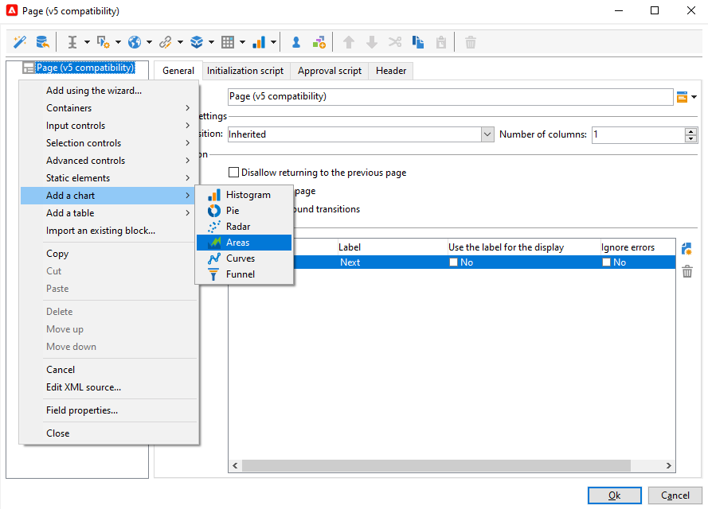

# Een webtoepassing ontwerpen{#designing-a-web-application}

Webtoepassingen worden volgens hetzelfde principe als [onlineenquêtes](../../web/using/about-surveys.md)gemaakt en beheerd.

De functionele verschillen zijn echter als volgt:

* Webtoepassingen gebruiken geen gearchiveerde velden. Gegevens kunnen daarom alleen in databasevelden of lokale variabelen worden opgeslagen.
* Er zijn geen ingebouwde rapporten over de toepassingen van het Web.
* Er worden extra velden aangeboden, vooral voor het maken van tabellen en grafieken.

>[!CAUTION]
>
>Het wordt hoogst geadviseerd dat de toegepaste configuraties voortdurend worden gecontroleerd om het even welke fouten vroeg in het de toepassingsbouwproces van het Web te ontdekken. Als u de rendering van een wijziging wilt controleren, slaat u de toepassing op en klikt u op het **[!UICONTROL Preview]** subtabblad.
>
>Totdat de toepassing van het Web wordt gepubliceerd, kunnen de veranderingen niet door het eind worden gezien - gebruiker.

## Het opnemen van grafieken in een toepassing van het Web {#inserting-charts-in-a-web-application}

U kunt grafieken in de toepassingen van het Web omvatten. Hiervoor selecteert u met de vervolgkeuzelijst met grafieken in de taakbalk het type diagram dat u wilt invoegen.

U kunt ook het **[!UICONTROL Add a chart]** menu selecteren.

## Tabellen invoegen in een webtoepassing {#inserting-tables-in-a-web-application}

Als u een tabel wilt toevoegen, selecteert u het type tabel dat u wilt gebruiken in de vervolgkeuzelijst met tabellen op de taakbalk.

U kunt ook het type tabel selecteren in het keuzemenu.

## Overzicht-type de toepassingen van het Web {#overview-type-web-applications}

De interface van de Campagne van Adobe gebruikt vele toepassingen van het Web om, tot ontvangers, leveringen, campagnes, voorraden, enz. toegang te hebben te beheren en in wisselwerking te staan.

Deze worden in de interface weergegeven in de vorm van dashboards met slechts één pagina.

De uit-van-de-doos toepassingen van het Web worden opgeslagen in de **[!UICONTROL Administration > Configuration > Web applications]** knoop.

## Formuliertype webtoepassingen bewerken {#edit-forms-type-web-applications}

De toepassingen van het formulierWeb voor een extranet bewerken worden gekenmerkt door:

* Een voorlaadvenster

   In de meeste gevallen moeten de gegevens die worden weergegeven, vooraf worden geladen. Omdat de gebruikers die tot deze vormen toegang hebben (via een toegangscontrole) worden geïdentificeerd, wordt het vooraf laden niet noodzakelijk gecodeerd.

* Een opslagvak
* Pagina&#39;s toevoegen

   Terwijl de &quot;overzicht&quot;-typeToepassingen van het Web allen één enkele pagina hebben, geef vormen een opeenvolging van pagina&#39;s uit die op specifieke criteria (tests, selecties, profiel van verbonden exploitant, enz.) worden gebaseerd.

De verrichting van dit type van de toepassing van het Web is gelijkaardig aan **Enquêtes**, maar zonder geschiedenisbeheer of gebiedsarchivering. Gebruikers krijgen meestal toegang via een aanmeldingspagina waar zij zich moeten identificeren.
