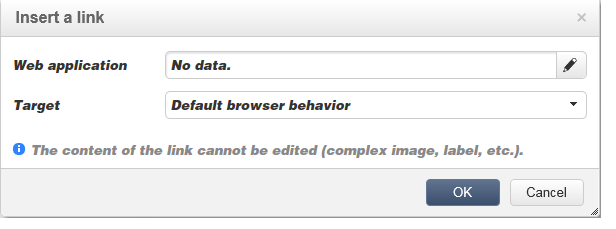

# Content bewerken{#editing-content}

## Een zichtbaarheidsvoorwaarde definiëren {#defining-a-visibility-condition}

U kunt een zichtbaarheidsvoorwaarde opgeven op een webpagina-element: dit element is alleen zichtbaar als aan de voorwaarde wordt voldaan.

Als u een zichtbaarheidsvoorwaarde wilt toevoegen, selecteert u een blok en voert u de voorwaarde in het dialoogvenster **[!UICONTROL Visibility condition]** veld met de expressie-editor.

>[!NOTE]
>
>Geavanceerde bewerkingen van expressies worden weergegeven op [deze pagina](../../platform/using/defining-filter-conditions.md#list-of-functions).

Deze voorwaarden nemen de XTK-expressiesyntaxis over (bijvoorbeeld **ctx.receiver.@email!= &quot;&quot;** of **ctx.receiver.@status==&quot;0&quot;**). Standaard zijn alle velden zichtbaar.

>[!NOTE]
>
>Niet-zichtbare dynamische blokken, zoals vervolgkeuzemenu&#39;s, kunnen niet worden bewerkt.

## Rand en achtergrond toevoegen {#adding-a-border-and-background}

U kunt een **border** naar een geselecteerd blok. De randen worden gedefinieerd met behulp van drie opties: stijl, grootte en kleur.

U kunt ook een **achtergrondkleur** door een kleur in het kleurdiagram te selecteren.

## Formulieren bewerken {#editing-forms}

### De gegevenseigenschappen van een formulier wijzigen {#changing-the-data-properties-for-a-form}

U kunt databasevelden koppelen aan invoerzone, keuzerondje of keuzelijstblokken.

>[!NOTE]
>
>De standaardgebieden zijn die in het schema van de de toepassingsopslag van het Web.

De **field** Met een invoerzone kunt u een databaseveld selecteren dat u wilt koppelen aan het formulierveld.

Standaard worden de velden in de **nms:ontvanger** tabel.

De **Vereist veld** Hiermee kunt u de goedkeuring van de pagina alleen autoriseren als de gebruiker het veld heeft ingevuld. Als een vereist veld niet is ingevuld, wordt een foutbericht weergegeven.

Voor keuzerondjes en selectievakjes: **extra configuratie is vereist**.

Als de gebruikte sjabloon standaard geen waarde bevat, moet u deze in de editor voltooien.

Dit doet u als volgt:

* Klik op de knop **[!UICONTROL Edit]** pictogram.

  

* Voer de opgegeven lijstwaarde (gedefinieerd door het geselecteerde veld) in in het dialoogvenster **[!UICONTROL Value]** veld.

  

### Formuliervelden wijzigen {#modifying-form-fields}

Formuliervelden zoals keuzerondjes, invoerzones, vervolgkeuzelijsten, enz. kan worden gewijzigd op basis van de werkbalken.

Dit betekent dat u:

* Verwijder het blok met de formuliervelden met het gereedschap **[!UICONTROL Delete]** pictogram.
* Het geselecteerde veld dupliceren door een nieuw blok te maken met het gereedschap **[!UICONTROL Duplicate]** pictogram.
* Bewerk de **[!UICONTROL Form data]** venster voor het koppelen van een databaseveld aan de formulierzone met behulp van de **[!UICONTROL Edit]** pictogram.

  

## Een handeling aan een knop toevoegen {#adding-an-action-to-a-button}

Wanneer de gebruiker op een knop klikt, kunt u een bijbehorende actie definiëren. Selecteer hiertoe de uit te voeren actie in de vervolgkeuzelijst.

De beschikbare acties zijn als volgt:

* **[!UICONTROL Refresh]** : vernieuwt de huidige pagina.
* **[!UICONTROL Next page]** : maakt een koppeling naar de volgende pagina in de webtoepassing.
* **[!UICONTROL Previous page]** : maakt een koppeling naar de vorige pagina in de webtoepassing.

>[!NOTE]
>
>De **[!UICONTROL None]** Met deze waarde kunt u de knop niet activeren.

U kunt het label dat aan de knop is gekoppeld, wijzigen in het desbetreffende veld.

## Een koppeling toevoegen {#adding-a-link}

U kunt een koppeling invoegen in elk pagina-element: afbeelding, woord, groep woorden, tekstblok, enzovoort.

Selecteer hiertoe het element en gebruik vervolgens het eerste pictogram in het pop-upmenu.

Met dit pictogram hebt u toegang tot alle beschikbare typen koppelingen.

U kunt alleen aanpassingsblokken en velden invoegen in tekstblokken.

>[!NOTE]
>
>Voor elk type koppeling kunt u de openingsmodus configureren: selecteer het doelvenster in het dialoogvenster **Doel** vervolgkeuzelijst. Deze waarde komt overeen met de **`<target>`** HTML-tag.
>
>De lijst met beschikbare **streefdoelen** is als volgt:
>
>* Overige (IFrame)
>* Bovenste venster (_boven)
>* Bovenliggend venster (_bovenliggend)
>* Nieuw venster (_leeg)
>* Huidig venster (_zelf)
>* Standaardbrowsergedrag
>

### Koppeling maken naar een URL {#link-to-a-url}

De **Koppeling maken naar een externe URL** kunt u elke URL vanuit de broninhoud openen.

Voer het koppelingsadres in kwestie in de **URL** veld. Het veld URL moet worden ingevoerd als: **https://www.myURL.com**.

### Koppelen naar een webtoepassing {#link-to-a-web-application}

De **Koppelen naar een webtoepassing** hebt toegang tot een Adobe Campaign Web-toepassing.

Selecteer de toepassing van het Web van het overeenkomstige gebied.

De lijst met voorgestelde webtoepassingen komt overeen met de beschikbare toepassingen in het dialoogvenster **[!UICONTROL Resources > Online > Web Applications]** knooppunt.

### Koppeling maken naar een handeling {#link-to-an-action}

De **Koppeling die een handeling definieert** kunt u een handeling configureren wanneer u op een bronelement klikt.

>[!NOTE]
>
>De beschikbare acties worden nader beschreven in het gedeelte [Een handeling aan een knop toevoegen](#adding-an-action-to-a-button) sectie.

### Een koppeling verwijderen {#delete-a-link}

Wanneer een koppeling is ingevoegd, bevat de werkbalk twee nieuwe pictogrammen: **Koppeling bewerken** en **De koppeling verbreken** Hiermee kunt u communiceren met de gemaakte koppeling.

* **[!UICONTROL Edit link]** Hiermee kunt u een venster weergeven met alle parameters van de koppeling.
* **[!UICONTROL Break the link]** Hiermee kunt u na bevestiging de koppeling en alle bijbehorende parameters verwijderen.

>[!NOTE]
>
>Als de koppeling wordt verwijderd, blijft de inhoud behouden.

## Lettertypekenmerken wijzigen {#changing-font-attributes}

Wanneer u een tekstelement selecteert, kunt u lettertypekenmerken (stijl, opmaak) wijzigen.

De beschikbare opties zijn als volgt:

* **Lettertype vergroten** pictogram: vergroot de grootte van de geselecteerde tekst (voeg toe) ``)
* **Lettertype reduceren** pictogram: verkleint de grootte van de geselecteerde tekst (toevoegen) ``)
* **Vet** pictogram: hiermee wordt geselecteerde tekst vet gemaakt (omlooptekst met de `<strong> </strong>` tag)
* **Cursief** pictogram: maakt geselecteerde tekst cursief (omlooptekst met de  `<em> </em>` tag)
* **Onderstrepen** pictogram: maakt geselecteerde tekst onderstreept (omlooptekst met de `` tag)
* **Links uitlijnen** pictogram: hiermee wordt tekst links van het geselecteerde blok uitgelijnd (add style=&quot;text-align: left;&quot;)
* **Midden** pictogram: centreert de tekst voor het geselecteerde blok (add style=&quot;text-align: center;&quot;)
* **Rechts uitlijnen** pictogram: hiermee wordt tekst rechts van het geselecteerde blok uitgelijnd (add style=&quot;text-align: right;&quot;)
* **De achtergrondkleur wijzigen** pictogram: hiermee kunt u de achtergrondkleur van het geselecteerde blok wijzigen (stijl=&quot;background-color: rgba(170, 86, 255, 0.87) toevoegen)
* **Tekstkleur wijzigen** pictogram: hiermee kunt u de tekstkleur van het geselecteerde blok of alleen de geselecteerde tekst wijzigen (``)

>[!NOTE]
>
>* **Verwijderen** pictogram: hiermee verwijdert u het blok en alle inhoud ervan.
>
>* **Dupliceren** pictogram: dupliceert het blok en alle stijlen die betrekking hebben op het blok.

## Afbeeldingen en animaties beheren {#managing-images-and-animations}

Met de Digital Content Editor kunt u werken aan **elk type afbeelding** compatibel met browsers.

>[!CAUTION]
>
>U mag geen externe bestanden oproepen in een **script** -tag van de pagina HTML. Deze bestanden worden niet geïmporteerd op de Adobe Campaign-server.

### Een afbeelding toevoegen, verwijderen of dupliceren {#adding---deleting---duplicating-an-image}

Als u een afbeelding wilt invoegen, selecteert u een blok met afbeeldingstypen en klikt u op de knop **Afbeelding** pictogram.

Selecteer een lokaal opgeslagen afbeeldingsbestand.

De **Verwijderen** verwijdert de tag die de afbeelding bevat.

De **Dupliceren** dupliceert de tag en de inhoud ervan.

>[!CAUTION]
>
>Wanneer u een afbeelding dupliceert, worden de id&#39;s voor de nieuwe afbeelding verwijderd.

### Afbeeldingseigenschappen bewerken {#editing-image-properties}

Wanneer u een blok selecteert dat een afbeelding bevat, hebt u toegang tot de volgende eigenschappen:

* **Bijschrift** Hiermee kunt u het bijschrift definiëren dat aan de afbeelding is gekoppeld (dat overeenkomt met de **alt** HTML, kenmerk).
* **Dimensionen** Hiermee kunt u de afbeeldingsgrootte opgeven, in pixels.

  

## Aanpassingsinhoud toevoegen {#adding-personalization-content}

### Een aanpassingsveld invoegen {#inserting-a-personalization-field}

De **Personalisatieveld** kunt u een databaseveld toevoegen aan de inhoud, bijvoorbeeld de naam van de ontvanger. Deze optie is alleen beschikbaar voor tekstblokken.

Standaard zijn de velden die worden aangeboden afkomstig van de **[!UICONTROL Recipient]** tabel. Indien nodig, geef de de toepassingseigenschappen van het Web uit om een andere lijst te selecteren.

De veldnaam wordt in de editor weergegeven en geel gemarkeerd. Deze wordt vervangen door het profiel van de beoogde ontvanger wanneer de personalisatie wordt gegenereerd (bijvoorbeeld wanneer een voorvertoning van een landingspagina wordt weergegeven).

In het dialoogvenster [Een aanpassingsveld invoegen](creating-a-landing-page.md#inserting-a-personalization-field) sectie.

### Een aanpassingsblok invoegen {#inserting-a-personalization-block}

De **Personalisatieblok** kunt u dynamische en gepersonaliseerde blokken in de inhoud opnemen. U kunt bijvoorbeeld een logo of een begroetingsbericht toevoegen. Deze optie is niet beschikbaar voor tekstblokken.

Zodra opgenomen, verschijnt de naam van het verpersoonlijkingsblok in de redacteur, die in geel wordt benadrukt. Het wordt automatisch aangepast aan het ontvankelijke profiel wanneer de verpersoonlijking wordt geproduceerd.

Voor meer op ingebouwde verpersoonlijkingsblokken en hoe te om de blokken van de douaneverpersoonlijking te bepalen, verwijs naar [deze pagina](../../delivery/using/personalization-blocks.md).
