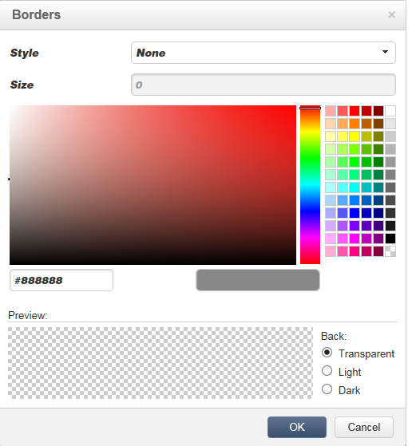

# Inhoud bewerken{#editing-content}

## Een zichtbaarheidsvoorwaarde definiëren {#defining-a-visibility-condition}

U kunt een zichtbaarheidsvoorwaarde opgeven voor een webpagina-element: dit element is alleen zichtbaar als aan de voorwaarde wordt voldaan .

Als u een zichtbaarheidsvoorwaarde wilt toevoegen, selecteert u een blok en voert u de voorwaarde in het **[!UICONTROL Visibility condition]** veld in met de expressie-editor.


>[!NOTE]
>
>Geavanceerde bewerkingen van expressies worden weergegeven op [deze pagina](../../platform/using/defining-filter-conditions.md#list-of-functions).


Deze voorwaarden passen de syntaxis van de XTK-expressie toe (bijvoorbeeld **ctx.receiver).@email!= &quot;&quot;** of **ctx.receiver.@status==&quot;0&quot;**). Standaard zijn alle velden zichtbaar.

>[!NOTE]
>
>Niet-zichtbare dynamische blokken, zoals vervolgkeuzemenu&#39;s, kunnen niet worden bewerkt.

## Rand en achtergrond toevoegen {#adding-a-border-and-background}

U kunt een **rand** aan een geselecteerd blok toevoegen. De randen worden gedefinieerd met behulp van drie opties: stijl, grootte en kleur.



U kunt ook een **achtergrondkleur** definiëren door een kleur te selecteren in het kleurdiagram.


## Formulieren bewerken {#editing-forms}

### De gegevenseigenschappen van een formulier wijzigen {#changing-the-data-properties-for-a-form}

U kunt databasevelden koppelen aan invoerzone, keuzerondje of keuzelijstblokken.


>[!NOTE]
>
>De standaardgebieden zijn die in het schema van de de toepassingsopslag van het Web.

Met de invoerzone **voor velden** kunt u een databaseveld selecteren dat u wilt koppelen aan het formulierveld.

Standaard worden velden aangeboden in de tabel **nms:ontvanger** .


Met de optie **Vereist veld** kunt u de goedkeuring van de pagina alleen autoriseren als de gebruiker het veld heeft ingevuld. Als een vereist veld niet is ingevuld, wordt een foutbericht weergegeven.

Voor keuzerondjes en selectievakjes is **aanvullende configuratie vereist**.

Als de gebruikte sjabloon standaard geen waarde bevat, moet u deze in de editor voltooien.

Dit doet u als volgt:

* Klik op het **[!UICONTROL Edit]** pictogram.

   

* Voer de opgegeven lijstwaarde (gedefinieerd door het geselecteerde veld) in het **[!UICONTROL Value]** veld in.

   

### Formuliervelden wijzigen {#modifying-form-fields}

Formuliervelden zoals keuzerondjes, invoerzones, vervolgkeuzelijsten, enz. kan worden gewijzigd op basis van de werkbalken.

Dit betekent dat u:

* Verwijder het blok met de formuliervelden met het **[!UICONTROL Delete]** pictogram.
* Dupliceer het geselecteerde veld door een nieuw blok te maken met het **[!UICONTROL Duplicate]** pictogram.
* Bewerk het **[!UICONTROL Form data]** venster om een databaseveld aan de formulierzone te koppelen met behulp van het **[!UICONTROL Edit]** pictogram.

   

## Een handeling aan een knop toevoegen {#adding-an-action-to-a-button}

Wanneer de gebruiker op een knop klikt, kunt u een bijbehorende actie definiëren. Selecteer hiertoe de uit te voeren actie in de vervolgkeuzelijst.


De beschikbare acties zijn als volgt:

* **[!UICONTROL Refresh]** : Hiermee vernieuwt u de huidige pagina.
* **[!UICONTROL Next page]** : leidt tot een verbinding aan de volgende pagina in de toepassing van het Web.
* **[!UICONTROL Previous page]** : maakt een koppeling naar de vorige pagina in de webtoepassing.

>[!NOTE]
>
>Met de **[!UICONTROL None]** waarde kunt u de knop niet activeren.

U kunt het label dat aan de knop is gekoppeld, wijzigen in het desbetreffende veld.

## Een koppeling toevoegen {#adding-a-link}

U kunt een koppeling invoegen in elk pagina-element: afbeelding, woord, groep woorden, tekstblok, enz.

Selecteer hiertoe het element en gebruik vervolgens het eerste pictogram in het pop-upmenu.


Met dit pictogram hebt u toegang tot alle beschikbare typen koppelingen.


U kunt alleen aanpassingsblokken en velden invoegen in tekstblokken.

>[!NOTE]
>
>Voor elk type verbinding, kunt u de openingswijze vormen: Selecteer het doelvenster in de vervolgkeuzelijst **Doel** . Deze waarde komt overeen met de **`<target>`** HTML-tag.
>
>De lijst van beschikbare **streefcijfers** is als volgt:
>
>* Overige (IFrame)
>* Bovenste venster (_boven)
>* Bovenliggend venster (_bovenliggend)
>* Nieuw venster (_leeg)
>* Huidig venster (_zelf)
>* Standaardbrowsergedrag
>


### Koppeling maken naar een URL {#link-to-a-url}

Met de optie **Koppelen naar een externe URL** kunt u elke URL vanuit de broninhoud openen.


Voer het koppelingsadres in kwestie in het veld **URL** . Het veld URL moet worden ingevoerd als: **https://www.myURL.com**.

### Koppelen naar een webtoepassing {#link-to-a-web-application}

Met de optie **Koppelen naar een webtoepassing** hebt u toegang tot een Adobe Campagne Web-toepassing.


Selecteer de toepassing van het Web van het overeenkomstige gebied.

De lijst van voorgestelde toepassingen van het Web beantwoordt aan de beschikbare toepassingen in de **[!UICONTROL Resources > Online > Web Applications]** knoop.

### Koppeling maken naar een handeling {#link-to-an-action}

Met de **koppeling die een handelingsoptie** definieert, kunt u een handeling configureren wanneer u op een bronelement klikt.


>[!NOTE]
>
>De beschikbare handelingen worden beschreven in de sectie Een handeling [toevoegen aan een knop](#adding-an-action-to-a-button) .

### Een koppeling verwijderen {#delete-a-link}

Wanneer een koppeling is ingevoegd, bevat de werkbalk twee nieuwe pictogrammen: Koppeling **** bewerken en de koppeling **** verbreken zodat u kunt communiceren met de gemaakte koppeling.

* **[!UICONTROL Edit link]** Hiermee kunt u een venster weergeven met alle parameters van de koppeling.
* **[!UICONTROL Break the link]** Hiermee kunt u na bevestiging de koppeling en alle bijbehorende parameters verwijderen.

>[!NOTE]
>
>Als de koppeling wordt verwijderd, blijft de inhoud behouden.

## Lettertypekenmerken wijzigen {#changing-font-attributes}

Wanneer u een tekstelement selecteert, kunt u lettertypekenmerken (stijl, opmaak) wijzigen.


De beschikbare opties zijn als volgt:

* **Pictogram font** vergroten: Hiermee vergroot u de grootte van de geselecteerde tekst (toevoegen `<span style="font size:">`)
* **Pictogram font** verkleinen: Hiermee verkleint u de grootte van de geselecteerde tekst (toevoegen `<span style="font size:">`)
* **Vet** pictogram: Hiermee maakt u geselecteerde tekst vet (tekstomloop met het `<strong> </strong>` label)
* **Cursief** pictogram: Hiermee maakt u geselecteerde tekst cursief (tekstomloop met `<em> </em>` label)
* **Onderstrepingspictogram** : maakt geselecteerde tekst onderstreept (laat tekst omlopen met het `<span style="text-decoration: underline;">` label)
* **Pictogram links** uitlijnen: Hiermee lijnt u tekst links van het geselecteerde blok uit (add style=&quot;text-align: left;&quot;)
* **Pictogram Midden** : centreert de tekst voor het geselecteerde blok (voeg style=&quot;text-align toe: middelpunt;&quot;)
* **Pictogram rechts** uitlijnen: Hiermee lijnt u tekst rechts van het geselecteerde blok uit (add style=&quot;text-align: right;&quot;)
* **Wijzig het pictogram achtergrondkleur** : Hiermee kunt u de achtergrondkleur van het geselecteerde blok wijzigen (stijl=&quot;background-color: rgba(170, 86, 255, 0,87)
* **Kleurpictogram** tekst wijzigen: Hiermee kunt u de tekstkleur van het geselecteerde blok of alleen de geselecteerde tekst wijzigen (`<span style="color: #CODE">`)

>[!NOTE]
>
>* **Pictogram Verwijderen** : Hiermee verwijdert u het blok en alle inhoud ervan.
   >
   >
* **Pictogram Dupliceren** : dupliceert het blok evenals alle stijlen met betrekking tot het blok.


## Afbeeldingen en animaties beheren {#managing-images-and-animations}

Met de Editor voor digitale inhoud kunt u werken aan **elk type afbeelding** dat compatibel is met browsers.

Voor compatibiliteit met de DCE moeten animaties **van het type** &quot;Flash&quot; op de volgende manier in een HTML-pagina worden ingevoegd:

```
<object type="application/x-shockwave-flash" data="https://www.mydomain.com/flash/your_animation.swf" width="200" height="400">
 <param name="movie" value="https://www.mydomain.com/flash/your_animation.swf" />
 <param name="quality" value="high" />
 <param name="play" value="true"/>
 <param name="loop" value="true"/> 
</object>
```

>[!CAUTION]
>
>Externe bestanden in een **scripttag** van de HTML-pagina mogen niet worden aangeroepen. Deze bestanden worden niet geïmporteerd op de Adobe Campagne-server.

### Een afbeelding toevoegen, verwijderen of dupliceren {#adding---deleting---duplicating-an-image}

Als u een afbeelding wilt invoegen, selecteert u een blok met afbeeldingstypen en klikt u op het pictogram **Afbeelding** .


Selecteer een afbeeldingsbestand dat lokaal is opgeslagen.


Met het pictogram **Verwijderen** verwijdert u de  tag met de afbeelding.

Met het pictogram **Dupliceren** dupliceert u de  tag en de inhoud ervan.

>[!CAUTION]
>
>Wanneer u een afbeelding dupliceert, worden de id&#39;s voor de nieuwe afbeelding verwijderd.

### Afbeeldingseigenschappen bewerken {#editing-image-properties}

Wanneer u een blok selecteert dat een afbeelding bevat, hebt u toegang tot de volgende eigenschappen:

* **Met Bijschrift** kunt u het bijschrift definiëren dat is gekoppeld aan de afbeelding (komt overeen met het **alt** -kenmerk HTML).
* **Met Afmetingen** kunt u de afbeeldingsgrootte opgeven, in pixels.

   

## Aanpassingsinhoud toevoegen {#adding-personalization-content}

### Een aanpassingsveld invoegen {#inserting-a-personalization-field}

Met de optie voor het veld **Aanpassing aan** persoonlijke voorkeur voor het invoegpictogram kunt u een databaseveld toevoegen aan de inhoud, zoals de naam van de ontvanger. Deze optie is alleen beschikbaar voor tekstblokken.


De velden die u aanbiedt, komen standaard uit de **[!UICONTROL Recipient]** tabel. Indien nodig, geef de de toepassingseigenschappen van het Web uit om een andere lijst te selecteren.

De veldnaam wordt in de editor weergegeven en geel gemarkeerd. Deze wordt vervangen door het profiel van de beoogde ontvanger wanneer de personalisatie wordt gegenereerd (bijvoorbeeld wanneer een voorvertoning van een landingspagina wordt weergegeven).

Een voorbeeld wordt voorgesteld in het [Invoegen van een het verpersoonlijkingsgebied](../../web/using/creating-a-landing-page.md#inserting-a-personalization-field) sectie.

### Een aanpassingsblok invoegen {#inserting-a-personalization-block}

Met de optie **Personalisatieblok** kunt u dynamische en gepersonaliseerde blokken in de inhoud invoegen. U kunt bijvoorbeeld een logo of een begroetingsbericht toevoegen. Deze optie is niet beschikbaar voor tekstblokken.


Zodra opgenomen, verschijnt de naam van het verpersoonlijkingsblok in de redacteur, die in geel wordt benadrukt. Het wordt automatisch aangepast aan het ontvankelijke profiel wanneer de verpersoonlijking wordt geproduceerd.

Voor meer op ingebouwde verpersoonlijkingsblokken en hoe te om de blokken van de douaneverpersoonlijking te bepalen, verwijs naar [deze pagina](../../delivery/using/personalization-blocks.md).
