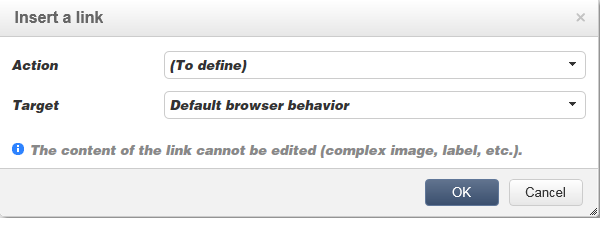

# Content bewerken{#editing-content}

## Een zichtbaarheidsvoorwaarde definiëren {#defining-a-visibility-condition}

U kunt een zichtbaarheidsvoorwaarde opgeven op een webpagina-element: dit element is alleen zichtbaar als aan de voorwaarde wordt voldaan.

Als u een zichtbaarheidsvoorwaarde wilt toevoegen, selecteert u een blok en voert u de voorwaarde in het veld **[!UICONTROL Visibility condition]** in met de expressie-editor.

>[!NOTE]
>
>Geavanceerde uitdrukking het uitgeven wordt voorgesteld op [ deze pagina ](../../platform/using/adobe-campaign-workspace.md#about-queries-in-campaign).

Deze voorwaarden nemen de XTK uitdrukkingssyntaxis (bijvoorbeeld **ctx.receiver over.@email!= &quot;&quot;** of **ctx.receiving.@status= &quot;0&quot;**). Standaard zijn alle velden zichtbaar.

>[!NOTE]
>
>Niet-zichtbare dynamische blokken, zoals vervolgkeuzemenu&#39;s, kunnen niet worden bewerkt.

## Rand en achtergrond toevoegen {#adding-a-border-and-background}

U kunt a **grens** aan een geselecteerd blok toevoegen. De randen worden gedefinieerd met behulp van drie opties: stijl, grootte en kleur.

U kunt a **achtergrondkleur** ook bepalen door een kleur van de kleurengrafiek te selecteren.

## Formulieren bewerken {#editing-forms}

### De gegevenseigenschappen van een formulier wijzigen {#changing-the-data-properties-for-a-form}

U kunt databasevelden koppelen aan invoerzone, keuzerondje of keuzelijstblokken.

>[!NOTE]
>
>De standaardgebieden zijn die in het schema van de de toepassingsopslag van het Web.

De **gebied** inputstreek laat u een gegevensbestandgebied selecteren om met het vormgebied te verbinden.

Door gebrek, zijn de aangeboden gebieden die in de **nms:recipient** lijst.

De **Vereiste gebied** optie laat u de goedkeuring van de pagina slechts machtigen als de gebruiker het gebied heeft ingevuld. Als een vereist veld niet is ingevuld, wordt een foutbericht weergegeven.

Voor radioknopen en checkboxes, **extra configuratie wordt vereist**.

Als de gebruikte sjabloon standaard geen waarde bevat, moet u deze in de editor voltooien.

Dit doet u als volgt:

* Klik op het pictogram **[!UICONTROL Edit]** .

  

* Voer de opgegeven lijstwaarde (gedefinieerd door het geselecteerde veld) in het veld **[!UICONTROL Value]** in.

  

### Formuliervelden wijzigen {#modifying-form-fields}

Formuliervelden zoals keuzerondjes, invoerzones, vervolgkeuzelijsten, enz. kan worden gewijzigd op basis van de werkbalken.

Dit betekent dat u:

* Verwijder het blok met de formuliervelden met het pictogram **[!UICONTROL Delete]** .
* Dupliceer het geselecteerde veld door een nieuw blok te maken met het pictogram **[!UICONTROL Duplicate]** .
* Bewerk het venster **[!UICONTROL Form data]** om een databaseveld te koppelen aan de formulierzone met behulp van het pictogram **[!UICONTROL Edit]** .

  

## Een handeling aan een knop toevoegen {#adding-an-action-to-a-button}

Wanneer de gebruiker op een knop klikt, kunt u een bijbehorende actie definiëren. Selecteer hiertoe de uit te voeren actie in de vervolgkeuzelijst.

De beschikbare acties zijn als volgt:

* **[!UICONTROL Refresh]** : vernieuwt de huidige pagina.
* **[!UICONTROL Next page]** : maakt een koppeling naar de volgende pagina in de webtoepassing.
* **[!UICONTROL Previous page]** : maakt een koppeling naar de vorige pagina in de webtoepassing.

>[!NOTE]
>
>Met de waarde **[!UICONTROL None]** kunt u de knop niet activeren.

U kunt het label dat aan de knop is gekoppeld, wijzigen in het desbetreffende veld.

## Een koppeling toevoegen {#adding-a-link}

U kunt een koppeling invoegen in elk pagina-element: afbeelding, woord, groep woorden, tekstblok, enzovoort.

Selecteer hiertoe het element en gebruik vervolgens het eerste pictogram in het pop-upmenu.

Met dit pictogram hebt u toegang tot alle beschikbare typen koppelingen.

U kunt alleen aanpassingsblokken en velden invoegen in tekstblokken.

>[!NOTE]
>
>Voor elk type van verbinding, kunt u de openingswijze vormen: selecteer het doelvenster in de **drop-down lijst van het Doel**. Deze waarde komt overeen met de HTML-tag **`<target>`** .
>
>De lijst van beschikbare **doelstellingen** is als volgt:
>
>* Overige (IFrame)
>* Bovenste venster (_boven)
>* Bovenliggend venster (_bovenliggend)
>* Nieuw venster (_leeg)
>* Huidig venster (_zelf)
>* Standaardbrowsergedrag
>

### Koppeling maken naar een URL {#link-to-a-url}

De **Verbinding aan een externe URL** optie laat u om het even welke URL van de broninhoud openen.

Ga het verbindingsadres in kwestie in het **URL** gebied. Het gebied URL zou als moeten zijn ingegaan: **https://www.myURL.com**.

### Koppelen naar een webtoepassing {#link-to-a-web-application}

De **Verbinding aan een toepassing van het Web** optie laat u tot een toepassing van het Web van Adobe Campaign toegang hebben.

Selecteer de toepassing van het Web van het overeenkomstige gebied.

De lijst met voorgestelde webtoepassingen komt overeen met de beschikbare toepassingen in het knooppunt **[!UICONTROL Resources > Online > Web Applications]** .

### Koppeling maken naar een handeling {#link-to-an-action}

De **Verbinding die een actie** optie bepaalt laat u een actie vormen wanneer het klikken van een bronelement.

>[!NOTE]
>
>De beschikbare acties worden gedetailleerd in [ Toevoegend een actie aan een knoop ](#adding-an-action-to-a-button) sectie.

### Een koppeling verwijderen {#delete-a-link}

Wanneer een verbinding is opgenomen, biedt de hulpmiddelbar twee nieuwe pictogrammen aan: **geef verbinding** uit en **breek de verbinding** die u met de gemaakte verbinding laat in wisselwerking staan.

* Met **[!UICONTROL Edit link]** kunt u een venster weergeven met alle parameters van de koppeling.
* Met **[!UICONTROL Break the link]** kunt u na bevestiging de koppeling en alle bijbehorende parameters verwijderen.

>[!NOTE]
>
>Als de koppeling wordt verwijderd, blijft de inhoud behouden.

## Lettertypekenmerken wijzigen {#changing-font-attributes}

Wanneer u een tekstelement selecteert, kunt u lettertypekenmerken (stijl, opmaak) wijzigen.

De beschikbare opties zijn als volgt:

* **vergroot doopvont** pictogram: vergroot de grootte van de geselecteerde tekst (voeg toe ``)
* **vermindert doopvont** pictogram: vermindert de grootte van de geselecteerde tekst (voeg toe ``)
* **Vet** pictogram: maakt geselecteerde tekst gewaagd (omlooptekst met de `<strong> </strong>` markering)
* **Cursief** pictogram: maakt geselecteerde tekst cursief (omlooptekst met de `<em> </em>` markering)
* **onderstreepte** pictogram: maakt geselecteerde tekst onderstreept (omlooptekst met de `` markering)
* **richt links** pictogram: richt tekst links van het geselecteerde blok (voeg style=&quot;text-align: verlaten;&quot; toe)
* **Centrum** pictogram: centreert de tekst voor het geselecteerde blok (voeg style= &quot;text-align: centrum;&quot; toe)
* **richt rechts** pictogram uit: richt tekst rechts van het geselecteerde blok (voeg style=&quot;text-align: juist;&quot; toe)
* **verander de achtergrondkleur** pictogram: laat u de achtergrondkleur voor het geselecteerde blok veranderen (voeg style=&quot;background-color toe: rgba(170, 86, 255, 0.87))
* **de tekstkleur van de Verandering** pictogram: laat u de tekstkleur van het geselecteerde blok of enkel de geselecteerde tekst (``) veranderen

>[!NOTE]
>
>* **Schrapping** pictogram: schrapt het blok en al zijn inhoud.
>
>* **dupliceer** pictogram: dupliceert het blok evenals alle stijlen met betrekking tot het blok.

## Afbeeldingen en animaties beheren {#managing-images-and-animations}

De Digitale Redacteur van de Inhoud laat u op **werken om het even welk type van beeld** compatibel met browsers.

>[!CAUTION]
>
>U moet geen externe dossiers in a **manuscript** markering van de pagina van HTML roepen. Deze bestanden worden niet geïmporteerd op de Adobe Campaign-server.

### Een afbeelding toevoegen, verwijderen of dupliceren {#adding---deleting---duplicating-an-image}

Om een beeld op te nemen, selecteer een het type van Beeld blok en klik het **pictogram van het Beeld**.

Selecteer een lokaal opgeslagen afbeeldingsbestand.

Het **pictogram van de Schrapping** schrapt de markering die het beeld bevat.

Het **dupliceert** pictogram dupliceert de markering en zijn inhoud.

>[!CAUTION]
>
>Wanneer u een afbeelding dupliceert, worden de id&#39;s voor de nieuwe afbeelding verwijderd.

### Afbeeldingseigenschappen bewerken {#editing-image-properties}

Wanneer u een blok selecteert dat een afbeelding bevat, hebt u toegang tot de volgende eigenschappen:

* **Titel** laat u de titel bepalen verbonden aan het beeld (beantwoordt aan het **alt** attribuut van HTML).
* **Afmetingen** laat u de beeldgrootte, in pixel specificeren.

  

## Aanpassingsinhoud toevoegen {#adding-personalization-content}

### Een aanpassingsveld invoegen {#inserting-a-personalization-field}

De **het gebied van Personalization** optie voor het tussenvoegselpictogram laat u een gegevensbestandgebied in de inhoud, zoals de naam van de ontvanger toevoegen. Deze optie is alleen beschikbaar voor tekstblokken.

Standaard komen de velden uit de tabel **[!UICONTROL Recipient]** . Indien nodig, geef de de toepassingseigenschappen van het Web uit om een andere lijst te selecteren.

De veldnaam wordt in de editor weergegeven en geel gemarkeerd. Deze wordt vervangen door het profiel van de beoogde ontvanger wanneer de personalisatie wordt gegenereerd (bijvoorbeeld wanneer een voorvertoning van een landingspagina wordt weergegeven).

Een voorbeeld wordt voorgesteld in het [ Tussenvoegend een verpersoonlijkingsgebied ](creating-a-landing-page.md#inserting-a-personalization-field) sectie.

### Een aanpassingsblok invoegen {#inserting-a-personalization-block}

De **het blok van Personalization** optie laat u dynamische en gepersonaliseerde blokken in de inhoud opnemen. U kunt bijvoorbeeld een logo of een begroetingsbericht toevoegen. Deze optie is niet beschikbaar voor tekstblokken.

Zodra opgenomen, verschijnt de naam van het verpersoonlijkingsblok in de redacteur, die in geel wordt benadrukt. Het wordt automatisch aangepast aan het ontvankelijke profiel wanneer de verpersoonlijking wordt geproduceerd.

Voor meer op ingebouwde verpersoonlijkingsblokken en hoe te om de blokken van de douaneverpersoonlijking te bepalen, verwijs naar de [ Campagne v8 documentatie ](https://experienceleague.adobe.com/docs/campaign/campaign-v8/send/personalize/personalization-blocks.html){target="_blank"}.
