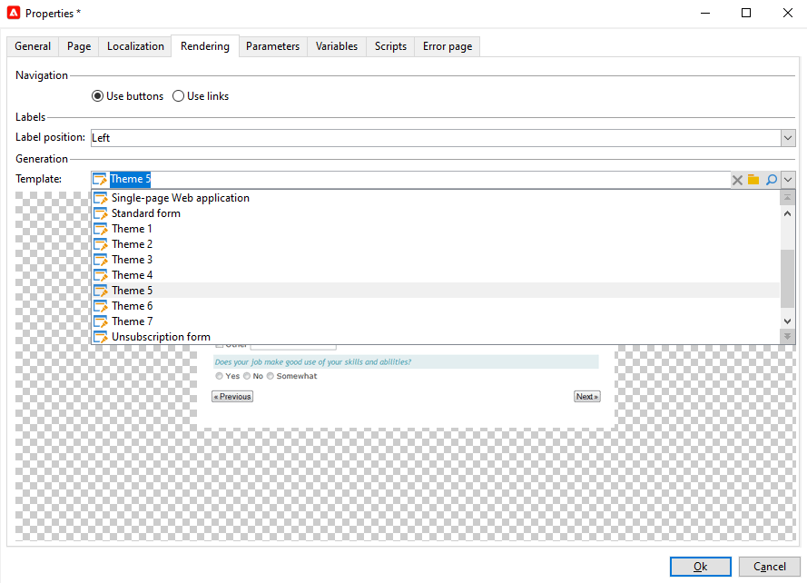

# Formulierweergave{#form-rendering}

## De renderingsjabloon van het formulier selecteren {#selecting-the-form-rendering-template}

Met de formulierinstellingen kunt u de sjabloon selecteren waarmee de pagina&#39;s worden gegenereerd. Klik op de knop **[!UICONTROL Settings]** op de werkbalk met formulierdetails en selecteer het tabblad **[!UICONTROL Rendering]** om deze weer te geven. Er is standaard een aantal sjablonen (stijlpagina&#39;s) beschikbaar.

In het onderste gedeelte van de editor kunt u een rendering van de geselecteerde sjabloon weergeven.

Met de functie Zoomen kunt u de geselecteerde sjabloon bewerken.

U kunt deze sjablonen wijzigen of overschrijven. Klik hiertoe op de koppeling **[!UICONTROL Page layout...]** en pas de informatie aan.

U kunt:

* Wijzig de afbeelding die als logo wordt gebruikt en pas de grootte ervan aan.
* Geef ook het pad op voor toegang tot de voorvertoning wanneer gebruikers deze renderingsjabloon selecteren.

Met het tabblad **[!UICONTROL Headers/Footers]** kunt u de informatie in de kop- en voetteksten van elke formulierpagina wijzigen met deze sjabloon.

Elke regel van de sectie **[!UICONTROL Page headers]** en **[!UICONTROL Page footers]** komt overeen met een regel in de HTML-pagina. Klik **[!UICONTROL Add]** om een nieuwe lijn tot stand te brengen.

Selecteer een bestaande regel en klik op de knop **[!UICONTROL Detail]** om deze aan te passen.

U kunt de inhoud van de regel wijzigen, randen toevoegen en de lettertypekenmerken wijzigen via de desbetreffende tabbladen. Klik **[!UICONTROL OK]** om deze veranderingen te bevestigen.

Met de velden **[!UICONTROL Position]** kunt u de positie van elementen in de paginakop en -voettekst definiëren.

>[!NOTE]
>
>Rendersjablonen worden opgeslagen in het knooppunt **[!UICONTROL Administration > Configuration > Form rendering]**.\
>Raadpleeg [Formulierweergave aanpassen](#customizing-form-rendering) voor meer informatie

## Rendering van formulier {#customizing-form-rendering} aanpassen

### De layout van elementen wijzigen {#changing-the-layout-of-elements}

U kunt de stijlpagina voor elk element van het formulier (invoervelden, afbeeldingen, keuzerondjes, enz.) overladen.

Hiervoor gebruikt u het tabblad **[!UICONTROL Advanced]**.

Hiermee kunt u de volgende eigenschappen definiëren:

* **[!UICONTROL Label position]**: zie  [De positie van labels](../../web/using/defining-web-forms-layout.md#defining-the-position-of-labels) definiëren.
* **[!UICONTROL Label format]**: Tekstomloop of Geen tekstomloop
* **[!UICONTROL Number of cells]** : zie De velden  [op de pagina](../../web/using/defining-web-forms-layout.md#positioning-the-fields-on-the-page) positioneren.
* **[!UICONTROL Horizontal alignment]** (Links, Rechts, Gecentreerd) en  **[!UICONTROL Vertical alignment]** (Hoog, Laag, Midden),
* **[!UICONTROL Width]** van het gebied: dit kan worden uitgedrukt als een percentage of in ems, punten of pixels (standaardwaarde);
* Maximum **[!UICONTROL Length]**: Maximum aantal tekens toegestaan (voor besturingselementen voor tekst, aantal en wachtwoordtype),
* **[!UICONTROL Lines]**: aantal regels voor een  **[!UICONTROL Multi-line text]** tekstzone;
* **[!UICONTROL Style inline]**: kunt u de CSS-stijlpagina overladen met extra instellingen. Deze worden gescheiden door middel van **;** tekens, zoals in het onderstaande voorbeeld wordt getoond:

   

### Kop- en voetteksten {#defining-headers-and-footers} definiëren

Velden worden gerangschikt in een boomstructuur waarvan het basisniveau dezelfde naam heeft als de pagina. Selecteer het om de naam te wijzigen.

De titel van het venster moet worden ingevoerd op het tabblad **[!UICONTROL Page]** van het venster met formuliereigenschappen. U kunt ook een setinhoud toevoegen aan de kop- en voettekst van de pagina (deze informatie wordt op elke pagina weergegeven). Deze inhoud wordt ingevoerd in de overeenkomstige secties van het **[!UICONTROL Texts]** lusje, zoals hieronder getoond:

### Elementen toevoegen aan HTML-koptekst {#adding-elements-to-html-header}

U kunt aanvullende elementen invoeren die in de HTML-koptekst van een formulierpagina moeten worden ingevoegd. Om dit te doen, ga de elementen op **[!UICONTROL Header]** lusje van de relevante pagina in.

Zo kunt u verwijzen naar een pictogram dat bijvoorbeeld op de titelbalk van de pagina wordt weergegeven.

## Besturingsinstellingen {#defining-control-settings} definiëren

Wanneer de gebruiker het formulier invult, wordt automatisch een controle uitgevoerd op bepaalde velden, afhankelijk van de indeling of configuratie. Hiermee kunt u bepaalde velden verplicht maken (zie [Verplichte velden definiëren](#defining-mandatory-fields)) of de indeling van de ingevoerde gegevens controleren (zie [Gegevensindeling controleren](#checking-data-format)). Controles worden uitgevoerd tijdens paginaconclusie (door een verbinding of een knoop te klikken die een outputovergang toelaat).

### Verplichte velden {#defining-mandatory-fields} definiëren

Als u bepaalde velden verplicht wilt maken, selecteert u deze optie bij het maken van het veld.

Als de gebruiker deze pagina goedkeurt zonder het veld in te voeren, wordt het volgende bericht weergegeven:

U kunt dit bericht personaliseren door de **[!UICONTROL Personalize this message]** verbinding te klikken.

Als de gebruiker deze pagina goedkeurt zonder het veld in te voeren, wordt het volgende bericht weergegeven:

### Gegevensindeling {#checking-data-format} controleren

Voor formuliercontroles waarvan de waarden zijn opgeslagen in een bestaand veld van de database, worden de regels voor het opslagveld toegepast.

Voor formuliercontroles waarvan de waarden in een variabele worden opgeslagen, zijn de goedkeuringsregels afhankelijk van de indeling van de variabele.

Als u bijvoorbeeld een **[!UICONTROL Number]** controle maakt om het clientnummer op te slaan, zoals hieronder wordt getoond:

De gebruiker moet een geheel getal in het formulierveld invoeren.

## Voorwaardelijke weergave van velden definiëren {#defining-fields-conditional-display}

U kunt de weergave van velden op de pagina configureren die moeten worden weergegeven op basis van de waarden die de gebruiker heeft gekozen. Dit kan op één gebied of een groep gebieden van toepassing zijn (wanneer zij in een container worden gegroepeerd).

Voor elk element van de pagina kunt u met de sectie **[!UICONTROL Visibility]** de weergavevoorwaarden definiëren.

Voorwaarden kunnen betrekking hebben op de waarde van databasevelden of -variabelen.

In het venster van de gebiedsselectie, kunt u van de volgende gegevens kiezen:

* De hoofdstructuur bevat de parameters van de formuliercontext. De standaardparameters zijn de id (die overeenkomt met de gecodeerde id van de ontvanger), de taal en de oorsprong.

   Raadpleeg [deze pagina](../../web/using/defining-web-forms-properties.md#form-url-parameters) voor meer informatie.

* De substructuur **[!UICONTROL Recipients]** bevat de invoervelden die in het formulier zijn ingevoegd en in de database zijn opgeslagen.

   Raadpleeg [Gegevens opslaan in de database](../../web/using/web-forms-answers.md#storing-data-in-the-database) voor meer informatie.

* De substructuur **[!UICONTROL Variables]** bevat de beschikbare variabelen voor dit formulier. Raadpleeg [Gegevens opslaan in een lokale variabele](../../web/using/web-forms-answers.md#storing-data-in-a-local-variable) voor meer informatie.

Raadpleeg de volgende gebruiksscenario&#39;s voor meer informatie: [Verschillende opties weergeven, afhankelijk van de geselecteerde waarden](../../web/using/use-cases--web-forms.md#displaying-different-options-depending-on-the-selected-values).

U kunt ook de weergave van formulierpagina&#39;s bepalen met behulp van het object **[!UICONTROL Test]**. Raadpleeg [deze pagina](../../web/using/defining-web-forms-page-sequencing.md#conditional-page-display) voor meer informatie.

## Elementen importeren uit een bestaand formulier {#importing-elements-from-an-existing-form}

Het is mogelijk om gebieden of containers van andere vormen van het Web in te voeren. Hiermee kunt u een bibliotheek maken met herbruikbare blokken die in formulieren worden ingevoegd, zoals het adresblok, het abonnementsgebied voor nieuwsbrieven, enzovoort.

Als u een element in een formulier wilt importeren, voert u de volgende stappen uit:

1. Bewerk de pagina waarin u een of meer elementen wilt invoegen en klik op **[!UICONTROL Import an existing block]** op de werkbalk.

   

1. Selecteer het webformulier met de velden die u wilt importeren en kies de containers en velden die u wilt importeren.

   

   >[!NOTE]
   >
   >Met het pictogram **[!UICONTROL Edit link]** rechts van de naam van het bronformulier kunt u het geselecteerde webformulier weergeven.

1. Klik **[!UICONTROL Ok]** om de invoeging te bevestigen.

   

