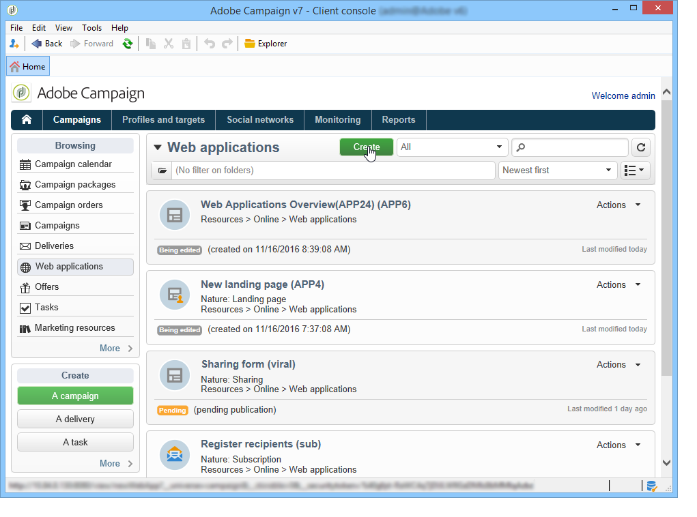

# Aan de slag met enquêtes{#getting-started-with-surveys}

Hier volgt een snel overzicht van de belangrijkste stappen om een eenvoudig onderzoek tot stand te brengen, gebruikend het volgende malplaatje:

Deze stappen zijn:

1. [Stap 1 - Een enquête](#step-1---creating-a-survey)maken,
1. [Stap 2 - De sjabloon](#step-2---selecting-the-template)selecteren
1. [Stap 3 - Opbouw van de enquête](#step-3---building-the-survey),
1. [Stap 4 - De pagina-inhoud](#step-4---creating-the-page-content)maken,
1. [Stap 5 - Opslag van de enquêtegegevens](#step-5---storing-the-survey-data-),
1. [Stap 6 - De pagina&#39;s](#step-6---publishing-the-pages)publiceren,
1. [Stap 7 - Uw online enquête](#step-7---sharing-your-online-survey)delen.

## Stap 1 - Een enquête maken {#step-1---creating-a-survey}

Als u een nieuwe enquête wilt maken, gaat u naar het **[!UICONTROL Campaigns]** tabblad of **[!UICONTROL Profiles and targets]** klikt u op het **[!UICONTROL Web Applications]** menu. Klik op de **[!UICONTROL Create]** knop boven de lijst met formulieren.

## Stap 2 - De sjabloon selecteren {#step-2---selecting-the-template}

Selecteer een enquêtemalplaatje, dan geef het onderzoek een naam. Deze naam is niet zichtbaar voor eindgebruikers, maar de enquête kan wel worden geïdentificeerd in Adobe Campaign. Klik **[!UICONTROL Save]** om het onderzoek aan de lijst van de toepassingen van het Web toe te voegen.

## Stap 3 - Opbouw van de enquête {#step-3---building-the-survey}

De onderzoeken worden gebouwd in een diagram waar de volgende elementen worden geplaatst: de pagina(&#39;s) waar de inhoud wordt gemaakt, de stappen voor het vooraf laden en opslaan van gegevens en de testfasen. Scripts en query&#39;s kunnen ook worden ingevoegd.

Klik op de **[!UICONTROL Edit]** vorm van de enquête om de grafiek te maken.

Een enquête moet ten **minste** de volgende drie onderdelen bevatten: een pagina, een opslagvak en een eindpagina.

* Als u een pagina wilt maken, selecteert u het **[!UICONTROL Page]** object in het linkergedeelte van de editor en plaatst u het object in het middelste gedeelte, zoals hieronder wordt getoond:

   

* Selecteer vervolgens het **[!UICONTROL Storage]** object en plaats het op de uitvoerovergang van de pagina.
* Tot slot selecteer het **[!UICONTROL End]** voorwerp en plaats het op het eind van de outputovergang van de opslagdoos om het volgende diagram te verkrijgen:

   

## Stap 4 - De pagina-inhoud maken {#step-4---creating-the-page-content}

In het volgende voorbeeld gebruiken we een **[!UICONTROL Page (v5 compatibility)]** typepagina. Dit type pagina is toegankelijk via het geavanceerde menu van het **[!UICONTROL Edit]** tabblad.

* Invoervelden toevoegen

   Als u de inhoud van de pagina wilt maken, moet u deze bewerken: Dubbelklik op het **[!UICONTROL Page]** object om dit te doen. Klik op het eerste pictogram op de werkbalk om de wizard voor het maken van velden te openen. Als u een invoerveld wilt maken waarin de gebruikersnaam wordt opgeslagen in het overeenkomende veld van het profiel van de ontvanger, selecteert u **[!UICONTROL Edit a recipient]**.

   

   Klik op de **[!UICONTROL Next]** knop om het veld voor gegevensopslag in de database te selecteren. In dit geval het veld Achternaam.

   

   Klik **[!UICONTROL Finish]** om het maken van velden te bevestigen.

   Wanneer de informatie wordt opgeslagen in een veld dat al in de database bestaat, neemt het veld standaard de naam van het geselecteerde veld over, d.w.z. &#39;Achternaam&#39; in dit voorbeeld. U kunt dit label wijzigen zoals hieronder wordt getoond:

   

   Maak nu een invoerveld voor het gebruikersaccountnummer. Herhaal de bewerking en selecteer Account No. veld.

   Pas dezelfde procedure toe om een veld toe te voegen waarin de gebruiker een e-mailadres kan invoeren.

* Als u een vraag wilt maken, klikt u met de rechtermuisknop op het laatste element in de structuur en selecteert u **[!UICONTROL Containers > Question]** of klikt u op het **[!UICONTROL Containers]** pictogram en selecteert u **[!UICONTROL Question]**.

   

   Voer het label van de vraag in en voeg het (de) antwoordveld(en) in als een subvertakking van de vraag. Hiervoor moet het knooppunt dat aan de vraag is gekoppeld, zijn geselecteerd wanneer u het antwoordveld maakt. Voeg een pictogram toe **[!UICONTROL drop-down listx]** met behulp van het **[!UICONTROL Selection controls]** pictogram of door met de rechtermuisknop te klikken, zoals hieronder wordt getoond:

   

   Selecteer een opslagruimte: Selecteer een opsommingsveld om de waarden automatisch op te halen (in dit geval de e-mailindeling).

   

   Klik op het **[!UICONTROL General]** tabblad op de **[!UICONTROL Initialize the list of values from the database]** koppeling: de waardetabel wordt automatisch ingevoerd.

   

   Klik **[!UICONTROL OK]** om de redacteur te sluiten, en veranderingen **[!UICONTROL Save]** te bewaren.

   >[!NOTE]
   >
   >Voor elk veld of elke vraag kunt u de paginalay-out aan uw wensen aanpassen, dankzij de opties op het **[!UICONTROL Advanced]** tabblad. De indeling van enquêteschermen wordt in [deze sectie](../../web/using/about-web-forms.md)nader beschreven.

   Klik in het detailscherm op het **[!UICONTROL Preview]** tabblad om de rendering weer te geven van de enquête die u zojuist hebt gemaakt.

   

## Stap 5 - Het Opslaan van de onderzoeksgegevens {#step-5---storing-the-survey-data-}

In het opslagvak kunt u de gebruikersreacties opslaan in de database. U moet een afstemmingssleutel selecteren om de profielen te identificeren die reeds in het gegevensbestand zijn.

Hiervoor bewerkt u het vak en selecteert u het veld dat wordt gebruikt als afstemmingssleutel wanneer de gegevens worden opgeslagen.

In het onderstaande voorbeeld wordt het profiel bijgewerkt wanneer het opslaan (bevestiging) plaatsvindt en een profiel wordt opgeslagen in de database met hetzelfde accountnummer als de ingevoerde gegevens in het formulier. Als het profiel niet bestaat, wordt het gemaakt.

Klik **[!UICONTROL OK]** om te bevestigen en klik vervolgens **[!UICONTROL Save]** om de enquête op te slaan

## Stap 6 - De pagina&#39;s publiceren {#step-6---publishing-the-pages}

Gebruikers kunnen de HTML-pagina&#39;s alleen openen als de toepassing beschikbaar is. Het moet zich niet meer in de bewerkingsfase bevinden, maar in productie. Als u een enquête in productie wilt plaatsen, moet u deze publiceren. Dit doet u als volgt:

* Klik op de **[!UICONTROL Publish]** knop boven het enquêtedashboard.
* Klik **[!UICONTROL Start]** om de publicatie te starten en de wizard te sluiten.

   

   De status van de enquête verandert in: **Online**.

   

## Stap 7 - Uw online enquête delen {#step-7---sharing-your-online-survey}

Zodra het in productie is, is het onderzoek toegankelijk op de server en u kunt het leveren. De URL voor toegang tot de enquête wordt weergegeven op het dashboard.

Als u de enquête wilt afleveren, kunt u een bericht met een toegangskoppeling naar de doelpopulatie verzenden of de URL voor de toegang tot de enquête bijvoorbeeld op een webpagina plaatsen.

Vervolgens kunt u de antwoorden van gebruikers controleren via rapporten en logboeken. Zie [Reactie bijhouden](../../web/using/publish--track-and-use-collected-data.md#response-tracking).

>[!CAUTION]
>
>De openbare URL bevat de interne naam van de enquête. Wanneer de interne naam wordt gewijzigd, wordt de URL automatisch bijgewerkt: alle links naar de enquête moeten eveneens worden bijgewerkt .
>
>Als er al leveringen met de koppeling naar het formulier zijn verzonden, werkt deze koppeling niet meer.

