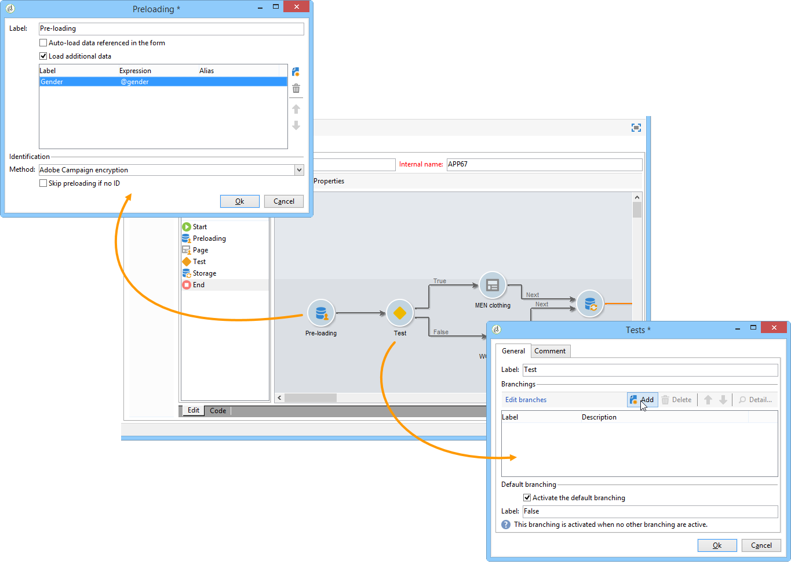
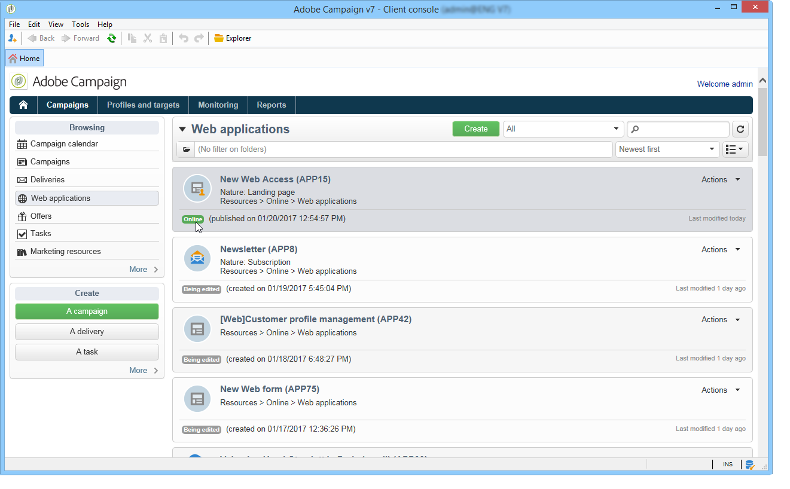

# Webformulieren publiceren{#publishing-a-web-form}

## De formuliergegevens vooraf laden {#pre-loading-the-form-data}

Als u de profielen wilt bijwerken die in het gegevensbestand via een vorm van het Web worden opgeslagen, kunt u een preloading doos gebruiken. In het vak Voorladen kunt u aangeven hoe de record moet worden gevonden die in de database moet worden bijgewerkt.

De volgende identificatiemethoden zijn mogelijk:

* **[!UICONTROL Adobe Campaign Encryption]**

   Deze coderingsmethode gebruikt de gecodeerde Adobe Campagne-id (ID). Deze methode is alleen van toepassing op een Adobe Campagne-object en de gecodeerde id kan alleen worden gegenereerd door het Adobe Campagne-platform.

   Als u deze methode gebruikt, moet u de URL van het formulier aanpassen om het e-mailadres te verzenden door de **`<%=escapeUrl(recipient.cryptedId) %>`** parameter toe te voegen. Raadpleeg [Een formulier via e-mail](#delivering-a-form-via-email)verzenden voor meer informatie.

* **[!UICONTROL DES encryption]**

   

   Deze coderingsmethode gebruikt een externe id die is gekoppeld aan een sleutel die wordt gedeeld door Adobe Campaign en de externe provider. In het **[!UICONTROL Des key]** veld kunt u deze coderingssleutel invoeren.

* **[!UICONTROL List of fields]**

   Met deze optie kunt u kiezen uit de velden in de huidige context van het formulier, de velden die worden gebruikt om het bijbehorende profiel in de database te zoeken.

   

   Velden kunnen via het **[!UICONTROL Parameters]** tabblad aan de formuliereigenschappen worden toegevoegd (zie [Parameters](../../web/using/defining-web-forms-properties.md#adding-parameters)toevoegen). Ze worden in de formulier-URL of invoerzones geplaatst.

   >[!CAUTION]
   >
   >De gegevens in de geselecteerde velden worden niet versleuteld. Deze mag niet in een versleuteld formulier worden aangeboden, omdat Adobe Campagne dit niet kan decoderen als de **[!UICONTROL Field list]** optie is geselecteerd.

   In het volgende voorbeeld wordt het vooraf laden van profielen gebaseerd op het e-mailadres.

   De URL kan het niet-gecodeerde e-mailadres bevatten. In dat geval hebben gebruikers rechtstreeks toegang tot de pagina&#39;s die hen aangaan.

   

   Als dat niet het geval is, worden ze om hun wachtwoord gevraagd.

   

   >[!CAUTION]
   >
   >Als de lijst meerdere velden bevat, moeten de gegevens van **ALLE VELDEN** overeenkomen met de gegevens die in de database zijn opgeslagen voordat het profiel kan worden bijgewerkt. Anders wordt een nieuw profiel gemaakt.
   > 
   >Deze functie is vooral nuttig voor de toepassingen van het Web maar niet geadviseerd voor openbare vormen. De geselecteerde toegangsbeheeroptie moet &quot;toegangsbeheer&quot;toelaten zijn.

U moet de **[!UICONTROL Skip preloading if identification is empty]** optie selecteren als u geen profielen wilt bijwerken. In dat geval wordt elk ingevoerde profiel na goedkeuring van het formulier toegevoegd aan de database. Deze optie wordt bijvoorbeeld gebruikt wanneer het formulier op een website wordt geplaatst.

Met **[!UICONTROL Auto-load data referenced in the form]** deze optie kunt u automatisch de gegevens laden die overeenkomen met de invoer- en samenvoegvelden in het formulier. Het gaat echter niet om gegevens waarnaar in **[!UICONTROL Script]** en **[!UICONTROL Test]** activiteiten wordt verwezen. Als deze optie niet is geselecteerd, moet u de velden definiëren met de **[!UICONTROL Load additional data]** optie.

Met **[!UICONTROL Load additional data]** deze optie kunt u informatie toevoegen die niet wordt gebruikt op de pagina&#39;s van het formulier, maar die wel vooraf wordt geladen.

U kunt bijvoorbeeld het geslacht van de ontvanger vooraf laden en hem of haar automatisch via een testvak naar de juiste pagina sturen.



## Levering en bijhouden van webformulieren beheren {#managing-web-forms-delivery-and-tracking}

Nadat het formulier is gemaakt, geconfigureerd en gepubliceerd, kunt u het verzenden en de reacties van gebruikers volgen.

### Levenscyclus van een formulier {#life-cycle-of-a-form}

Er zijn drie fasen in de levenscyclus van een formulier:

1. **Formulier wordt bewerkt**

   Dit is de eerste ontwerpfase. Wanneer een nieuw formulier wordt gemaakt, bevindt het zich in de bewerkingsfase. Toegang tot het formulier alleen voor testdoeleinden vereist dat de parameter in de URL **[!UICONTROL __uuid]** wordt gebruikt. Deze URL is toegankelijk op het **[!UICONTROL Preview]** subtabblad. Zie [URL-parameters](../../web/using/defining-web-forms-properties.md#form-url-parameters)van formulier.

   >[!CAUTION]
   >
   >Zolang het formulier wordt bewerkt, is de toegangs-URL een speciale URL.

1. **Formulier online**

   Nadat de ontwerpfase is voltooid, kan het formulier worden afgeleverd. Ten eerste moet het worden gepubliceerd. Raadpleeg Een formulier [](#publishing-a-form)publiceren voor meer informatie.

   Het formulier loopt **[!UICONTROL Live]** tot het vervalt.

   >[!CAUTION]
   >
   >De URL van het onderzoek mag niet de **[!UICONTROL __uuid]** parameter bevatten om te worden bezorgd.

1. **Formulier niet beschikbaar**

   Nadat het formulier is gesloten, is de leveringsfase voorbij en is het formulier niet meer beschikbaar: het is niet meer toegankelijk voor gebruikers.

   De vervaldatum kan worden gedefinieerd in het venster met formuliereigenschappen. Raadpleeg [Een formulier online beschikbaar maken voor meer informatie](#making-a-form-available-online)

De publicatiestatus van een formulier wordt weergegeven in de lijst met formulieren.



### Een formulier publiceren {#publishing-a-form}

Als u de status van een formulier wilt wijzigen, moet u het publiceren. Klik hiertoe op de **[!UICONTROL Publication]** knop boven de lijst met webformulieren en selecteer de status in de vervolgkeuzelijst.


### Een formulier online beschikbaar maken {#making-a-form-available-online}

Om door gebruikers te kunnen worden geraadpleegd, moet het formulier in productie zijn en worden gestart, d.w.z. binnen de geldigheidsperiode. De geldigheidsdata worden ingevoerd via de **[!UICONTROL Properties]** link van het formulier.

* Gebruik de velden in de **[!UICONTROL Project]** sectie om begin- en einddatums voor het formulier in te voeren.

   

* Klik op de **[!UICONTROL Personalize the message displayed if the form is closed...]** koppeling om het foutbericht te definiëren dat moet worden weergegeven als de gebruiker toegang probeert te krijgen tot het formulier terwijl het niet geldig is.

   Zie [Toegankelijkheid van het formulier](../../web/using/defining-web-forms-properties.md#accessibility-of-the-form).

### Een formulier via e-mail verzenden {#delivering-a-form-via-email}

Wanneer u een uitnodiging via e-mail verzendt, kunt u de **[!UICONTROL Adobe Campaign Encryption]** optie voor gegevensafstemming gebruiken. Hiervoor gaat u naar de wizard voor levering en past u de koppeling naar het formulier aan door de volgende parameter toe te voegen:

```
<a href="https://server/webApp/APP264?&id=<%=escapeUrl(recipient.cryptedId) %>">
```

In dit geval moet de compatibiliteitssleutel voor gegevensopslag de gecodeerde id van de ontvanger zijn. Zie [De formuliergegevens](#pre-loading-the-form-data)vooraf laden voor meer informatie.

In dit geval moet u de **[!UICONTROL Update the preloaded record]** optie in het recordvak inschakelen. Zie [Webformulieren opslaan voor meer informatie](../../web/using/web-forms-answers.md#saving-web-forms-answers).


### Antwoorden in logboek {#log-responses}

Het volgen van de reactie kan in een specifiek lusje worden geactiveerd om het effect van uw vorm van het Web te controleren. Klik hiertoe op de **[!UICONTROL Advanced parameters...]** koppeling in het venster met formuliereigenschappen en selecteer de **[!UICONTROL Log responses]** optie.


Op het **[!UICONTROL Responses]** tabblad kunt u de identiteit van de geënquêteerden weergeven.


Selecteer een ontvanger en klik op de **[!UICONTROL Detail...]** knop om de antwoorden te bekijken.


U kunt de antwoordlogboeken verwerken die in vragen worden verstrekt, bijvoorbeeld om slechts niet-geënquêteerden te richten wanneer het verzenden van herinneringen, of specifieke mededelingen aan slechts geënquêteerden aan te bieden.

>[!NOTE]
>
>Als u de antwoorden volledig wilt bijhouden, exporteert u de reacties en bekijkt of maakt u speciale rapporten, gebruikt u de optionele module **Enquête** . Zie [deze sectie](../../web/using/about-surveys.md)voor meer informatie.

