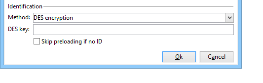

# Een webformulier publiceren{#publishing-a-web-form}


## De formuliergegevens vooraf laden {#pre-loading-the-form-data}

Als u de profielen wilt bijwerken die in het gegevensbestand via een vorm van het Web worden opgeslagen, kunt u een preloading doos gebruiken. In het vak Voorladen kunt u aangeven hoe de record moet worden gevonden die in de database moet worden bijgewerkt.

De volgende identificatiemethoden zijn mogelijk:

* **[!UICONTROL Adobe Campaign Encryption]**

   Deze coderingsmethode gebruikt de gecodeerde Adobe Campaign-id (ID). Deze methode is alleen van toepassing op een Adobe Campaign-object en de gecodeerde id mag alleen worden gegenereerd door het Adobe Campaign-platform.

   Als u deze methode gebruikt, moet u de URL van het formulier aanpassen voor levering aan het e-mailadres door het volgende toe te voegen: **`<%=escapeUrl(recipient.cryptedId) %>`** parameter. Raadpleeg voor meer informatie hierover [Een formulier via e-mail verzenden](#delivering-a-form-via-email).

* **[!UICONTROL DES encryption]**

   

   Deze encryptiemethode gebruikt een herkenningsteken (identiteitskaart) die extern wordt verstrekt, verbonden met een sleutel die door Adobe Campaign en de externe leverancier wordt gedeeld. De **[!UICONTROL Des key]** kunt u deze coderingssleutel invoeren.

* **[!UICONTROL List of fields]**

   Met deze optie kunt u kiezen uit de velden in de huidige context van het formulier, de velden die worden gebruikt om het bijbehorende profiel in de database te zoeken.

   

   U kunt velden toevoegen aan de formuliereigenschappen via het dialoogvenster **[!UICONTROL Parameters]** tab (verwijzing naar [Parameters toevoegen](defining-web-forms-properties.md#adding-parameters)). Ze worden in de formulier-URL of invoerzones geplaatst.

   >[!CAUTION]
   >
   >De gegevens in de geselecteerde velden worden niet versleuteld. Het mag niet in een gecodeerde vorm worden verstrekt omdat Adobe Campaign het niet kan decoderen als het **[!UICONTROL Field list]** is geselecteerd.

   In het volgende voorbeeld wordt het vooraf laden van profielen gebaseerd op het e-mailadres.

   De URL kan het niet-gecodeerde e-mailadres bevatten. In dat geval hebben gebruikers rechtstreeks toegang tot de pagina&#39;s die hen aangaan.

   

   Als dat niet het geval is, worden ze om hun wachtwoord gevraagd.

   

   >[!CAUTION]
   >
   >Als in de lijst meerdere velden zijn opgegeven, worden de gegevens van **ALLE VELDEN** Het profiel kan alleen worden bijgewerkt als het overeenkomt met de gegevens die in de database zijn opgeslagen. Anders wordt een nieuw profiel gemaakt.
   > 
   >Deze functie is vooral nuttig voor de toepassingen van het Web maar niet geadviseerd voor openbare vormen. De geselecteerde toegangsbeheeroptie moet &quot;toegangsbeheer&quot;toelaten zijn.

De **[!UICONTROL Skip preloading if no ID]** Selecteer deze optie als u geen profielen wilt bijwerken. In dat geval wordt elk ingevoerde profiel na goedkeuring van het formulier toegevoegd aan de database. Deze optie wordt bijvoorbeeld gebruikt wanneer het formulier op een website wordt geplaatst.

De **[!UICONTROL Auto-load data referenced in the form]** Met deze optie kunt u automatisch de gegevens laden die overeenkomen met de invoer- en samenvoegvelden in het formulier. Gegevens waarnaar echter wordt verwezen in **[!UICONTROL Script]** en **[!UICONTROL Test]** de activiteiten betreffen niet. Als deze optie niet is geselecteerd, moet u de velden definiëren met de **[!UICONTROL Load additional data]** optie.

De **[!UICONTROL Load additional data]** Met deze optie kunt u informatie toevoegen die niet wordt gebruikt op de pagina&#39;s van het formulier, maar die wel vooraf wordt geladen.

U kunt bijvoorbeeld het geslacht van de ontvanger vooraf laden en deze automatisch via een testvak naar de juiste pagina sturen.


## Levering en bijhouden van webformulieren beheren {#managing-web-forms-delivery-and-tracking}

Nadat het formulier is gemaakt, geconfigureerd en gepubliceerd, kunt u het verzenden en de reacties van gebruikers volgen.

### Levenscyclus van een formulier {#life-cycle-of-a-form}

Er zijn drie fasen in de levenscyclus van een formulier:

1. **Formulier wordt bewerkt**

   Dit is de eerste ontwerpfase. Wanneer een nieuw formulier wordt gemaakt, bevindt het zich in de bewerkingsfase. Toegang tot het formulier is alleen voor testdoeleinden vereist, en vervolgens is de parameter vereist **[!UICONTROL __uuid]** te gebruiken in zijn URL. Deze URL is toegankelijk in het dialoogvenster **[!UICONTROL Preview]** subtab. Zie [URL-parameters van formulier](defining-web-forms-properties.md#form-url-parameters).

   >[!CAUTION]
   >
   >Zolang het formulier wordt bewerkt, is de toegangs-URL een speciale URL.

1. **Formulier online**

   Nadat de ontwerpfase is voltooid, kan het formulier worden afgeleverd. Ten eerste moet het worden gepubliceerd. Raadpleeg voor meer informatie hierover [Een formulier publiceren](#publishing-a-form).

   Het formulier wordt **[!UICONTROL Live]** tot het vervalt.

   >[!CAUTION]
   >
   >De URL van de enquête mag niet de volgende informatie bevatten: **[!UICONTROL __uuid]** parameter.

1. **Formulier niet beschikbaar**

   Nadat het formulier is gesloten, is de leveringsfase voorbij en is het formulier niet meer beschikbaar: het is niet meer toegankelijk voor gebruikers.

   De vervaldatum kan worden gedefinieerd in het venster met formuliereigenschappen. Raadpleeg voor meer informatie hierover [Een formulier online beschikbaar maken](#making-a-form-available-online)

De publicatiestatus van een formulier wordt weergegeven in de lijst met formulieren.


### Een formulier publiceren {#publishing-a-form}

Als u de status van een formulier wilt wijzigen, moet u het publiceren. Om dit te doen, klik **[!UICONTROL Publication]** boven de lijst met webformulieren en selecteer de status in de vervolgkeuzelijst.


### Een formulier online beschikbaar maken {#making-a-form-available-online}

Om door gebruikers te kunnen worden geraadpleegd, moet het formulier in productie zijn en worden gestart, d.w.z. binnen de geldigheidsperiode. De geldigheidstermijnen worden ingevoerd via de **[!UICONTROL Properties]** koppeling van het formulier.

* Gebruik de velden in het dialoogvenster **[!UICONTROL Project]** in om begin- en einddatums voor het formulier in te voeren.

   

* Klik op de knop **[!UICONTROL Personalize the message displayed if the form is closed...]** Hiermee definieert u het foutbericht dat wordt weergegeven als de gebruiker toegang probeert te krijgen tot het formulier terwijl het niet geldig is.

   Zie [Toegankelijkheid van het formulier](defining-web-forms-properties.md#accessibility-of-the-form).

### Een formulier via e-mail verzenden {#delivering-a-form-via-email}

Als u een uitnodiging via e-mail verzendt, kunt u de opdracht **[!UICONTROL Adobe Campaign Encryption]** optie voor afstemming van gegevens. Hiervoor gaat u naar de wizard voor levering en past u de koppeling naar het formulier aan door de volgende parameter toe te voegen:

```
<a href="https://server/webApp/APP264?&id=<%=escapeUrl(recipient.cryptedId) %>">
```

In dit geval moet de compatibiliteitssleutel voor gegevensopslag de gecodeerde id van de ontvanger zijn. Raadpleeg voor meer informatie hierover [De formuliergegevens vooraf laden](#pre-loading-the-form-data).

In dit geval moet u de opdracht **[!UICONTROL Update the preloaded record]** in het recordvak. Raadpleeg voor meer informatie hierover [Webformulieren opslaan](web-forms-answers.md#saving-web-forms-answers).


### Antwoorden in logboek {#log-responses}

Het volgen van de reactie kan in een specifiek lusje worden geactiveerd om het effect van uw vorm van het Web te controleren. Om dit te doen, klik **[!UICONTROL Advanced parameters...]** in het venster met formuliereigenschappen en selecteer de optie **[!UICONTROL Log responses]** optie.


De **[!UICONTROL Responses]** weergegeven, kunt u de identiteit van de geënquêteerden weergeven.


Selecteer een ontvanger en klik op de knop **[!UICONTROL Detail...]** om de antwoorden te bekijken.


U kunt de antwoordlogboeken verwerken die in vragen worden verstrekt, bijvoorbeeld om slechts niet-geënquêteerden te richten wanneer het verzenden van herinneringen, of specifieke mededelingen aan slechts geënquêteerden aan te bieden.
