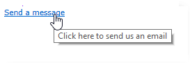

# Statische elementen in een webformulier{#static-elements-in-a-web-form}

U kunt elementen opnemen waarmee de gebruiker geen interactie heeft op de pagina&#39;s van het formulier. Dit zijn statische elementen, zoals afbeeldingen, HTML-inhoud, een horizontale balk of een hypertekstkoppeling. Deze elementen worden gemaakt met de eerste knop op de werkbalk door op het **[!UICONTROL Add static element]** menu te klikken.


De volgende veldtypen zijn beschikbaar:

* Waarde gebaseerd op eerder gegeven antwoorden (in de context van het formulier) of op de database.
* Hypertext link, HTML, horizontal bar. Zie HTML-inhoud [invoegen](#inserting-html-content).
* Afbeelding opgeslagen in de bronbibliotheek of op een server die toegankelijk is voor gebruikers. Zie [Afbeeldingen](#inserting-images)invoegen.
* Script wordt uitgevoerd aan de clientzijde en/of serverzijde. Deze moet in JavaScript zijn geschreven en compatibel zijn met de meeste browsers om een correcte uitvoering op de client te garanderen.

   >[!NOTE]
   >
   >Aan de serverzijde kan het script de functies gebruiken die zijn gedefinieerd in de [Campagne JSAPI-documentatie](https://docs.adobe.com/content/help/en/campaign-classic/technicalresources/api/index.html).

## HTML-inhoud invoegen {#inserting-html-content}

U kunt HTML-inhoud opnemen in een formulierpagina: hypertextkoppelingen, afbeeldingen, opgemaakte alinea&#39;s, video- of Flash-objecten, enz.

Met de HTML-editor kunt u de inhoud invoeren die u in de formulierpagina wilt invoegen. Ga naar **[!UICONTROL Static elements>HTML]** .

U kunt de inhoud rechtstreeks invoeren en opmaken of het venster met de broncode weergeven om deze in externe inhoud te plakken. Als u wilt overschakelen naar de modus &quot;broncode&quot;, klikt u op het eerste pictogram op de werkbalk:


Om een gegevensbestandgebied op te nemen, gebruik de verpersoonlijkingsknoop.


>[!NOTE]
>
>De tekenreeksen die u opgeeft in de HTML-editor worden alleen omgezet als ze zijn gedefinieerd op het **[!UICONTROL Texts]** subtabblad. Anders worden ze niet verzameld. Raadpleeg [Een webformulier](../../web/using/translating-a-web-form.md)vertalen voor meer informatie.

### Een koppeling invoegen {#inserting-a-link}

Vul de velden in het bewerkingsvenster in, zoals in het volgende voorbeeld wordt getoond:

Ga naar **[!UICONTROL Static elements>Link]** om een hypertekstkoppeling toe te voegen.


* De inhoud **[!UICONTROL Label]** is de inhoud van de hypertekstkoppeling zoals deze wordt weergegeven op de formulierpagina.
* Het **[!UICONTROL URL]** is het gewenste adres, bijvoorbeeld: [https://www.adobe.com](https://www.adobe.com) voor een website of [info@adobe.com](mailto:info@adobe.com) voor het verzenden van een bericht.
* In het **[!UICONTROL Window]** veld kunt u de weergavemodus voor de koppeling selecteren in het geval van een site. U kunt de koppeling openen in een nieuw venster, in het huidige venster of in een ander venster.
* U kunt een ToolTip toevoegen, zoals hieronder getoond:

   

* U kunt de koppeling weergeven als een knop of als een afbeelding. Selecteer hiertoe het type weergave in het **[!UICONTROL Type]** veld.

### Typen koppelingen {#types-of-links}

De koppelingen zijn standaard gekoppeld aan een actie van het type URL, zodat een doeladres van de koppeling kan worden ingevoerd in het veld URL.


U kunt andere acties voor de koppeling definiëren, zodat de gebruiker op de koppeling kan klikken om het volgende te doen:

* De pagina vernieuwen

   Selecteer hiertoe de **[!UICONTROL Refresh page]** optie in de vervolgkeuzelijst van het **[!UICONTROL Action]** veld.

   

* Volgende/vorige pagina weergeven

   U doet dit door de **[!UICONTROL Next page]** of **[!UICONTROL Previous page]** optie in de vervolgkeuzelijst van het **[!UICONTROL Action]** veld te selecteren.

   

   U kunt de knoppen **[!UICONTROL Next]** en/of **[!UICONTROL Back]** knoppen verbergen als u deze wilt vervangen door een koppeling. Zie deze [pagina](../../web/using/defining-web-forms-page-sequencing.md).

   De koppeling vervangt de **[!UICONTROL Next]** knop die standaard wordt gebruikt.

   

* Een andere pagina weergeven

   Met de **[!UICONTROL Enable a transition]** optie kunt u een specifieke pagina weergeven die is gekoppeld aan de uitgaande overgang die in het **[!UICONTROL Transition]** veld is geselecteerd.

   

   Een pagina heeft standaard maar één uitvoerovergang. Als u nieuwe overgangen wilt maken, selecteert u de pagina en klikt u op de **[!UICONTROL Add]** knop in de **[!UICONTROL Output transitions]** sectie, zoals hieronder wordt weergegeven:

   

   In het diagram ziet deze toevoeging er als volgt uit:

   

   >[!NOTE]
   >
   >Voor meer op pagina rangschikken in een vorm van het Web, verwijs naar het [Bepalen van de Web-vormenpagina opeenvolging](../../web/using/defining-web-forms-page-sequencing.md).

* Velden van het formulier vooraf laden met gegevens uit het Facebook-profiel

   >[!CAUTION]
   >
   >Deze functie is alleen beschikbaar als u de **[!UICONTROL Social Marketing]** toepassing hebt geïnstalleerd. Als u deze optie wilt gebruiken, moet u samen met een extern **[!UICONTROL Facebook Connect]** type account een Facebook-toepassing maken. Raadpleeg [deze pagina](../../social/using/creating-a-facebook-application.md#configuring-external-accounts)voor meer informatie.

   Met de **[!UICONTROL Preload with Facebook]** optie kunt u een knop in een formulier invoegen om velden vooraf te laden met Facebook-profielgegevens.

   

   Wanneer een gebruiker op de **[!UICONTROL Fill in automatically]** knop klikt, wordt het venster met bevoegdheden op Facebook geopend.

   

   >[!NOTE]
   >
   >Het is mogelijk om de lijst met uitgebreide rechten te wijzigen wanneer u de externe account configureert. Als u geen uitgebreide rechten opgeeft, stuurt Facebook standaard de basisprofielgegevens door.\
   >Klik hier als u de lijst met uitgebreide rechten en de bijbehorende syntaxis wilt weergeven: [https://developers.facebook.com/docs/reference/api/permissions/](https://developers.facebook.com/docs/reference/api/permissions/)

   Als de gebruiker ermee instemt om zijn gegevens te delen, worden de velden van het formulier vooraf geladen.

   

Voor dit gebruiksgeval, hebben wij een toepassing van het Web gecreeerd die uit de volgende elementen wordt samengesteld:

* een pagina met het formulier
* een **[!UICONTROL Record]** activiteit
* een **[!UICONTROL End]** activiteit


Voer de volgende stappen uit om een knop voor vooraf laden toe te voegen:

1. Maak een formulier.

   

1. Ga naar hetzelfde niveau als de velden in het formulier en voeg een koppeling toe.

   

1. Voer het label in en selecteer het **[!UICONTROL Button]** type.

   

1. Ga naar het **[!UICONTROL Action]** veld en selecteer **[!UICONTROL Preload with Facebook]**.

   

1. Ga naar het **[!UICONTROL Application]** veld en selecteer het **[!UICONTROL Facebook Connect]** type externe account dat eerder is gemaakt. Raadpleeg [deze pagina](../../social/using/creating-a-facebook-application.md#configuring-external-accounts)voor meer informatie.

   

### HTML-inhoud aanpassen {#personalizing-html-content}

U kunt de HTML-inhoud van een formulierpagina aanpassen met gegevens die op een vorige pagina zijn opgenomen. U kunt bijvoorbeeld een webformulier voor autoverzekering maken waarvan u op de eerste pagina contactgegevens en het merk van de auto kunt opgeven.


Gebruik personalisatievelden om de gebruikersnaam en het geselecteerde merk opnieuw op de volgende pagina te injecteren. De syntaxis die moet worden gebruikt, is afhankelijk van de gegevensopslagmodus. Voor meer informatie hierover, verwijs naar het [Gebruiken van verzamelde informatie](../../web/using/web-forms-answers.md#using-collected-information).

>[!NOTE]
>
>Om veiligheidsredenen wordt de in de **`<%=`** formule ingevoerde waarde vervangen door escape-tekens. Gebruik de volgende syntaxis om dit te voorkomen en alleen als dat nodig is: **`<%=`**.

In ons voorbeeld, worden de voornaam en de familienaam van de ontvanger opgeslagen in een gebied van het gegevensbestand, terwijl het merk van hun auto in een variabele wordt opgeslagen. De syntaxis van het bericht op bladzijde 2 is als volgt:


```
<P>Welcome <%= ctx.recipient.@firstName %> <%= ctx.recipient.@lastName %>,</P>
<P>To start your customized study, please select your car <%=ctx.vars.marque%> and its year of purchase.</P>
```

Dit levert het volgende resultaat op:


### Tekstvariabelen gebruiken {#using-text-variables}

Op het **[!UICONTROL Text]** tabblad kunt u met de volgende syntaxis variabele velden maken die in de HTML tussen de tekens &lt;%= en %> kunnen worden gebruikt: **$ (IDENTIFIER)**.

Gebruik deze methode om uw tekenreeksen eenvoudig te lokaliseren. Zie Een webformulier [vertalen](../../web/using/translating-a-web-form.md)

U kunt bijvoorbeeld een veld **Contactpersoon** maken waarmee u de tekenreeks &quot;Datum van laatste contactpersoon:&quot; kunt weergeven voor de HTML-inhoud. Hiervoor voert u de volgende stappen uit:

1. Klik op het **[!UICONTROL Text]** tabblad van de HTML-tekst.
1. Klik op het **[!UICONTROL Add]** pictogram.
1. Voer in de **[!UICONTROL Identifier]** kolom de naam van de variabele in
1. Voer in de **[!UICONTROL Text]** kolom de standaardwaarde in.

   

1. Voeg deze tekstvariabele in de HTML-inhoud in via de syntaxis **&lt;%= $(Contact) %>** .

   

   >[!CAUTION]
   >
   >Als u deze tekens invoert in de HTML-editor, worden de velden **&lt;** en **>** vervangen door de escape-tekens. In dit geval moet u de broncode corrigeren door op het **[!UICONTROL Display source code]** pictogram van de HTML-teksteditor te klikken.

1. Open het **[!UICONTROL Preview]** label van het formulier om de waarde weer te geven die in de HTML is ingevoerd:

   

In deze modus kunt u de tekst van webformulieren factoriseren en vertalingen beheren met het geïntegreerde vertaalgereedschap. Raadpleeg [Een webformulier](../../web/using/translating-a-web-form.md)vertalen voor meer informatie.

## Afbeeldingen invoegen {#inserting-images}

Afbeeldingen die u in formulieren wilt opnemen, moeten worden opgeslagen op een server die van buitenaf toegankelijk is.

Selecteer het **[!UICONTROL Static elements>Image]** menu.

Selecteer de bron van de afbeelding die u wilt invoegen: het kan uit de openbare middelbibliotheek komen of op een externe server worden opgeslagen die van buiten toegankelijk is.


Als dit een afbeelding uit de bibliotheek is, selecteert u deze in de keuzelijst met invoervak van het veld. Als het in een extern dossier wordt gevestigd, ga de toegangspad in. Het label wordt weergegeven door de cursor boven de afbeelding te plaatsen (valt samen met een ALT-veld in HTML) of wanneer de afbeelding niet wordt weergegeven.

De afbeelding kan worden weergegeven in het centrale gedeelte van de editor.
