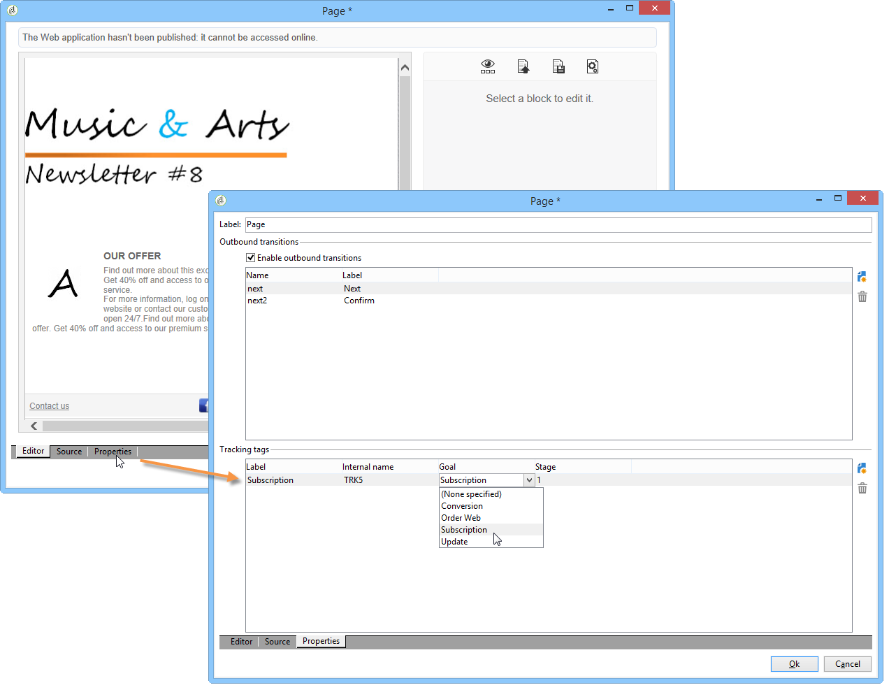
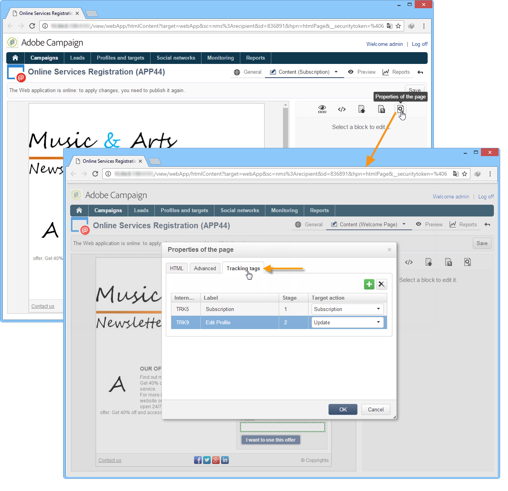
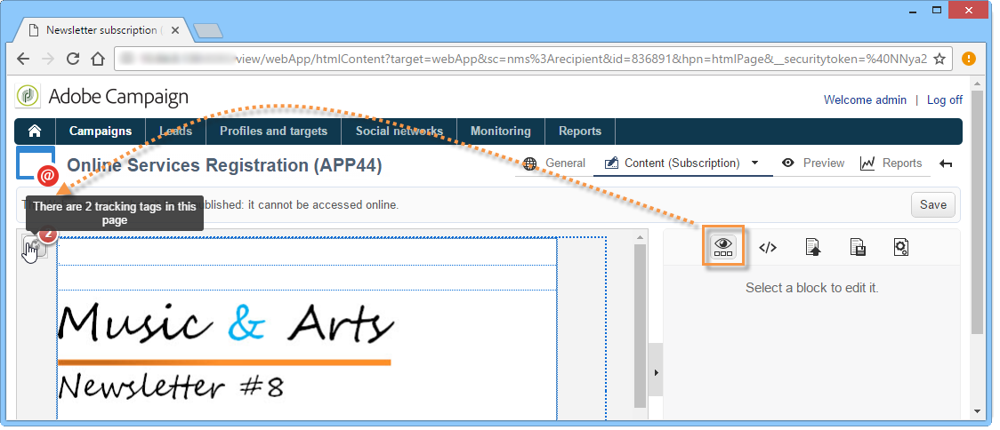

# Een webtoepassing bijhouden{#tracking-a-web-application}

Met Adobe Campaign kunt u bezoeken op webtoepassingspagina&#39;s bijhouden en meten door trackingtags in te voegen. Deze functionaliteit kan voor alle toepassingstypen van het Web (vormen, online onderzoeken, Web-pagina&#39;s worden gebruikt die gebruikend DCE worden gecreeerd, etc.).

U kunt dus verschillende navigatiepaden definiëren en het succes ervan beoordelen. De teruggekregen gegevens zijn dan beschikbaar in de rapporten van elke toepassing.

De belangrijkste verbeteringen in deze versie zijn:

* De mogelijkheid om verschillende volgcodes op dezelfde pagina in te voegen om de definitie van navigatiepaden te vereenvoudigen (bijvoorbeeld aankoop, abonnement, retournering, enz.).
* Navigatiepaden en trackingcodes van de verschillende pagina&#39;s weergeven op het dashboard van de webtoepassing.

   

* Een volledig traceringsrapport genereren.

   

   De belangrijkste indicatoren zijn:

   * **Conversiesnelheid**: aantal personen dat alle stappen van een navigatiepad heeft weergegeven.
   * **Stuitsnelheid**: aantal personen dat alleen de eerste stap heeft getoond
   * **Conversietunnel**: verliespercentage tussen elke stap.
   Bovendien wordt de populatie volgens de bron in een **sectorkaart** weergegeven.

## Identificerend de verkeersbron {#identifying-the-traffic-source}

Twee verschillende wijzen kunnen worden gebruikt om te identificeren waar de bezoeker van komt wanneer het toegang tot van een toepassing van het Web:

1. Het verzenden van een specifieke levering om toegang tot de de toepassingspagina&#39;s van het Web te verlenen: in dit geval is de verkeersbron deze levering;
1. Het associëren van de toepassing van het Web aan een specifieke verkeersbron: in dit geval moet het een externe levering van het type &quot;verkeersbron&quot; zijn. Het kan van de de toepassingseigenschappen van het Web of van de doelafbeelding worden geselecteerd.

   

Om de verkeersbron in een toepassing van het Web te identificeren, zoekt de Campagne van Adobe achtereenvolgens de volgende informatie:

1. de bron-id, indien aanwezig (nlId cookie);
1. de id van de externe levering die is gedefinieerd in de webtoepassingseigenschappen, indien deze bestaan;
1. de identificatiecode van de externe levering die in de doeltoewijzing is gedefinieerd, indien deze bestaat.

>[!NOTE]
>
>Herinner dat het anonieme volgen slechts mogelijk is als de overeenkomstige optie in de plaatsingstovenaar is geactiveerd.
>
>Raadpleeg de [installatiehandleiding](../../installation/using/deploying-an-instance.md)voor meer informatie.

## Webtoepassingen die zijn ontworpen met Digital Content Editor (DCE) {#web-applications-designed-with-digital-content-editor--dce-}

Wanneer een webtoepassing wordt gemaakt met de HTML-inhoudeditor - **Digital Content Editor (DCE)** - worden trackingtags ingevoegd op het **[!UICONTROL Properties]** tabblad van de editor. Raadpleeg [deze sectie](../../web/using/about-campaign-html-editor.md)voor meer informatie over de Digital Content Editor (DCE).

Wanneer het gebruiken van de interface van het Web, moet het volgen markeringen van de paginaeigenschappen worden opgenomen.

Met het **[!UICONTROL Display blocks]** pictogram kunt u het aantal trackinglabels weergeven dat voor de pagina is gedefinieerd.

