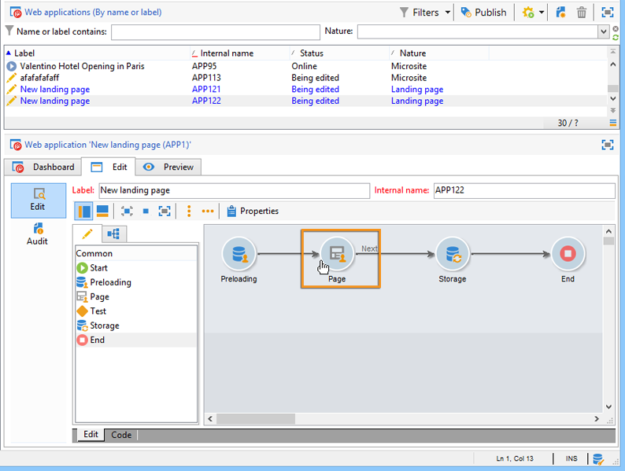

# Een webtoepassing vertalen{#translating-a-web-application}

U kunt webtoepassingspagina&#39;s die zijn gemaakt met de Adobe Campagne Digital Content Editor (DCE), vertalen.

Als u via het **[!UICONTROL Localization]** **[!UICONTROL Properties]** tabblad in een webtoepassing ten minste één extra taal selecteert, wordt een nieuwe optie beschikbaar wanneer u een HTML-inhoudsblok toevoegt aan een pagina die met DCE wordt bewerkt.

Met deze optie kunt u aangeven of de blokinhoud moet worden vertaald of niet.

Tekenreeksen die moeten worden vertaald, worden op dezelfde manier verzameld als de andere tekenreeksen van de webtoepassing, via het **[!UICONTROL Translations]** tabblad van de toepassing. Raadpleeg [deze pagina](../../web/using/translating-a-web-form.md)voor meer informatie.

De tekenreeksen markeren die moeten worden vertaald:

1. Open een inhoudspagina die met DCE in een toepassing van het Web wordt uitgegeven.

   

1. Selecteer een HTML-blok.
1. In het parameterblok op het recht, laat de **[!UICONTROL Localization]** optie u de inhoud van het geselecteerde blok markeren. Standaard wordt alleen de paginatitel vertaald.

   

   >[!NOTE]
   >
   >Tekenreeksen mogen niet langer zijn dan 1023 tekens.

   Er zijn drie specifieke gevallen:

   * Wanneer het geselecteerde blok verschillende tekenreeksen/blokken bevat, wordt het gemarkeerd als één tekenreeks die moet worden vertaald. De tekenreeks bevat vervolgens de HTML-code van de elementen in dit blok.
   * Wanneer u een blok wilt markeren dat meerdere tekenreeksen bevat en wanneer ten minste een van deze tekenreeksen al is gemarkeerd, wordt een waarschuwing weergegeven. Vervolgens kunt u de markering verwijderen uit de geïsoleerde tekenreeks en het volledige blok toevoegen.

      

   * Wanneer u de markering wilt verwijderen uit een tekenreeks die zich in een blok bevindt dat al is gemarkeerd, kunt u de optie voor het omzetten van de tekenreeks niet rechtstreeks wijzigen. U kunt echter wel toegang krijgen tot het blok met de tekenreeks om deze te wijzigen.

      

1. Wanneer u de tekenreeksen hebt gemarkeerd, gaat u terug naar de webtoepassing en selecteert u het **[!UICONTROL Translations]** tabblad.
1. Selecteer **[!UICONTROL Collect the strings to translate]**. De tekenreeksen die in DCE worden gemarkeerd, worden toegevoegd aan de tekenreeksen van de webtoepassing.

   >[!NOTE]
   >
   >Nadat de tekenreeksen zijn verzameld, worden deze niet uit de lijst verwijderd als u de vertaalmarkering in DCE verwijdert. Hierdoor blijven ze in het vertaalgeheugen staan.

1. Vertaal en keur de tekenreeksen goed.

   U kunt dan een voorvertoning van de vertalingen bekijken door de gewenste taal te selecteren op het **[!UICONTROL Preview]** tabblad in de webtoepassing.

