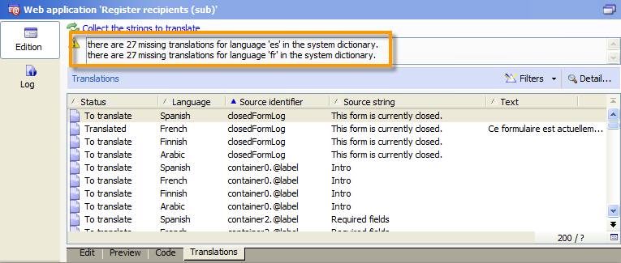

# Een webformulier vertalen{#translating-a-web-form}

Het is mogelijk om een toepassing van het Web in verscheidene talen te lokaliseren.

U kunt vertalingen rechtstreeks uitvoeren in de Adobe Campagne-console (verwijs naar [Vertalingen beheren in de editor](#managing-translations-in-the-editor)), of tekenreeksen exporteren en importeren om de vertaling te externaliseren (verwijs naar [Extern maken van vertalingen](#externalizing-translation)).

De lijst met talen die standaard beschikbaar zijn, wordt gedetailleerd weergegeven in de weergavetaal [van](#changing-forms-display-language)formulieren wijzigen.

De toepassing van het Web wordt ontworpen in een het uitgeven taal: dit is de referentietaal die wordt gebruikt om labels en andere te vertalen inhoud in te voeren.

De standaardtaal is de taal waarin de toepassing van het Web zal worden getoond als geen taal het plaatsen aan zijn toegang URL wordt toegevoegd.

>[!NOTE]
>
>Door gebrek, zijn de het uitgeven taal en de standaardtaal het zelfde als de consoletaal.

## Talen kiezen {#choosing-languages}

Als u een of meer vertaaltalen wilt definiëren, klikt u op de **[!UICONTROL Properties]** knop van de webtoepassing en vervolgens op het **[!UICONTROL Localization]** tabblad. Klik de **[!UICONTROL Add]** knoop om een nieuwe vertaaltaal voor de toepassing van het Web te bepalen.

>[!NOTE]
>
>In dit venster kunt u ook de standaardtaal en de bewerkingstaal wijzigen.


Wanneer u vertaaltalen toevoegt voor een toepassing van het Web (of wanneer de standaardtaal en het uitgeven taal verschillend zijn), wordt een **[!UICONTROL Translation]** sub-lusje toegevoegd aan het **[!UICONTROL Edit]** lusje om vertalingen te beheren.

Adobe Campaign beschikt over een programma voor het vertalen en beheren van meertalige vertalingen. In deze editor kunt u de tekenreeksen bekijken die u wilt vertalen of goedkeuren, vertalingen rechtstreeks in de interface invoeren of tekenreeksen importeren/exporteren om vertalingen te externaliseren.

## Vertalingen beheren in de editor {#managing-translations-in-the-editor}

### Tekenreeksen verzamelen {#collecting-strings}

Op het **[!UICONTROL Translations]** tabblad kunt u vertalingen invoeren voor de tekenreeksen die de webtoepassing vormen.

De eerste keer dat u dit tabblad opent, bevat dit tabblad geen gegevens. Klik op de **[!UICONTROL Collect the strings to translate]** koppeling om de tekenreeksen in de webtoepassing bij te werken.

Adobe Campagne verzamelt labels met velden en tekenreeksen die zijn gedefinieerd op de **[!UICONTROL Texts]** tabbladen van alle statische elementen: HTML-blokken, JavaScript, enz. Statische elementen worden gedetailleerd weergegeven in [statische elementen in een webformulier](../../web/using/static-elements-in-a-web-form.md).


>[!CAUTION]
>
>Dit proces kan enkele minuten duren, afhankelijk van het volume gegevens dat moet worden verwerkt.
> 
>Als er een waarschuwing verschijnt dat sommige vertalingen ontbreken in het systeemwoordenboek, raadpleegt u [De systeemtekenreeksen](#translating-the-system-strings)omzetten.

Elke keer dat een tekenreeks wordt vertaald, wordt de vertaling ervan toegevoegd aan het vertaalwoordenboek.

Wanneer het inzamelingsproces ontdekt dat een vertaling reeds bestaat, wordt deze vertaling getoond in de **[!UICONTROL Text]** kolom van het koord. De status van de tekenreeks wordt gewijzigd in **[!UICONTROL Translated]**.

Voor tekenreeksen die nooit zijn omgezet, is het **[!UICONTROL Text]** veld leeg en is de status **[!UICONTROL To translate]**.

### Tekenreeksen filteren {#filtering-strings}

Door gebrek, wordt elke vertaaltaal van de toepassing van het Web getoond. Er zijn twee standaardfilters: taal en status. Klik op de **[!UICONTROL Filters]** knop en klik vervolgens **[!UICONTROL By language or status]** om de bijbehorende vervolgkeuzelijsten weer te geven. U kunt ook een geavanceerd filter maken. Raadpleeg [deze pagina](../../platform/using/creating-filters.md#creating-an-advanced-filter)voor meer informatie.


Ga naar de **[!UICONTROL Language]** drop-down doos om de vertaaltaal te selecteren.

Als u alleen onvertaalde tekenreeksen wilt weergeven, selecteert u deze **[!UICONTROL To translate]** in de **[!UICONTROL Status]** vervolgkeuzelijst. U kunt ook alleen vertaalde of goedgekeurde tekenreeksen weergeven.

### Tekenreeksen omzetten {#translating-strings}

1. Als u een woord wilt vertalen, dubbelklikt u op de desbetreffende regel in de lijst met tekenreeksen.

   

   De brontekenreeks wordt weergegeven in de bovenste sectie van het venster.

1. Voer de vertaling in de onderste sectie in. Schakel de **[!UICONTROL Translation approved]** optie in als u het bestand wilt goedkeuren.

   >[!NOTE]
   >
   >Goedkeuring van vertaling is optioneel en blokkeert het proces niet.

   Niet-goedgekeurde vertalingen worden weergegeven als **[!UICONTROL Translated]** vertalingen. Goedgekeurde vertalingen worden weergegeven als **[!UICONTROL Approved]**.

## Externe vertaling {#externalizing-translation}

Het is mogelijk tekenreeksen te exporteren en te importeren om deze te vertalen met een ander programma dan Adobe Campagne.

>[!CAUTION]
>
>Nadat u de tekenreeksen hebt geëxporteerd, hoeft u geen vertalingen meer uit te voeren met het geïntegreerde gereedschap. Dit zou tot een conflict leiden wanneer u de vertalingen opnieuw invoert en deze zullen verloren gaan.

### Bestanden exporteren {#exporting-files}

1. Selecteer de webtoepassing(en) waarvan u de tekenreeksen wilt importeren, klik met de rechtermuisknop en selecteer **[!UICONTROL Actions > Export strings for translation...]**

   

1. Selecteer een **[!UICONTROL Export strategy]** :

   * **[!UICONTROL One file per language]**: bij de export wordt één bestand per vertaaltaal gegenereerd . Elk dossier zal voor alle geselecteerde toepassingen van het Web gemeenschappelijk zijn.
   * **[!UICONTROL One file per Web application]**: bij het exporteren één bestand per geselecteerde webtoepassing wordt gegenereerd. Elk bestand bevat alle vertaaltalen.

      >[!NOTE]
      >
      >Dit type export is niet beschikbaar voor XLIFF-export.

   * **[!UICONTROL One file per language and per Web application]**: bij het exporteren worden verschillende bestanden gegenereerd. Elk dossier zal één vertaaltaal per toepassing van het Web bevatten.
   * **[!UICONTROL One file for all]**: bij het exporteren wordt één meertalig bestand voor alle webtoepassingen gegenereerd. Het zal alle vertaaltalen voor alle geselecteerde toepassingen van het Web bevatten.

      >[!NOTE]
      >
      >Dit type export is niet beschikbaar voor XLIFF-export.

1. Kies vervolgens **[!UICONTROL Target folder]** waar de bestanden worden opgenomen.
1. Selecteer de bestandsindeling ( **[!UICONTROL CSV]** of **[!UICONTROL XLIFF]** ) en klik op **[!UICONTROL Start]**.


>[!NOTE]
>
>De namen van exportbestanden worden automatisch gegenereerd. Als u dezelfde exportbewerking meerdere malen uitvoert, vervangt u bestaande bestanden door de nieuwe bestanden. Als u de vorige bestanden wilt behouden, wijzigt u de naam **[!UICONTROL Target folder]** en klikt u **[!UICONTROL Start]** opnieuw om het exporteren uit te voeren.

Wanneer u bestanden in **CSV-indeling** exporteert, wordt elke taal gekoppeld aan een status en goedkeuringsstatus. De **goedkeuring?** kunt u een vertaling goedkeuren. Deze kolom kan de waarden **Ja** of **Nee** bevatten. Wat de geïntegreerde editor betreft (zie [Vertalingen beheren in de editor](#managing-translations-in-the-editor)), is het goedkeuren van vertalingen optioneel en blokkeert het proces niet.

### Bestanden importeren {#importing-files}

Nadat de externe vertaling is voltooid, kunt u de vertaalde bestanden importeren.

1. Ga naar de lijst van de toepassingen van het Web, klik met de rechtermuisknop aan, dan selecteer **[!UICONTROL Actions > Import translated strings...]**

   >[!NOTE]
   >
   >Het is niet nodig om de webtoepassingen te selecteren waarop de vertaling betrekking heeft. Plaats overal de curseur op de lijst van de toepassingen van het Web.

   

1. Selecteer het bestand dat u wilt importeren en klik op **[!UICONTROL Upload]**.

   

>[!NOTE]
>
>Externe vertalingen hebben altijd voorrang op interne vertalingen. In geval van conflicten wordt de interne vertaling overschreven door de externe vertaling.

## Weergavetaal van formulieren wijzigen {#changing-forms-display-language}

De vormen van het Web worden getoond in de standaardtaal die in het **[!UICONTROL Localization]** lusje van de de toepassingseigenschappen van het Web wordt gespecificeerd. Als u talen wilt wijzigen, moet u de volgende tekens toevoegen aan het einde van de URL (waarbij **xx** het symbool van de taal is):

```
?lang=xx
```

als de taal de eerste of enige parameter van de URL is. Bijvoorbeeld: **https://myserver/webApp/APP34?lang=en**

```
&lang=xx
```

als er andere parameters zijn vóór de taal in de URL. Bijvoorbeeld: **https://myserver/webApp/APP34?status=1&amp;lang=en**

De vertalingstalen en woordenboeken die standaard beschikbaar zijn, worden hieronder weergegeven.

**Standaardsysteemwoordenboek**: sommige talen bevatten een standaardwoordenboek dat de vertaling van de systeemtekenreeksen bevat. Raadpleeg [De systeemtekenreeksen](#translating-the-system-strings)omzetten voor meer informatie.

**Kalenderbeheer**: de pagina&#39;s van een toepassing van het Web kunnen een kalender voor het ingaan van data omvatten. Deze kalender is standaard beschikbaar in verschillende talen (vertaling van dagen, datumnotatie).

<table> 
 <tbody> 
  <tr> 
   <td> <strong>Taal (symbolen)</strong><br /> </td> 
   <td> <strong>Standaardsysteemwoordenboek</strong><br /> </td> 
   <td> <strong>Kalenderbeheer</strong><br /> </td> 
  </tr> 
  <tr> 
   <td> Duits (de)<br /> </td> 
   <td> ja<br /> </td> 
   <td> ja<br /> </td> 
  </tr> 
  <tr> 
   <td> Engels (en)<br /> </td> 
   <td> ja<br /> </td> 
   <td> ja<br /> </td> 
  </tr> 
  <tr> 
   <td> Engels (Verenigde Staten) (en_US)<br /> </td> 
   <td> </td> 
   <td> </td> 
  </tr> 
  <tr> 
   <td> Engels (Verenigd Koninkrijk) (en_GB)<br /> </td> 
   <td> </td> 
   <td> </td> 
  </tr> 
  <tr> 
   <td> Arabisch (ar)<br /> </td> 
   <td> </td> 
   <td> </td> 
  </tr> 
  <tr> 
   <td> Chinees (zh)<br /> </td> 
   <td> </td> 
   <td> </td> 
  </tr> 
  <tr> 
   <td> Koreaans (ko)<br /> </td> 
   <td> </td> 
   <td> </td> 
  </tr> 
  <tr> 
   <td> Deens (d bis)<br /> </td> 
   <td> ja<br /> </td> 
   <td> ja<br /> </td> 
  </tr> 
  <tr> 
   <td> Spaans (es)<br /> </td> 
   <td> ja<br /> </td> 
   <td> ja<br /> </td> 
  </tr> 
  <tr> 
   <td> Ests (et)<br /> </td> 
   <td> </td> 
   <td> </td> 
  </tr> 
  <tr> 
   <td> Fins (fi)<br /> </td> 
   <td> </td> 
   <td> ja<br /> </td> 
  </tr> 
  <tr> 
   <td> Frans (fr)<br /> </td> 
   <td> ja<br /> </td> 
   <td> ja<br /> </td> 
  </tr> 
  <tr> 
   <td> Frans (België) (fr_BE)<br /> </td> 
   <td> </td> 
   <td> </td> 
  </tr> 
  <tr> 
   <td> Frans (Frankrijk) (fr_FR)<br /> </td> 
   <td> </td> 
   <td> </td> 
  </tr> 
  <tr> 
   <td> Grieks (el)<br /> </td> 
   <td> </td> 
   <td> ja<br /> </td> 
  </tr> 
  <tr> 
   <td> Hebreeuws (he)<br /> </td> 
   <td> </td> 
   <td> </td> 
  </tr> 
  <tr> 
   <td> Hongaars (hu)<br /> </td> 
   <td> </td> 
   <td> ja<br /> </td> 
  </tr> 
  <tr> 
   <td> Indonesisch (id)<br /> </td> 
   <td> </td> 
   <td> </td> 
  </tr> 
  <tr> 
   <td> Iers (g bis)<br /> </td> 
   <td> </td> 
   <td> </td> 
  </tr> 
  <tr> 
   <td> Italiaans (it)<br /> </td> 
   <td> ja<br /> </td> 
   <td> ja<br /> </td> 
  </tr> 
  <tr> 
   <td> Italiaans (Italië) (IT_NL)<br /> </td> 
   <td> </td> 
   <td> </td> 
  </tr> 
  <tr> 
   <td> Italiaans (Zwitsers) (it_CH)<br /> </td> 
   <td> </td> 
   <td> </td> 
  </tr> 
  <tr> 
   <td> Japans (ja)<br /> </td> 
   <td> </td> 
   <td> </td> 
  </tr> 
  <tr> 
   <td> Lets (lv)<br /> </td> 
   <td> </td> 
   <td> ja<br /> </td> 
  </tr> 
  <tr> 
   <td> Litouws (lt)<br /> </td> 
   <td> </td> 
   <td> </td> 
  </tr> 
  <tr> 
   <td> Maltees (mt)<br /> </td> 
   <td> </td> 
   <td> </td> 
  </tr> 
  <tr> 
   <td> Nederlands (nl)<br /> </td> 
   <td> </td> 
   <td> ja<br /> </td> 
  </tr> 
  <tr> 
   <td> Nederlands (België) (nl_BE)<br /> </td> 
   <td> </td> 
   <td> </td> 
  </tr> 
  <tr> 
   <td> Nederlands (Nederland) (nl_NL)<br /> </td> 
   <td> </td> 
   <td> </td> 
  </tr> 
  <tr> 
   <td> Noors (Noorwegen) (nr_NO)<br /> </td> 
   <td> </td> 
   <td> ja<br /> </td> 
  </tr> 
  <tr> 
   <td> Pools (pl)<br /> </td> 
   <td> </td> 
   <td> ja<br /> </td> 
  </tr> 
  <tr> 
   <td> Portugees (pt)<br /> </td> 
   <td> </td> 
   <td> ja<br /> </td> 
  </tr> 
  <tr> 
   <td> Portugees (Brazilië) (pt_BR)<br /> </td> 
   <td> </td> 
   <td> </td> 
  </tr> 
  <tr> 
   <td> Portugees (Portugal) (pt_PT)<br /> </td> 
   <td> </td> 
   <td> </td> 
  </tr> 
  <tr> 
   <td> Russisch (ru)<br /> </td> 
   <td> </td> 
   <td> ja<br /> </td> 
  </tr> 
  <tr> 
   <td> Sloveens (sl)<br /> </td> 
   <td> </td> 
   <td> </td> 
  </tr> 
  <tr> 
   <td> Slowaaks (sk)<br /> </td> 
   <td> </td> 
   <td> </td> 
  </tr> 
  <tr> 
   <td> Zweeds (sv)<br /> </td> 
   <td> ja<br /> </td> 
   <td> ja<br /> </td> 
  </tr> 
  <tr> 
   <td> Zweeds (Finland) (sv_FI)<br /> </td> 
   <td> </td> 
   <td> </td> 
  </tr> 
  <tr> 
   <td> Zweeds (Zweden) (sv_SE)<br /> </td> 
   <td> </td> 
   <td> </td> 
  </tr> 
  <tr> 
   <td> Tsjechisch (cs)<br /> </td> 
   <td> </td> 
   <td> </td> 
  </tr> 
  <tr> 
   <td> Thai (th)<br /> </td> 
   <td> </td> 
   <td> </td> 
  </tr> 
  <tr> 
   <td> Vietnamees (vi)<br /> </td> 
   <td> </td> 
   <td> </td> 
  </tr> 
  <tr> 
   <td> Waloon (wa)<br /> </td> 
   <td> </td> 
   <td> </td> 
  </tr> 
 </tbody> 
</table>

>[!NOTE]
>
>Als u andere talen wilt toevoegen dan die welke standaard worden aangeboden, raadpleegt u [Een vertaaltaal toevoegen](#adding-a-translation-language)

## Voorbeeld: het tonen van een toepassing van het Web in verscheidene talen {#example--displaying-a-web-application-in-several-languages}

Het volgende webformulier is beschikbaar in vier talen: Engels, Frans, Duits en Spaans. De tekenreeksen zijn allemaal vertaald via het **[!UICONTROL Translation]** tabblad van het webformulier. Omdat de standaardtaal Engels is, gebruikt u bij het publiceren van de enquête de standaard-URL om deze in het Engels weer te geven.


Voeg toe **?lang=fr** aan het eind van URL om het in het Frans te tonen:

>[!NOTE]
>
>De lijst met symbolen voor elke taal wordt weergegeven in de weergavetaal [van](#changing-forms-display-language)Formulieren wijzigen.


U kunt toevoegen **?lang=es** of **?lang=de** om het in Spaans of Duits te tonen.

>[!NOTE]
>
>Als andere parameters reeds voor deze toepassing van Web worden gebruikt, voeg **&amp;lang=** toe.\
>Bijvoorbeeld: **https://myserver/webApp/APP34?status=1&amp;lang=en**

## Geavanceerde vertaalconfiguratie {#advanced-translation-configuration}

>[!CAUTION]
>
>Deze sectie is alleen bedoeld voor ervaren gebruikers.

### De systeemtekenreeksen omzetten {#translating-the-system-strings}

De koorden van het systeem zijn uit-van-de-doos karakterkoorden die door alle toepassingen van het Web worden gebruikt. Bijvoorbeeld: **[!UICONTROL Next]** , **[!UICONTROL Previous]**, **[!UICONTROL Approve]** knoppen, **[!UICONTROL Loading]** berichten, enz. Standaard bevatten sommige talen een woordenboek met vertalingen voor deze tekenreeksen. De lijst met talen wordt gedetailleerd weergegeven in de weergavetaal van [formulieren](#changing-forms-display-language)wijzigen.

Als u uw toepassing van het Web in een taal vertaalt waarvoor het systeemwoordenboek niet wordt vertaald, zal een waarschuwingsbericht schijnen om u te laten weten dat sommige vertalingen ontbreken.



Voer de volgende stappen uit om een taal toe te voegen:

1. Ga naar de Adobe Campagnestructuur en klik **[!UICONTROL Administration > Configuration > Global dictionary > System dictionary]** .
1. Selecteer in de bovenste sectie van het venster de systeemtekenreeks die u wilt vertalen en klik vervolgens **[!UICONTROL Add]** in de onderste sectie.

   

1. Selecteer de vertaaltaal en voer een vertaling voor de tekenreeks in. U kunt de vertaling goedkeuren door de **[!UICONTROL Translation validated]** optie te controleren.

   

   >[!NOTE]
   >
   >Goedkeuring van vertaling is optioneel en blokkeert het proces niet.

>[!CAUTION]
>
>Verwijder niet de uit-van-de-doos systeemkoorden.

### Een vertaaltaal toevoegen {#adding-a-translation-language}

Als u webtoepassingen wilt vertalen in andere talen dan de standaardtalen (zie [Weergavetaal](#changing-forms-display-language)van formulieren wijzigen), moet u een nieuwe vertaaltaal toevoegen.

1. Klik op het **[!UICONTROL Administration > Platform > Itemized lists]** knooppunt van de Adobe-campagnestructuur en selecteer een optie in de **[!UICONTROL Languages available for translation]** lijst. De lijst met beschikbare vertalingen wordt weergegeven in de onderste sectie van het venster.

   

1. Klik op de **[!UICONTROL Add]** knop en voer vervolgens de naam **[!UICONTROL Internal name]**, **[!UICONTROL Label]** en id van de afbeelding (markering) in. Neem contact op met de beheerder als u een nieuwe afbeelding wilt toevoegen.

   

