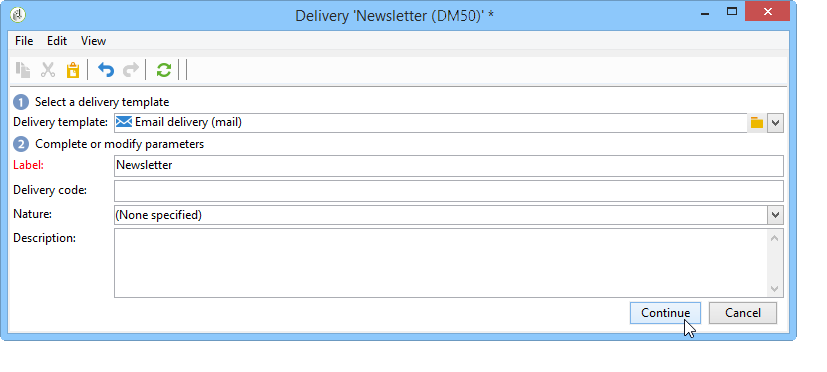

# Hoofdlettergebruik: een e-maillevering maken{#use-case-creating-an-email-delivery}

In dit geval leert u stappen om een e-maillevering te ontwerpen met de Adobe Campagne Digital Content Editor (DCE).

Ons uiteindelijke doel is om een levering te maken met een gepersonaliseerde sjabloon die het volgende bevat:

* Een rechtstreeks adres voor een ontvanger (met de voornaam en de tweede naam)
* Twee typen koppelingen naar een externe URL
* Een spiegelpagina
* Een koppeling naar een webtoepassing

>[!NOTE]
>
>Voordat u begint, moet u minstens één **HTML-sjabloon** hebben geconfigureerd voor het hosten van de inhoud van toekomstige leveringen.
>
>Zorg er bij de levering **[!UICONTROL Properties]** voor dat **[!UICONTROL Content editing mode]** (op het **[!UICONTROL Advanced]** tabblad) is ingesteld op **[!UICONTROL DCE]**. Raadpleeg de aanbevolen werkwijzen voor het bewerken van [inhoud om ervoor te zorgen dat de editor optimaal werkt](../../web/using/content-editing-best-practices.md).

## Stap 1 - Een levering maken {#step-1---creating-a-delivery}

Als u een nieuwe levering wilt maken, plaatst u de cursor op het tabblad **Campagnes** en klikt u op **Leveringen**. Klik vervolgens op de knop **Maken** boven de lijst met bestaande leveringen. Raadpleeg [deze pagina](../../delivery/using/about-email-channel.md)voor meer informatie over het maken van leveringen.

## Stap 2 - Een sjabloon selecteren {#step-2---selecting-a-template}

Selecteer een leveringssjabloon en geef uw levering een naam. Deze naam is alleen zichtbaar voor gebruikers van de Adobe Campagne Console en niet voor uw ontvangers. Deze kop wordt echter weergegeven in uw lijst met leveringen. Klik **[!UICONTROL Continue]**.

## Stap 3 - Inhoud selecteren {#step-3---selecting-a-content}

De Editor voor digitale inhoud wordt geleverd met verschillende out-of-the-box sjablonen met verschillende structuren (kolommen, tekstgebieden, enz.).

Selecteer de inhoudssjabloon die u wilt gebruiken en klik op de **[!UICONTROL Start with the selected content]** knop om de sjabloon weer te geven in de gemaakte levering.

U kunt ook HTML-inhoud die buiten Adobe Campaign is gemaakt, importeren door deze te selecteren **[!UICONTROL From a file]**.

U kunt deze inhoud opslaan als een sjabloon voor toekomstig gebruik. Nadat u een gepersonaliseerde inhoudssjabloon hebt gemaakt, kunt u deze voorvertonen in de lijst met sjablonen. Raadpleeg [Sjabloonbeheer](../../web/using/template-management.md)voor meer informatie hierover.

>[!CAUTION]
>
>Als u de **Adobe Campagne-webinterface** gebruikt, moet u een .zip-bestand importeren dat de HTML-inhoud en verwante afbeeldingen bevat.

## Stap 4 - Het ontwerpen van het bericht {#step-4---designing-the-message}

* De eerste en tweede naam van de ontvangers weergeven

   Als u de eerste en tweede naam van de ontvangers wilt invoegen in een tekstveld in de aflevering, klikt u op het gekozen tekstveld en plaatst u de cursor op de gewenste positie. Klik op het eerste pictogram op de pop-upwerkbalk en klik vervolgens op **[!UICONTROL Personalization block]**. Selecteer **[!UICONTROL Greetings]** en klik op **[!UICONTROL OK]**.

   

* Een koppeling invoegen in een afbeelding

   Als u ontvangers voor levering via een afbeelding naar een extern adres wilt sturen, klikt u op de desbetreffende afbeelding om de pop-upwerkbalk weer te geven. Plaats de cursor op het eerste pictogram en klik vervolgens **[!UICONTROL Link to an external URL]**. Raadpleeg [Een koppeling](../../web/using/editing-content.md#adding-a-link)toevoegen voor meer informatie.

   

   Voer de URL voor de koppeling in het veld **URL** in met de volgende notatie **https://www.myURL.com** en bevestig vervolgens de URL.

   U kunt de koppeling op elk gewenst moment wijzigen met de sectie rechts van het venster.

* Koppelingen in tekst invoegen

   Als u een externe koppeling wilt integreren in de tekst in uw bestelling, selecteert u een stuk tekst of een blok tekst en klikt u op het eerste pictogram in de pop-upwerkbalk. Klik **[!UICONTROL Link to an external URL]** en voer het koppelingsadres in het **[!UICONTROL URL]** veld in. Raadpleeg [Een koppeling](../../web/using/editing-content.md#adding-a-link)toevoegen voor meer informatie.

   U kunt de koppeling op elk gewenst moment wijzigen met de sectie rechts van het venster.

   >[!CAUTION]
   >
   >De oorspronkelijke tekst wordt vervangen door de tekst die in het **[!UICONTROL Label]** veld wordt ingevoerd.

* Een spiegelpagina toevoegen

   Om uw ontvangers toe te staan om uw leveringsinhoud in browser van het Web te bekijken, kunt u een verbinding aan een spiegelpagina in uw levering integreren.

   Klik op het tekstveld waarin u de koppeling wilt plaatsen. Klik op het eerste pictogram op de pop-upwerkbalk en selecteer **[!UICONTROL Personalization block]** vervolgens **[!UICONTROL Link to Mirror Page (MirrorPage)]**. Klik **[!UICONTROL Save]** om te bevestigen.

   

   >[!CAUTION]
   >
   >Het label van het verpersoonlijkingsblok vervangt automatisch de originele tekst in uw levering.

* Een koppeling naar een webtoepassing integreren

   Met de Digital Content Editor kunt u koppelingen naar webtoepassingen integreren vanuit uw Adobe Campagne-console, zoals een openingspagina of een formulierpagina. Voor meer op dit, verwijs naar [Verbinding aan een toepassing](../../web/using/editing-content.md#link-to-a-web-application)van het Web.

   Selecteer een tekstveld voor de koppeling naar een webtoepassing en klik op het eerste pictogram. Kies **[!UICONTROL Link to a Web application]**, selecteer dan de gewenste toepassing door het pictogram aan het eind van het gebied van de Toepassing **van het** Web te klikken.

   

   Klik op **Opslaan** om te bevestigen.

   >[!NOTE]
   >
   >Voor deze stap moet u ten minste één webtoepassing opslaan. Deze vindt u op het **[!UICONTROL Campaigns > Web applications]** tabblad van uw console.

## Stap 5 - de levering bewaren {#step-5---saving-the-delivery}

Wanneer de inhoud is geïntegreerd, slaat u de levering op door op **Opslaan** te klikken. Het wordt nu weergegeven in de lijst met leveringen op het **[!UICONTROL Campaigns > Deliveries]** tabblad.
