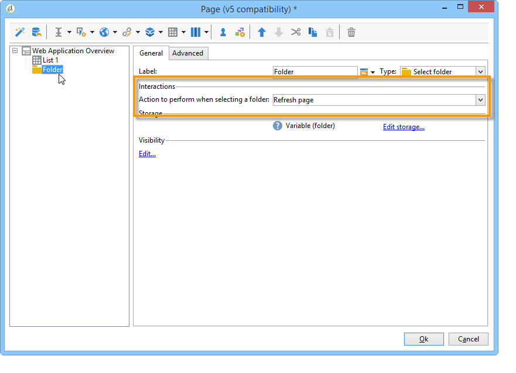

# Gebruik hoofdletters/kleine letters: overzichten maken{#use-cases-creating-overviews}

In het volgende voorbeeld, zullen wij overzicht-type de toepassingen van het Web tot stand brengen om alle toepassingen van het Web in uw gegevensbestand te tonen. Configureer de volgende elementen:

* een filter op de map (zie [Een filter toevoegen aan een map](#adding-a-filter-on-a-folder));
* een knoop voor het creëren van een nieuwe toepassing van het Web (verwijs naar het [Toevoegen van een knoop om een nieuwe toepassing](#adding-a-button-to-configure-a-new-web-application)van het Web te vormen),
* detailweergave voor elk item in de lijst (raadpleeg [Gegevens aan een lijst](#adding-detail-to-a-list)toevoegen);
* één filter per koppelingsbewerkingsgereedschap (zie [Een filter maken met een koppelingseditor](#creating-a-filter-using-a-link-editor));
* een koppeling Vernieuwen (raadpleeg [Een vernieuwingskoppeling](#creating-a-refresh-link)maken).


## Een webtoepassing van één pagina maken {#creating-a-single-page-web-application}

1. Creeer één enkele toepassing van het **[!UICONTROL Page]** Web en maak uitgaande overgangen en overgangen aan de volgende pagina onbruikbaar.

   

1. De paginatitel wijzigen.

   Deze titel zal in de overzichtskopbal en in het de toepassingsoverzicht van het Web verschijnen.

1. In de de toepassingseigenschappen van het Web, wijzig het teruggeven van uw toepassing door het **[!UICONTROL Single-page Web application]** malplaatje te selecteren.

   

1. Open de **[!UICONTROL Page]** activiteit van uw toepassing van het Web en open een lijst (**[!UICONTROL Static element > List]**).
1. Selecteer op het **[!UICONTROL Data]** tabblad van de lijst het type **[!UICONTROL Web applications]** document en de kolommen **[!UICONTROL Label]** , **[!UICONTROL Creation date]** en **[!UICONTROL Type of application]** uitvoer.
1. Maak in het **[!UICONTROL Filter]** subtabblad het volgende filter, zoals hieronder wordt weergegeven, om alleen webtoepassingen weer te geven en sjablonen uit te sluiten van uw weergave.

   

1. Sluit het configuratievenster van uw pagina en klik **[!UICONTROL Preview]**.

   De lijst van de toepassingen van het Web beschikbaar in uw gegevensbestand wordt getoond.

   

## Een filter toevoegen aan een map {#adding-a-filter-on-a-folder}

In een overzicht kunt u naar keuze toegang krijgen tot gegevens, afhankelijk van de locatie in de Adobe-campagnestructuur. Dit is een filter op een map. Pas het volgende proces toe om het aan uw overzicht toe te voegen.

1. Plaats uw curseur op de **[!UICONTROL Page]** knoop van uw toepassing van het Web en voeg een **[!UICONTROL Select folder]** element (**[!UICONTROL Advanced controls > Select folder]**) toe.
1. Klik in het **[!UICONTROL Storage]** venster dat verschijnt op de **[!UICONTROL Edit variables]** koppeling.
1. Wijzig het label van de variabele naar wens.
1. Wijzig de naam van de variabele met de **mapwaarde** .

   >[!NOTE]
   >
   >De naam van de variabele moet overeenkomen met de naam van het element dat is gekoppeld aan de map (gedefinieerd in het schema), in dit geval dus de **map** . U moet deze naam opnieuw gebruiken wanneer u naar de tabel verwijst.

1. Pas het **[!UICONTROL XML]** type toe op de variabele.

   

1. Selecteer de **[!UICONTROL Refresh page]** interactie.

   

1. Plaats de cursor in de lijst en verwijs op het **[!UICONTROL Advanced]** tabblad naar de variabele die u eerder op het **[!UICONTROL Folder filter XPath]** tabblad van de lijst hebt gemaakt. U moet de naam gebruiken van het element waarop de mapkoppeling betrekking heeft, namelijk de **map**.

   

   >[!NOTE]
   >
   >In dit stadium, is de toepassing van het Web niet binnen zijn toepassingscontext, kan het filter daarom niet op de omslag worden getest.

## Een knop toevoegen om een nieuwe webtoepassing te configureren {#adding-a-button-to-configure-a-new-web-application}

1. Plaats de cursor op het **[!UICONTROL Page]** element en voeg een koppeling (**[!UICONTROL Static elements > Link]**) toe.
1. Wijzig het koppelingsetiket aangezien het op de knoop in het overzicht zal verschijnen.

   In ons voorbeeld is het label **New**.

1. Voeg de volgende URL in het URL-veld in: **xtk://open/?schema=nms:webApp&amp;form=nms:newWebApp**.

   >[!NOTE]
   >
   >**nms:webApp** valt samen met het webtoepassingsschema.
   >
   >**nms:newWebApp** valt samen met de nieuwe wizard Webtoepassing maken.

1. Kies of u de URL in hetzelfde venster wilt weergeven.
1. Voeg het webtoepassingspictogram toe aan het afbeeldingsveld: **/nms/img/webApp.png**.

   Dit pictogram wordt weergegeven op de **[!UICONTROL New]** knop.

1. Voer de **knop** in het **[!UICONTROL Style]** veld in.

   Naar deze stijl wordt verwezen in de eerder geselecteerde **[!UICONTROL Single-page Web application]** sjabloon.

   

## Details toevoegen aan een lijst {#adding-detail-to-a-list}

Wanneer u een lijst in uw overzicht vormt, kunt u verkiezen om extra details voor elke ingang in uw lijst te tonen.

1. Plaats de cursor op het eerder gemaakte lijstelement.
1. Selecteer op het **[!UICONTROL General]** tabblad de **[!UICONTROL Columns and additional detail]** weergavemodus in de vervolgkeuzelijst.

   

1. Voeg op het **[!UICONTROL Data]** tabblad de kolommen **[!UICONTROL Primary key]** , **[!UICONTROL Internal name]** en **[!UICONTROL Description]** en selecteer de **[!UICONTROL Hidden field]** optie voor elke kolom.

   

   Op die manier is deze informatie alleen zichtbaar in de details van elke vermelding.

1. Voeg op het **[!UICONTROL Additional detail]** tabblad de volgende code toe:

   ```
   <div class="detailBox">
     <div class="actionBox">
       <span class="action"><a title="Open" class="linkAction" href="xtk://open/?schema=nms:webApp&form=nms:webApp&pk=
       <%=webApp.id%>">Open...</a></span>
       <% 
       if( webApp.@appType == 1 ) { //survey
       %>
       <span class="action"><a target="_blank" title="Reports" class="linkAction" href="/xtk/report.jssp?_context=selection&
         _schema=nms:webApp&_selection=<%=webApp.@id%>
         &__sessiontoken=<%=document.controller.getSessionToken()%>">Reports</a></span>
       <% 
       } 
       %>
     </div>
     <div>
       Internal name: <%= webApp.@internalName %>
     </div>
     <%
     if( webApp.desc != "" )
     {
     %>
     <div>
       Description: <%= webApp.desc %>
     </div>
     <% 
     } 
     %>
   </div>
   ```

>[!NOTE]
>
>JavaScript-bibliotheken vernieuwen zich vijf minuten op de server. U kunt de server opnieuw starten om te voorkomen dat wordt gewacht tot deze vertraging optreedt.

## De lijst filteren en bijwerken {#filtering-and-updating-the-list}

In deze sectie, zult u een filter voor het tonen van het overzicht van de toepassingen creëren van het Web die door een specifieke exploitant worden gecreeerd. Dit filter wordt gemaakt met een koppelingseditor. Nadat u een operator hebt geselecteerd, vernieuwt u de lijst om het filter toe te passen. hiervoor moet een koppeling Vernieuwen worden gemaakt.

Deze twee elementen worden in dezelfde container gegroepeerd om in het overzicht grafisch te worden gegroepeerd.

1. Plaats de cursor op het **[!UICONTROL Page]** element en selecteer **[!UICONTROL Container > Standard]**.
1. Stel het aantal kolommen in op **2**, zodat de koppelingseditor en de koppeling naast elkaar staan.

   

   Zie [deze sectie](../../web/using/about-web-forms.md)voor informatie over de indeling van elementen.

1. Pas **dottedFilter** toe.

   Naar deze stijl wordt verwezen in de eerder geselecteerde **[!UICONTROL Single-page Web applicatio]** sjabloon.

   

### Een filter maken met een koppelingseditor {#creating-a-filter-using-a-link-editor}

1. Plaats de cursor op de container die u in het vorige werkgebied hebt gemaakt en voeg een koppelingseditor in via het **[!UICONTROL Advanced controls]** menu.
1. Selecteer de **[!UICONTROL Variables]** optie in het opslagvenster dat automatisch wordt geopend, klik op de **[!UICONTROL Edit variables]** koppeling en maak een XML-variabele voor het filteren van gegevens.

   

1. Wijzig het label.

   Deze wordt naast het **[!UICONTROL Filter]** veld in het overzicht weergegeven.

1. Kies de lijst van Exploitant als toepassingsschema.

   

1. Plaats de cursor op het lijstelement en maak een filter via het **[!UICONTROL Data > Filter]** tabblad:

   * **** Uitdrukking: Externe sleutel van de koppeling &#39;Gemaakt door&#39;
   * **** Operator: is gelijk aan
   * **** Waarde: Variabelen (variabelen)
   * **** Wordt in aanmerking genomen: &#39;$(var2/@id)&#39;!=&#39;
   

>[!CAUTION]
>
>De gebruiker van de toepassing van het Web moet een geïdentificeerde exploitant met de aangewezen rechten van de Campagne van Adobe zijn om tot de informatie toegang te hebben. Dit type van configuratie zal niet voor de anonieme toepassingen van het Web werken.

### Een koppeling voor vernieuwen maken {#creating-a-refresh-link}

1. Plaats de cursor op de container en voeg een object in **[!UICONTROL Link]** via het **[!UICONTROL Static elements]** menu.
1. Wijzig het label.
1. Selecteer **[!UICONTROL Refresh data in a list]**.
1. Voeg de eerder gemaakte lijst toe.

   

1. Voeg het pictogram Vernieuwen toe op het **[!UICONTROL Image]** gebied: **/xtk/img/refresh.png **.
1. Gebruikend de soort-orde pijlen, reorganiseer de diverse elementen van uw toepassing van het Web zoals hieronder getoond.

   

De toepassing van het Web wordt nu gevormd. U kunt op het **[!UICONTROL Preview]** tabblad klikken om er een voorvertoning van weer te geven.


