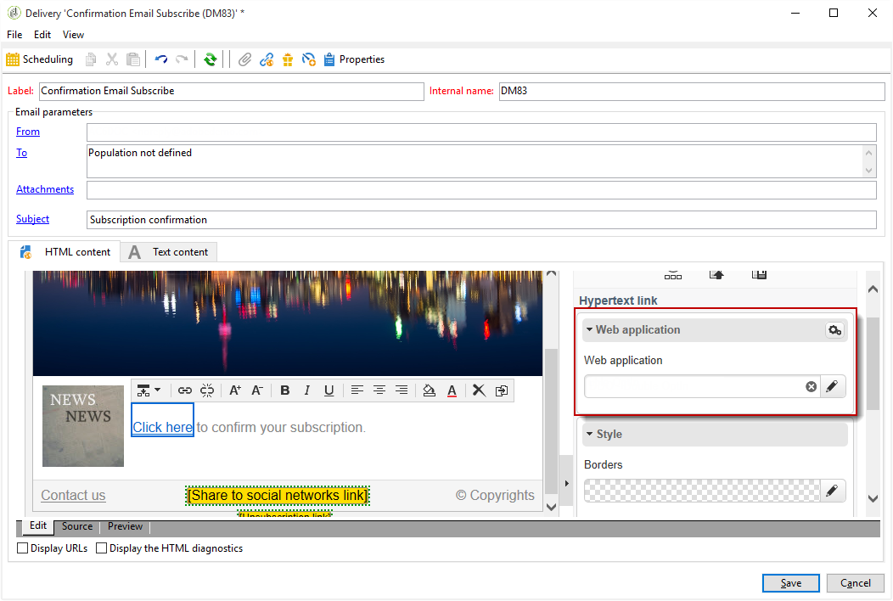
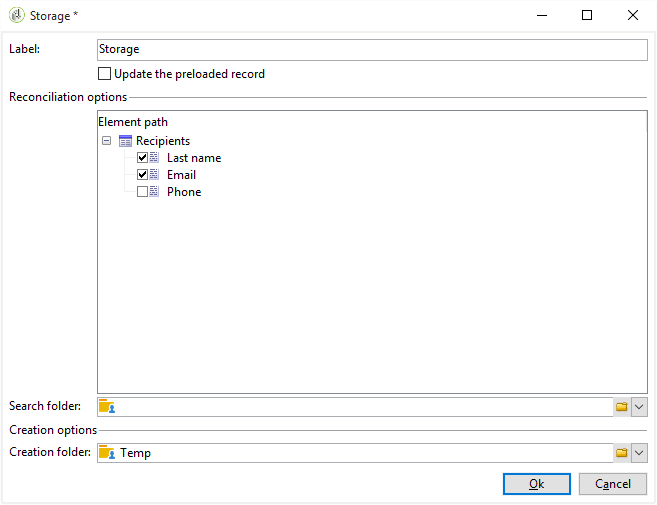
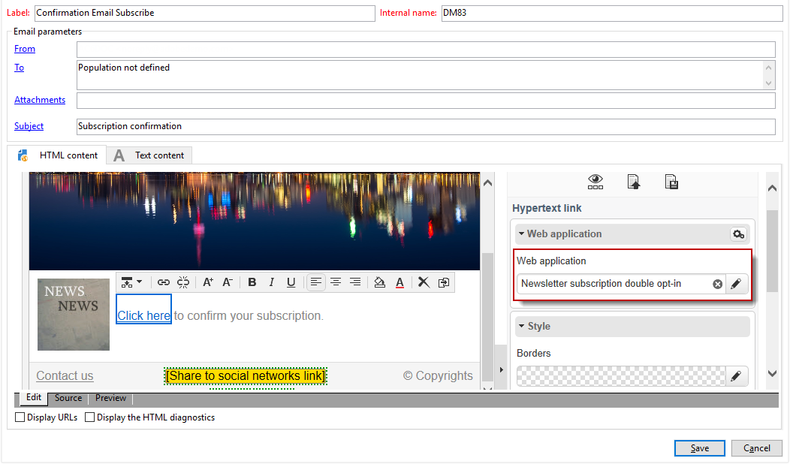
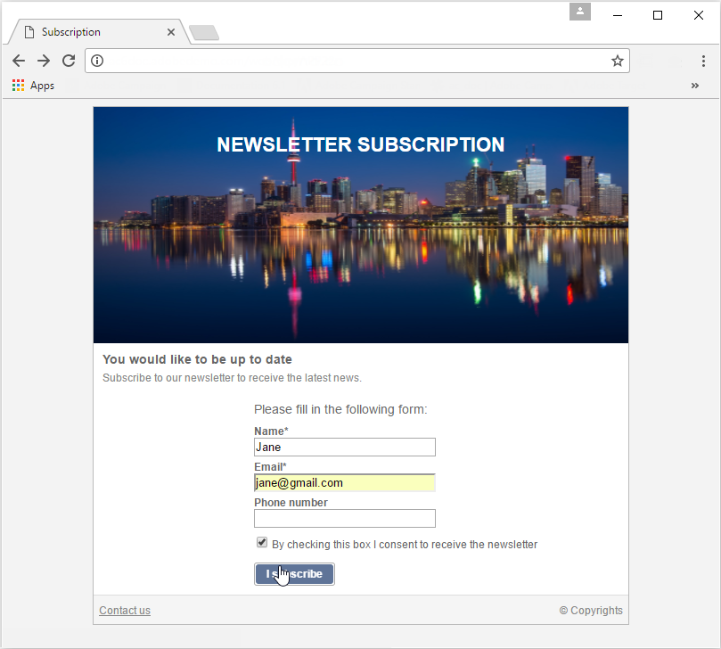
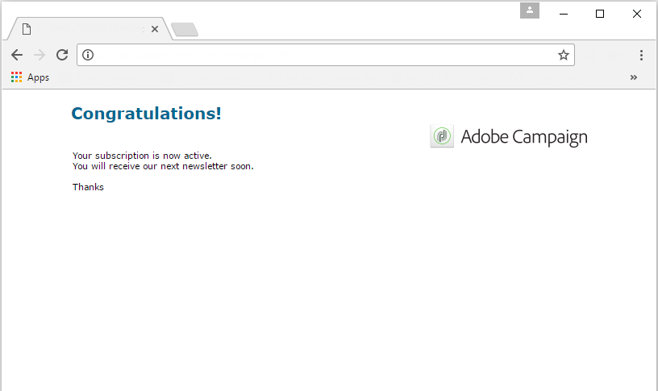

# Gebruik hoofdletters/kleine letters: webformulieren{#use-cases-web-forms}

## Abonnementsformulieren met dubbele aanmelding maken {#create-a-subscription--form-with-double-opt-in}

Wanneer u de informatiediensten aanbiedt, moeten de ontvangers intekenen om alle verbonden mededelingen te ontvangen. Om onjuiste mededelingen te vermijden en ervoor te zorgen de ontvanger opzettelijk wordt ingetekend, adviseren wij het verzenden van een verzoek van de abonnementsbevestiging om tot een dubbele opt-in te leiden. Het abonnement wordt pas van kracht nadat de gebruiker op de koppeling klikt die in het bevestigingsbericht is opgenomen.

Dit voorbeeld is gebaseerd op het volgende scenario:

1. Een abonnementsformulier voor nieuwsbrieven maken op een website die een selectievakje bevat voor het abonneren op een tijdelijke service. Met deze service kunt u berichten voor abonnementsbevestiging verzenden.
1. Het creëren van de levering van de abonnementsbevestiging met een leveringsmalplaatje verbonden aan de vorm van het Web. Het bevat de bevestigingskoppeling die het formulier oproept voor een abonnement op een nieuwsbrief en een goedkeuringsbericht voor een abonnement weergeeft.

### Stap 1 - Informatiediensten maken {#step-1---creating-information-services}

1. Maak de service voor abonnementen op nieuwsbrieven die aan uw ontvangers moet worden aangeboden. Raadpleeg [deze sectie](../../delivery/using/about-services-and-subscriptions.md)voor meer informatie over het maken van een nieuwsbrief.

   

1. Maak een tweede informatieservice, een tijdelijke service die is gekoppeld aan een leveringssjabloon voor het verzenden van abonnementsbevestigingsberichten.

   

### Stap 2 - Bevestigingsberichten maken {#step-2---creating-confirmation-messages}

De berichten van de bevestiging worden verzonden via een specifiek leveringsmalplaatje dat op het tijdelijke de dienstniveau van verwijzingen wordt voorzien.

1. Selecteer in het **[!UICONTROL Explorer]** vak **[!UICONTROL Resources > Templates > Delivery templates]**.
1. Maak een leveringssjabloon voor het verzenden van de bevestigingsberichten voor abonnementen.
1. Klik op de **[!UICONTROL To]** knop in het dialoogvenster **[!UICONTROL Email parameters]** om de leveringssjabloon te koppelen aan de doeltoewijzing voor abonnementen in plaats van aan ontvangers.

   

1. Aangezien de ontvangers van deze levering hun goedkeuring niet hebben bevestigd, worden ze nog steeds op de zwarte lijst gezet in de database. Om deze communicatie te ontvangen, moet u leveringen op basis van deze sjabloon toestaan aan ontvangers op de zwarte lijst.

   Klik hiertoe op het **[!UICONTROL Exclusions]** tabblad.

1. Klik op de **[!UICONTROL Edit...]** koppeling en schakel de **[!UICONTROL Exclude recipients who no longer want to be contacted (blacklist)]** optie uit.

   

   >[!CAUTION]
   >
   >Deze optie kan alleen in dit type context worden uitgeschakeld.

1. Pas de levering aan en voeg de bevestigingskoppeling in de inhoud van het bericht in. Met deze koppeling hebt u toegang tot het webformulier om de bevestiging van uw abonnement op te nemen.

   

1. Koppel uw URL met de DCE aan het webformulier. Aangezien het formulier Web nog niet is gemaakt, vervangt u de waarde zodra u het maakt.

   

1. Tot slot verbind dit malplaatje met de tijdelijke dienst eerder gecreeerd.

   

### Stap 3 - Het abonnementsformulier maken {#step-3---creating-the-subscription-form}

In het webformulier zijn zowel een abonnement als een bevestiging van een abonnement voor de ontvanger ingeschakeld.

De webformulierworkflow omvat de volgende activiteiten:


Hiervoor voert u de volgende stappen uit:

1. Maak een webformulier en kies de sjabloon **[!UICONTROL Newsletter subscription (subNewsletter)]**.

   

1. Op het **[!UICONTROL Edit]** lusje, moeten wij het bestaande werkschema vormen aangezien wij een bevestigingsbericht aan de ontvangers willen toevoegen die zich willen abonneren.

   Dubbelklik hiertoe op het **[!UICONTROL Preloading]** vak en configureer het als volgt.

   

   Dit betekent dat als de gebruiker dit formulier opent via de koppeling in het bevestigingsbericht, de profielgegevens worden geladen. Als zij tot het formulier van het Web via een pagina van de website toegang hebben, zal geen informatie worden geladen.

1. Voeg een **[!UICONTROL Test]** activiteit aan uw werkschema toe.

   

   De **[!UICONTROL Test]** activiteit kan op de ontvankelijke e-mail betrekking hebben. In dit geval, vorm het als volgt:

   

1. Voeg twee **[!UICONTROL Script]** activiteiten toe aan uw workflow.

   

   De eerste **[!UICONTROL Script]** activiteit zal ontvangers op een zwarte lijst zetten tot zij hun abonnement op de nieuwsbrief bevestigden. De inhoud ervan moet als volgt zijn:

   ```
   ctx.recipient.@blackList=1
   ```

   

   De tweede **[!UICONTROL Script]** activiteit staat leveringen toe om aan de gebruikers te worden verzonden en hen aan de nieuwsbrief in te schrijven. Met de laatste twee regels van het script kunt u de ontvangers van de tijdelijke map overbrengen naar een andere map en worden ze afgestemd op bestaande profielen zodra ze het abonnement hebben bevestigd.

   ```
   ctx.recipient.@blackList=0
   nms.subscription.Subscribe("INTERNAL_NAME_OF_THE_NEWSLETTER", ctx.recipient, false)
   ctx.recipient.folder = <folder name="nmsRootRecipient"/>
   nms.subscription.Unsubscribe("TEMP", ctx.recipient)
   ```

   >[!NOTE]
   >
   >De **[!UICONTROL Temp]** partitie kan ook regelmatig worden gewist met behulp van een workflow.

   

1. Dubbelklik op de **[!UICONTROL Subscription]** activiteit om het abonnementsformulier aan te passen en schakel een selectievakje in met de eerder gemaakte tijdelijke service.

   

1. Configureer de **[!UICONTROL Storage]** activiteit om de informatie op te slaan die op de formulierpagina is ingevoerd.

   Deze activiteit laat u ontvankelijke profielen in een specifiek tijdelijk tot stand brengen om hen los van de profielen in het gegevensbestand te plaatsen, waarnaar de mededelingen kunnen worden verzonden.

   

   >[!NOTE]
   >
   >U mag geen afstemmingsopties definiëren.

1. Voeg twee **[!UICONTROL End]** activiteiten toe om een bericht voor de gebruiker te tonen.

   In het tweede **[!UICONTROL End]** vak wordt het bevestigingsbericht weergegeven wanneer het abonnement is voltooid.

   

1. Zodra de vorm van het Web wordt gecreeerd en gevormd, kunt u het in het leveringsmalplaatje nu van verwijzingen voorzien om bevestigingsberichten te verzenden.

   

### Stap 4 - Het formulier publiceren en testen {#step-4---publishing-and-testing-the-form}

U kunt het formulier nu publiceren om het toegankelijk te maken voor gebruikers.


Het abonnement op de nieuwsbrief omvat de volgende stappen:

1. De gebruiker van de website meldt zich aan bij de abonnementspagina en keurt het formulier goed.

   

   Zij worden via een bericht in hun browser op de hoogte gesteld dat met hun verzoek rekening is gehouden.

   

   De gebruiker wordt toegevoegd aan de Adobe Campagne-database in de **[!UICONTROL Temp]** map en zijn profiel wordt op de zwarte lijst weergegeven totdat hij of zij zijn abonnement met de e-mail bevestigt.

   

1. Een bevestigingsbericht met een koppeling voor het goedkeuren van hun abonnement wordt naar hen verzonden.

   

1. Wanneer ze op deze koppeling klikken, wordt de goedkeuringspagina in hun browser weergegeven.

   

   In Adobe Campaign wordt het gebruikersprofiel bijgewerkt:

   * zij zijn niet langer op de zwarte lijst geplaatst;
   * zij zijn geabonneerd op de informatiedienst .

      

## Verschillende opties weergeven, afhankelijk van de geselecteerde waarden {#displaying-different-options-depending-on-the-selected-values}

In het volgende voorbeeld wordt de gebruiker gevraagd een voertuigtype te selecteren. U kunt de beschikbare voertuigcategorieën weergeven op basis van het geselecteerde type. Dit betekent dat de items die in de rechterkolom worden weergegeven, afhankelijk zijn van de keuze van de gebruiker:


* Wanneer de gebruiker &#39;Private Vehicle&#39; selecteert, wordt de keuze tussen &#39;Compact&#39; en &#39;Minivan&#39; aangeboden.

   

* Wanneer de gebruiker &#39;bedrijfsvoertuig&#39; selecteert, wordt een selectie weergegeven in een vervolgkeuzelijst:

   

In dit voorbeeld wordt het voertuigtype niet in de database opgeslagen. De vervolgkeuzelijst is als volgt geconfigureerd:


Deze informatie wordt opgeslagen in een lokale variabele.

De voorwaardelijke vertoning van de rechterkolom wordt gevormd in de containers:


* Voorwaardelijke zichtbaarheid van velden voor een particulier voertuig:

   

* Voorwaardelijke zichtbaarheid van velden voor bedrijfsvoertuigen:

   

