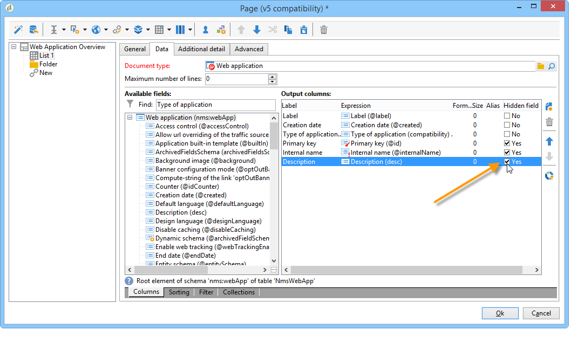
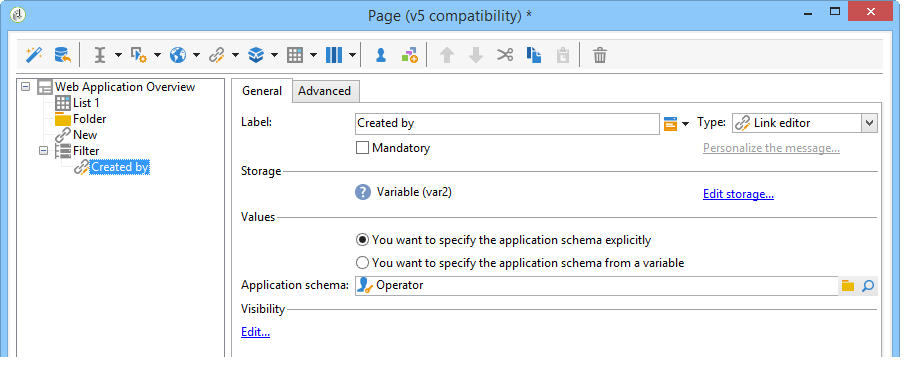

# Gebruiksscenario&#39;s: overzichtspagina&#39;s maken{#use-cases-creating-overviews}


In het volgende voorbeeld, zullen wij overzicht-type de toepassingen van het Web tot stand brengen om alle toepassingen van het Web in uw gegevensbestand te tonen. Configureer de volgende elementen:

* een filter op de omslag (verwijs naar [ Toevoegend een filter op een omslag ](#adding-a-filter-on-a-folder)),
* een knoop voor het creëren van een nieuwe toepassing van het Web (verwijs naar [ Toevoegend een knoop om een nieuwe toepassing van het Web ](#adding-a-button-to-configure-a-new-web-application) te vormen),
* detailvertoning voor elke ingang in de lijst (verwijs naar [ Toevoegend detail aan een lijst ](#adding-detail-to-a-list)),
* één filter per verbinding het uitgeven hulpmiddel (verwijs naar [ Creërend een filter gebruikend een verbindingsredacteur ](#creating-a-filter-using-a-link-editor)),
* Vernieuw verbinding (verwijs naar [ Creërend een verfrist verbinding ](#creating-a-refresh-link)).


## Een webtoepassing van één pagina maken {#creating-a-single-page-web-application}

1. Maak één **[!UICONTROL Page]** webtoepassing en schakel uitgaande overgangen en overgangen naar de volgende pagina uit.

   

1. De paginatitel wijzigen.

   Deze titel verschijnt in de overzichtskop en in het overzicht van de webapplicatie.

1. Wijzig in de eigenschappen van de webtoepassing de rendering van uw toepassing door de **[!UICONTROL Single-page Web application]** -sjabloon te selecteren.

   

1. Open de **[!UICONTROL Page]** activiteit van uw toepassing van het Web en open een lijst (**[!UICONTROL Static element > List]**).
1. Selecteer op het tabblad **[!UICONTROL Data]** van de lijst het type **[!UICONTROL Web applications]** document en de kolommen **[!UICONTROL Label]** , **[!UICONTROL Creation date]** en **[!UICONTROL Type of application]** uitvoer.
1. Maak in het subtabblad **[!UICONTROL Filter]** het volgende filter, zoals hieronder wordt weergegeven, om alleen webtoepassingen weer te geven en sjablonen uit te sluiten van uw weergave.

   

1. Sluit het configuratievenster van de pagina en klik op **[!UICONTROL Preview]** .

   De lijst van de toepassingen van het Web beschikbaar in uw gegevensbestand wordt getoond.

   

## Een filter toevoegen aan een map {#adding-a-filter-on-a-folder}

In een overzicht kunt u naar keuze toegang krijgen tot gegevens, afhankelijk van de locatie in de Adobe Campaign-structuur. Dit is een filter op een map. Pas het volgende proces toe om het aan uw overzicht toe te voegen.

1. Plaats uw curseur op de **[!UICONTROL Page]** knoop van uw toepassing van het Web en voeg een **[!UICONTROL Select folder]** element (**[!UICONTROL Advanced controls > Select folder]**) toe.
1. Klik in het **[!UICONTROL Storage]** -venster dat verschijnt op de koppeling **[!UICONTROL Edit variables]** .
1. Wijzig het label van de variabele naar wens.
1. Verander de veranderlijke naam met de **omslag** waarde.

   >[!NOTE]
   >
   >De naam van de variabele moet de naam van het element aanpassen verbonden aan de omslag (die in het schema wordt bepaald), d.w.z. **omslag** in dit geval. U moet deze naam opnieuw gebruiken wanneer u naar de tabel verwijst.

1. Pas het **[!UICONTROL XML]** type op de variabele toe.

   

1. Selecteer de interactie **[!UICONTROL Refresh page]** .

   

1. Plaats de cursor in de lijst en verwijs op het tabblad **[!UICONTROL Advanced]** naar de variabele die u eerder op het tabblad **[!UICONTROL Folder filter XPath]** van de lijst hebt gemaakt. U moet de naam van het element gebruiken betrokken bij de omslagverbinding, d.w.z. **omslag**.

   

   >[!NOTE]
   >
   >In dit stadium, is de toepassing van het Web niet binnen zijn toepassingscontext, kan het filter daarom niet op de omslag worden getest.

## Een knop toevoegen om een nieuwe webtoepassing te configureren {#adding-a-button-to-configure-a-new-web-application}

1. Plaats de cursor op het **[!UICONTROL Page]** element en voeg een link (**[!UICONTROL Static elements > Link]**) toe.
1. Wijzig het linklabel omdat het op de knop in het overzicht verschijnt.

   In ons voorbeeld, is het etiket **Nieuw**.

1. Neem volgende URL op het gebied URL op: **xtk://open/?schema=nms:webApp&amp;form=nms:newWebApp**.

   >[!NOTE]
   >
   >**nms:webApp** valt met het de toepassingsschema van het Web samen.
   >
   >**nms:newWebApp** valt met de nieuwe de toepassingsverwezenlijking van het Web medewerker samen.

1. Kies of u de URL in hetzelfde venster wilt weergeven.
1. Voeg het toepassingspictogram van het Web op het beeldgebied toe: **/nms/img/webApp.png**.

   Dit pictogram wordt weergegeven op de knop **[!UICONTROL New]** .

1. Ga **knoop** op het **[!UICONTROL Style]** gebied in.

   Naar deze stijl wordt verwezen in de eerder geselecteerde **[!UICONTROL Single-page Web application]** sjabloon.

   

## Details toevoegen aan een lijst {#adding-detail-to-a-list}

Wanneer u een lijst in uw overzicht vormt, kunt u verkiezen om extra details voor elke ingang in uw lijst te tonen.

1. Plaats de cursor op het eerder gemaakte lijstelement.
1. Selecteer op het tabblad **[!UICONTROL General]** de weergavemodus **[!UICONTROL Columns and additional detail]** in de vervolgkeuzelijst.

   

1. Voeg op het **[!UICONTROL Data]** tabblad de **[!UICONTROL Primary key]** kolom en **[!UICONTROL Internal name]** **[!UICONTROL Description]** toe en selecteer de **[!UICONTROL Hidden field]** optie voor elke kolom.

   

   Op deze manier is deze informatie alleen zichtbaar in de details van elke invoer.

1. Voeg op het **[!UICONTROL Additional detail]** tabblad de volgende code toe:

   ```
   <div class="detailBox">
     <div class="actionBox">
       <span class="action"><a title="Open" class="linkAction" href="xtk://open/?schema=nms:webApp&form=nms:webApp&pk=
       <%=webApp.id%>">Open...</a></span>
       <% 
       if( webApp.@appType == 1 ) { //survey
       %>
       <span class="action"><a target="_blank" title="Reports" class="linkAction" href="/xtk/report.jssp?_context=selection&
         _schema=nms:webApp&_selection=<%=webApp.@id%>
         &__sessiontoken=<%=document.controller.getSessionToken()%>">Reports</a></span>
       <% 
       } 
       %>
     </div>
     <div>
       Internal name: <%= webApp.@internalName %>
     </div>
     <%
     if( webApp.desc != "" )
     {
     %>
     <div>
       Description: <%= webApp.desc %>
     </div>
     <% 
     } 
     %>
   </div>
   ```

>[!NOTE]
>
>JavaScript-bibliotheken hebben vijf minuten nodig om te worden vernieuwd op de server. U kunt de server opnieuw starten om te voorkomen dat wordt gewacht tot deze vertraging optreedt.

## De lijst filteren en bijwerken {#filtering-and-updating-the-list}

In deze sectie, zult u een filter voor het tonen van het overzicht van de toepassingen creëren van het Web die door een specifieke exploitant worden gecreeerd. Dit filter wordt gemaakt met een koppelingseditor. Nadat u een operator hebt geselecteerd, vernieuwt u de lijst om het filter toe te passen. Hiervoor moet u een koppeling voor vernieuwen maken.

Deze twee elementen worden in dezelfde container gegroepeerd om in het overzicht grafisch te worden gegroepeerd.

1. Plaats de cursor op het element **[!UICONTROL Page]** en selecteer **[!UICONTROL Container > Standard]** .
1. Plaats het aantal kolommen aan **2**, zodat de verbindingsredacteur en de verbinding naast elkaar zijn.

   

   Voor informatie over elementenlay-out, verwijs naar [ deze sectie ](about-web-forms.md).

1. Pas **dottedFilter** toe.

   Naar deze stijl wordt verwezen in de eerder geselecteerde **[!UICONTROL Single-page Web application]** sjabloon.

   

### Een filter maken met een koppelingseditor {#creating-a-filter-using-a-link-editor}

1. Plaats de cursor op de container die u in het vorige werkgebied hebt gemaakt en voeg een koppelingseditor in via het menu **[!UICONTROL Advanced controls]** .
1. Selecteer in het opslagvenster dat automatisch wordt geopend de optie **[!UICONTROL Variables]** en klik vervolgens op de koppeling **[!UICONTROL Edit variables]** en maak een XML-variabele voor het filteren van gegevens.

   

1. Wijzig het label.

   Deze wordt naast het veld **[!UICONTROL Filter]** in het overzicht weergegeven.

1. Kies de lijst van Exploitant als toepassingsschema.

   

1. Plaats de cursor op het lijstelement en maak een filter via het tabblad **[!UICONTROL Data > Filter]** :

   * **Uitdrukking:** Buitenlandse sleutel van de &quot;Gemaakt door&quot;verbinding
   * **Exploitant:** evenaart aan
   * **Waarde:** Variabelen (variabelen)
   * **In aanmerking genomen indien:** &#39;$(var2/@id)&#39;!=&#39;&#39;

   

>[!CAUTION]
>
>De gebruiker van de webtoepassing moet een geïdentificeerde operator zijn met de juiste Adobe Campaign-rechten om toegang te krijgen tot de informatie. Dit type configuratie werkt niet voor anonieme webtoepassingen.

### Een koppeling voor vernieuwen maken {#creating-a-refresh-link}

1. Plaats de cursor op de container en voeg een **[!UICONTROL Link]** in via het menu **[!UICONTROL Static elements]** .
1. Wijzig het label.
1. Selecteer **[!UICONTROL Refresh data in a list]**.
1. Voeg de eerder gemaakte lijst toe.

   

1. Voeg toe verfrist pictogram op het **[!UICONTROL Image]** gebied: **/xtk/img/refresh.png**.
1. Gebruikend de soort-orde pijlen, reorganiseer de diverse elementen van uw toepassing van het Web zoals hieronder getoond.

   

De toepassing van het Web wordt nu gevormd. U kunt op de tab **[!UICONTROL Preview]** klikken om er een voorvertoning van weer te geven.


