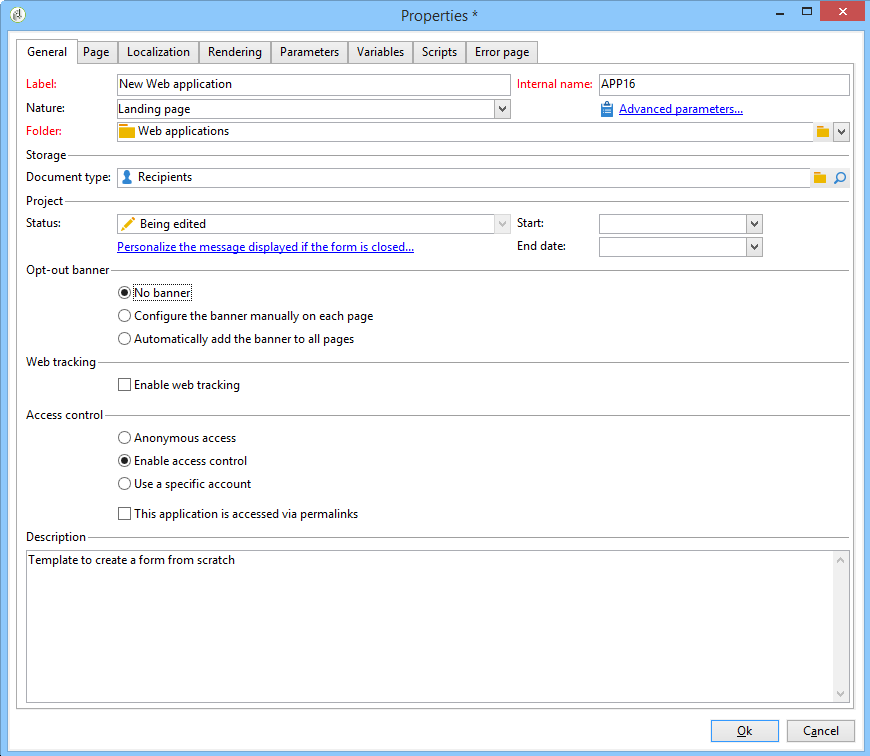

# Weigeren van webtoepassing{#web-application-tracking-opt-out}

Met Adobe Campaign kunt u het webgedrag van eindgebruikers die zich afmelden voor het volgen van gedragingen via cookies of webbakens, niet meer bijhouden. De functie omvat de mogelijkheid om een banner weer te geven om de eindgebruiker die optie te bieden; U kunt deze banners toevoegen aan webtoepassingen of landingspagina&#39;s.

Als een eindgebruiker via cookies of webbakens de functie voor het bijhouden van gedrag uitschakelt, wordt die informatie met JavaScript-API&#39;s naar de Adobe Campagne Tracking-server verzonden. Houd er rekening mee dat sommige rechtsgebieden vereisen dat de klant eindgebruikers een opt-in biedt voordat een opt-out kan worden aangeboden (of andere wettelijke vereisten heeft) en dat de klant verantwoordelijk is voor het naleven van de toepasselijke wetgeving.

## De banner configureren {#configuring-the-banner-}

Om binnen de toepassingen van het Web of het Landing pagina&#39;s te worden getoond, moet de banner worden gevormd.

Adobe Campagne wordt geleverd met een voorbeeldbanner die u aan uw behoeften moet aanpassen. Deze bannerversie wordt weergegeven als een aanpassingsblok in de map van het inhoudsmodel. Zie [deze pagina](../../delivery/using/personalization-blocks.md).

>[!CAUTION]
>
>Als u uw eigen banner wilt maken, moet u de uit-van-de-box banner personaliseren.

Om de banner te activeren, moet u de de toepassingseigenschappen van het Web vormen. Raadpleeg de sectie [Een webtoepassing](../../web/using/designing-a-web-application.md) ontwerpen.

Als Web het volgen wordt geactiveerd, kunt u of hebben:

* Geen banner.
* Configureer de banner handmatig op elke pagina: Schakel deze optie in en selecteer de banner op elke pagina in de pagina-eigenschappen.

   

* Voeg automatisch de banner toe aan alle pagina&#39;s: Selecteer de banner direct in de de toepassingseigenschappen van het Web.

   

>[!NOTE]
>
>Voor de v5 Web-toepassing met hetzelfde gedrag is een compatibiliteitsmodus beschikbaar.

De standaardbanner heeft de volgende structuur:

```
<div onClick="NL.ClientWebTracking.closeOptOutBanner(this);" id="defaultOptOutBanner">
  <p>Please insert your message here
   <a onClick="NL.ClientWebTracking.allow();" class="optout-accept">Accept</a>
   <a onClick="NL.ClientWebTracking.forbid();" class="optout-decline">Refuse</a>
  </p>
</div>
      
```

U moet het bericht **Voeg hier** het blok in dat uw trackinggegevens bevat. Deze vervanging zou in uw nieuw personaliseringsblok met betrekking tot de uit opt-banner moeten worden uitgevoerd.

De banner wordt geleverd met een specifieke CSS. U kunt de stijlen echter overschrijven bij het maken en configureren van een webpagina. Zie [deze pagina](../../web/using/content-editor-interface.md).

## De uitschakelcookie instellen met API {#setting-the-opt-out-cookie-using-api}

Adobe Campaign wordt geleverd met API&#39;s waarmee u de cookiewaarde kunt beheren en gebruikersvoorkeuren kunt ophalen.

De naam van het cookie is **acoptout**. De gemeenschappelijke waarden zijn:

* 0: gebruiker heeft Web tracking toegestaan (standaardwaarde)
* 1: gebruiker heeft webtracking verboden
* null: gebruiker heeft niet gekozen maar Web tracking is toegestaan omdat dit de standaardwaarde is

De beschikbare client-side API&#39;s om de banner aan te passen zijn:

* **NL.ClientWebTracking.allow()**: Hiermee stelt u de waarde van het uitschakelcookie in om webtracking toe te staan. Webspatiëring is standaard toegestaan.
* **NL.ClientWebTracking.forbid()**: Hiermee stelt u de waarde voor uitschakelcookies in om webtracking te verbieden. Webtracering vereist dat gebruikersinvoer wordt verboden.
* **NL.ClientWebTracking.closeOptOutBanner(bannerDomElt)**: Sluit de uitschakelcookie-banner nadat de gebruiker op de knop Accepteren of Weigeren heeft geklikt. (tijdens de terugkoppelfase van de klikgebeurtenis)

   bannerDomElt {DOMElement} het hoofd-DOM-element van de cookiebanner die moet worden verwijderd

* **NL.ClientWebTracking.hasUserPrefs()**: Retourneert true als de gebruiker zijn voorkeuren voor webspatiëring heeft gekozen.
* **NL.ClientWebTracking.getUserPrefs()**: Retourneert de uitschakelcookie-waarde die de voorkeuren van de gebruiker definieert.

Als u een JSSP moet schrijven, zijn de server-zij APIs beschikbaar:

* **NL.ServerWebTracking.generateOptOutBanner(escapeJs)**: Genereert de opmaak voor de uitschakelbanner die in de JSSP-pagina moet worden ingevoegd

   **escapeJs {Boolean}**: true wanneer de gegenereerde markering moet worden beschermd om in JavaScript te kunnen worden gebruikt.

   Deze geeft de HTML van de opmaakcode voor de uitschakelbanner die op de pagina moet worden afgedrukt.

* **NL.ServerWebTracking._displayOptOutBanner()**

   Retourneert true als de uitschakelbanner moet worden weergegeven nadat de beheerder een uitschakelbanner heeft geselecteerd

   Deze code wordt geroepen wanneer de beheerder reeds heeft gekozen om de Web het volgen opt-out banner te gebruiken.

   De banner moet worden weergegeven als de gebruiker er nog niet voor heeft gekozen om te worden bijgehouden.

* **NL.ServerWebTracking.renderOptOutBanner(escapeJs)**

   Geeft de prijsverhoging voor de opt-out banner door het in te voegen in de JSSP pagina terug. Wordt aangeroepen als in JPEG tussen &lt;% %>

   **escapeJs {Boolean}**: waar (true) wanneer de gegenereerde markering moet worden beschermd voor gebruik in JavaScript

JSSP-voorbeeld:

```
<%@ page import="/nl/core/shared/nl.js" %>
<!doctype html>
<%
NL.require('/nl/core/shared/webTracking.js');
NL.client.require('/nl/core/shared/webTracking.js');
%>
<html>
<head>
<%==NL.client.deps()%>
</head>

<body>

<!-- TEST USING SERVER API IN JSSP -->
<% 
var webTracking = new NL.ServerWebTracking(request, 'optOutBanner');
webTracking.renderOptOutBanner();
%>

<!-- TEST USING SERVER API IN A SCRIPT -->
<!--
<% 
var webTracking = new NL.ServerWebTracking(request, 'optOutBanner');
%>
<script>var el = document.createElement('div'); el.innerHTML =  "<% webTracking.renderOptOutBanner(true); %>";document.body.appendChild(el);</script>
-->

<!-- TEST OF THE CLIENT API -->
<!--
<div onClick="NL.ClientWebTracking.closeOptOutBanner(this);" id="defaultOptOutBanner">
  <p>Please insert your message here
   <a onClick="NL.ClientWebTracking.allow();" class="optout-accept">Accept</a>
   <a onClick="NL.ClientWebTracking.forbid();" class="optout-decline">Refuse</a>
  </p>
</div>
-->
</body>
</html>
```

