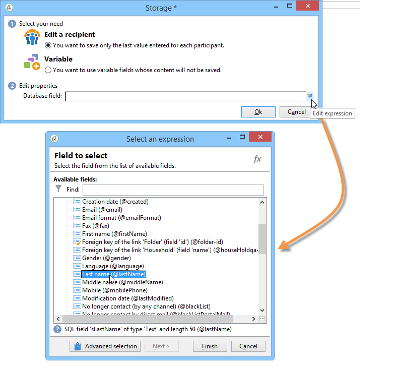

# Antwoorden webformulieren{#web-forms-answers}


## Responsopslagvelden {#response-storage-fields}

Antwoorden op formulieren kunnen worden opgeslagen in een veld van de database of tijdelijk in een lokale variabele. De opslagmodus voor antwoorden wordt gekozen tijdens het maken van velden. U kunt deze bewerken via de koppeling **[!UICONTROL Edit storage...]** .

Voor elk invoerveld in een formulier zijn de volgende opslagopties beschikbaar:


* **[!UICONTROL Edit a recipient]**

  U kunt een veld van de database selecteren: de antwoorden van gebruikers worden in dit veld opgeslagen. Voor elke gebruiker, slechts wordt de laatste ingegane waarde opgeslagen: het wordt toegevoegd aan hun profiel: Verwijs naar [ het Opslaan gegevens in het gegevensbestand ](#storing-data-in-the-database).

* **[!UICONTROL Variable]**

  Als u geen informatie in het gegevensbestand wilt opslaan, kunt u een variabele gebruiken. Lokale variabelen kunnen upstream worden gedeclareerd. Verwijs naar [ het Opslaan van gegevens in een lokale variabele ](#storing-data-in-a-local-variable).

### Gegevens opslaan in de database {#storing-data-in-the-database}

Als u de gegevens in een bestaand veld van de database wilt opslaan, klikt u op het pictogram **[!UICONTROL Edit expression]** en selecteert u dit in de lijst met beschikbare velden.



>[!NOTE]
>
>Het standaardverwijzingsdocument is **nms:ontvangend** schema. Als u het formulier wilt weergeven of een nieuw formulier wilt kiezen, selecteert u het in de lijst en klikt u op de knop **[!UICONTROL Properties]** .

### Gegevens opslaan in een lokale variabele {#storing-data-in-a-local-variable}

U kunt lokale variabelen gebruiken zodat zelfs als gegevens niet in het gegevensbestand worden opgeslagen, het op de pagina of de andere pagina&#39;s kan worden opnieuw gebruikt, bijvoorbeeld om voorwaarden op de vertoning van een gebied te plaatsen of een bericht te personaliseren.

Dit betekent dat u de waarde van een niet-opgeslagen veld kunt gebruiken om de weergave van een groep opties op de pagina toe te staan. Op de onderstaande pagina wordt het voertuigtype niet in de database opgeslagen:


De variabele wordt opgeslagen in een variabele die moet worden geselecteerd wanneer de vervolgkeuzelijst wordt gemaakt, of via de koppeling **[!UICONTROL Edit storage...]** .


Via de koppeling **[!UICONTROL Edit variables...]** kunt u bestaande variabelen weergeven en nieuwe variabelen maken. Klik op de knop **[!UICONTROL Add]** om een nieuwe variabele te maken.


De toegevoegde variabele is beschikbaar in de lijst met lokale variabelen wanneer de invoervelden van de pagina worden gemaakt.

>[!NOTE]
>
>Voor elk formulier kunt u variabelen upstream maken. Selecteer het formulier en klik op de knop **[!UICONTROL Properties]** om dit te doen. Het tabblad **[!UICONTROL Variables]** bevat de lokale variabelen voor het formulier.

**Voorbeeld van lokale opslag met conditionering**

In het bovenstaande voorbeeld wordt de container met gegevens over privévoertuigen alleen weergegeven als de optie **[!UICONTROL Private]** is geselecteerd in de vervolgkeuzelijst, zoals aangegeven in de zichtbaarheidsvoorwaarde:


Als de gebruiker een privé voertuig selecteert, biedt het formulier van het Web de volgende opties:


De container met de gegevens over bedrijfsvoertuigen wordt weergegeven als de optie &quot;Professional&quot; is geselecteerd, zoals aangegeven in de zichtbaarheidsvoorwaarde:


Dit betekent dat als de gebruiker een bedrijfsvoertuig selecteert, het formulier de volgende opties biedt:


## Gezamelde gegevens gebruiken {#using-collected-information}

Voor elk formulier kunnen de gegeven antwoorden opnieuw worden gebruikt in de velden of de labels. De volgende syntaxis moet worden gebruikt:

* Voor inhoud die is opgeslagen in een veld van de database:

  ```
  <%=ctx.recipient.@field name%
  ```

* Voor inhoud die is opgeslagen in een lokale variabele:

  ```
  <%= ctx.vars.variable name %
  ```

* Voor inhoud die is opgeslagen in een tekstveld HTML:

  ```
  <%== HTML field name %
  ```

  >[!NOTE]
  >
  >In tegenstelling tot de andere velden waarvoor `<%=` -tekens worden vervangen door escape-tekens, wordt de HTML-inhoud op dezelfde manier opgeslagen met de syntaxis van `<%==` .

## Webformulieren opslaan {#saving-web-forms-answers}

Als u de informatie wilt opslaan die op de pagina&#39;s van een formulier wordt verzameld, moet u een opslagvak in het diagram plaatsen.


U kunt dit vak op twee manieren gebruiken:

* Als het webformulier wordt geopend via een koppeling die in een e-mail wordt verzonden en als de gebruiker die de toepassing opent al in de database aanwezig is, kunt u de optie **[!UICONTROL Update the preloaded record]** controleren. Voor meer op dit, verwijs naar [ Leverend een vorm via e-mail ](publishing-a-web-form.md#delivering-a-form-via-email).

  In dit geval gebruikt Adobe Campaign de gecodeerde primaire sleutel van het gebruikersprofiel, een unieke id die aan elk profiel is toegewezen door Adobe Campaign. U moet de informatie vormen om via de preloaddoos vooraf te laden. Voor meer op dit, verwijs naar [ pre-ladend de vormgegevens ](publishing-a-web-form.md#pre-loading-the-form-data).

  >[!CAUTION]
  >
  >Met deze optie worden de gebruikersgegevens genegeerd, inclusief het e-mailadres als er een veld is waarin de gegevens moeten worden ingevoerd. Het kan niet worden gebruikt om nieuwe profielen te maken en vereist het gebruik van een voorlaadvenster in het formulier.

* Als u de gegevens van ontvangers in de database wilt verrijken, bewerkt u het opslagvak en selecteert u de afstemmingssleutel. Voor intern gebruik (meestal een intranetsysteem) of voor een formulier dat wordt gebruikt om nieuwe profielen te maken, kunt u bijvoorbeeld het (de) afstemmingsveld(en) selecteren. De doos biedt alle gebieden van het gegevensbestand aan die in de diverse pagina&#39;s van de toepassing van het Web worden gebruikt:

  

Standaard worden de gegevens door een bewerking **[!UICONTROL Update or insertion]** in de database geïmporteerd: als het element in de database aanwezig is, wordt het element bijgewerkt (bijvoorbeeld de geselecteerde nieuwsbrief of het ingevoerde e-mailadres). Als deze niet bestaat, wordt de informatie toegevoegd.

U kunt dit gedrag echter wijzigen. Selecteer hiertoe de basis van het element en selecteer de uit te voeren bewerking in de vervolgkeuzelijst:


U kunt een zoekmap selecteren voor afstemming en de map waarin nieuwe profielen worden gemaakt. Als deze velden leeg zijn, worden de profielen gezocht naar en gemaakt in de standaardmap van de operator.

>[!NOTE]
>
>Mogelijke bewerkingen zijn: **[!UICONTROL Simple reconciliation]**, **[!UICONTROL Update or insertion]**, **[!UICONTROL Insertion]**, **[!UICONTROL Update]**, **[!UICONTROL Deletion]** .\
>De standaardmap van de operator is de eerste map waarvoor de operator schrijfmachtigingen heeft.\
>Zie [deze sectie](../../platform/using/access-management.md).
