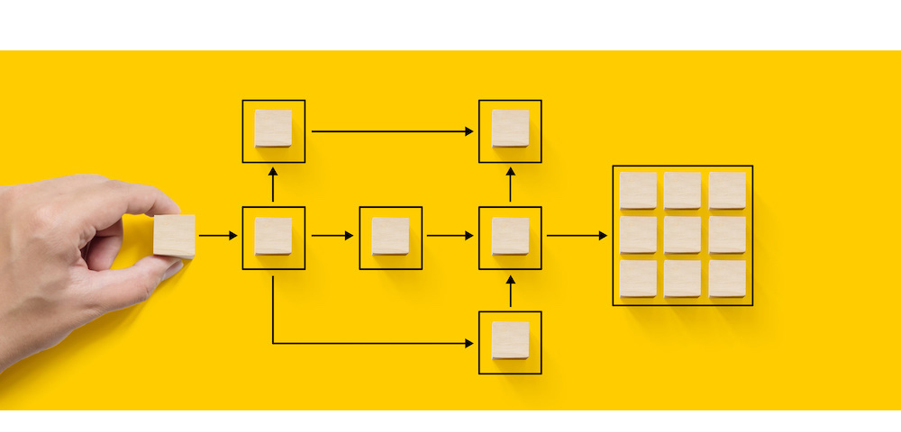

# Automatiseren met workflows {#gs-workflows}

Adobe Campaign bevat een workflowmodule om het volledige scala aan processen en taken in de verschillende modules van de applicatieserver te organiseren. Met deze uitgebreide grafische omgeving kunt u processen ontwerpen, zoals segmentatie, uitvoering van campagnes, bestandsverwerking, menselijke participatie, enzovoort. Deze processen worden uitgevoerd en bijgehouden door de workflowengine.

U kunt bijvoorbeeld een workflow gebruiken om een bestand van een server te downloaden, het te decomprimeren en vervolgens records in de Adobe Campaign-database te importeren.

Een workflow kan ook een of meer operatoren omvatten die op de hoogte moeten worden gebracht of die keuzes kunnen maken en processen kunnen goedkeuren. Op deze manier is het mogelijk om een leveringsactie te maken, een taak toe te wijzen aan een of meer operatoren om aan content te werken, doelen op te geven en proeven goed te keuren voordat de levering wordt gestart.

Workflows vinden plaats in verschillende contexten en fasen van het campagnemanagementproces.

Meer over werkstroombeheer leren, gelieve te verwijzen naar de [ documentatie van de Campagne v8 ](https://experienceleague.adobe.com/docs/campaign/automation/workflows/introduction/about-workflows.html) {target=_blank}.

{width="40%"}

Leer de belangrijkste stappen met betrekking tot workflowbeheer:

* [ de activiteiten van het Werkschema ](https://experienceleague.adobe.com/docs/campaign/automation/workflows/wf-activities/activities.html) {target=_blank}: Een activiteit beschrijft een taakmalplaatje. De werkstromen omvatten het richten, debietcontrole, actie en gebeurtenisactiviteiten.

* [ bouwt een werkschema ](https://experienceleague.adobe.com/docs/campaign/automation/workflows/introduction/build-a-workflow.html) {target=_blank}: Leer hoe te om het richten, campagne en technische werkschema&#39;s tot stand te brengen en in werking te stellen.

* [ Beste praktijken ](https://experienceleague.adobe.com/docs/campaign/automation/workflows/introduction/workflow-best-practices.html) {target=_blank}: Leer over de richtlijnen om het werkschemaprestaties van de Campagne te optimaliseren, uw werkschemaontwerp te verbeteren en de correcte montages te selecteren.

* [ werkschema&#39;s van de Monitor ](https://experienceleague.adobe.com/docs/campaign/automation/workflows/monitoring-workflows/monitor-workflow-execution.html) {target=_blank}: Leer hoe te werkschemauitvoering te controleren om ervoor te zorgen dat alles correct loopt.

* {het gebruiksgevallen van het 0} Werkschema ](https://experienceleague.adobe.com/docs/campaign/automation/workflows/use-cases/workflow-use-cases.html) {target=_blank}: Leer verschillende contexten waarin de werkschema&#39;s kunnen worden gebruikt en hoe te om hen door gebruiksgevallen van begin tot eind uit te voeren.[

<!--

Adobe Campaign uses workflows to:

* Carry out targeting campaigns. [Learn more](building-a-workflow.md#implementation-steps-)
* Build campaigns: for each campaign, the **[!UICONTROL Workflow]** tab lets you build the target and create the deliveries. [Learn more](building-a-workflow.md#campaign-workflows)
* Perform technical processes: cleanup, collecting tracking information or provisional calculations. [Learn more](building-a-workflow.md#technical-workflows)

A workflow can mean both a process definition (the workflow model, which is a representation of what is supposed to happen) and an instance of this process (a workflow instance, which is a representation of what is actually happening).

The workflow template describes the various tasks to be performed and how they are linked together. The task templates are called activities and are represented by icons. They are linked together by transitions.

Each workflow contains:

* **[!UICONTROL Activities]**

  An activity describes a task template. The various activities available are represented on the diagram by icons. Each type has common properties and specific properties. For example, while all activities have a name and label, only the **[!UICONTROL Approval]** activity has an assignment.

  In a workflow diagram, a given activity can produce multiple tasks, in particular when there is a loop or recurrent (periodic) actions.

  All workflow activities are listed in [this section](about-activities.md), including use cases and samples.

* **[!UICONTROL Transitions]**

  Transitions enable you to link activities and to define their sequence. A transition links a source activity to a destination activity. There are several sorts of transitions, which depend on the source activity. Some transitions have additional parameters such as a duration, a condition or a filter.

  A transition which is not linked to a destination activity is colored orange and the arrow head is shown as a diamond.

  >[!NOTE]
  >
  >A workflow containing unterminated transitions can still be executed: a warning message will be generated and the workflow will pause once it reaches the transition but it will not generate an error. It is thus possible to start a workflow without it being finished and to add to it as you go along.

  For more information about how to build a workflow, refer to [this section](building-a-workflow.md).

* **[!UICONTROL Worktables]**

  The worktable contains all the information carried by the transition. Each workflow uses several worktables. The data conveyed in these tables can be accelerated and used throughout the workflow's life cycle, as long as it is not purged. Indeed, unneeded tables are purged each time the workflow is passivated, and possibly during the execution of the largest workflows to avoid overloading the server.

  Learn more on workflow data and tables in [this section](how-to-use-workflow-data.md).

## Key principles and best practices{#principles-workflows}

Refer to these sections to find guidance and best practices to automate processes with workflows:

* Learn more about workflow activities in [this page](how-to-use-workflow-data.md).
* Learn how to build a workflow in [this section](building-a-workflow.md).
* Discover how to use workflows to import data in Campaign in [this section](../../platform/using/import-export-workflows.md).
* Workflow best practices are detailed in [this page](workflow-best-practices.md).
* Find guidance about workflow execution in [this section](starting-a-workflow.md).
* Learn how to monitor workflows in [this page](monitoring-workflow-execution.md).
* Learn how to grant access to users to use workflows in [this page](managing-rights.md).

-->