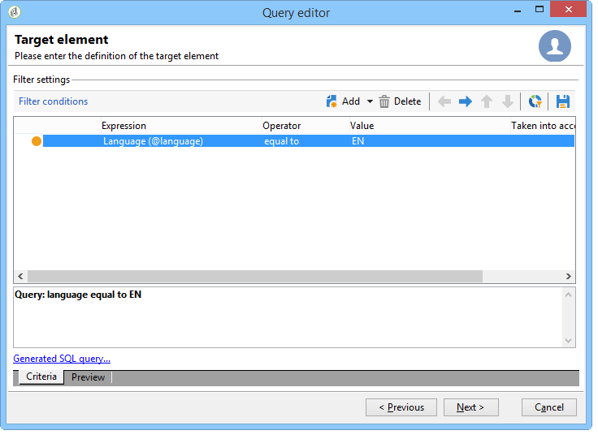

# Een berekend nummeringstype toevoegen {#adding-an-enumeration-type-calculated-field}

Hier willen wij een vraag met een **[!UICONTROL Enumerations]** type berekend gebied tot stand brengen. Met dit veld wordt een extra kolom gegenereerd in het venster met de gegevensvoorvertoning. Deze kolom zal de numerieke waarden specificeren die als resultaat voor elke ontvanger (0, 1 en 2) zijn teruggekeerd. Aan elke waarde in de nieuwe kolom wordt een geslacht toegewezen: &quot;Mannelijk&quot; voor &quot;1&quot;, &quot;Vrouwelijk&quot; voor &quot;2&quot; of &quot;Niet aangegeven&quot; als de waarde gelijk is aan &quot;0&quot;.

* Welke tabel moet worden geselecteerd?

   De tabel met ontvangers (nms:ontvanger)

* Te selecteren velden in de uitvoerkolom?

   Achternaam, voornaam, geslacht

* Aan welke criteria wordt de informatie gefilterd?

   De taal van de ontvanger

Voer de volgende stappen uit:

1. Open de Algemene vraagredacteur en selecteer de Ontvangerlijst (**[!UICONTROL nms:recipient]**).
1. Selecteer **[!UICONTROL Data to extract]**, **[!UICONTROL First name]** en **[!UICONTROL Gender]** in het venster **[!UICONTROL Last name]**.

   

1. Klik in het venster **[!UICONTROL Sorting]** op **[!UICONTROL Next]**: voor dit voorbeeld is geen sortering nodig .
1. In **[!UICONTROL Data filtering]** selecteert u **[!UICONTROL Filtering conditions]**.
1. Stel in het venster **[!UICONTROL Target element]** een filtervoorwaarde in om ontvangers te verzamelen die Engels spreken.

   

1. Klik in het venster **[!UICONTROL Data formatting]** op **[!UICONTROL Add a calculated field]**.

   

1. Ga naar het **[!UICONTROL Type]** venster van **[!UICONTROL Export calculated field definition]** en selecteer **[!UICONTROL Enumerations]**.

   Definieer de kolom waarnaar het nieuwe berekende veld moet verwijzen. Selecteer hiertoe de kolom **[!UICONTROL Gender]** in het vervolgkeuzemenu van het veld **[!UICONTROL Source column]**: de doelwaarden komen overeen met de kolom **[!UICONTROL Gender]**.

   

   Definieer de waarden **Source** en **Destination**: de bestemmingswaarde maakt het vraagresultaat gemakkelijker te lezen. Deze vraag zou ontvankelijk geslacht moeten terugkeren en het resultaat zal of 0, 1, of 2 zijn.

   Voor elke &quot;bron-bestemming&quot;lijn die moet worden ingegaan, klik **[!UICONTROL Add]** in **[!UICONTROL List of enumeration values]**:

   * Voer in de kolom **[!UICONTROL Source]** de bronwaarde voor elk geslacht (0,1,2) in een nieuwe regel in.
   * Voer in de kolom **[!UICONTROL Destination]** de waarden in: &quot;Niet aangegeven&quot; voor regel &quot;0&quot;, &quot;Mannelijk&quot; voor regel &quot;1&quot; en &quot;Vrouwelijk&quot; voor regel &quot;2&quot;.

   Selecteer de functie **[!UICONTROL Keep the source value]**.

   Klik **[!UICONTROL OK]** om het berekende gebied goed te keuren.

   

1. Klik in het venster **[!UICONTROL Data formatting]** op **[!UICONTROL Next]**.
1. **[!UICONTROL start the preview of the data]** in het voorvertoningsvenster.

   De aanvullende kolom definieert het geslacht van 0, 1 en 2:

   * 0 voor &quot;Niet aangegeven&quot;
   * 1 voor &quot;Mannelijk&quot;
   * 2 voor &quot;Vrouwelijk&quot;

   

   Als u bijvoorbeeld geen geslacht &quot;2&quot; opgeeft in **[!UICONTROL List of enumeration values]** en de functie **[!UICONTROL Generate a warning and continue]** van het veld **[!UICONTROL In other cases]** is geselecteerd, wordt een waarschuwingslogboek weergegeven. Dit logbestand geeft aan dat geslacht &quot;2&quot; (vrouwelijk) niet is ingevoerd. Deze wordt weergegeven in het veld **[!UICONTROL Logs generated during export]** van het venster met gegevensvoorvertoning.

   

   Neem een ander voorbeeld en zeg dat de opsommingswaarde &quot;2&quot;niet is ingegaan. Selecteer de functie **[!UICONTROL Generate an error and reject the line]**: alle geslachten die onder &quot; 2 &quot; vallen , zullen anomalieën veroorzaken en de overige informatie op de regel ( voornaam en achternaam , enz . ) wordt niet geëxporteerd. Er wordt een foutenlogboek weergegeven in het veld **[!UICONTROL Logs generated during export]** van het venster met de gegevensvoorvertoning. Dit logboek wijst erop dat de opsommingswaarde &quot;2&quot;niet ingegaan is.

   
