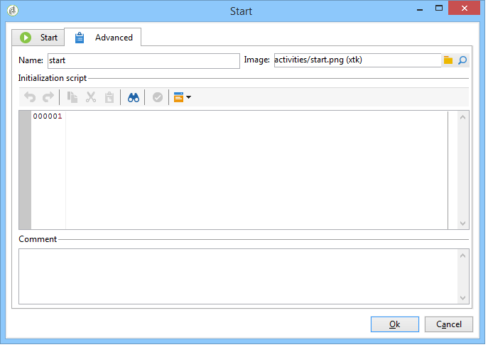

# Geavanceerde parameters{#advanced-parameters}

Het eigenschappenscherm van een activiteit heeft een **[!UICONTROL Advanced]** lusje dat u een gedrag in het geval van fouten, de uitvoeringsperiode voor de activiteit laat bepalen; en kunt u een initialisatiescript invoeren. Er zijn twee versies van dit tabblad:

* een vereenvoudigde versie ( bijvoorbeeld voor **[!UICONTROL Start]** en **[!UICONTROL End]** activiteiten )

   

* een gedetailleerdere versie (bijvoorbeeld voor de **[!UICONTROL Query]** activiteit)

   

De velden die op het **[!UICONTROL Advanced]** tabblad moeten worden ingevoerd, worden in de volgende secties beschreven.

## Naam {#name}

Dit veld bevat de interne naam van de activiteit.

## Afbeelding {#image}

In dit veld kunt u de afbeelding wijzigen die aan een activiteit is gekoppeld. Raadpleeg voor meer informatie: Afbeeldingen [van activiteiten](../../workflow/using/managing-activity-images.md)beheren.

## Uitvoering {#execution}

In dit veld kunt u de actie definiëren die moet worden uitgevoerd wanneer de taak wordt geactiveerd. Er zijn drie mogelijke opties:

Deze opties worden over het algemeen geselecteerd in het winkelwagentje door met de rechtermuisknop op de activiteit te klikken.

* **[!UICONTROL Normal]**: de activiteit wordt uitgevoerd zoals gebruikelijk.
* **[!UICONTROL Do not activate]**: deze taak en alle volgende taken (in dezelfde vertakking) worden niet uitgevoerd.
* **[!UICONTROL Activate but do not execute]**: deze taak en alle volgende taken (in dezelfde vertakking) worden automatisch gestopt. Dit kan handig zijn als u er wilt zijn wanneer de taak wordt gestart. Als u de taak handmatig wilt uitvoeren, klikt u met de rechtermuisknop op de activiteit en selecteert u **[!UICONTROL Normal execution]**.

## affiniteit {#affinity}

In dit veld kunt u de uitvoering van een activiteit op een specifieke computer forceren. Raadpleeg voor meer informatie: [Dichtheid](../../workflow/using/managing-propensity.md)beheren.

## Max. uitvoeringstermijn {#max--execution-period}

In dit veld kunt u een waarschuwing instellen wanneer de taak te lang duurt. Het heeft geen invloed op de workflowbewerking. Als de taak niet tegen de tijd wordt gebeëindigd **[!UICONTROL Max. execution period]** is, zal de **[!UICONTROL Instance monitoring]** pagina een waarschuwing voor dit werkschema tonen. Deze pagina is toegankelijk via het **[!UICONTROL Monitoring]** tabblad van de startpagina.

## Gedrag {#behavior}

In dit veld kunt u het gedrag definiëren dat moet worden toegepast bij het gebruik van asynchrone taken. Er zijn twee mogelijke opties:

* **[!UICONTROL Several tasks authorized]**: verscheidene taken kunnen tegelijkertijd worden uitgevoerd, zelfs als eerste niet gebeëindigd is.
* **[!UICONTROL The current task has priority]**: de lopende taken hebben voorrang . Zolang een taak bezig is, zal geen andere taak worden uitgevoerd.

## Tijdzone {#time-zone}

In dit veld kunt u de tijdzone van de activiteit selecteren. Voor meer informatie hierover: Tijdzones [beheren](../../workflow/using/managing-time-zones.md).

## Bij fouten {#in-case-of-errors}

In dit veld kunt u de actie definiëren die moet worden uitgevoerd wanneer de activiteit fouten bevat. Er zijn twee mogelijke opties:

* **[!UICONTROL Stop the process]**: de workflow wordt automatisch gestopt. De status verandert in **[!UICONTROL Failed]**. Als het probleem is opgelost, start u de workflow opnieuw.
* **[!UICONTROL Ignore]**: deze taak en alle volgende taken (in dezelfde vertakking) worden niet uitgevoerd. Dit kan handig zijn voor terugkerende taken. Als de tak een eerder geplaatste planner heeft, zal het zoals gewoonlijk op de volgende uitvoeringsdatum beginnen.

## Initialisatiescript {#initialization-script}

In dit veld kunt u variabelen initialiseren of eigenschappen van activiteit wijzigen. Raadpleeg voor meer informatie: JavaScript-scripts en -sjablonen .

## Opmerking {#comment}

Het **[!UICONTROL Comment]** veld is een gratis veld waarin u een beschrijving kunt toevoegen.
