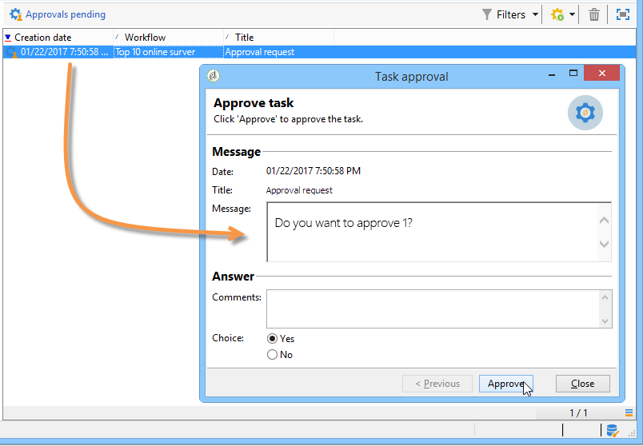

# Goedkeuring{#approval}

Voor een **goedkeuringstaak** is de deelname van een exploitant vereist. De operator krijgt een taak toegewezen en kan per e-mail reageren met de webpagina die is gekoppeld in het e-mailbericht of via de console.

## Taaktoewijzing {#task-assignment}

Standaard wordt de goedkeuring toegewezen aan een groep operatoren. Deze groep vertegenwoordigt een rol, bijvoorbeeld &#39;Newsletter-inhoudsgroep&#39; of &#39;Newsletter-doelgroep&#39;. Elke exploitant in de groep kan antwoorden, maar alleen het eerste antwoord wordt in aanmerking genomen (behalve in het geval van meerdere goedkeuringen).

Indien nodig, kunt u de goedkeuringstaak aan één enkele exploitant of een reeks exploitanten toewijzen die door een filter worden bepaald.

* Als u één operator wilt selecteren, selecteert u de **[!UICONTROL Operator]** waarde in het **[!UICONTROL Assignment type]** veld en selecteert u de relevante operator in de vervolgkeuzelijst van het **[!UICONTROL Assignee]** veld.

   

   >[!CAUTION]
   >
   >Alleen de gekozen exploitant wordt gemachtigd de taak goed te keuren.

* U kunt een query definiëren voor het filteren van goedkeurende operatoren. Selecteer hiertoe de **[!UICONTROL Filter]** waarde in het **[!UICONTROL Assignment type]** veld en klik op de **[!UICONTROL Advanced parameters...]** koppeling om filtervoorwaarden te definiëren, zoals in het volgende voorbeeld wordt getoond:

   

In het geval van één enkele goedkeuring wordt de overgang die overeenkomt met de keuze van de exploitant geactiveerd en is de taak voltooid: de andere marktdeelnemers kunnen niet antwoorden .

In het geval van meerdere goedkeuringen zijn overgangen die overeenkomen met de keuze van elke exploitant ingeschakeld. De taak is voltooid wanneer alle exploitanten van de groep hebben geantwoord, of wanneer de taak is verlopen.

Deze activiteit blokkeert geen verwerking, en het werkschema kan andere taken uitvoeren terwijl het wachten op een antwoord.

Een exploitant kan de taken goedkeuren die aan die exploitant van de console worden toegewezen. Een exploitant met beheerderrechten kan de taken bekijken en schrappen die aan om het even welke exploitant worden toegewezen, maar kan niet op hen antwoorden.

Het wijzigen van de titel of de berichttekst van de activiteit beïnvloedt niet de huidige taken, maar anderzijds, beïnvloedt het wijzigen van de mogelijke keuzen direct de huidige taken, die automatisch de nieuwe lijst van keuzen erven.

**Taken voor het type goedkeuring** zijn toegankelijk via het **[!UICONTROL Administration > Production > Objects created automatically > Approvals pending]** knooppunt: operatoren hebben rechtstreeks via deze weergave toegang tot het goedkeuringsformulier.

## Eigenschappen {#properties}

Aanpassingsvariabelen kunnen worden gebruikt in het bericht dat naar revisoren wordt verzonden. Zij kunnen in de berichttitel of het lichaam worden opgenomen.

Dit **[!UICONTROL Title]** veld bevat de titel van het bericht: Dit is het onderwerp van het verzonden e-mailbericht. De titel en de berichttekst zijn JavaScript-sjablonen en kunnen daarom waarden bevatten die zijn berekend op basis van de context van de workflow.

In het onderste gedeelte van de editor kunt u de lijst met mogelijke antwoorden definiëren. Er is een overgang die overeenkomt met elk antwoord. De naam is de interne id en het label is de tekst die in de keuzelijst wordt weergegeven.

Klik op de **[!UICONTROL Advanced parameters...]** koppeling om de leveringssjabloon te selecteren die moet worden gebruikt om operatoren op de hoogte te brengen. De standaardsjabloon (interne naam &#39;notifyAssignee&#39;) neemt de titel en het bericht en voegt een koppeling toe aan de webpagina die wordt gebruikt om te antwoorden.

Deze sjabloon kan worden gewijzigd om de berichtlay-out aan te passen, maar u kunt het beste een kopie maken. Het doelmechanisme (extern bestand, doeltoewijzing) mag niet worden gewijzigd omdat meldingen correct moeten werken.

Een goedkeuringsvoorbeeld wordt getoond in het [Definiëren van goedkeuringen](../../workflow/using/executing-a-workflow.md#defining-approvals).

## Uitvoerparameters {#output-parameters}

* **[!UICONTROL response]**

   Opmerking met betrekking tot het antwoord

* **[!UICONTROL responseOperator]**

   Identifier van de operator die heeft gereageerd. Dit veld is een numerieke waarde, maar een **[!UICONTROL String]** veld.

