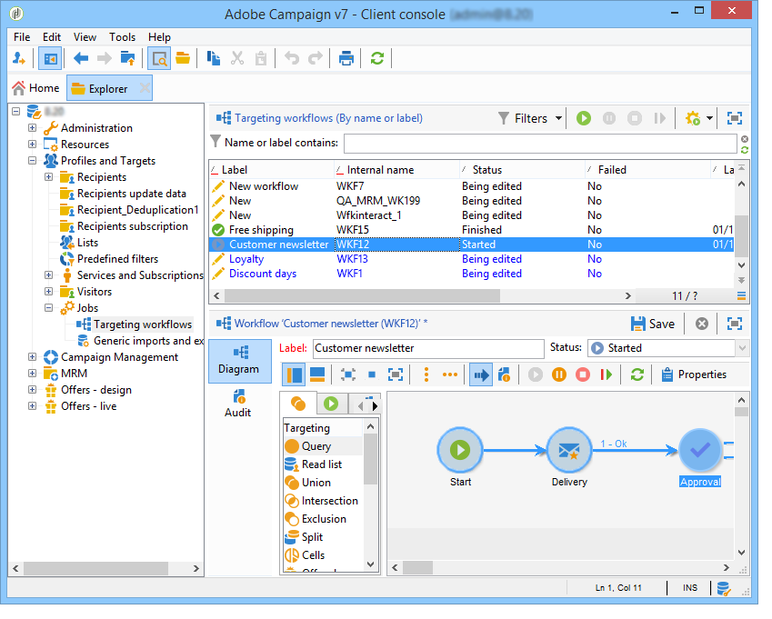

# Een workflow maken {#building-a-workflow}

In deze sectie worden de belangrijkste beginselen en aanbevolen procedures beschreven voor het maken van een workflow in Campagne.

* Een workflow maken, zie [Een nieuwe workflow maken](#creating-a-new-workflow)
* Ontwerp het werkschemadiagram, zie het [Toevoegen en het verbinden activiteiten](#adding-and-linking-activities)
* De parameters en de eigenschappen van de toegang van activiteiten, zie het [Vormen activiteiten](#configuring-activities)
* Ontwerpen voor workflows, zie [Doelworkflows](#targeting-workflows)
* Workflows gebruiken om een campagne uit te voeren, zie [Campagneworkflows](#campaign-workflows)
* Toegang tot technische workflows en technische workflows maken, zie [Technische workflows](#technical-workflows)
* Gebruik sjablonen om workflows te maken. Zie [Workflowsjablonen](#workflow-templates)

## Een nieuwe workflow maken {#creating-a-new-workflow}

Via de **[!UICONTROL Explorer]** map hebt u toegang tot een werkstroommap. Standaard kunt u **[!UICONTROL Profiles and Targets]** > **[!UICONTROL Jobs]** > **[!UICONTROL Targeting workflows]** gebruiken.

Klik op de **[!UICONTROL New]** knop boven de lijst met workflows.

U kunt ook de **[!UICONTROL Create]** knop in het workflowoverzicht gebruiken (**[!UICONTROL Monitoring]** > **[!UICONTROL Workflow]** koppeling).

Voer een label in en klik op **[!UICONTROL Save]**.

>[!NOTE]
>
>Wanneer u de interne naam van een werkstroomactiviteit of de werkstroom zelf wijzigt, moet u de werkstroom opslaan voordat u deze sluit, zodat de nieuwe interne naam correct in aanmerking wordt genomen.

## Toevoegen en koppelen van activiteiten {#adding-and-linking-activities}

U moet nu de verschillende activiteiten definiëren en deze koppelen in het diagram. In dit stadium van de configuratie, kunnen wij het diagrametiket en de werkschemastatus zien (Bewerkt lopend). Het onderste gedeelte van het venster wordt alleen gebruikt voor het bewerken van het diagram. Het bevat een werkbalk, een palet met activiteiten (links) en het diagram zelf (rechts).

>[!NOTE]
>
>Als het palet niet wordt weergegeven, klikt u op de eerste knop op de werkbalk om het weer te geven.

De activiteiten worden gegroepeerd op categorie in de verschillende tabbladen van het palet. De beschikbare tabbladen en activiteiten kunnen variëren afhankelijk van het type workflow (technisch, doelgericht of campagneworkflow).

* Het eerste tabblad bevat bewerkingen voor het activeren van doelen en gegevens. Deze activiteiten worden nader omschreven in [gerichte activiteiten](../../workflow/using/about-targeting-activities.md).
* Het tweede tabblad bevat de planningsactiviteiten, die hoofdzakelijk worden gebruikt voor de coördinatie van andere activiteiten. Deze activiteiten worden beschreven in [Stroombeheeractiviteiten](../../workflow/using/about-flow-control-activities.md).
* Het derde tabblad bevat gereedschappen en handelingen die in de workflow kunnen worden gebruikt. Deze activiteiten worden beschreven in [Actie-activiteiten](../../workflow/using/about-action-activities.md).
* Het vierde tabblad bevat activiteiten die afhankelijk zijn van een bepaalde gebeurtenis, zoals de ontvangst van een e-mail of de aankomst van een bestand op een server. Deze activiteiten worden beschreven in [Gebeurtenisactiviteiten](../../workflow/using/about-event-activities.md).

Het diagram maken

1. Voeg een activiteit toe door het in het palet te selecteren en het te bewegen aan het diagram gebruikend belemmering-en-dalingsverrichting.

   Voeg een activiteit van het **Begin** en dan een activiteit van de **Levering** op het diagram toe.

   

1. Koppel de activiteiten aan elkaar door de overgang naar activiteit **starten** te slepen en neer te zetten op de activiteit **Aflevering** .

   

   U kunt een activiteit aan vorige automatisch verbinden door de nieuwe activiteit aan het eind van de overgang te plaatsen.

1. Voeg de activiteiten toe u nodig hebt en verbind hen samen zoals aangetoond in het hieronder diagram.

   

>[!CAUTION]
>
>U kunt activiteiten kopiëren en plakken binnen dezelfde workflow. We raden echter niet aan plakactiviteiten over verschillende workflows te kopiëren. Sommige instellingen die zijn gekoppeld aan activiteiten zoals Leveringen en Planner kunnen leiden tot conflicten en fouten tijdens het uitvoeren van de doelworkflow. We raden u aan werkstromen te **dupliceren** . Zie Workflows [dupliceren voor meer informatie](#duplicating-workflows).

U kunt de weergave en lay-out van het diagram wijzigen met de volgende elementen:

* **De werkbalk gebruiken**

   Met de werkbalk voor diagrambewerking hebt u toegang tot de functies voor lay-out en uitvoering van de workflow.

   

   Zo kunt u de layout van het bewerkgereedschap aanpassen: de weergave van het palet en het overzicht, de grootte en de uitlijning van grafische objecten.

   

   Pictogrammen voor het bijhouden en starten van een geavanceerd workflow voor doelwitten worden in deze [sectie](../../campaign/using/marketing-campaign-deliveries.md#creating-a-targeting-workflow)beschreven.

* **Objectuitlijning**

   Als u pictogrammen wilt uitlijnen, selecteert u de pictogrammen en klikt u op het pictogram **[!UICONTROL Align vertically]** of **[!UICONTROL Align horizontally]** pictogram.

   Gebruik de **CTRL** -toets om meerdere verspreide activiteiten te selecteren of om een of meer activiteiten te deselecteren. Klik op de achtergrond van het diagram om alles te deselecteren.

* **Afbeeldingsbeheer**

   U kunt het achtergrondbeeld van het diagram evenals die aanpassen met betrekking tot de diverse activiteiten. Zie [Activiteitenafbeeldingen](../../workflow/using/managing-activity-images.md)beheren.

## Activiteiten configureren {#configuring-activities}

Dubbelklik op een activiteit om deze te configureren of klik met de rechtermuisknop en selecteer **[!UICONTROL Open...]**.

>[!NOTE]
>
>De activiteiten van de campagnewerkstroom worden beschreven in [deze sectie](../../workflow/using/about-activities.md).

Het eerste lusje bevat de basisconfiguratie. Het **[!UICONTROL Advanced]** tabblad bevat de aanvullende parameters die met name worden gebruikt voor het definiëren van gedrag wanneer een fout optreedt, het opgeven van de uitvoeringstijd voor een activiteit en het invoeren van een initialisatiescript.

Voor een beter begrip van de activiteiten en een betere leesbaarheid van de workflow kunt u opmerkingen invoeren in de activiteiten: deze worden automatisch weergegeven wanneer de operatoren over de activiteit schuiven.

## Workflows voorbereiden {#targeting-workflows}

Met doelgerichte workflows kunt u verschillende leveringsdoelen maken. U kunt query&#39;s maken, samenvoegingen of uitsluitingen definiëren op basis van specifieke criteria, planning toevoegen dankzij workflowactiviteiten. Het resultaat van deze gerichte actie kan automatisch worden overgedragen naar een lijst die als doel van leveringsacties kan dienen

Naast deze activiteiten kunt u met de opties voor gegevensbeheer gegevens manipuleren en geavanceerde functies gebruiken om complexe doelproblemen op te lossen. Raadpleeg [Gegevensbeheer](../../workflow/using/targeting-data.md#data-management)voor meer informatie.

Al deze activiteiten vindt u op het eerste tabblad van de workflow.

>[!NOTE]
>
>De gerichte activiteiten worden beschreven in [deze sectie](../../workflow/using/about-activities.md).

Doelworkflows kunnen worden gemaakt en bewerkt via het **[!UICONTROL Profiles and Targets > Jobs > Targeting workflows]** knooppunt van de Adobe Campagnestructuur of via het **[!UICONTROL Profiles and Targets > Targeting workflows]** menu van de startpagina.

Het richten van werkschema&#39;s binnen het kader van een campagne wordt opgeslagen met alle campagnewerkschema&#39;s.

### Uitvoeringsstappen {#implementation-steps-}

De volgende fasen voor het samenstellen van gegevens zijn bedoeld:

1. Voor het identificeren van gegevens in het gegevensbestand, verwijs naar het [Creëren van vragen](../../workflow/using/targeting-data.md#creating-queries).
1. Voor het voorbereiden van gegevens om aan leveringsbehoeften te voldoen, verwijs naar het [Verrijken en het wijzigen van gegevens](../../workflow/using/targeting-data.md#enriching-and-modifying-data).
1. Voor het gebruiken van gegevens om updates of binnen een levering uit te voeren, verwijs naar het [Bijwerken van het gegevensbestand](../../workflow/using/how-to-use-workflow-data.md#updating-the-database).

De resultaten van alle verrijkingen en alle handgrepen die tijdens het richten worden uitgevoerd worden opgeslagen en toegankelijk op verpersoonlijkingsgebieden, met name voor gebruik wanneer het creëren van gepersonaliseerde berichten. Raadpleeg de [doelgegevens voor meer informatie](../../workflow/using/data-life-cycle.md#target-data)

### Afmetingen gericht en filteren {#targeting-and-filtering-dimensions}

Tijdens de verrichtingen van de gegevenssegmentatie, wordt de het richten sleutel in kaart gebracht aan een het filtreren dimensie. Met de doeldimensie kunt u de doelgroep voor de bewerking definiëren: ontvangers, begunstigden van contracten, exploitanten, abonnees, enz. Met de filterdimensie kunt u de populatie selecteren op basis van bepaalde criteria: contractanten, abonnees van nieuwsbrieven enz.

Als u bijvoorbeeld klanten wilt selecteren die al meer dan vijf jaar een levensverzekeringspolis hebben, selecteert u de volgende dimensie: **Clients** en de volgende filterdimensie: **Contracthouder**. U kunt de het filtreren voorwaarden binnen de vraagactiviteit dan bepalen

Tijdens het gericht afmetingsselectiefase, slechts worden de compatibele het filtreren dimensies aangeboden in de interface.

Deze twee dimensies moeten met elkaar verband houden. De inhoud van de **[!UICONTROL Filtering dimension]** lijst is dus afhankelijk van de doeldimensie die in het eerste veld is opgegeven.

Voor ontvangers (**ontvangers**) zijn bijvoorbeeld de volgende filterafmetingen beschikbaar:

Bij **webtoepassingen** bevat de lijst de volgende filterafmetingen:

## Workflows voor campagnes {#campaign-workflows}

Voor elke campagne kunt u workflows maken die via het **[!UICONTROL Targeting and workflows]** tabblad moeten worden uitgevoerd. Deze workflows zijn specifiek voor de campagne.

Dit tabblad bevat dezelfde activiteiten als voor alle workflows. Deze worden weergegeven in het gedeelte [Implementatiestappen](#implementation-steps-) .

Naast het richten van campagnes, laten de campagnewerkschema&#39;s u toe om leveringen volledig voor alle beschikbare kanalen tot stand te brengen en te vormen. Zodra gecreeerd in het werkschema, zijn deze leveringen beschikbaar bij het dashboard van de campagne.

Alle campagneworkflows worden gecentraliseerd onder het **[!UICONTROL Administration > Production > Objects created automatically > Campaign workflows]** knooppunt.

De workflows van de campagne en de implementatievoorbeelden worden in deze [pagina](../../campaign/using/marketing-campaign-deliveries.md#building-the-main-target-in-a-workflow)beschreven.

## Technische workflows {#technical-workflows}

De technische workflows worden van de doos voorzien van de Campagne van Adobe. Het zijn bewerkingen of taken die zijn gepland voor periodieke uitvoering op de server. Met deze services kunt u onderhoud uitvoeren in de database, gegevens over leveringen doorsturen en voorlopige processen voor leveringen instellen. Technische workflows worden geconfigureerd via het **[!UICONTROL Administration > Production > Technical workflows]** knooppunt.

Native sjablonen zijn beschikbaar voor het maken van technische workflows. Zij kunnen worden gevormd om aan uw behoeften te passen.

De **[!UICONTROL Campaign process]** submap centraliseert de workflows die nodig zijn voor het uitvoeren van processen binnen de campagnes: taakomschrijving, voorraadbeheer, kostenberekening, enz.

>[!NOTE]
>
>De lijst van technische werkschema&#39;s die met elke module worden geïnstalleerd is beschikbaar in een [specifieke sectie](../../workflow/using/about-technical-workflows.md).

U kunt andere technische werkschema&#39;s in de **[!UICONTROL Administration > Production > Technical workflows]** knoop van de boomstructuur tot stand brengen. Dit proces is echter voorbehouden aan professionele gebruikers.

De aangeboden activiteiten zijn hetzelfde als voor workflows die zich op werkstromen richten. Raadpleeg de stappen [voor](#implementation-steps-)implementatie voor meer informatie.

## Workflowsjablonen {#workflow-templates}

De malplaatjes van het werkschema bevatten de algemene configuratie van eigenschappen en misschien een waaier van activiteiten die binnen een diagram worden samengevoegd. Deze configuratie kan opnieuw worden gebruikt voor het maken van nieuwe workflows die een bepaald aantal vooraf geconfigureerde elementen bevatten

U kunt nieuwe werkstroomsjablonen maken op basis van bestaande sjablonen of een workflow rechtstreeks in een sjabloon wijzigen.

Workflowsjablonen worden opgeslagen in het **[!UICONTROL Resources > Templates > Workflow templates]** knooppunt van de Adobe Campaign-structuur.

Naast de gebruikelijke workfloweigenschappen kunt u met de sjablooneigenschappen het uitvoeringsbestand opgeven voor workflows die op basis van deze sjabloon worden gemaakt.

## Workflows dupliceren {#duplicating-workflows}

U kunt verschillende typen workflows dupliceren. Als de workflow eenmaal is gedupliceerd, worden wijzigingen van de workflow niet doorgevoerd in de kopie van de workflow.

>[!CAUTION]
>
>Kopiëren en plakken is beschikbaar in workflows, maar u wordt aangeraden **Dupliceren** te gebruiken. Zodra een gekopieerde activiteit, zijn volledige configuratie wordt gehouden. Voor leveringsactiviteiten (E-mail, SMS, pushmelding...) wordt het leveringsobject dat aan de activiteit is gekoppeld ook gekopieerd, wat tot een crash kan leiden.

1. Klik met de rechtermuisknop op een workflow.
1. Klik op **Dupliceren**.

   

1. Wijzig in het workflowvenster het workflowlabel.
1. Klik op **Opslaan**.

De dubbele functie is niet rechtstreeks beschikbaar in de weergave van een campagne.

U kunt echter een weergave maken om alle workflows op uw exemplaar weer te geven. In deze weergave kunt u workflows dupliceren met **Dupliceren naar**.

**Laten we eerst een weergave maken:**

1. Ga in **Verkenner** naar de map waarin u de weergave wilt maken.
1. Klik met de rechtermuisknop en ga naar **Een nieuwe map** toevoegen > **Proces** en selecteer **Workflows**.

   

De nieuwe **mapworkflows** worden gemaakt.

1. Klik met de rechtermuisknop en selecteer **Eigenschappen**.
1. Controleer in **Beperking** of **Map een weergave** is en klik op **Opslaan**.

   

De map wordt nu gevuld met alle workflows van uw instantie.

**Een campagneworkflow dupliceren**

1. Selecteer een campagneworkflow in de werkstroomweergave.
1. Klik met de rechtermuisknop op **Dupliceren**.
   
1. Wijzig het label.
1. Klik op **Opslaan**.

U kunt de gedupliceerde workflow zien in de werkstroomweergave.
