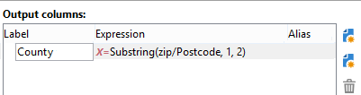

# Dimensie wijzigen{#change-dimension}

De activiteit van de veranderingsdimensie laat u de het richten dimensie tijdens de cyclus van de doelbouw veranderen. Axisverschuiving is afhankelijk van de gegevenssjabloon en de invoerdimensie. Dit laat u van de &quot;contracten&quot;afmeting aan de &quot;cliënten&quot;afmeting schakelen, bijvoorbeeld.

U kunt deze activiteit ook gebruiken om de extra kolommen van het nieuwe doel te bepalen.

Het is mogelijk criteria voor gegevensdeduplicatie vast te stellen.

## Configuratiemodus {#configuration-mode}

Om de activiteit van de veranderingsdimensie te vormen, pas de volgende stappen toe:

1. Selecteer de nieuwe doeldimensie via het **[!UICONTROL Change dimension]** veld.

   

1. Tijdens het wijzigen van de afmetingen kunt u alle elementen behouden of selecteren die in de uitvoer moeten worden bewaard. In het volgende voorbeeld, max. Aantal duplicaten is ingesteld op 2.

   

   Wanneer u verkiest om slechts één verslag te houden, wordt een inzameling getoond in het het werkschema: Deze verzameling vertegenwoordigt alle records die in het eindresultaat niet als doel zullen worden gebruikt (aangezien er slechts één record wordt bewaard). Net als bij alle andere verzamelingen kunt u met deze verzameling aggregaten berekenen of gegevens in kolommen herstellen.

   Als u bijvoorbeeld de **[!UICONTROL Customers]** dimensie wijzigt in de **[!UICONTROL Recipients]** dimensie, kunt u zich richten op klanten van een specifieke winkel en tegelijkertijd het aantal aanschafte aankopen toevoegen.

1. Als u verkiest om al deze informatie niet te houden, kunt u de dubbele beheerswijze vormen.

   

   Met de blauwe pijlen kunt u de dubbele verwerkingsprioriteit definiëren.

   In het bovenstaande voorbeeld worden ontvangers eerst gededupliceerd op hun e-mailadres en vervolgens, indien nodig, op hun accountnummer.

1. Op het **[!UICONTROL Result]** tabblad kunt u aanvullende informatie toevoegen.

   U kunt bijvoorbeeld het graafschap herstellen op basis van de postcode met een functie van het type **Substring** . Dit doet u als volgt:

   * Klik op de **[!UICONTROL Add data...]** koppeling en selecteer **[!UICONTROL Data linked to the filtering dimension]**.

      

      >[!NOTE]
      >
      >Raadpleeg Gegevens [toevoegen voor informatie over het maken en beheren van extra kolommen](../../workflow/using/query.md#adding-data).

   * Selecteer de vorige gericht afmeting (vóór asschakelaar) en selecteer **[!UICONTROL Zip Code]** in de **[!UICONTROL Location]** subboom van de ontvanger, dan klik **[!UICONTROL Edit expression]**.

      

   * Klik **[!UICONTROL Advanced selection]** en kies **[!UICONTROL Edit the formula using an expression]**.

      

   * Gebruik de functies in de lijst en geef de uit te voeren berekening op.

      

   * Tot slot ga het etiket van de kolom in u enkel hebt gecreeerd.

      

1. Voer het werkschema uit om het resultaat van deze configuratie te bekijken. Vergelijk de gegevens in de tabellen voor en na de activiteit voor de veranderingsdimensie en vergelijk de structuur van de workflowtabellen, zoals in de volgende voorbeelden wordt getoond:

   

   

