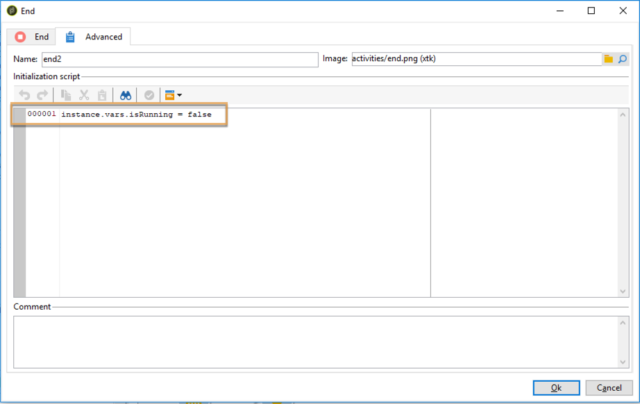

# Data-updates coördineren{#coordinating-data-updates}

In dit geval wordt beschreven hoe u een workflow maakt waarmee u gelijktijdige updates kunt beheren wanneer u verschillende uitvoeringen van een workflow gebruikt.

Het doel is te controleren of het updateproces is beëindigd voordat een andere updatebewerking wordt uitgevoerd. Hiervoor wordt een instantievariabele ingesteld en wordt in de workflow getest of de instantie wordt uitgevoerd om te bepalen of de workflow moet worden voortgezet en of de update moet worden uitgevoerd.

Deze workflow bestaat uit:

* a **Planner** activiteit, die de werkstroom op een specifieke frequentie uitvoert.
* a **Test** activiteit die controleert of de werkstroom reeds uitvoert.
* **** Queryen  **Update** gegevensactiviteiten voor het geval de werkstroom niet reeds uitvoert, die door een  **** Eindactiviteit wordt gevolgd die de variabele van de werkschemainstantie aan vals herinitialiseert.
* Een **End** activiteit als de werkstroom reeds uitvoert.

Volg onderstaande stappen om de workflow te maken:

1. Voeg een **Planner** activiteit toe, dan vorm zijn frequentie volgens uw behoeften.
1. Voeg een **Test** activiteit toe om te controleren of het werkschema reeds uitvoert, dan vorm het zoals hieronder.

   >[!NOTE]
   >
   >&quot;isRunning&quot; is de naam van de instantievariabele die we voor dit voorbeeld hebben gekozen. Dit is geen ingebouwde variabele.

   

1. Voeg een **End** activiteit aan **No** vork toe. Op deze manier wordt niets uitgevoerd als de workflow al wordt uitgevoerd.
1. Voeg de gewenste activiteiten toe aan de **Yes** vork. In ons geval, **Vraag** en **Werk Gegevens** activiteiten bij.
1. Open de eerste activiteit, dan voeg **instance.vars.isRunning = waar** bevel op **[!UICONTROL Advanced]** tabel toe. Op deze manier wordt de instantievariabele ingesteld als actief.

   

1. Voeg een **End** activiteit aan het eind van **[!UICONTROL Yes]** vork toe, dan voeg **instance.vars.isRunning = vals** bevel in **[!UICONTROL Advanced]** tabel toe.

   Op deze manier wordt geen actie uitgevoerd zolang de workflow wordt uitgevoerd.

   

**Verwante onderwerpen:**

* [Meerdere uitvoeringen voorkomen](../../workflow/using/monitoring-workflow-execution.md#preventing-simultaneous-multiple-executions)
* [Gegevensactiviteit bijwerken](../../workflow/using/update-data.md)

