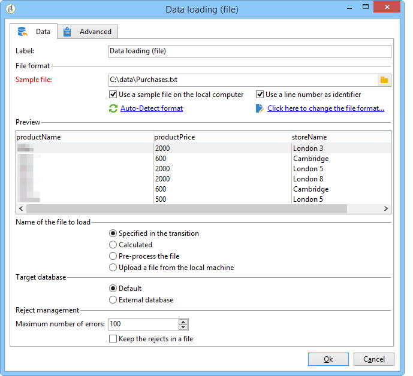
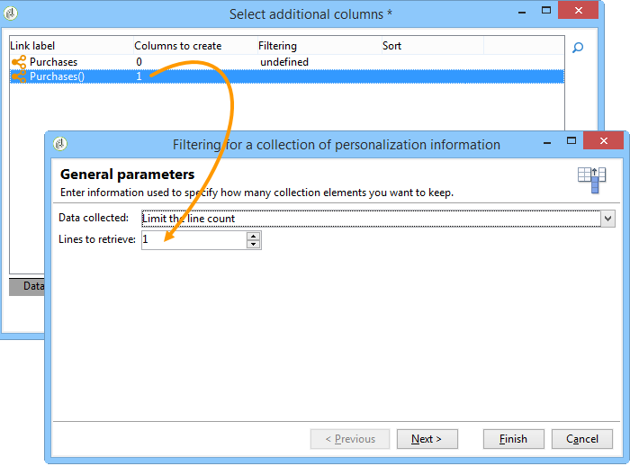

# Een overzichtslijst maken{#creating-a-summary-list}

In dit geval wordt beschreven hoe u een workflow maakt waarin u na het verzamelen van bestanden en na verschillende verbeteringen een overzichtslijst kunt maken. Het voorbeeld is gebaseerd op een lijst van contacten die aankopen in een opslag maakten.


De volgende gegevensstructuur wordt gebruikt:


Het doel van de verordening is:

* De verschillende opties van de verrijkingsactiviteit gebruiken
* De gegevens in de database bijwerken na een afstemming
* Een algemene &quot;weergave&quot; van de verrijkte gegevens maken

Voer de volgende stappen uit om een overzichtslijst te maken:

1. Een &quot;Aankopen&quot;-bestand verzamelen en laden in de tabel met werkzaamheden van de workflow
1. De geïmporteerde gegevens verrijken door een koppeling naar een referentietabel te maken
1. De tabel &quot;Aankopen&quot; bijwerken met de verrijkte gegevens
1. Verrijking van de &quot;Contactpersonen&quot;-gegevens met een geaggregeerde berekening uit de tabel &quot;Aankopen&quot;
1. Een overzichtslijst maken

## Stap 1: Het bestand laden en de geïmporteerde gegevens afstemmen {#step-1--loading-the-file-and-reconciling-the-imported-data}

De te laden gegevens zijn &quot;Aankoop&quot; gerelateerde gegevens met de volgende indeling:

```
Product Name;Product price;Store
Computer;2000;London 3
Tablet;600;Cambridge
Computer;2000;London 5
Comptuer;2000;London 8
Tablet;600;Cambridge
Phone;500;London 5
```

Deze gegevens staan in het tekstbestand &quot;Purchases.txt&quot;.

1. Voeg de activiteiten **Bestandsverzamelaar** en **Gegevens laden (bestand)** toe aan de workflow.

   Met de activiteit **Bestandsverzamelaar** kunt u bestanden verzamelen en verzenden van en naar de Adobe Campagneserver.

   Met de activiteit **Gegevens laden (bestand)** kunt u de werktabel van de workflow verrijken met de verzamelde gegevens.

   Zie Gegevens uit een bestand [](../../workflow/using/importing-data.md#loading-data-from-a-file)laden voor meer informatie over deze activiteit.

1. Configureer de activiteit van de **bestandscollector** om tekstbestanden (*.txt) uit de geselecteerde map te verzamelen.

   

   Met de activiteit **Bestandsverzamelaar** kunt u de afwezigheid van een bestand in de bronmap beheren. Schakel de **[!UICONTROL Process file nonexistence]** optie in om dit te doen. In deze werkstroom, is een **Wacht** activiteit toegevoegd om een andere dossierinzameling te proberen als het van de folder op het tijdstip van inzameling mist.

1. Configureer de activiteit **Gegevens laden (bestand)** met behulp van een voorbeeldbestand met dezelfde indeling als de te importeren gegevens.

   

   Klik op de **[!UICONTROL Click here to change the file format...]** koppeling om de naam van de kolommen te wijzigen met de interne namen en labels van de tabel Aankopen.

   

Zodra de gegevens zijn ingevoerd, wordt de verrijking uitgevoerd door een verbinding aan een verwijzingstabel te creëren die het schema &quot;van Sporen&quot;aanpast.

Voeg de verrijkingsactiviteit toe en configureer deze als volgt:

1. Selecteer de hoofdset die bestaat uit de gegevens uit de activiteit **Gegevens laden(bestand)** .

   

1. Klik **[!UICONTROL Add data]** en selecteer de **[!UICONTROL A link]** optie.

   

1. Selecteer de **[!UICONTROL Define a collection]** optie.
1. Selecteer het schema &quot;Wines&quot; als doel.

   

Raadpleeg [Verrijken en gegevens](../../workflow/using/targeting-data.md#enriching-and-modifying-data)wijzigen voor meer informatie over de verschillende typen koppelingen.

In het volgende venster, moet u tot stand brengen zich aansluit bij voorwaarde door het brongebied (in de belangrijkste reeks) en het doelgebied (die tot het schema van &quot;Sporen&quot;behoren) te selecteren om gegevensverenigbaarheid te vormen.


Nu wordt de verbinding gecreeerd, gaan wij een kolom aan de het werklijst van het werkschema van het &quot;Schema van Opslag&quot;toevoegen: het veld &quot;ZipCode Reference&quot;.

1. Open de verrijkingsactiviteit.
1. Klik **[!UICONTROL Edit additional data]**.
1. Voeg het veld &quot;ZipCode Reference&quot; toe aan het **[!UICONTROL Output columns]** veld.


De gegevens in de werktabel na deze verrijking zijn als volgt:


## Stap 2: Verrijkte gegevens naar de tabel &#39;Aankopen&#39; schrijven {#step-2--writing-enriched-data-to-the--purchases--table}

In deze stap wordt beschreven hoe u de geïmporteerde en verrijkte gegevens naar de tabel &quot;Aankopen&quot; schrijft. Hiervoor moeten we een **updategegevensactiviteit** gebruiken.

Voordat de gegevens in de tabel **Aankopen** worden bijgewerkt, moet een afstemming plaatsvinden tussen de gegevens in de werktabel van de workflow en de **aankoopdimensie** .

1. Klik op het **[!UICONTROL Reconciliation]** tabblad van de verrijkingsactiviteit.
1. Selecteer in dit geval de doeldimensie, het schema &quot;Aankopen&quot;.
1. Selecteer een &quot;Bronexpressie&quot; voor de gegevens in de tabel met workflows (in dit geval het veld &quot;storeName&quot;).
1. Selecteer een expressie Doel voor de gegevens in de tabel &#39;Aankopen&#39; (in dit geval het veld &#39;bestandsnaam&#39;).
1. Schakel de **[!UICONTROL Keep unreconciled data coming from the work table]** optie in.


In de de gegevensactiviteit van de **Update** , is de volgende configuratie nodig:

1. Selecteer de **[!UICONTROL Insert or update]** optie in het **[!UICONTROL Operation type]** veld om te voorkomen dat telkens wanneer het bestand wordt verzameld, nieuwe records worden gemaakt.
1. Selecteer de **[!UICONTROL By directly using the targeting dimension]** waarde voor de **[!UICONTROL Record identification]** optie.
1. Selecteer het schema &quot;Aankopen&quot; als een **[!UICONTROL Document type]**.
1. Geef de lijst op met velden die moeten worden bijgewerkt. In de **[!UICONTROL Destination]** kolom kunt u de velden van het schema &quot;Aankopen&quot; definiëren. In de **[!UICONTROL Expression]** kolom kunt u de velden in de werktabel selecteren om een toewijzing uit te voeren.
1. Klik op de **[!UICONTROL Generate an outbound transition]** optie.


## Stap 3: Contactgegevens verrijken {#step-3--enriching--contact--data-}

Het schema &quot;Contacten&quot; is fysiek gekoppeld aan het schema &quot;Aankopen&quot;. Dit betekent dat u een andere optie van de optie &quot;Verrijking&quot;kunt gebruiken: gegevens toevoegen die zijn gekoppeld aan de filterdimensie.

Het doel van deze tweede verrijking is een aggregaat te maken op het aankoopschema om het totale bedrag aan aankopen voor elke geïdentificeerde contactpersoon te berekenen.

1. Voeg een activiteit van het **vraagtype** toe die u alle opgeslagen **Contacten** laat terugkrijgen.
1. Voeg een **Verrijkingsactiviteit** toe dan selecteer de belangrijkste reeks resulterend uit de vorige vraag.
1. Klik op Toevoegen **[!UICONTROL Data]**.
1. Klik op de **[!UICONTROL Data linked to the targeting dimension]** optie.
1. Klik op de **[!UICONTROL Data linked to the filtering dimension]** optie in het **[!UICONTROL Select fields to add]** venster.
1. Selecteer het **[!UICONTROL Purchases]** knooppunt en klik op **[!UICONTROL Next]**.

   

1. Wijzig het **[!UICONTROL Collected data]** veld door de **[!UICONTROL Aggregates]** optie te selecteren.

   

1. Klik **[!UICONTROL Next]**.
1. Voeg de volgende expressie toe om het aankooptotaal voor elke contactpersoon te berekenen: &quot;Sum(@prodprice)&quot;.

   

Voor het opstellen van de overzichtslijst moet u velden toevoegen uit de velden Aankopen en uit de eerste verrijking: het veld &quot;ZipCode Reference&quot;.

1. Klik op de **[!UICONTROL Edit additional data...]** koppeling in de verrijkingsactiviteit.
1. Voeg de velden Winkelnaam en Aankopen / Postcodeverwijzing toe.

   

1. Klik op het **[!UICONTROL Properties]** tabblad.
1. Wijzig de tweede koppeling om slechts één regel te maken.

   

## Stap 4: Een samenvattingslijst maken en toevoegen {#step-4--creating-and-adding-to-a-summary-list}

De laatste stap bestaat uit het schrijven van alle verrijkte gegevens naar een lijst.

1. Voeg een **List-updateactiviteit** toe aan de workflow. Deze activiteit moet verband houden met de uitgaande overgang van de tweede verrijkingsactiviteit.
1. Selecteer de **[!UICONTROL Create the list if necessary (Calculated name)]** optie.
1. Selecteer een waarde voor de berekende naam. Het label dat voor de lijst wordt gekozen, is de huidige datum: &lt;%= formatDate(new Date(), &quot;%2D/%2M/%2Y&quot;) %>.

Als de workflow eenmaal is uitgevoerd, bevat de lijst:

* een lijst van contacten;
* een kolom &quot;Totale aankopen&quot;,
* een kolom &quot;Winkelnaam&quot;,
* een kolom van de &quot;Verwijzing van de Code van het Postcode&quot;ingegaan voor alle opslag bevat in het schema van de archiefverwijzing.


