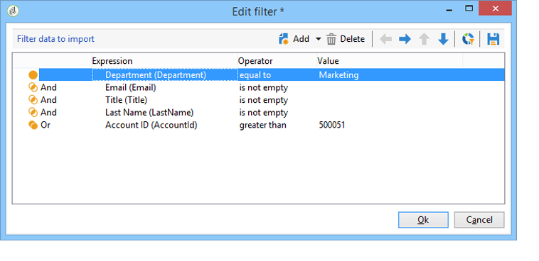

# CRM-connector{#crm-connector}

Met de **CRM-connector** kunt u de gegevenssynchronisatie configureren tussen Adobe Campaign en een CRM.

Voor meer informatie over de schakelaars van CRM in Adobe Campaign, verwijs naar dit [sectie](../../platform/using/crm-connectors.md).

Dit betekent dat u:

* Importeren vanuit de CRM (zie [Importeren vanuit de CRM](#importing-from-the-crm));
* Exporteren naar CRM (zie [Exporteren naar de CRM](#exporting-to-the-crm));
* Importeer objecten die zijn verwijderd in de CRM (zie [Objecten importeren die zijn verwijderd in de CRM](#importing-objects-deleted-in-the-crm)).
* Objecten in de CRM verwijderen (zie [Objecten in de CRM](#deleting-objects-in-the-crm) verwijderen).


Selecteer de externe rekening die CRM aanpast dat u synchronisatie met wilt vormen, dan het te synchroniseren voorwerp selecteren (rekeningen, kansen, contacten, enz.).


De configuratie van deze activiteit hangt af van het uit te voeren proces. Hieronder worden verschillende configuraties beschreven.

## Importeren vanuit de CRM {#importing-from-the-crm}

Om gegevens via CRM in Adobe Campaign te importeren, moet u het volgende type workflow maken:


Voor een importactiviteit, zijn de **CRM Connector** stappen van de activiteitenconfiguratie:

1. Selecteer een bewerking **[!UICONTROL Import from the CRM]**.
1. Ga naar **[!UICONTROL Remote object]** drop-down lijst en selecteer het voorwerp betrokken bij het proces. Dit object valt samen met een van de tabellen die in Adobe Campaign worden gemaakt tijdens de verbindingsconfiguratie.
1. Ga naar de sectie **[!UICONTROL Remote fields]** en ga de gebieden in om in te voeren.

   Als u een veld wilt toevoegen, klikt u op de knop **[!UICONTROL Add]** op de werkbalk en vervolgens op het pictogram **[!UICONTROL Edit expression]**.

   

   Wijzig zo nodig de gegevensindeling in de vervolgkeuzelijst met de kolommen **[!UICONTROL Conversion]**. Mogelijke conversietypen worden beschreven in deze [pagina](../../platform/using/crm-connectors.md#data-format).

   >[!CAUTION]
   >
   >De identificator van de record in de CRM is verplicht voor het koppelen van objecten in CRM en in Adobe Campaign. Deze wordt automatisch toegevoegd wanneer de activiteit wordt goedgekeurd.
   > 
   >De laatste wijzigingsdatum aan de CRM-zijde is ook verplicht voor de incrementele invoer van gegevens.

1. U kunt de te importeren gegevens ook filteren op basis van uw behoeften. Klik op de koppeling **[!UICONTROL Edit the filter...]** om dit te doen.

   In het volgende voorbeeld zal Adobe Campaign alleen contactpersonen importeren waarvoor sinds 31 juli 2012 enige activiteit is geregistreerd.

   

   De beperkingen verbonden aan gegevens het filtreren wijzen zijn gedetailleerd in [Filter op gegevens](#filter-on-data) sectie.

1. Met de optie **[!UICONTROL Use automatic index]** kunt u automatisch incrementele objectsynchronisatie tussen de CRM en Adobe Campaign beheren, afhankelijk van de datum en de laatste wijziging.

   Raadpleeg [Variabel beheer](#variable-management) voor meer informatie.

## Variabelebeheer {#variable-management}

Als u de optie **[!UICONTROL Automatic index]** inschakelt, kunt u alleen objecten verzamelen die zijn gewijzigd sinds de laatste import.


De datum van de laatste synchronisatie wordt opgeslagen in de optie die in het configuratievenster wordt gespecificeerd, door gebrek:

```
LASTIMPORT_<%=instance.internalName%>_<%=activityName%>
```

U kunt het verre gebied van CRM specificeren dat in aanmerking moet worden genomen om de meest recente veranderingen te identificeren.

Standaard worden de volgende velden gebruikt (in de opgegeven volgorde):

* Voor Microsoft Dynamics: **gewijzigd op**,
* Voor Oracle On Demand: **LastUpdated**, **ModifiedDate**, **LastLoggedIn**,
* Voor Salesforce.com: **LastModifiedDate**, **SystemModstamp**.

Als u de optie **[!UICONTROL Automatic index]** activeert, worden drie variabelen gegenereerd die in de synchronisatieworkflow kunnen worden gebruikt via een activiteit van het type **[!UICONTROL JavaScript code]**. Deze activiteiten zijn:

* **varscrmOptionName**: geeft de naam aan van de optie die de laatste importdatum bevat.
* **vars.crmStartImport**: staat voor de begindatum (inclusief) van de laatste gegevensherstel.
* **vars.crmEndDate**: staat voor de einddatum (exclusief) van de laatste gegevensherstel.

   Deze datums worden weergegeven in de volgende notatie: **yyyy/MM/dd hh:mm:ss**.

## Filter op gegevens {#filter-on-data}

Om efficiënte werking met diverse CRMs te verzekeren, moeten de filters worden gecreeerd gebruikend de volgende regels:

* Elk filterniveau mag slechts één type logische operator gebruiken.
* De operator EXCEPT (AND NOT) wordt niet ondersteund.
* Vergelijkingen mogen alleen betrekking hebben op null-waarden (&#39;is leeg&#39;/&#39;is geen leeg&#39; type) of getallen. Dit betekent dat wanneer de kolom **[!UICONTROL Value]** (rechterkolom) is beoordeeld, het resultaat van deze beoordeling een getal moet zijn.
* De gegevens in de kolom **[!UICONTROL Value]** worden beoordeeld in JavaScript.
* JOIN-vergelijkingen worden niet ondersteund.
* De expressie in de linkerkolom moet een veld zijn. Het kan geen combinatie zijn van verschillende expressies, een getal, enzovoort.

Bijvoorbeeld, zal de het filtreren voorwaarde hieronder niet geldig voor de invoer van CRM zijn, omdat:

* De operator OR wordt op hetzelfde niveau geplaatst als de AND-operatoren.
* Vergelijkingen worden uitgevoerd op tekstreeksen.



## Volgorde van {#order-by}

In de Dynamica van Microsoft en Salesforce.com, kunt u de verre gebieden sorteren om in stijgende of dalende orde worden ingevoerd.

Om dit te doen, klik **[!UICONTROL Order by]** verbinding en voeg de kolommen aan de lijst toe.

De volgorde van de kolommen in de lijst is de sorteervolgorde:


## Identificatie record {#record-identification}

In plaats van elementen te importeren die in de CRM zijn opgenomen (en mogelijk zijn gefilterd), kunt u een populatie gebruiken die vooraf in de workflow is berekend.

Hiervoor selecteert u de optie **[!UICONTROL Use the population calculated upstream]** en geeft u het veld op dat de externe id bevat.

Selecteer vervolgens de velden van de binnenkomende populatie die u wilt importeren, zoals hieronder wordt weergegeven:


## Exporteren naar de CRM {#exporting-to-the-crm}

Het uitvoeren van de gegevens van Adobe Campaign in CRM laat u volledige inhoud aan een gegevensbestand van CRM kopiëren.

Als u gegevens naar CRM wilt exporteren, moet u het volgende type workflow maken:


Voor de uitvoer, pas de volgende configuratie op **CRM Connector** activiteit toe:

1. Selecteer een bewerking **[!UICONTROL Export to CRM]**.
1. Ga naar **[!UICONTROL Remote object]** drop-down lijst en selecteer het voorwerp betrokken bij het proces. Dit object valt samen met een van de tabellen die in Adobe Campaign worden gemaakt tijdens de verbindingsconfiguratie.

   >[!CAUTION]
   >
   >De de uitvoerfunctie van **CRM Connectors** activiteit kan gebieden op de kant van CRM opnemen of bijwerken. Om gebiedsupdates in CRM toe te laten, moet u de primaire sleutel van de verre lijst specificeren. Als de sleutel ontbreekt, worden gegevens ingevoegd (in plaats van bijgewerkt).

1. Geef in de sectie **[!UICONTROL Mapping]** de velden op die u wilt exporteren en de toewijzing ervan in de CRM-toepassing.

   

   Als u een veld wilt toevoegen, klikt u op de knop **[!UICONTROL Add]** op de werkbalk en vervolgens op het pictogram **[!UICONTROL Edit expression]**.

   Als er voor een bepaald veld geen overeenkomst is gedefinieerd aan de CRM-zijde, kunnen de waarden niet worden bijgewerkt: zij worden rechtstreeks in de BCR ingevoegd.

   Wijzig zo nodig de gegevensindeling in de vervolgkeuzelijst met de kolommen **[!UICONTROL Conversion]**. Mogelijke conversietypen worden beschreven in deze [sectie](../../platform/using/crm-connectors.md#data-format).

   De lijst met te exporteren records en het resultaat van de export worden opgeslagen in een tijdelijk bestand dat toegankelijk blijft totdat de workflow is voltooid of opnieuw is gestart. Hierdoor kunt u het proces opnieuw starten in het geval van fouten zonder dat u het risico loopt dezelfde record meerdere keren te exporteren of gegevens te verliezen.

## Gegevensindeling en verwerking van fouten {#data-format-and-error-processing}

U kunt gegevensindeling direct omzetten wanneer u deze importeert in of vanuit de CRM.

Selecteer hiertoe de conversie die in de overeenkomende kolom moet worden toegepast.


In de modus **[!UICONTROL Default]** worden de gegevens automatisch omgezet. In de meeste gevallen is dit gelijk aan een kopie/plakbewerking van de gegevens. Tijdzonebeheer wordt echter toegepast.

Andere mogelijke omzettingen zijn:

* **[!UICONTROL Date only]**: in deze modus worden de velden Datum- en tijdtype verwijderd.
* **[!UICONTROL Without time offset]**: in deze modus wordt het tijdzonebeheer geannuleerd dat in de standaardmodus wordt toegepast.
* **[!UICONTROL Copy/Paste]**: in deze modus worden onbewerkte gegevens gebruikt, zoals tekenreeksen (geen conversie).


In het kader van de invoer of de uitvoer van gegevens, kunt u een specifiek proces op fouten en verwerpingen toepassen. Hiervoor selecteert u de opties **[!UICONTROL Process rejects]** en **[!UICONTROL Process errors]** op het tabblad **[!UICONTROL Behavior]**.

Met deze opties worden de overeenkomende uitgaande overgangen geplaatst.


Plaats vervolgens de activiteiten die relevant zijn voor de processen die u wilt toepassen.

Als u bijvoorbeeld fouten wilt verwerken, kunt u een wachtactiviteit toevoegen en werkstroompogingen plannen.

Afwijzingen worden verzameld met hun foutcode en het bijbehorende bericht. Dit betekent dat u de registratie van afwijzingen kunt instellen om het synchronisatieproces te optimaliseren.

Zelfs wanneer **[!UICONTROL Process rejects]** optie niet wordt toegelaten, wordt een waarschuwing geproduceerd voor elke verworpen kolom met een foutencode en een bericht.

De **[!UICONTROL Reject]** uitgaande overgang laat u tot het outputschema toegang hebben dat de specifieke kolommen relevant voor foutenmeldingen en codes bevat. Deze kolommen zijn:

* Voor Oracle On Demand: **errorLogFilename** (naam van het logboekdossier op de kant van Oracle), **errorCode** (foutcode), **errorSymbol** (foutsymbool, anders dan de foutcode), **errorMessage** (beschrijving van de foutcontext).
* Voor Salesforce.com: **errorSymbol** (foutsymbool, anders dan de foutcode), **errorMessage** (beschrijving van de foutcontext).

## Objecten importeren die zijn verwijderd in de CRM {#importing-objects-deleted-in-the-crm}

Om het opzetten van een uitgebreid proces van de gegevenssynchronisatie toe te laten, kunt u voorwerpen invoeren die in CRM worden geschrapt in Adobe Campaign.

Hiervoor voert u de volgende stappen uit:

1. Selecteer een bewerking **[!UICONTROL Import objects deleted in the CRM]**.
1. Ga naar **[!UICONTROL Remote object]** drop-down lijst en selecteer het voorwerp betrokken bij het proces. Dit object valt samen met een van de tabellen die in Adobe Campaign worden gemaakt tijdens de verbindingsconfiguratie.
1. Geef de verwijderingsperiode op die in de velden **[!UICONTROL Start date]** en **[!UICONTROL End date]** in aanmerking moet worden genomen. Deze data worden in de periode opgenomen.

   

   >[!CAUTION]
   >
   >De periode voor het verwijderen van elementen moet samenvallen met de specifieke beperkingen van de BCR. Dit betekent dat voor Salesforce.com bijvoorbeeld elementen die meer dan 30 dagen geleden zijn verwijderd, niet kunnen worden hersteld.

## Objecten in de CRM {#deleting-objects-in-the-crm} verwijderen

Om voorwerpen op de kant van CRM te schrappen, moet u de primaire sleutel van de verre te schrappen elementen specificeren.


Met het tabblad **[!UICONTROL Behavior]** kunt u de verwerking van afwijzingen inschakelen. Met deze optie wordt een tweede uitvoerovergang voor de activiteit **[!UICONTROL CRM connector]** gegenereerd. Raadpleeg deze [sectie](../../platform/using/crm-connectors.md#error-processing) voor meer informatie.

Zelfs wanneer de optie **[!UICONTROL Process rejects]** is uitgeschakeld, wordt een waarschuwing gegenereerd voor elke geweigerde kolom.

## Voorbeeld van hoe te om een contactinvoer {#example-of-how-to-configure-a-contact-import} te vormen

In het volgende voorbeeld, wordt de activiteit gevormd om contacten van Oracle On Demand CRM in te voeren. Voordat de CRM-velden worden geïmporteerd, worden deze zo geselecteerd dat ze overeenkomen met de velden die al in de Adobe Campaign-database staan.


