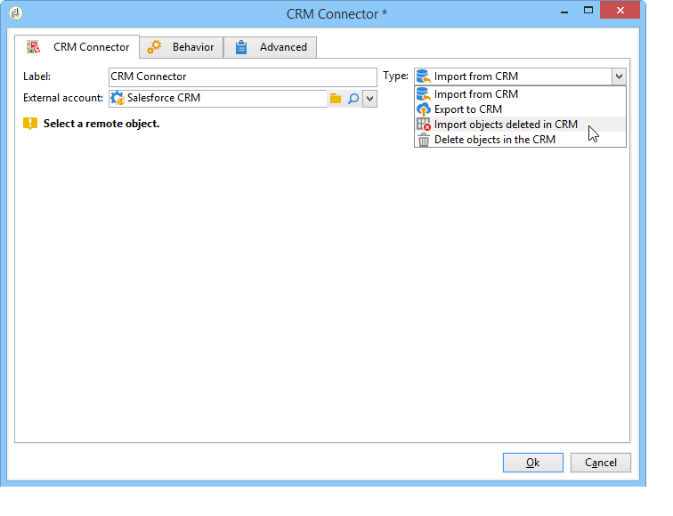
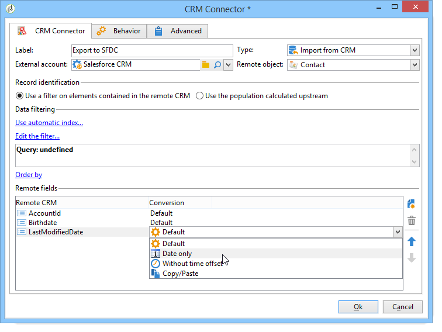

# CRM-connector{#crm-connector}

Met de **CRM-connector** kunt u de gegevenssynchronisatie configureren tussen Adobe Campaign en een CRM.

Raadpleeg deze [sectie](../../platform/using/crm-connectors.md)voor meer informatie over CRM-connectors in Adobe Campaign.

Dit betekent dat u:

* invoer uit de BCR (zie [Importing from the CRM](#importing-from-the-crm));
* export naar CRM (zie [Exporteren naar CRM](#exporting-to-the-crm));
* Importeren van objecten die zijn verwijderd in de CRM (verwijs naar [Importeren van objecten die zijn verwijderd in de CRM](#importing-objects-deleted-in-the-crm));
* Objecten verwijderen in de CRM (verwijder objecten [verwijderen in de CRM](#deleting-objects-in-the-crm)).



Selecteer de externe rekening die CRM aanpast dat u synchronisatie met wilt vormen, dan het te synchroniseren voorwerp selecteren (rekeningen, kansen, contacten, enz.).


De configuratie van deze activiteit hangt af van het uit te voeren proces. Hieronder worden verschillende configuraties beschreven.

## Importeren vanuit de CRM {#importing-from-the-crm}

Als u gegevens wilt importeren via CRM in Adobe Campaign, moet u het volgende type workflow maken:


Voor een de invoeractiviteit, zijn de de activiteitsconfiguratiestappen van de Verbinding van **CRM** :

1. Selecteer een **[!UICONTROL Import from the CRM]** bewerking.
1. Ga naar de **[!UICONTROL Remote object]** drop-down lijst en selecteer het voorwerp betrokken bij het proces. Dit object valt samen met een van de tabellen die tijdens de verbindingsconfiguratie in Adobe Campaign zijn gemaakt.
1. Ga naar de **[!UICONTROL Remote fields]** sectie en ga de gebieden in om worden ingevoerd.

   Als u een veld wilt toevoegen, klikt u op de **[!UICONTROL Add]** knop op de werkbalk en vervolgens op het **[!UICONTROL Edit expression]** pictogram.

   

   Wijzig zo nodig de gegevensindeling in de vervolgkeuzelijst met de **[!UICONTROL Conversion]** kolommen. Mogelijke conversietypen worden in deze [pagina](../../platform/using/crm-connectors.md#data-format)nader beschreven.

   >[!CAUTION]
   >
   >De id van de record in de CRM is verplicht voor het koppelen van objecten in CRM en in Adobe Campaign. Deze wordt automatisch toegevoegd wanneer de activiteit wordt goedgekeurd.
   > 
   >De laatste wijzigingsdatum aan de CRM-zijde is ook verplicht voor de incrementele invoer van gegevens.

1. U kunt de te importeren gegevens ook filteren op basis van uw behoeften. Klik hiertoe op de **[!UICONTROL Edit the filter...]** koppeling.

   In het volgende voorbeeld importeert Adobe Campaign alleen contactpersonen waarvoor enige activiteit is opgenomen sinds 31 juli 2012.

   

   De beperkingen die zijn gekoppeld aan de modi voor gegevensfiltering worden beschreven in de sectie [Filter op gegevens](#filter-on-data) .

1. Met deze **[!UICONTROL Use automatic index]** optie kunt u automatisch incrementele objectsynchronisatie beheren tussen de CRM-campagne en de Adobe-campagne, afhankelijk van de datum en de laatste wijziging.

   Raadpleeg voor meer informatie het [Variabele-beheer](#variable-management).

## Beheer van variabelen {#variable-management}

Als u de **[!UICONTROL Automatic index]** optie inschakelt, kunt u alleen objecten verzamelen die zijn gewijzigd sinds de laatste importbewerking.


De datum van de laatste synchronisatie wordt opgeslagen in de optie die in het configuratievenster wordt gespecificeerd, door gebrek:

```
LASTIMPORT_<%=instance.internalName%>_<%=activityName%>
```

U kunt het verre gebied van CRM specificeren dat in aanmerking moet worden genomen om de meest recente veranderingen te identificeren.

Standaard worden de volgende velden gebruikt (in de opgegeven volgorde):

* Voor Microsoft Dynamics: **gewijzigd**,
* Voor Oracle On Demand: **LastUpdated**, **ModifiedDate**, **LastLoggedIn**,
* Voor Salesforce.com: **LastModifiedDate**, **SystemModstamp**.

Als u de **[!UICONTROL Automatic index]** optie activeert, worden drie variabelen gegenereerd die in de synchronisatieworkflow kunnen worden gebruikt via een **[!UICONTROL JavaScript code]** type-activiteit. Deze activiteiten zijn:

* **varscrmOptionName**: geeft de naam aan van de optie die de laatste importdatum bevat.
* **vars.crmStartImport**: staat voor de begindatum (inclusief) van de laatste gegevensherstel.
* **vars.crmEndDate**: de einddatum (exclusief) van de laatste gegevensherstel.

   Deze datums worden weergegeven in de volgende notatie: **yyyy/MM/dd hh:mm:ss**.

## Filter op gegevens {#filter-on-data}

Om efficiënte werking met diverse CRMs te verzekeren, moeten de filters worden gecreeerd gebruikend de volgende regels:

* Elk filterniveau mag slechts één type logische operator gebruiken.
* De operator EXCEPT (AND NOT) wordt niet ondersteund.
* Vergelijkingen mogen alleen betrekking hebben op null-waarden (&#39;is leeg&#39;/&#39;is geen leeg&#39; type) of getallen. Dit betekent dat, zodra de **[!UICONTROL Value]** kolom (rechterkolom) is beoordeeld, het resultaat van deze beoordeling een getal moet zijn.
* De gegevens in de **[!UICONTROL Value]** kolom worden beoordeeld in JavaScript.
* JOIN-vergelijkingen worden niet ondersteund.
* De expressie in de linkerkolom moet een veld zijn. Het kan geen combinatie zijn van verschillende expressies, een getal, enzovoort.

Bijvoorbeeld, zal de het filtreren voorwaarde hieronder niet geldig voor de invoer van CRM zijn, omdat:

* De operator OR wordt op hetzelfde niveau geplaatst als de AND-operatoren.
* Vergelijkingen worden uitgevoerd op tekstreeksen.


## Volgorde van {#order-by}

In de Dynamica van Microsoft en Salesforce.com, kunt u de verre gebieden sorteren om in stijgende of dalende orde worden ingevoerd.

Klik hiertoe op de **[!UICONTROL Order by]** koppeling en voeg de kolommen toe aan de lijst.

De volgorde van de kolommen in de lijst is de sorteervolgorde:


## Registeridentificatie {#record-identification}

In plaats van elementen te importeren die in de CRM zijn opgenomen (en mogelijk zijn gefilterd), kunt u een populatie gebruiken die vooraf in de workflow is berekend.

Hiervoor selecteert u de **[!UICONTROL Use the population calculated upstream]** optie en geeft u het veld op dat de externe id bevat.

Selecteer vervolgens de velden van de binnenkomende populatie die u wilt importeren, zoals hieronder wordt weergegeven:


## Exporteren naar de CRM {#exporting-to-the-crm}

Als u Adobe Campaign-gegevens exporteert naar de CRM-database, kunt u de volledige inhoud kopiëren naar een CRM-database.

Als u gegevens naar CRM wilt exporteren, moet u het volgende type workflow maken:


Voor de uitvoer, pas de volgende configuratie op de activiteit van de Schakelaar **van** CRM toe:

1. Selecteer een **[!UICONTROL Export to CRM]** bewerking.
1. Ga naar de **[!UICONTROL Remote object]** drop-down lijst en selecteer het voorwerp betrokken bij het proces. Dit object valt samen met een van de tabellen die tijdens de verbindingsconfiguratie in Adobe Campaign zijn gemaakt.

   >[!CAUTION]
   >
   >De de uitvoerfunctie van de activiteit van de Verbindingen van **CRM** kan gebieden op de kant van CRM opnemen of bijwerken. Om gebiedsupdates in CRM toe te laten, moet u de primaire sleutel van de verre lijst specificeren. Als de sleutel ontbreekt, worden gegevens ingevoegd (in plaats van bijgewerkt).

1. Geef in de **[!UICONTROL Mapping]** sectie de velden op die geëxporteerd moeten worden en de toewijzing ervan in de CRM.

   

   Als u een veld wilt toevoegen, klikt u op de **[!UICONTROL Add]** knop op de werkbalk en vervolgens op het **[!UICONTROL Edit expression]** pictogram.

   Als er voor een bepaald veld geen overeenkomst is gedefinieerd aan de CRM-zijde, kunnen de waarden niet worden bijgewerkt: zij worden rechtstreeks in de BCR ingevoegd.

   Wijzig zo nodig de gegevensindeling in de vervolgkeuzelijst met de **[!UICONTROL Conversion]** kolommen. Mogelijke conversietypen worden in deze [sectie](../../platform/using/crm-connectors.md#data-format)beschreven.

   De lijst met te exporteren records en het resultaat van de export worden opgeslagen in een tijdelijk bestand dat toegankelijk blijft totdat de workflow is voltooid of opnieuw is gestart. Hierdoor kunt u het proces opnieuw starten in het geval van fouten zonder dat u het risico loopt dezelfde record meerdere keren te exporteren of gegevens te verliezen.

## Gegevensindeling en foutafhandeling {#data-format-and-error-processing}

U kunt gegevensindeling direct omzetten wanneer u deze importeert in of vanuit de CRM.

Selecteer hiertoe de conversie die in de overeenkomende kolom moet worden toegepast.



In de **[!UICONTROL Default]** modus worden de gegevens automatisch omgezet. In de meeste gevallen is dit gelijk aan een kopie/plak van de gegevens. Tijdzonebeheer wordt echter toegepast.

Andere mogelijke omzettingen zijn:

* **[!UICONTROL Date only]**: in deze modus worden de velden Datum- en tijdtype verwijderd.
* **[!UICONTROL Without time offset]**: in deze modus wordt het tijdzonebeheer geannuleerd dat in de standaardmodus wordt toegepast.
* **[!UICONTROL Copy/Paste]**: in deze modus worden onbewerkte gegevens gebruikt, zoals tekenreeksen (geen conversie).


In het kader van de invoer of de uitvoer van gegevens, kunt u een specifiek proces op fouten en verwerpingen toepassen. Selecteer hiertoe de **[!UICONTROL Process rejects]** en **[!UICONTROL Process errors]** opties op het **[!UICONTROL Behavior]** tabblad.

Met deze opties worden de overeenkomende uitgaande overgangen geplaatst.


Plaats vervolgens de activiteiten die relevant zijn voor de processen die u wilt toepassen.

Als u bijvoorbeeld fouten wilt verwerken, kunt u een wachtactiviteit toevoegen en werkstroompogingen plannen.

Afwijzingen worden verzameld met hun foutcode en het bijbehorende bericht. Dit betekent dat u de registratie van afwijzingen kunt instellen om het synchronisatieproces te optimaliseren.

Zelfs wanneer de **[!UICONTROL Process rejects]** optie niet wordt toegelaten, wordt een waarschuwing geproduceerd voor elke verworpen kolom met een foutencode en een bericht.

De **[!UICONTROL Reject]** uitgaande overgang laat u tot het outputschema toegang hebben dat de specifieke kolommen relevant voor foutenmeldingen en codes bevat. Deze kolommen zijn:

* Voor Oracle On Demand: **errorLogFilename** (naam van het logboekdossier op Oracle kant), **errorCode** (foutencode), **errorSymbol** (foutensymbool, verschillend van de foutencode), **errorMessage** (beschrijving van de foutencontext).
* Voor Salesforce.com: **errorSymbol** (foutsymbool, anders dan de foutcode), **errorMessage** (beschrijving van de foutcontext).

## Objecten importeren die zijn verwijderd in de CRM {#importing-objects-deleted-in-the-crm}

Als u het instellen van een uitgebreid proces voor gegevenssynchronisatie wilt inschakelen, kunt u objecten die zijn verwijderd in de CRM-campagne importeren in Adobe-campagne.

Hiervoor voert u de volgende stappen uit:

1. Selecteer een **[!UICONTROL Import objects deleted in the CRM]** bewerking.
1. Ga naar de **[!UICONTROL Remote object]** drop-down lijst en selecteer het voorwerp betrokken bij het proces. Dit object valt samen met een van de tabellen die tijdens de verbindingsconfiguratie in Adobe Campaign zijn gemaakt.
1. Geef de periode op waarmee rekening moet worden gehouden in de velden **[!UICONTROL Start date]** en de **[!UICONTROL End date]** velden. Deze data worden in de periode opgenomen.

   

   >[!CAUTION]
   >
   >De periode voor het verwijderen van elementen moet samenvallen met de specifieke beperkingen van de BCR. Dit betekent dat voor Salesforce.com bijvoorbeeld elementen die meer dan 30 dagen geleden zijn verwijderd, niet kunnen worden hersteld.

## Objecten verwijderen in de CRM {#deleting-objects-in-the-crm}

Om voorwerpen op de kant van CRM te schrappen, moet u de primaire sleutel van de verre te schrappen elementen specificeren.


Op het **[!UICONTROL Behavior]** tabblad kunt u de verwerking van afwijzingen inschakelen. Met deze optie wordt een tweede uitvoerovergang voor de **[!UICONTROL CRM connector]** activiteit gegenereerd. Zie deze [sectie](../../platform/using/crm-connectors.md#error-processing)voor meer informatie.

Zelfs als de **[!UICONTROL Process rejects]** optie is uitgeschakeld, wordt een waarschuwing gegenereerd voor elke geweigerde kolom.

## Voorbeeld van hoe te om een contactinvoer te vormen {#example-of-how-to-configure-a-contact-import}

In het volgende voorbeeld, wordt de activiteit gevormd om contacten van Oracle On Demand CRM in te voeren. Voordat de CRM-velden worden geïmporteerd, worden deze zo geselecteerd dat ze overeenkomen met de velden die al bestaan in de Adobe Campagne-database.


