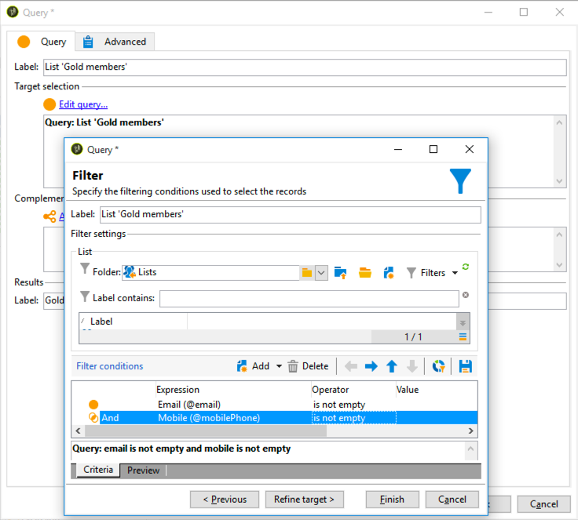
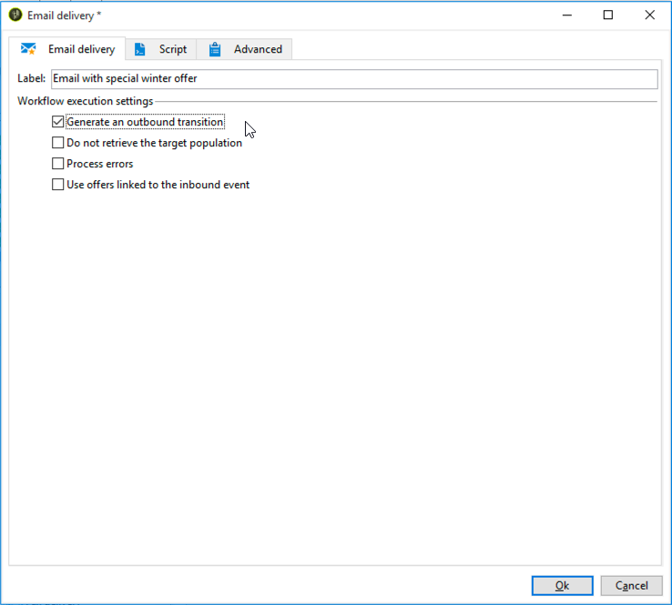
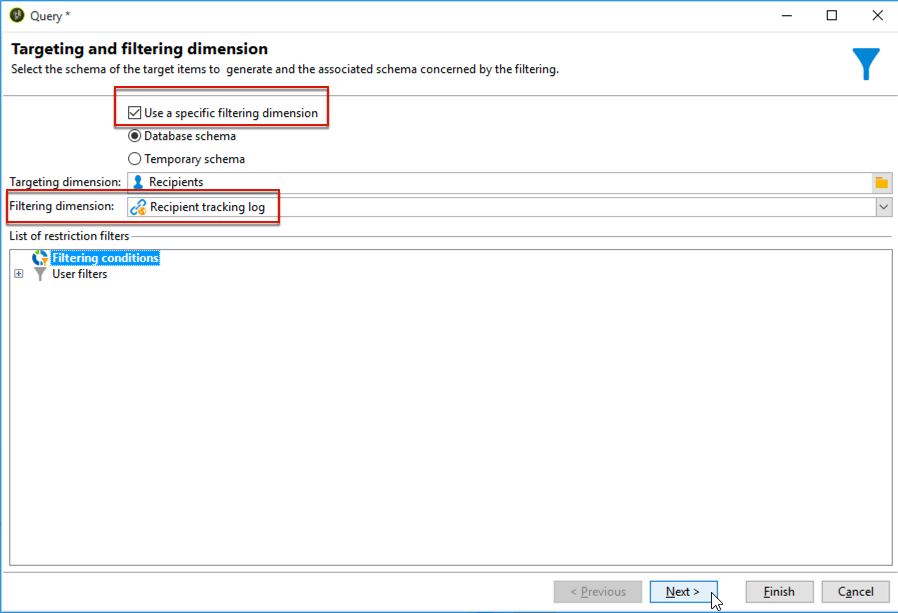

# Workflow voor levering tussen kanalen{#cross-channel-delivery-workflow}

In dit geval wordt een voorbeeld weergegeven met een workflow voor levering over meerdere kanalen. In [deze sectie](../../workflow/using/cross-channel-deliveries.md)wordt het algemene concept van de levering tussen kanalen beschreven.

Het doel is een publiek van de ontvangers van uw gegevensbestand in verschillende groepen te segmenteren met als doel een e-mail naar een groep en een bericht van SMS naar een andere groep te verzenden.

De belangrijkste stappen voor de implementatie van dit gebruiksgeval zijn als volgt:

1. Een **[!UICONTROL Query]** activiteit maken om uw doelgroep te bereiken.
1. Een **[!UICONTROL Email delivery]** activiteit maken die een koppeling naar een aanbieding bevat.
1. Een **[!UICONTROL Split]** activiteit gebruiken om:

   * Stuur een andere e-mail naar de ontvangers die het eerste e-mailbericht niet hebben geopend.
   * Verzend een SMS-bericht naar de ontvangers die het e-mailbericht hebben geopend, maar klik niet op de koppeling naar het voorstel.
   * Voeg aan het gegevensbestand de ontvangers toe die e-mail opende en de verbinding klikte.

## Stap 1: Het doelpubliek {#step-1--targeting-the-audience}

Om uw doel te bepalen, creeer een vraag om de ontvangers te identificeren.

1. Maak een campagne. Zie [deze sectie](../../campaign/using/setting-up-marketing-campaigns.md#creating-a-campaign)voor meer informatie.
1. Voeg op het **[!UICONTROL Targeting and workflows]** tabblad van uw campagne een **query** -activiteit toe aan uw workflow. Raadpleeg [deze sectie](../../workflow/using/query.md)voor meer informatie over het gebruik van deze activiteit.
1. Bepaal de ontvangers die uw leveringen zullen ontvangen. Selecteer bijvoorbeeld &#39;Gold&#39;-leden als doeldimensie.
1. Voeg filtervoorwaarden aan uw vraag toe. Selecteer in dit voorbeeld ontvangers met een e-mailadres en een mobiel nummer.

   

1. Sla uw wijzigingen op.

## Stap 2: Een e-mail maken met een aanbieding {#step-2--creating-an-email-including-an-offer}

1. Maak een **[!UICONTROL Email delivery]** activiteit en dubbelklik erop in de workflow om deze te bewerken. Raadpleeg [deze sectie](../../delivery/using/about-email-channel.md)voor meer informatie over het maken van een e-mailbericht.
1. Ontwerp het bericht en voeg een verbinding met inbegrip van een aanbieding in de inhoud op.

   

   Voor meer informatie over het integreren van een aanbieding in het lichaam van een bericht, verwijs naar [deze sectie](../../interaction/using/integrating-an-offer-via-the-wizard.md#delivering-with-a-call-to-the-offer-engine).

1. Sla uw wijzigingen op.
1. Klik met de rechtermuisknop op de **[!UICONTROL Email delivery]** activiteit om deze te openen.
1. Selecteer de **[!UICONTROL Generate an outbound transition]** optie om de populatie en de trackinglogboeken te herstellen.

   

   Hierdoor kunt u deze informatie gebruiken om een andere levering te verzenden, afhankelijk van het gedrag van de ontvangers bij het ontvangen van de eerste e-mail.

1. Voeg een **[!UICONTROL Wait]** activiteit toe zodat de ontvangers het e-mailbericht enkele dagen kunnen openen.

   

## Stap 3: Het resulterende publiek segmenteren {#step-3--segmenting-the-resulting-audience}

Zodra uw doel wordt geïdentificeerd en uw eerste levering gecreeerd, moet u het doel in verschillende populaties segmenteren gebruikend het filtreren voorwaarden.

1. Voeg een **gesplitste** activiteit aan het werkschema toe en open het. Raadpleeg [deze sectie](../../workflow/using/split.md)voor meer informatie over het gebruik van deze activiteit.
1. Creeer drie segmenten van de bevolking die stroomopwaarts in de vraag wordt berekend.

   

1. Voor de eerste subset selecteert u de **[!UICONTROL Add a filtering condition on the inbound population]** optie en klikt u **[!UICONTROL Edit]**.

   

1. Selecteer **[!UICONTROL Recipients of a delivery]** als het restrictiefilter en klik op **[!UICONTROL Next]**.

   

1. Selecteer in de filterinstellingen een optie in de **[!UICONTROL Recipients who have not opened or clicked (email)]** **[!UICONTROL Behavior]** vervolgkeuzelijst en selecteer de e-mail met de aanbieding die u wilt verzenden in de leveringslijst. Klik **[!UICONTROL Finish]**.

   

1. Ga op dezelfde manier te werk voor de tweede subset en selecteer **[!UICONTROL Recipients who have not clicked (email)]** uit de **[!UICONTROL Behavior]** drop-down lijst.

   

1. Voor de derde subset selecteert u de **[!UICONTROL Add a filtering condition on the inbound population]** optie nadat u de subset hebt geselecteerd **[!UICONTROL Edit]** en hebt geklikt **[!UICONTROL Use a specific filtering dimension]** .
1. Selecteer **[!UICONTROL Recipient tracking log]** in de **[!UICONTROL Filtering dimension]** vervolgkeuzelijst de optie Markeren in de lijst **[!UICONTROL Filtering conditions]** en klik op **[!UICONTROL List of restriction filters]** **[!UICONTROL Next]**.

   

1. Selecteer de filtervoorwaarden als volgt:

   

1. Klik **[!UICONTROL Finish]** om uw wijzigingen op te slaan.

## Stap 4: De workflow voltooien {#step-4--finalizing-the-workflow}

1. Voeg de relevante activiteiten toe aan uw werkstroom na de drie subsets die het resultaat zijn van de **[!UICONTROL Split]** activiteit:

   * Voeg een **[!UICONTROL Email delivery]** activiteit toe om een herinnering e-mail naar de eerste subset te verzenden.
   * Voeg een **[!UICONTROL Mobile delivery]** activiteit toe om een bericht van SMS naar de tweede ondergroep te verzenden.
   * Voeg een **[!UICONTROL List update]** activiteit toe om de overeenkomstige ontvangers aan het gegevensbestand toe te voegen.

1. Dubbelklik op de leveringsactiviteiten in uw workflow om deze te bewerken. Raadpleeg het [e-mailkanaal](../../delivery/using/about-email-channel.md) en het [SMS-kanaal](../../delivery/using/sms-channel.md)voor meer informatie over het maken van een e-mail en een sms.
1. Dubbelklik op de **[!UICONTROL List update]** activiteit en selecteer de **[!UICONTROL Generate an outbound transition]** optie.

   Vervolgens kunt u de resulterende ontvangers van Adobe Campaign exporteren naar de Adobe Experience Cloud. U kunt bijvoorbeeld het publiek in Adobe Target gebruiken door een **[!UICONTROL Update shared audience]** activiteit aan de workflow toe te voegen. Raadpleeg [Een publiek](../../integrations/using/importing-and-exporting-audiences.md#exporting-an-audience)exporteren voor meer informatie.

1. Klik op de knop **Start** op de actiebalk om de workflow uit te voeren.

De populatie waarop de activiteit **Query** betrekking heeft, wordt gesegmenteerd om een e-mail of een levering van SMS te ontvangen volgens het gedrag van de ontvangers. De resterende populatie wordt met behulp van de **[!UICONTROL List update]** activiteit aan de database toegevoegd.
